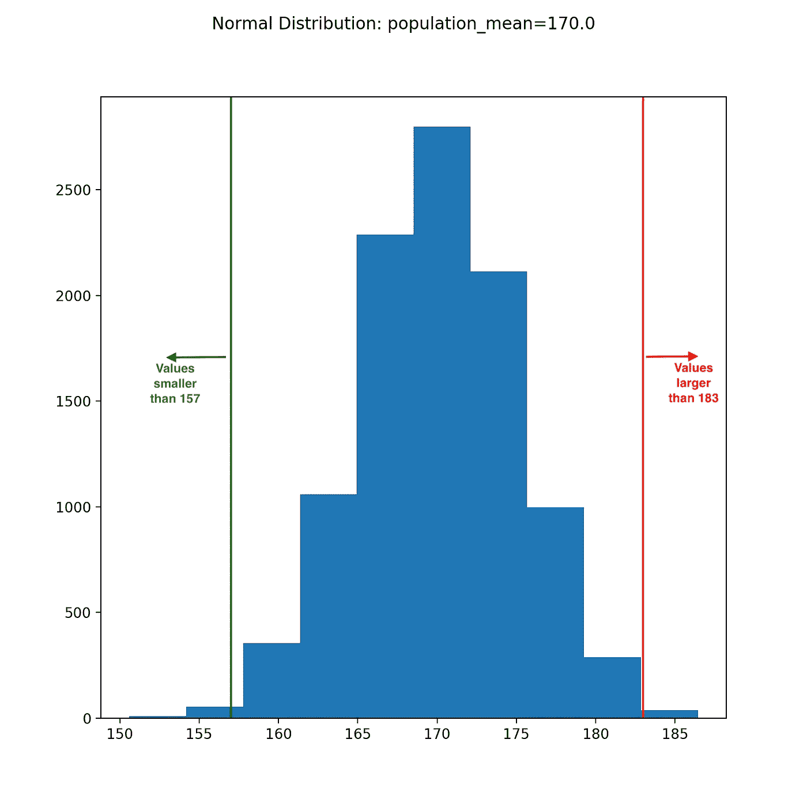

# Python 代码的 p 值基础

> 原文：<https://towardsdatascience.com/p-value-basics-with-python-code-ae5316197c52?source=collection_archive---------1----------------------->


阿奇·范顿在 [Unsplash](https://unsplash.com?utm_source=medium&utm_medium=referral) 上拍摄的照片

**什么是 p 值？它是在给定实际分布的情况下，你获得测试结果的概率。或者在 A/B 测试设置中，在给定初始假设的情况下，例如“我们认为平均订单价值为 170 美元”，这是我们衡量某些东西的概率，例如平均订单价值。**

p 值是以一定的置信度回答问题。你经常听到人们说，“我有 90%的信心得到那份工作”或者“我有 99.99%的信心我唱不出佛莱迪·摩克瑞的水平”或者类似的涉及自信程度的话。这是一样的，除了它是一个实际的数量。

我们在[中心极限定理文章](https://medium.com/p/central-limit-theorem-explained-with-python-code-230884d40ce0?source=email-1cc9a87c6964--writer.postDistributed&sk=9b76d0fd89a7d50c56ee20c666eba1ed)中看到，如果我们抽取足够多的样本，这些样本均值的分布将是正态分布，该正态分布的均值接近总体均值。那么一个自然的问题是，我们观察到某个样本均值的可能性有多大。

让我们看一个例子。

我们假设，和之前的[一样，我们公司客户的平均订单价值是 170 美元。也就是说，我们的总体均值是 170 美元(标准差是 5 美元)。 ***所以我们的假设是，我们整个客户群的平均订单价值为 170 美元。***](https://medium.com/@sujeewak/basic-elements-of-a-b-testing-with-python-code-to-simulate-2b7f342f5ac6)

现在我们想验证我们的假设。总的来说，我们不能测试整个人口，所以我们求助于测试许多较小的人口样本。现在，如果我们抽取 10，000 个样本，那么这些样本平均值的分布将如下所示:



整个客户群(数百万人)的平均订单价值为 170 美元。如果你一次选取较小的人群样本，将这个样本重复 10，000 次，并绘制样本均值，它将看起来是这样的分布。样本均值将在 150 美元和 190 美元之间变化。

因此，您可以看到，任何给定样本的平均值都可能从 150 美元到 190 美元不等。

然后，假设我们对一组人进行抽样，得到他们的平均订单价值，结果是 183 美元。我们想知道这种情况发生的概率。但是在统计学中，我们会问，假设总体平均值为 170 美元，样本平均值为 183 美元或以上的概率是多少。

这可以通过计算上图中所有大于 183 的数字，并除以抽样总数 10000 来计算。将和中的代码用于:

```
pvalue_101(170.0, 5.0, 10000, 183.0) 
```

大于 183.0 的数字百分比为 0.35%。这是一个很小的百分比，但不是零。如果你拒绝总体均值为 170 美元的假设，那将是错误的，因为我们清楚地从总体分布中得出这个样本均值。

同样，如果你想问，样本均值与总体均值 170 美元相差超过 13 美元的概率是多少？也就是说，得到小于 157 美元或大于 183 美元的样本均值的概率是多少？

超过人口平均数 170.0+/-13.0 的人数百分比为 0.77%。你可以看到，这个百分比是样本平均值的两倍，可能仅仅大于 183 美元。这是因为正态分布是围绕平均值对称的。

理解这个微小但非零的概率是很重要的。即使从完全相同的总体中抽取样本，样本平均值与总体平均值相差很大的可能性也不是零。因此，如果我们只运行 A/B 测试一天，这相当于抽取一个样本，我们就不能对总体均值做出决定。我们能做的是，估计在给定总体的情况下，我们得到样本均值的概率。

现在，假设你想知道相反的情况——95%的样本均值离总体均值有多远？这时[68–95–99.7 规则](https://en.wikipedia.org/wiki/68%E2%80%9395%E2%80%9399.7_rule)就派上用场了。


图片鸣谢[http://www . muela ner . com/WP-content/uploads/2013/07/Standard _ deviation _ diagram . png](http://www.muelaner.com/wp-content/uploads/2013/07/Standard_deviation_diagram.png)

上面写着:

1.  我们有 68.2%的信心，如果我们抽取许多随机样本，样本均值将在μ+/- σ之间。在我们的例子中，170 +/- 5，即 68.2%的时间样本均值将在$165 和$175 之间
2.  95.4%的时间我们的样本均值将在μ+/- 2σ之间。也就是说，95.4%的情况下，我们的样本均值将介于 160 美元和 180 美元之间。

在商界，人们经常谈论 p 值。p 值与上述规则密切相关。p 值衡量在给定总体平均值和标准差的情况下，样本平均值为某个值或更大值的概率。

# 结论

**p 值给出了我们观察到我们所观察到的东西的概率，假设假设是真的。它没有告诉我们零假设为真的概率。**

在我们的例子中，

1.  假设总体均值为 170 美元，p 值为 0.35%将给出样本均值超过 183 美元的概率。
2.  假设总体均值为 170 美元，p 值为 0.77%将给出样本均值大于 183 美元或小于 157 美元的概率。
3.  ***它没有给我们假设为真的概率。*** 事实上拒绝总体均值为 170 美元的假设是危险的，因为我们显然是从总体均值 170 美元中得到样本均值的。

# 错误结论

人们通常会在开始一个实验时说他们想要 95%的置信度，这意味着他们期望 p 值为 5%(来自 100%-95%)。然后他们会取上述样本均值 183 美元，取其 p 值 0.35%，并说:“由于 0.35%<0.5%，我们的样本均值比我们允许的 5%更靠近尾部。因此，我们拒绝人口平均数为 170 美元的假设”。我们知道这是一个错误的结论，因为我们使用了 170 美元的总体均值来生成一些高于 183 美元的样本均值，尽管数量很少(见上图)。

你不能说假设是真是假。事实上，你甚至不能仅凭这一个数据点就否定这个假设。

开车回家是一个很难的教训。但总的来说，在生活中，我们无法说出任何假设为真的概率——我们所能说的只是根据某人的假设进行观察的概率。

# Python 代码再现情节

您可以使用以下 Python 代码生成本文中的图和 p 值。

```
**def** pvalue_101(mu, sigma, samp_size, samp_mean=0, deltam=0):
    np.random.seed(1234)
    s1 = np.random.normal(mu, sigma, samp_size)
    **if** samp_mean > 0:
        print(len(s1[s1>samp_mean]))
        outliers = float(len(s1[s1>samp_mean])*100)/float(len(s1))
        print(**'Percentage of numbers larger than {} is {}%'**.format(samp_mean, outliers))
    **if** deltam == 0:
        deltam = abs(mu-samp_mean)
    **if** deltam > 0 :
        outliers = (float(len(s1[s1>(mu+deltam)]))
                    +float(len(s1[s1<(mu-deltam)])))*100.0/float(len(s1))
        print(**'Percentage of numbers further than the population mean of {} by +/-{} is {}%'**.format(mu, deltam, outliers))

    fig, ax = plt.subplots(figsize=(8,8))
    fig.suptitle(**'Normal Distribution: population_mean={}'**.format(mu) )
    plt.hist(s1)
    plt.axvline(x=mu+deltam, color=**'red'**)
    plt.axvline(x=mu-deltam, color=**'green'**)
    plt.show()
```