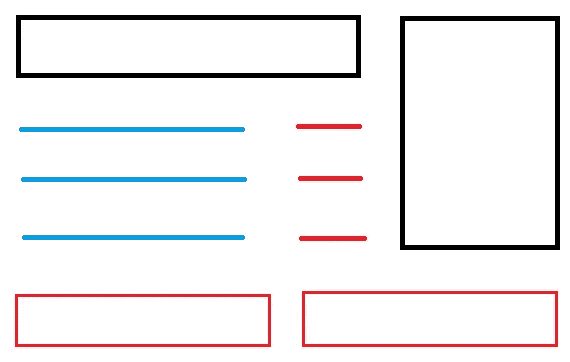
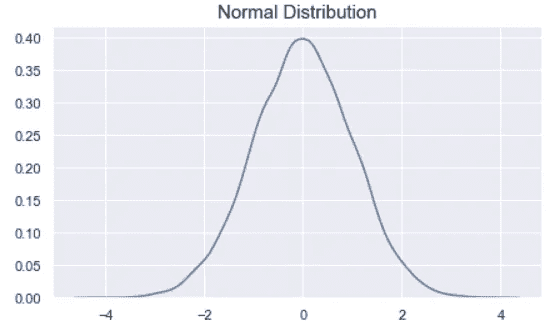
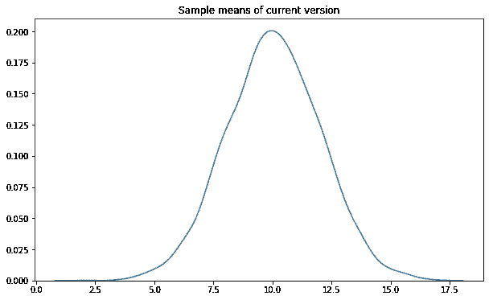
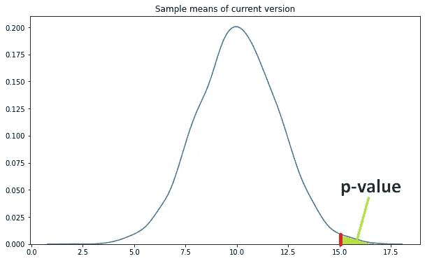
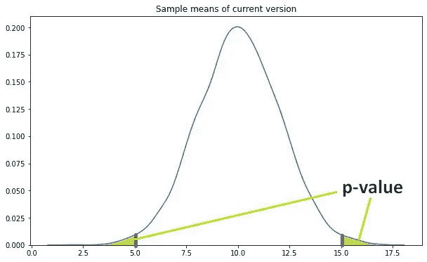

# p 值—已解释

> 原文：<https://towardsdatascience.com/p-value-explained-c7f5547c0562?source=collection_archive---------18----------------------->

## 它的含义和使用方法。用一个用例解释。

迈克尔·泽兹奇在 [Unsplash](https://unsplash.com/s/photos/math?utm_source=unsplash&utm_medium=referral&utm_content=creditCopyText) 上的照片

p 值是推断统计学中的一个基本概念，用于根据统计检验的结果得出结论。简而言之，p 值是极端或不太可能的度量。事件发生的可能性帮助我们做出明智的决定，而不是随机的选择。

为了理解 p 值的重要性，我们应该熟悉两个关键术语:总体和样本。

*   **人口**是一个群体中的所有元素。例如，美国的大学生是指包括美国所有大学生的人口。欧洲的 25 岁人群包括了所有符合描述的人。

对人口进行分析并不总是可行或可能的，因为我们无法收集人口的所有数据。因此，我们使用样本。

*   样本是总体的子集。例如，美国 1000 名大学生是“美国大学生”人口的一个子集。

p 值提供的是基于样本统计评估或比较总体的能力。因此，P 值可以被认为是**群体**和**样本之间的桥梁。**

我更喜欢用现实生活中的例子来解释这种概念，我认为这样更容易理解这个主题。

假设你和你的朋友创建了一个网站。你对目前的设计不满意，想做些改变。你告诉你的朋友，如果你在设计上做一些改变，更多的人会点击网站，你会通过广告赚更多的钱。然而，你的朋友认为这是浪费时间，改变设计不会增加点击率(CTR)。

当前设计

*   你的朋友:改变设计不会提高点击率(零假设)。
*   你:改变设计会提高点击率(替代假设)。

新型设计

既然你们不能达成一致，你想做一个测试。顺便说一下，这种测试叫做假设测试，比较无效假设和可选假设。

**测试设置**

*   一半访问网站的人看到当前的设计，另一半看到新的设计
*   你记录两种设计的每日点击率

但是，您需要运行测试多长时间？在这种情况下，人口是从你开始测试之日到永远访问你的网站的所有人。这个数据是不可能收集的。因此，您收集了代表总体的样本。您运行测试 30 天，并分别记录每天的 CTR。现在，两个种群都有 30 个样本。为什么是 30？我们稍后会谈到这一点。

30 天的测试结果

每天都是一个样本。每天的数值是当天的平均 CTR(即样本平均值)。

取 30 天的平均值，可以看到新设计的 30 天平均 CTR 高于当前设计。你要求你的朋友立即改变网站的设计，因为新的设计增加了流量。你的朋友回答道:

*   “坚持住！没有一致和大的差异，所以结果可能是由于随机的机会。如果我们再进行 30 天的测试，目前的设计可能会有更高的点击率。”

你的朋友建议做一个**统计显著性检验**并检查 **p 值**以了解结果是否具有**统计显著性。**

> **统计显著性测试**测量样本的测试结果是否适用于整个人群。

是时候引入一些新概念了。

*   **概率分布**:显示事件或实验结果概率的函数。
*   **正态(高斯)分布**:一种看起来像钟的概率分布；

描述正态分布的两个术语是**均值**和**标准差**。Mean 是被观察到的概率最高的平均值。**标准偏差**是对数值分布程度的测量。随着标准差的增加，正态分布曲线变宽。y 轴表示要观察的值的概率。

**中心极限定理**

正态分布用于表示分布未知的随机变量。因此，它被广泛应用于包括自然科学和社会科学在内的许多领域。证明为什么它可以用来表示未知分布的随机变量的理由是**中心极限定理(CLT)** 。

根据 **CLT** ，当我们从一个分布中抽取更多样本时，样本平均值将趋向于一个**正态分布**，而不管总体分布如何。通常，如果我们有 30 个或更多的样本，我们可以假设我们的数据是正态分布的。这就是我们进行 30 天测试的原因。

假设数据呈正态分布，因此当前版本样本均值的分布函数如下:

**注**:要绘制正态分布，只需要知道**均值**和**标准差**。您可以使用收集的 30 个样本平均值来计算这些值。

样本平均值似乎是 10，因此更有可能观察到 10 左右的值。例如，CTR 为 11 并不奇怪，因为这种可能性很高。然而，获得 16.5 的值将是一个极端的结果，因为根据我们的分布函数，它具有非常低的概率。

如果根据当前设计的分布，新设计的样本均值被观察到的概率非常低，我们可以得出结论，新设计的结果不是随机出现的。如果结果不太可能被随机观察到，我们说这些结果在统计上是显著的。为了确定统计显著性，我们使用 p 值。 **P 值**是获得我们的观察值或有相同或较少机会被观察的值的概率。

假设新设计的样本平均值为 12.5。因为它是一个连续函数，所以区间的概率就是函数曲线下的面积。因此，12.5 的 p 值是上图中的绿色区域。绿色区域表示获得 12.5 或更极端值(在我们的例子中高于 12.5)的概率。

假设 p 值是 0.11，但是我们如何解释它呢？p 值为 0.11 意味着我们对结果有 89%的把握。换句话说，有 11%的概率结果是随机的。类似地，p 值为 0.5 意味着有 5%的概率结果是随机的。

> p 值越低，结果越确定。

为了根据 p 值做出决定，我们需要设置一个**置信水平**，它表示我们对结果的确信程度。如果我们将置信度设为 95%，则**显著性值**为 0.05。在这种情况下，要使检验具有统计显著性，p 值必须低于 0.05。

如果你和你的朋友将置信水平设为 95%，发现 p 值为 0.11，那么你的结果在统计上不显著。你的结论是，由于随机因素，新设计的平均值更高。因此，您不需要更改设计。

如果新设计的样本平均值是 15，这是一个更极端的值，p 值将低于 0.11。

如果新版本的 CTR 高于当前版本，结果为 15.0，则为 p 值

我们可以看到，p 值比前一个小很多。假设 p 值现在是 0.02。因此，根据 95%的置信水平，该 p 值表明结果具有统计学意义。

值得一提的重要一点是，我们正在测试新设计的结果是否比当前设计的结果**高**。因此，在计算更多极值的概率时，我们只考虑右侧的值。如果我们检验结果是否**不同**，我们需要考虑分布函数的两边。

如果新版本的 CTR 与当前版本不同，结果为 15.0，则为 p 值

感谢您的阅读。如果您有任何反馈，请告诉我。