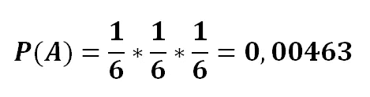
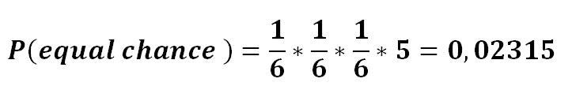
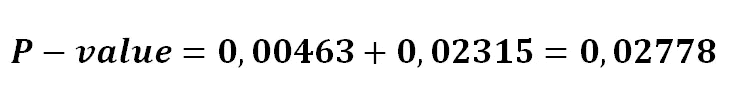
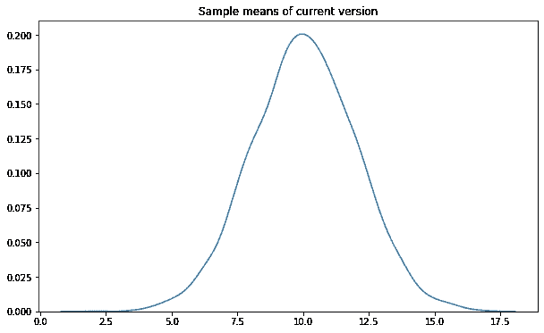
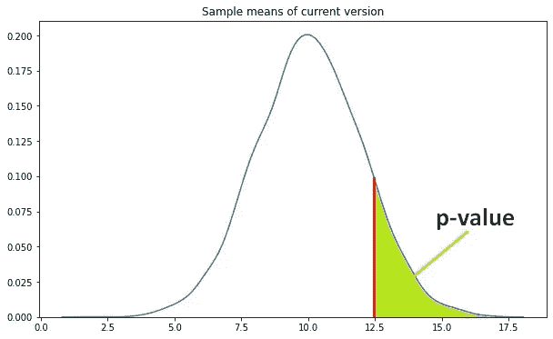
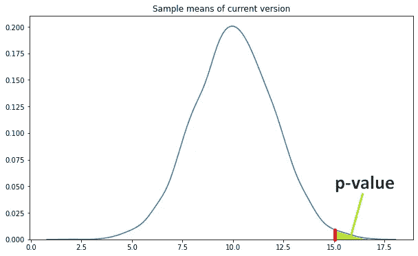
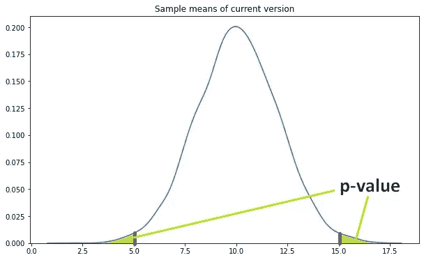

# p 值、假设检验和统计显著性

> 原文：<https://towardsdatascience.com/p-value-hypothesis-testing-and-statistical-significance-63bdd7277e66?source=collection_archive---------36----------------------->

## 如何理解差异是否真的重要？

你可能听说过双陆棋。虽然是最古老的棋盘游戏之一，但它抵制了数字时代，在许多东方文化中仍然非常普遍。双陆棋是一种双人游戏，每位玩家有 15 颗棋子。目标是将棋子移动到棋盘的角落并收集它们。玩家掷出一对骰子，并相应地移动棋子。因此，这是一个需要策略和运气同步才能获胜的游戏，我认为这是它存在了很长时间的主要原因。在这篇文章中，我们对双陆棋的“运气”部分感兴趣。

Backgommon ( [图源](https://en.wikipedia.org/wiki/File:Backgammon_lg.png))

骰子有六种结果，从 1 到 6。当你掷两个骰子时，结果数增加到 36 (6x6)。为了简单起见，我假设这个游戏只有一个骰子。你能移动的次数取决于骰子的结果。所以，如果你掷出更高的数字，你可以快速移动，增加你赢的机会。如果你一直掷出所有的六，你的对手会在掷出几个后开始叫你“幸运”。例如，连续三次掷出 6 是极不可能的。现在是时候引入 p 值了。

**P 值**是一个事件发生可能性的量度。该定义可能会导致将 p 值理解为事件的概率。它与事件的概率有关，但它们不是一回事。

**P 值**是获得我们的观察值或有相同或更少机会被观察的值的概率。

考虑掷骰子的例子。让我们将事件 A 定义为“连续三次掷出 6”。那么，事件 A 的概率:

这个小数字是事件 a 的概率。事件 a 的 P 值是多少。P 值有三个组成部分:

1.  事件 A 的概率
2.  与事件 A 有同等机会发生的事件的概率
3.  比事件 A 发生几率小的事件的概率

我们已经知道了事件 a 的概率，我们来计算其他部分。与事件 A 有同等机会发生的事件连续三次掷出不同的数字。比如三次滚动一个 1。由于骰子上有 6 个数字，这些事件的概率(排除 6 个，因为已经计算过了):

**注意**:为了简单起见，顺序被忽略。如果考虑顺序，5–6–6 或 6–5–6 与 6–6–6 的概率相同。我们认为情况 5–6–6 和 6–5–6 是相同的(一次 5 和两次 6)。

在我们的案例中，不存在发生几率更低的事件，因此发生几率更低的事件的概率为零。因此，连续三次滚动 6 的 p 值:

p 值很低，因此我们可以说这是一个不太可能发生的事件。

p 值多用于**假设检验。**考虑我们有一个网站，并计划在其设计上做一些改变，以增加流量。我们想测试“新设计”是否会吸引更多的注意力，从而增加网站的流量。我们应该定义两个假设:

*   零假设:新设计不会增加流量
*   替代假设:新设计增加了交通流量

我们通过点击率(CTR)来衡量流量。当不可能或不可行比较两个总体时，我们抽取样本并代表总体比较样本。在我们的例子中，**人口**是我们网站存在期间的所有流量，在它消亡之前是不可能知道的。所以我们取**样本**。我们向一半的观众展示当前的设计，向另一半的观众展示“新设计”。然后我们测量 50 天的点击率(即收集 50 个样本)。我们计算了所有样品的 CTR，发现“新设计”的平均 CTR 高于当前设计。我们是否仅仅通过比较手段就永久地改变了设计？绝对不行。

我们可能通过**随机机会**获得更高的点击率。我们需要检查 p 值。在进入这一步之前，我将提到一个被称为中心极限定理的最新定理:

根据**中心极限定理**，当我们从一个数据分布中取更多的平均值时，平均值将趋向于一个**正态分布**，而不管总体分布如何。如果样本量很大，样本数超过 30，中心极限定理就更加确定。

因此，当前版本的样本均值分布如下:

这是概率分布。如图所示，当前设计最有可能的 CTR 似乎是 10。我们可以说它可能观察到 12.5 和 7.5 之间的值。但是，随着值不断增加或减少，概率会显著降低。尾部的值非常极端，很难观察到。如果从新设计中获得的平均 CTR 约为 12.5，那么我们可以得出结论，这个结果可能是随机的，因为它也可能从当前设计中获得。回想一下，p 值是获得我们的结果或同样可能或更极端结果的概率。因此，这种情况下的 p 值是下图中的绿色区域。

从新版本中获得 12.5 的 p 值

假设新设计的平均 CTR 为 15.0，这是当前设计的极限值。使用当前设计观察 15.0 的 p 值可以在下图中看到。由于使用当前设计得到 15.0 的可能性极小，我们可以得出结论，新设计和当前设计的结果之间的差异是**而不是由于随机机会**。因此，新的设计实际上提高了网站的点击率。

从新版本中获得 15.0 的 p 值

> p 值告诉我们这种差异是否真的重要。

**注**:我们正在测试新设计的结果是否比当前设计的**高**。如果我们要测试新设计的结果是否与当前设计的**不同**，我们将需要包括左边尾部的值，其概率等于或低于我们的结果。在这种情况下，p 值变为:

如果新版本不同于当前版本，则 p 值为 15.0

> p 值越低，结果越确定。

如果 p 值是 0.05，那么我们对结果有 95%的把握。换句话说，有 5%的可能性结果是随机的。代表总体比较两个样本的过程称为统计显著性检验。

> **统计显著性检验**测量样本的检验结果是否可能适用于整个人群。

在进行统计显著性测试之前，我们设置了一个**置信水平**，它表明我们对结果的确信程度。如果我们将置信度设为 95%，则**显著性值**为 0.05。在这种情况下，要使测试具有统计显著性，p 值必须低于显著性值。假设我们将测试的置信水平设为 95%，发现 p 值为 0.02，则:

*   我们 98%确定新设计的 CTR 高于当前设计。
*   有 2%的几率由于随机机会而获得结果。
*   根据我们的置信水平，结果具有统计学意义。

我们现在可以将样本结果应用于整个人口。在假设检验方面，这一结果建议拒绝零假设，并根据替代假设采取行动。回想一下两个假设:

*   零假设:新设计不会增加流量
*   替代假设:新设计增加了交通流量

我们可以采用新的设计。

置信度取决于任务。95%是一个常用值。对于像化学反应这样的敏感任务，置信度可以设置为高达 99.9%。在 99.9%置信水平的情况下，我们寻找 0.001 或更小的 p 值。

感谢您的阅读。如果你有任何问题，请让我知道。