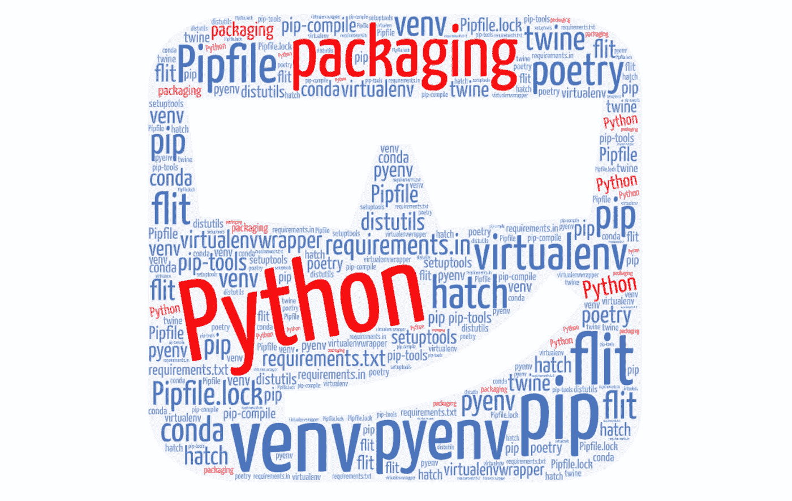
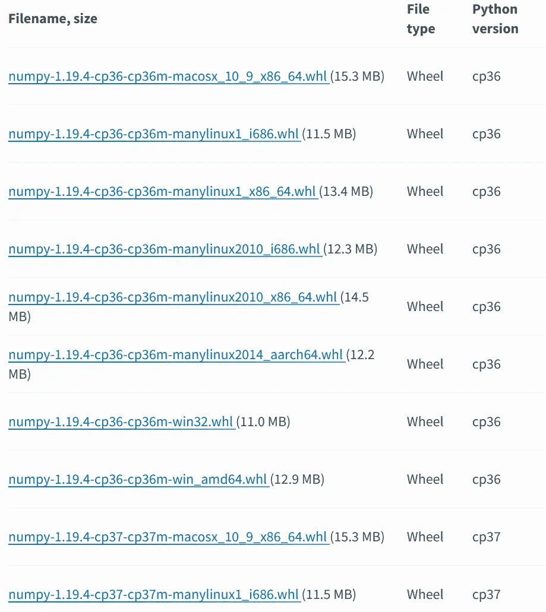

# Python 中的打包:工具和格式

> 原文：<https://towardsdatascience.com/packaging-in-python-tools-and-formats-743ead5f39ee?source=collection_archive---------5----------------------->

## 9 个问题的 16 种解决方案——你知道哪些？



由作者创建

虚拟环境是一个隔离的 Python 环境。它有自己安装的`site-packages`，可以不同于系统`site-packages`。别担心，我们稍后会更详细地讨论。

看完这篇文章，你就明白下面这些工具是什么了，它们解决了哪些问题:pip，pyenv，venv，virtualenv，pipx，pipenv，pip-tools，setup.py，requirements.txt，requirementst.in，Pipfile，Pipfile.lock，twine，poem，flint，hatch。

# 包装类型

对于本文，您需要区分两种类型的(打包)代码:

*   **库**由其他库或应用程序**导入**。库不会自己运行；它们总是由应用程序运行。Python 中库的例子有 Numpy，SciPy，Pandas，Flask，Django，[点击](https://pypi.org/project/click/)，
*   **应用**被**执行**。Python 应用的例子有 [awscli](https://pypi.org/project/awscli/) 、 [Jupyter](https://pypi.org/project/jupyter/) (笔记本)、任何用 [Flask](https://pypi.org/project/Flask/) 或 [Django](https://pypi.org/project/Django/) 创建的网站。

你可以进一步区分它们，例如库和框架。或者命令行应用程序、具有图形用户界面的应用程序、服务等等。但是对于本文，我们只需要区分库和应用程序。

请注意，有些应用程序还包含可以导入的代码，或者有些库具有作为应用程序提供的部分功能。在这些情况下，您可以将它们用作库(包括项目中的代码)或应用程序(只是执行它们)。你是指挥官。

# 基础知识:pip、站点包和提示符

Python 将`pip`作为默认的包管理器。你像这样使用它:

```
pip install mpu
```

当您运行它时，您应该会看到以下消息:

```
Collecting mpu
  Using cached [https://files.pythonhosted.org/packages/a6/3a/c4c04201c9cd8c5845f85915d644cb14b16200680e5fa424af01c411e140/mpu-0.23.1-py3-none-any.whl](https://files.pythonhosted.org/packages/a6/3a/c4c04201c9cd8c5845f85915d644cb14b16200680e5fa424af01c411e140/mpu-0.23.1-py3-none-any.whl)
Installing collected packages: mpu
Successfully installed mpu-0.23.1
```

为了能够向您展示输出和我插入的内容，我开始了包含我用`$`输入的命令的行:

```
$ pip install mpu
Collecting mpu
  Using cached [https://files.pythonhosted.org/packages/a6/3a/c4c04201c9cd8c5845f85915d644cb14b16200680e5fa424af01c411e140/mpu-0.23.1-py3-none-any.whl](https://files.pythonhosted.org/packages/a6/3a/c4c04201c9cd8c5845f85915d644cb14b16200680e5fa424af01c411e140/mpu-0.23.1-py3-none-any.whl)
Installing collected packages: mpu
Successfully installed mpu-0.23.1
```

这个`$`叫做**提示**。在 Python 内部，提示是`>>>`:

```
$ python
>>> import mpu
>>> mpu.__file__
'/home/moose/venv/lib/python3.7/site-packages/mpu/__init__.py'
```

这个命令显示了软件包`mpu`的安装位置。默认情况下，这是系统的 Python 位置。这意味着所有 Python 包共享同一套已安装的库。

# 问题 1:需要不同的 Python 版本

我们安装了 Python 3.6，但是应用程序需要 Python 3.8。我们无法升级我们的系统 Python 版本，例如，因为我们缺少管理员权限，或者因为其他东西会损坏。

# 解决方案:pyenv

[Pyenv](https://github.com/pyenv/pyenv) 允许你安装任何你想要的 Python 版本。您还可以使用`pyenv`在 Python 环境之间轻松切换:

```
$ python --version
Python 3.6.0$ pyenv global 3.8.6$ python --version
Python 3.8.6$ pip --version
pip 20.2.1 from /home/math/.pyenv/versions/3.8.6/lib/python3.8/site-packages/pip (python 3.8)
```

更多信息，请阅读我的文章[Python 开发初学者指南](https://medium.com/python-in-plain-english/a-beginners-guide-to-python-development-on-windows-10-e9d80601f483)。详细安装说明，直接去【pyenv 官方网站。

# 问题 2:包装和配送大楼

你通常不仅仅使用裸 Python。作为开发者，我们站在巨人的肩膀上——整个免费软件生态系统。在 Python 的初期，人们只是复制文件。Python 文件在导入时也称为**模块**。如果我们在一个带有`__init__.py`的文件夹中有多个 Python 文件，它们可以互相导入。这个文件夹被称为**包**。包可以包含其他包——也有`__init__.py`的子文件夹，然后被称为**子包**。

复制文件和文件夹不方便。如果该代码的作者进行了更新，我可能需要更新几十个文件。我需要在第一时间知道是否有更新。我可能还需要安装数百个依赖项。通过复制粘贴来做这件事将是地狱。

我们需要一种更方便的方式来分发这些包。

# 解决方案:来源分配

包装系统需要三个核心组件:

*   **包格式**:Python 中最简单的格式叫做*源码分发*。它本质上是一个具有特定结构的 ZIP 文件。该文件的一个重要部分是可以指定包的依赖关系。它还应该包含其他元数据，比如包的名称、作者和许可信息。
*   **软件包管理器**:安装软件包的程序。pip 在 Python 中安装包。
*   **软件仓库**:包管理者可以寻找包的中心位置。在 Python 生态系统中，[pypi.org](https://pypi.org/)是公共的。我甚至不知道还有其他公开的。当然，您可以创建私有的。

如前所述，我们需要一种方法来指定元数据和依赖关系。这是通过`setup.py`文件完成的。它通常看起来像这样:

```
from setuptools import setupsetup(
    name="my_awesome_package",
    version="0.1.0",
    install_requires=["requests", "click"]
)
```

您可以使用更多的[版本说明符](https://www.python.org/dev/peps/pep-0440/#version-specifiers)，例如:

```
numpy>3.0.0  # 3.0.1 is acceptable, but not 3.0.0
numpy~=3.1   # 3.1 or later, but not version 4.0 or later.
numpy~=3.1.2 # 3.1.2 or later, but not version 3.2.0 or later.
```

为了创建源分布，我们运行

```
$ python setup.py sdist
```

我不太喜欢`setup.py`文件，因为它是代码。对于元数据，我更喜欢使用配置文件。Setuptools 允许使用一个`setup.cfg`文件。您仍然需要一个 setup.py，但它可以简化为:

```
from setuptools import setupsetup()
```

然后你就有了如下的`setup.cfg`文件。有关于 [setup.cfg](https://setuptools.readthedocs.io/en/latest/setuptools.html#configuring-setup-using-setup-cfg-files) 格式的文档。

```
[metadata]
name = my_awesome_packageauthor = Martin Thoma
author_email = [info@martin-thoma.de](mailto:info@martin-thoma.de)
maintainer = Martin Thoma
maintainer_email = [info@martin-thoma.de](mailto:info@martin-thoma.de)# keep in sync with my_awesome_package/__init__.py
version = 0.23.1description = Martins Python Utilities
long_description = file: README.md
long_description_content_type = text/markdown
keywords = utility,platforms = Linuxurl = [https://github.com/MartinThoma/mpu](https://github.com/MartinThoma/mpu)
download_url = [https://github.com/MartinThoma/mpu](https://github.com/MartinThoma/mpu)license = MIT# [https://pypi.org/pypi?%3Aaction=list_classifiers](https://pypi.org/pypi?%3Aaction=list_classifiers)
classifiers =
    Development Status :: 3 - Alpha
    Environment :: Console
    Intended Audience :: Developers
    Intended Audience :: Information Technology
    License :: OSI Approved :: MIT License
    Natural Language :: English
    Operating System :: OS Independent
    Programming Language :: Python :: 3.7
    Programming Language :: Python :: 3.8
    Programming Language :: Python :: 3.9
    Topic :: Software Development
    Topic :: Utilities[options]
packages = find:
python_requires = >=3.7
install_requires = 
    requests
    click[tool:pytest]
addopts = --doctest-modules --ignore=docs/ --durations=3 --timeout=30
doctest_encoding = utf-8[pydocstyle]
match_dir = mpu
ignore = D105, D413, D107, D416, D212, D203, D417[flake8]
max-complexity=10
max_line_length = 88
exclude = tests/*,.tox/*,.nox/*,docs/*
ignore = H301,H306,H404,H405,W503,D105,D413,D103[mutmut]
backup = False
runner = python -m pytest
tests_dir = tests/[mypy]
ignore_missing_imports = True
```

# 问题 3:安全上传

您希望将包安全地上传到 PyPI。你需要认证，你想确定没有人篡改你的包。

# 解决方案:缠绕

通过`pip install twine`安装[绳](https://pypi.org/project/twine/)，您可以上传您的分发文件:

```
twine upload dist/*
```

# 问题 4:依赖冲突

你想在版本`1.2.3`中安装需要库`requests`的`youtube-downloader`，在版本`3.2.1`中安装需要库`requests`的`vimeo-downloader`。因此库`requests`是两个应用程序的依赖项。这两个应用程序都需要用 Python 3.8 来执行。这是一个问题，因为两个应用程序都将`requests`存储在同一个`site-packages`目录中。一旦你安装了一个版本，另一个就没了。您需要两个不同的环境来运行这两个应用程序。

> python 环境是 Python 可执行文件、pip 和一组已安装的软件包。不同的环境是相互隔离的，因此不会相互影响。

我们通过创建虚拟环境来解决这种依赖性冲突。我们称之为*虚拟*，因为它们实际上共享 Python 可执行文件和其他东西，比如 shells 的环境变量。

# 解决方案:venv

Python 有 [venv 模块](https://docs.python.org/3/library/venv.html),碰巧也是可执行的。您可以创建和使用一个全新的虚拟环境，如下所示:

```
$ python -m venv my-fresh-venv
$ source my-fresh-venv/bin/activate(my-fresh-venv)$ pip --version
pip 20.1.1 from /home/moose/my-fresh-venv/lib/python3.8/site-packages/pip (python 3.8)
```

环境之所以被称为“新鲜”，是因为里面什么都没有。在`source`-调用`activate`脚本后安装的所有东西都将被安装在这个本地目录中。这意味着当你在一个这样的虚拟环境中安装`youtube-downloader`而在另一个虚拟环境中安装`vimeo-downloader`时，你可以同时拥有两者。你可以通过执行`deactivate`走出虚拟环境。

如果你想了解更多细节，我推荐你阅读 [Python 虚拟环境:初级读本](https://realpython.com/python-virtual-environments-a-primer/)。

# 问题 5:不方便

您仍然需要一直在虚拟环境之间切换，这很不方便。

# 解决方案:pipx

[pipx](https://github.com/pipxproject/pipx) 自动将软件包安装到它们自己的虚拟环境中。它还会自动执行该环境中的应用程序😍

**注意**:这只对应用有意义！您需要在与应用程序相同的环境中使用库。所以永远不要用 pipx 安装库。用 pipx 安装应用程序(间接安装库)。

# 问题 6:更改第三方代码

作为一名应用程序开发人员，我想确保我的应用程序能够正常工作。我想独立于我使用的第三方软件的潜在突破性变化。

比如，想想 1.2.3 版本中需要`requests`的`youtube-downloader`。在某些时候，可能是在开发期间，那个版本的请求可能是最新的版本。然后`youtube-downloader`的开发就停止了，但是`requests`一直在改。

# 解决方案:依赖固定

给出您想要安装的确切版本:

```
numpy==3.2.1
scipy==1.2.3
pandas==4.5.6
```

然而，如果你在`setup.py`中这样做，这本身就有一个问题。您将在相同环境中的其他软件包上强制使用这个版本。Python 在这里相当混乱:一旦另一个包在同一环境的另一个版本中安装了您的一个依赖项，它就会被简单地覆盖。您的依赖项可能仍然有效，但是您没有得到预期的版本。

对于应用程序，您可以像这样将依赖项固定在`setup.py`中，并告诉您的用户使用`pipx`来安装它们。这样你和你的用户都会很开心💕

对于库，您不能这样做。根据定义，库包含在其他代码中。可能包含大量库的代码。如果它们都固定了它们的依赖关系，那么很可能会出现依赖冲突。如果开发的库本身有几个依赖项，这会使库开发变得困难。

通常的做法是不在`setup.py`文件中固定依赖关系，而是创建一个带有固定依赖关系的平面文本文件。 [PEP 440](https://www.python.org/dev/peps/pep-0440/) 在 2013 年定义了格式或要求文件。它通常被称为`requirements.txt`或`requirements-dev.txt`，通常看起来像这样:

```
numpy==3.2.1
scipy==1.2.3
pandas==4.5.6
```

您还可以根据 PEP 440 指定下载包的位置(例如，不仅是名称，还有 git 存储库)。

requirements.txt 中的包(包括它们的依赖项)可以与

```
$ pip install -r requirements.txt
```

# 问题 7:改变传递依赖关系

想象你写的代码依赖于包`foo`和`bar`。这两个包本身也可能有依赖关系。这些依赖被称为代码的*传递*依赖。它们是间接依赖关系。你需要关心的原因如下。

假设发布了多个版本的`foo`和`bar`。`foo`和`bar`恰好都有一个依赖关系:`fizz`

情况是这样的:

```
foo 1.0.0 requires fizz==1.0.0
foo 1.2.0 requires fizz>=1.5.0, fizz<2.0.0
foo 2.0.0 requires fizz>=1.5.0, fizz<3.0.0bar 1.0.0 requires fizz>2.0.0
bar 1.0.1 requires fizz==3.0.0fizz 1.0.0 is available
fizz 1.2.0 is available
fizz 1.5.0 is available
fizz 2.0.0 is available
fizz 2.0.1 is available
fizz 3.0.0 is available
```

你可能想说“我需要`foo==2.0.0`和`bar==1.0.0`。有两个问题:

1.  **依赖满足可能很难**:客户需要弄清楚这两个需求只能由`fizz==2.0.0`或`fizz==2.0.1`来满足。这可能很耗时，因为 Python 源代码发行版没有很好地设计，也没有很好地公开这些信息([示例讨论](https://github.com/python-poetry/poetry/issues/2094))。依赖关系解析器实际上需要下载包来找到依赖关系。
2.  **中断传递性变更**:包 foo 和 bar 无法声明它们的依赖关系。你安装了它们，事情就正常了，因为你碰巧有`foo==2.0.0`、`bar==1.0.0`、`fizz==2.0.1`。但是过了一会儿，`fizz==3.0.0`就放出来了。不用告诉`pip`要安装什么，它就会安装最新版本的`fizz`。之前没有人测试过，因为它不存在。你的用户是第一个，这对他们来说是坏消息😢

# 解决方案:固定传递依赖关系

您还需要找出可传递的依赖关系，并准确地告诉 pip 要安装什么。为此，我从一个`setup.py`或`requirements.in`文件开始。`requirements.in`文件包含了我所知道的必须实现的内容——它与 setup.py 文件非常相似。与`setup.py`文件不同，它是一个平面文本文件。

然后我使用 [pip-tools](https://pypi.org/project/pip-tools/) 中的`pip-compile`来寻找传递依赖关系。它将生成如下所示的`requirements.txt`文件:

```
#
# This file is autogenerated by pip-compile
# To update, run:
#
#    pip-compile setup.py
#
foo==2.0.0   # via setup.py
bar==1.0.0   # via setup.py
fizz==2.0.1  # via foo, bar
```

通常情况下，我有以下内容:

*   **setup.py** :定义抽象依赖和已知的最低版本/最高版本。
*   **requirements.txt** :我知道的一个版本组合[在我的机器](https://blog.codinghorror.com/the-works-on-my-machine-certification-program/)上工作。对于我控制安装的 web 服务，这也用于通过`pip install -r requirements.txt`安装依赖项
*   **需求-开发在**中:我使用的开发工具。pytest、flake8、flake8 插件、mypy、black 之类的东西……看我的[静态代码分析贴](/static-code-analysis-for-python-bdce10b8d287)。
*   **requirements-dev.txt** :我使用的工具的确切版本+它们的传递依赖。这些也安装在 [CI 管道](https://levelup.gitconnected.com/ci-pipelines-for-python-projects-9ac2830d2e38)中。对于应用程序，我还在这里包含了`requirements.txt`文件。请注意，我创建了一个包含了`requirements.txt`的组合`requirements-dev.txt`。如果我在安装`requirements-dev.txt`之前安装`requirements.txt`，它可能会改变版本。这意味着我不会对完全相同的包版本进行测试。如果我在`requirements-dev.txt`之后安装`requirements.txt`，我可以为开发工具破坏一些东西。因此我通过
    `pip-compile --output-file requirements-dev.txt requirements.txt`创建了一个组合文件

如果你想确定完全一样，你也可以加上`--generate-hashes`。

# 问题 8:非 Python 代码

像 [cryptography](https://pypi.org/project/cryptography/) 这样的包都有用 c 写的代码，如果你安装了 cryptography 的源代码发行版，你需要能够编译那些代码。您可能没有安装像 gcc 这样的编译器，编译需要相当多的时间。

# 解决方案:构建的发行版(轮子)

软件包创建者也可以上传构建的发行版，例如作为 wheels 文件。这可以防止你自己编译东西。事情是这样做的:

```
$ pip install wheels
$ python setup.py bdist_wheel
```

例如， [NumPy](https://pypi.org/project/numpy/#files) 这样做:



pypi.org 的截图是作者拍摄的。

# 问题 9:构建系统的规范

Python 生态系统非常依赖 setuptools。不管 setuptools 有多好，总会有人们遗漏的功能。但是我们有一段时间不能改变构建系统。

# 解决方案:pyproject.toml

[人教版 517](https://www.python.org/dev/peps/pep-0517/) 和[人教版 518](https://www.python.org/dev/peps/pep-0518) 规定了`pyproject.toml`文件格式。看起来是这样的:

```
[build-system]
requires = ["poetry-core>=1.0.0"]
build-backend = "poetry.core.masonry.api"
```

是的，不多。它告诉 pip 构建您的包需要什么。但这是迈向更大灵活性的良好一步。

其他工具，像 poem 和 black，使用这个文件为他们的`pyproject.toml`配置，类似于`flake8`、`pytest`、`pylint`和更多允许你添加配置到`setup.cfg`。


Giorgio Trovato 在 [Unsplash](https://unsplash.com?utm_source=medium&utm_medium=referral) 上拍摄的照片

# 荣誉奖

本节中的工具相对广泛，但是到今天为止，它们并没有真正解决上面的工具没有解决的任何问题。它们可能比其他的更方便使用。

## virtualenv 和 virtualenvwrapper

第三方工具 [virtualenv](https://pypi.org/project/virtualenv/) 存在于核心模块 [venv](https://docs.python.org/3/library/venv.html) 之前。它们并不完全相同，但对我来说，`venv`已经足够好了。如果有人能告诉我一个问题的解决方案是 virtualenv(而不是 venv ),我会很高兴🙂

[virtualenvwrapper](https://virtualenvwrapper.readthedocs.io/en/latest/) 扩展 virtualenv。

## pipenv

Pipenv 是一个依赖管理和打包的工具。它介绍了[两个新文件](https://github.com/pypa/pipfile):

*   **Pipfile** :一个 TOML 文件。它的内容在思想上类似于`requirements.in`的内容:抽象依赖。
*   **Pipfile.lock** :一个 TOML 文件。它的内容在思想上类似于`requirements.txt`的内容:固定的具体依赖，包括可传递的依赖。

本质上，它包装了 venv。

## 诗意

[诗歌](https://pypi.org/project/poetry/)是一个依赖管理和打包的工具。它结合了许多工具，但其核心功能与 pipenv 相同。主要区别在于它使用了`pyproject.toml`和`poetry.lock`而不是`Pipfile`和`Pipfile.lock`。[霜明](https://medium.com/u/8a7cdd475d09?source=post_page-----743ead5f39ee--------------------------------)写了一篇[诗与 pipenv](https://frostming.com/2019/01-04/pipenv-poetry) 的详细比较。

诗歌包装或替换的项目有:

*   **脚手架** : `poetry new project-name` vs [千篇一律](https://github.com/MartinThoma/cookiecutter-python-package)
*   **建筑分布** : `poetry build` vs `python setup.py build sdist_build`
*   **依赖管理** : `poetry add foobar` vs 手动编辑 setup.py / requirements.txt 文件。然后，poems 将创建一个虚拟环境，一个与`Pipfile.lock`概念相同的`poetry.lock`文件，并更新`pyproject.toml`。你可以在下面看到一个例子。它们使用自己的依赖部分，这与其他任何部分都不兼容。我希望他们搬到 PEP 631(更新见[期](https://github.com/python-poetry/poetry/issues/3332))。
*   **上传到 PyPI** : `poetry publish` vs `twine upload dist/*`
*   **凹凸版** : `poetry version minor` vs 手动编辑`setup.py` / `setup.cfg`或使用[凹凸版](https://pypi.org/project/bumpversion/)。⚠️尽管诗歌在包含一个版本的脚手架中生成了一个`__init__.py`，但`poetry version`并没有改变这一点！

它背离了指定依赖关系的事实上的标准`setup.py` / `setup.cfg`。相反，诗歌期望依赖关系在它的配置中:

```
[tool.poetry]
name = "mpu"
version = "0.1.0"
description = ""
authors = ["Martin Thoma <[info@martin-thoma.de](mailto:info@martin-thoma.de)>"]
license = "MIT"[tool.poetry.dependencies]
python = "^3.8"
awscli = "^1.18.172"
pydantic = "^1.7.2"
click = "^7.1.2"[tool.poetry.dev-dependencies]
```

我希望他们也能实现 [PEP 621](https://www.python.org/dev/peps/pep-0621/) 和 [PEP 631](https://www.python.org/dev/peps/pep-0631/) ，在`[project]`部分给元数据和依赖项一个正式的位置。让我们看看，[也许他们改变了那个](https://github.com/python-poetry/poetry/issues/3332)。

有些人喜欢有一个什么都做的工具。我宁愿选择 Unix 哲学:

> 让每个程序做好一件事。要做一项新的工作，就要重新构建，而不是通过添加新的“特性”使旧的程序变得复杂。

由于诗歌结合了很多工具，它没有做什么也很重要:

*   **包管理**:你还需要 pip。并且 pip 支持 [pyproject.toml](https://pip.pypa.io/en/stable/reference/pip/#pep-517-and-518-support) 。
*   **脚手架** : Cookiecutter 有很多模板。我自己创建了两个:一个用于[典型的 Python 项目](https://github.com/MartinThoma/cookiecutter-python-package)，一个用于 [Flake8 插件](https://github.com/MartinThoma/cookiecutter-flake8-plugin)。
*   Setup.py :你可能不需要自己创建一个，但是 poems 会为你创建一个 Setup.py 文件。看看发行版文件就知道了。

我还应该指出，诗歌有一个超级好的命令行界面和视觉愉悦的网站。

## 舱口

[孵化](https://pypi.org/project/hatch/)也旨在替代相当多的工具:

*   **脚手架** : `hatch new project-name` vs [千篇一律](https://github.com/MartinThoma/cookiecutter-python-package)
*   **凹凸版** : `hatch grow minor` vs 手动编辑`setup.py` / `setup.cfg`或使用[凹凸版](https://pypi.org/project/bumpversion/)
*   **运行 pytest** : `hatch test` vs `pytest`
*   **创建虚拟环境** : `hatch env my-venv` vs `python -m venv my-venv`
*   **安装包** : `hatch install package` vs `pip install package`

我在尝试孵化时犯了几个错误。

## 菲丽

Flit 是一种将 Python 包和模块放在 PyPI 上的方法。它是 setuptools 的第三方替代品。在这个意义上，它类似于 setuptools + twine 或诗歌的一部分。

## 康达

Conda 是 Anaconda 的包管理器。它比 pip 更强大，可以构建/安装任意语言的代码。有了`pyproject.toml`，我想知道康达在未来是否有必要🤔

# 红鲱鱼

*   这是在 Python 中安装东西的最古老的方法。它类似于`pip`，但是你不能(轻易)卸载用`easy_install`安装的东西
*   `distutils`:虽然是核心 Python，但是已经不用了。`setuptools`更强大，到处安装。
*   我不确定那是否曾经发生过？
*   `pyvenv`:弃用，支持`venv`。

# 摘要

*   `pip`是蟒蛇**的包经理**。它转到 Python **包索引**PyPI.org 来安装你的包和它们的依赖项。
*   **抽象依赖**可以用 setup.py、requirements.in、Pipfile 或者 pyproject.toml 来表示，你只需要一个。
*   **具体的依赖关系**可以用 requirements.txt，Pipfile.lock，或者 poetry.lock 来表示，你只需要一个。
*   **构建包**是用 setuptools 或者诗歌完成的。
*   **上传包**是用麻线或者诗歌完成的。
*   **虚拟环境**由 venv 或 poem/pipenv/hatch/conda 创建
*   **pipx** 如果要安装应用的话很酷。不要用在图书馆。