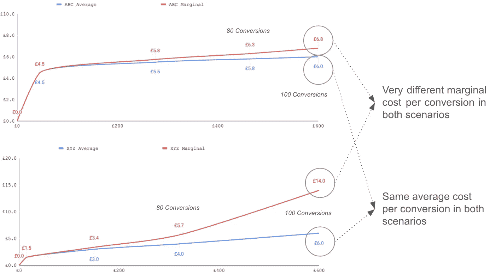
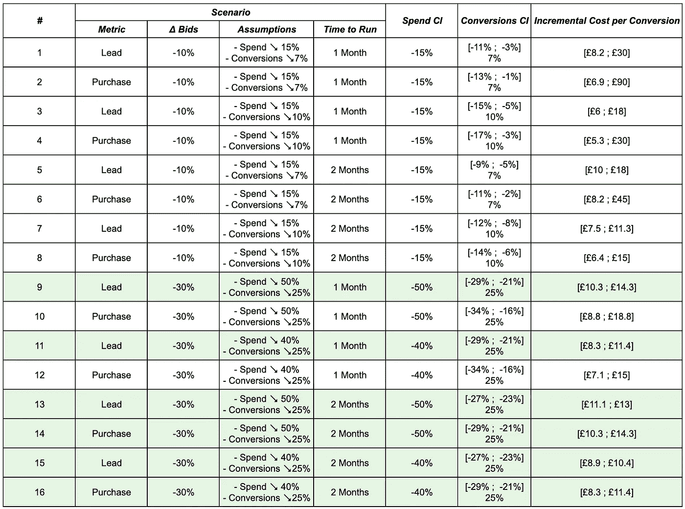
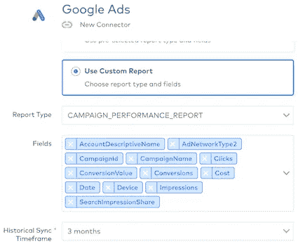
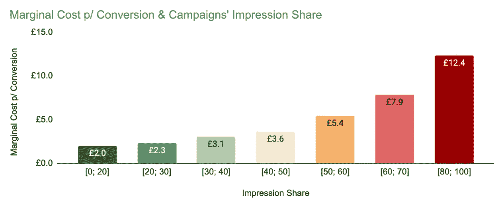
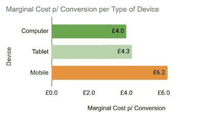

# 付费搜索增量

> 原文：<https://towardsdatascience.com/paid-search-incrementally-adc5ea284279?source=collection_archive---------21----------------------->

## 重新思考你的目标并找到最佳投标水平——一份商业解释和一份*操作指南*。

许多广告商和数字营销专业人士通常致力于实现每笔销售的目标成本，同时最大化他们为企业带来的客户数量或销售额。今天，我们将挑战在付费搜索领域实现这些目标的最佳方式，引入增量概念。为此，我们不仅要解释背后的商业理性和理论，还要提出在渐进框架中操作的实际步骤，并提供代码样本，以高效的方式应对挑战。

让我们首先将增量定义为一个特定行为对总产出(即成本、销售、收入、利润或其他)变化的影响。为了理解**增量**，我们必须意识到总有一个**基线情况**，你想要**对照它来衡量**任何给定行为的影响:

*   场景 1 — *一个行动是完全递增的* —最终，如果基线场景是几乎什么都没有的状态，那么所有行动都是 100%递增的。例如，拥有一个电子商务公司的网站是 100%的增量。没有它就没有销售或收入。
*   场景 2 — *一项行动是部分递增的* —并非所有行动都像上面的行动一样重要。例如，考虑一家公司在谷歌上购买关于他们自己品牌的广告空间，如果他们不这样做，那么一些潜在客户会点击他们竞争对手的付费广告链接；然而，他们不能说点击自己广告的人带来的收入是 100%递增的，因为有些人可能会通过自己品牌的 SEO 有机链接来访问他们的网站，跳过竞争对手的付费广告。(注意:我并不主张不对你的品牌竞价，许多公司这样做是因为它们通常是廉价的点击，他们害怕竞争会吓跑一些自然客户)
*   场景 3 — *一个动作是部分递增的，你想知道做这个动作有多少是最佳的* —例如，想象一家餐馆，试图计算他们的菜单上应该有多少选项。当然，答案往往不止一个或两个，以增加选择和满足不同的客户群，然而，在这一点上，一个额外的菜单项增加变化的好处被不得不管理额外的食物库存，培训他们的厨师制作这样的食谱和增加厨房协调的难度的成本所超过，以在一个给定的服务中在不同的菜肴之间跳跃？可能许多餐馆都希望有一个工具来帮助他们解决这个优化问题。
*   场景 4 — *一个行动根本不是增量* —一个简单的例子是给你的员工发白色笔记本而不是黑色笔记本:这个行动在任何给定的时间点都不会增加员工的生产力。然而，有时非增量行动更难识别。例如，你向现有客户展示一些脸书广告，他们最终会在某个时候再次购买你的产品(这是有关联的)。虽然，他们可能会在任何情况下购买你的商品(相关性并不意味着因果关系)，甚至他们中的一些人最终会再次从你那里购买，但他们对你公司的过度沟通感到不安，最终不会再回到你的网站或商店(在这种情况下，你的行动将是负增量)。

*在继续之前，有一个小提示:关于付费搜索增量的含义，一个合理的预期可能是追求理解作为一个整体的渠道的增量价值(即，如果我们完全关闭了 ppc，会发生什么？一些潜在客户还会通过其他营销渠道找到我们吗？).尽管对于一些公司来说，这可能是一个非常有见地的研究，但这不是本文今天要探讨的内容。相反，本文将关注我们在场景 3 中描述的内容及其在付费搜索领域的应用。希望这能有助于你思考你的 PPC 目标，以及如何衡量实现这些目标的最佳出价。*

因此，就像在餐馆优化他们应该拥有的菜单项目数量的例子中一样，一些谷歌广告广告可能会对你的业务有益和有利可图，而太多的谷歌广告广告开始对你的公司造成轻微的损失。这篇文章提出了一个框架，用于寻找谷歌广告的最佳数量，同时保持一种*递增*的心态，并远离一种*平均*的思维方式。这意味着在优化成熟度 2 和 3 之间进行如下所述的过渡(这可能与优化成熟度 1 和 2 之间的过渡一样重要和基本):

*   优化成熟度 1 — *公司目标—*SEM 渠道经理确保客户大致达到每次转化的总体目标，并且广告支出的回报符合高层管理人员或客户的期望。活动的多样性要么是有限的，要么是跨活动的每次转换的实际成本跨度非常大。
*   优化成熟度 2 — *平均值—*SEM 经理仍然确保客户的广告支出回报符合预期，但同时确保其拥有一个稳健的客户结构，其中大量活动在所有活动中实现相似的每次转化成本。其背后的基本原理是，首先，平均每次转化成本高于目标的活动对公司来说是无利可图的，其次，当所有活动都达到目标时，转化量最大化，而一些活动低于目标，另一些活动高于目标(即使在一天结束时，这两种情况都导致总体账户达到目标)。在确保上述内容后的第二步，SEM 经理通常还会确保除活动级别之外的其他“分割”客户的方式在每次转换的平均成本方面也是相同的(例如设备类型、主要位置、在许多活动中重复出现的广告组类型等)。).大多数公司都是在这种 ppc 优化成熟度水平上运营的。
*   优化成熟度 3 — *增量—* 在此框架下运营的公司明白，他们的平均目标和指标只是冰山一角。关键的思维转变是，他们从“*重新定义了这个问题:我每次转换的平均成本是多少？*“转换”*我愿意在任何特定转换上花费的最大金额是多少？*”。他们还了解收益递减，并且收益递减取决于许多因素:他们知道每次转化的平均成本相同的两个活动的每次转化的增量成本可能非常不同，如果他们多花一英镑或一美元，他们不会在这两个活动中平均分配，而是将它应用于每次转化的增量成本较低的一个活动。然而，要将这样的框架付诸实践，他们首先要做的不同的事情是生成他们自己的数据集，因为增量指标并不容易获得，这通常涉及到许多跨团队的合作(并且他们决不会低估所有相关团队之间沟通、协调和购买的重要性)。没有这样的努力，这个框架将永远只是一个理论上的练习。最后，一旦解锁，他们通过使用他们的新指标、报告和营销业务目标，从理论到实践，从平均值到增量。

但是，我们所说的平均值相同但增量经济学不同的运动是什么意思呢？让我们考虑下面的例子:对于 ABC 和 XYZ 的活动，你已经设置了 6 的目标 cpa(这里假设智能竞价，但是如果你运行关键字级别手动竞价，应该没有什么不同),并且谷歌能够为你的每个活动以该平均成本获得 100 次转换。如果不考虑增量，你可能没有理由在优化每个活动时采取不同的行动。然而，在后台可能发生的情况是，活动 ABC 能够以平均价格 5.8 获得 80 次转化，并以平均价格 6.8 获得额外的 20 次转化(总 100 次转化的平均 cpa 仍然是 6/次转化) 然而，XYZ 战役可以让你以平均 4 英镑的价格获得 80 次转换，然后找些空闲时间让你以平均 14 英镑的价格获得额外的 20 次转换(总转换的平均 cpa 仍然是 6 英镑——是的，这种情况可能发生，而且确实在很多场合一直在发生！ ).基本上，在一种情况下，你以合理的价格获得了额外的 20 次转换，而在另一种情况下，价格可能会让你赔钱，这总结了为什么平均值往往隐藏了一半的情况。我们用一个图表来说明这个观点，以此来结束这一部分:



每次转换的边际成本与平均成本

在这个阶段，我们已经奠定了理论框架，关于为什么 PPC 增量是重要的，但我们还没有提出一个实际的方法来操作在这个优化成熟度水平下，这可能是本文的主要观点。尽管这比在平均框架下操作要困难，因此很少有公司采用它。使用平均值的好处是，数据通常很容易使用，并且不需要额外的步骤来生成数据。Google ads 将为您提供详细的花费和转化数据，您可以根据这些数据轻松计算出您在账户本身或账户的几乎任何*【片段】*(每个活动、广告组、设备、设备和活动的组合、位置、受众等)上的平均每次转化成本。).如果你想在一个增量框架上操作，你必须弄清楚你想生成哪些数据，生成它，并确保其质量和准确性。

那么，你如何对你的 ppc 账户进行增量测试呢？是的，我说测试是因为一方面，对于许多人来说，ppc 增量可能还没有实现，另一方面，ppc 增量本身确实需要测试。当我们早些时候给出一个例子，在你的 100 次转换中，总成本为 600，你可能会以 4 的成本获得 80 次，以 14 的成本获得额外的 20 次，我们没有提到实际上有一种方法可以确定(或不确定)*(至少从统计上来说)。这个载体很可能就是你所知道的谷歌广告的草稿和实验。该工具将允许您 A/B 测试您帐户中的任何活动，将搜索流量平均分配给对照和变体(或 google ads 行话中的原始和草稿活动),并查看如果您有草稿而不是原始活动，您的指标(花费和转化率)会发生什么。您的草案和原始活动之间的差异将为您提供增量支出和增量转换。不过要小心，如果我们不把统计显著性等同于我们的测试，它会像什么都不做一样提供信息。此外，您可能很难在活动级别获得统计显著性，并且您必须在测试中降低粒度(即，考虑从客户/活动组/组合级别开始)。*

*因此，它最终归结为以下步骤(现在我们进入文章的实际应用):*

1.  *情况分析*
2.  *大规模创建多个草稿和实验*
3.  *监控测试的完整性*
4.  *以适当的方式收集数据，并准备好进行测量。*
5.  *评估测试*
6.  *探索性分析*
7.  *总结并准备未来的内分泌测试。*

## *1)情景分析*

*这是计划、玩弄数字和预测阶段。像任何好的实验一样，你应该从一个假设开始，这个假设应该是可操作的(即，它的确认与否应该使你采取行动 A 或行动 B)，并且可以以良好的准确度进行测量(即，你必须能够生成足够的数据来得出具有统计意义的结论，并且不应该存在任何技术、商业或业务障碍来阻止你生成这样的数据)。让我们回到我们的例子，我们有一个点击付费帐户，产生了 100 个转换，平均每次点击费为 6。在这种情况下，一个好的假设的例子可能是:*

*   *你想知道你的增量转换成本是否超过 15 英镑(例如，因为你在 15 英镑盈亏平衡，或者因为你想要至少 2 倍的边际 ROAS 来补偿你所有的其他成本)。*
*   *如果你证实了你的假设(每 conv 的递增转换率> 15)，你将采取的行动是把你的出价降低到你在这个实验中测试的相同出价水平。*
*   *如果你否定了你的假设(增量转换< 15 每 conv)，你将采取的行动是保持你的出价水平。*

*考虑到这一点，现在您将运行一些场景来处理测试的变量:*

*   *测试的潜在指标:漏斗下端的转换可能会提供您最感兴趣的答案，但是漏斗上端的转换更频繁，因此意味着测试持续时间更短。你越怀疑不同的出价对你的 ppc 帐户吸引的访问者类型的影响，你就越有理由努力将漏斗下端的转化作为你的测试指标，否则漏斗上端的转化可能就能做到；*
*   *出价水平的变化:测试彼此更接近的出价水平更有意思，比如 10%的变化，但你可能没有足够的数据来准确验证这样小的差异；*
*   *假设当你的出价按照上面定义的水平改变时，花费和转化率会发生什么:如果你降低出价，你的花费水平自然也会降低，但是会降低多少呢？你应该提前提出一些假设，并检查“如果你在测试结束时观察到这种差异”，这些假设会对你的估计和信心水平产生什么影响。您希望事先确保测试的设计足够稳健，能够承受不同的结果，并且仍然能够为您提供最初问题的答案:我的每次转换的增量成本是高于还是低于 15？为此，你会希望你的置信区间不重叠 15。*
*   *运行测试的时间:时间越长，您收集的数据越多，您的置信区间变得越小，但是运行测试总是有相关的成本，至少是牺牲的转换数量或不运行其他测试的机会成本。你的问题的答案越重要，你就越愿意延长测试时间。*

*你为上述 4 个变量考虑的选项越多，你最终得到的情景就越多，所以我们希望在综合的情景组合和不被它们淹没之间取得平衡。回到我们的例子，我们自己也创建了一些场景。我们考虑了两个指标:投标级别的两种变化；当改变每个投标级别时，对花费和转换会发生什么的两种不同假设；和两个测试持续时间。根据下表，所有这些组合导致了总共 16 种情况:*

**

*情况分析*

*首先需要解释的是，您将生成比“转换”数据多得多的“花费”数据，因此您的花费置信区间通常非常接近其点估计值，这意味着您的测试准确性将主要取决于您的转换数据。*

*其次，置信区间的计算不仅取决于您的假设，还取决于您将生成多少数据(您应该查看您的帐户历史记录，以了解在您的情况下有多少)。在*“评估测试”*部分，我们深入研究了置信区间计算，您也可以在场景分析中计算预期 ci 时应用这些计算。*

*因此，一旦我们有了所有这些，就该对我们实验的最终设计做出决定了，看一下示例中的场景，以下情况似乎是不可能的:*

*   *出价 10%的变动似乎不是一个选项。即使我们运行它 2 个月，并使用销售线索作为测试指标，在我们假设花费减少 15%和转化率减少 7%的场景中，置信区间将重叠 15。在测试结束时，我们可能会处于这样一种情况，我们既不能确认也不能反驳我们的假设，因此不确定是采取行动 A 还是行动 b。*
*   *基于 1 个月的购买量运行测试似乎也不在考虑范围之内(在我们的支出下降 50%和转化率下降 25%的场景中，置信区间与 15 重叠很多—[8.8；18.8];并且使用其他假设，置信区间刚好接近 15)*

*因此，我们的选择是:*

*   *运行测试 1 个月，并对潜在客户进行评估(两个花费/转换假设最终都在没有重叠的置信区间 15 内)*
*   *将测试持续时间延长至两个月，并将购买量转化为您的衡量指标(再次消除重叠 15)*

*你最终选择哪一个取决于在测试持续时间和低漏斗转化率的权衡中什么对你更重要。*

## **2)按比例创建多个草稿和实验**

*此时，您已经选择了测试的设计，这是我们需要更多技术的地方，因为我们将引入代码示例来处理这一步。Python 作为选举的数据语言将会被使用，而且我们将会与 adwords API 交互。因此，首先你需要连接到你的帐户的 AdWords API。如果你之前没有用过 API，你首先要做的是获取一个开发者令牌；一个谷歌客户端 ID(这不同于客户端客户 ID——你实际上在谷歌广告用户界面上看到的一个类似于这个的数字:562–425–3085)；谷歌客户端机密；和谷歌刷新令牌。在[这里](https://developers.google.com/adwords/api/docs/guides/first-api-call)有关于如何开始使用 adwords API 并生成上述所有内容的非常有用的文档。*

*如果您成功完成了上述操作，那么下面的脚本应该会将您连接到 adwords API:*

*Google Adwords —连接到 API*

*接下来你可能要做的事情与预算有关。如果您的帐户中没有使用任何共享预算，您可以忽略这一点，但我敢打赌，至少您的一些活动是共享预算的。如果这确实是你的帐户的情况，那么下一位设置来解决使用草案和实验的缺点之一:你不能为使用共享预算的活动创建草案。这意味着您必须创建单独的预算，并将它们分配到您的活动中。幸运的是，您也可以通过编程来实现这一点，这将为您在您的客户中提议进入增量测试的所有活动节省大量时间。一旦您决定了每个活动的合理预算金额，以下脚本将帮助您创建这些预算:*

*Google Adwords API —为活动创建和分配预算*

*现在是介绍为什么 google 可能将这个特性命名为 Drafts 和 Experiments，而不是 juts Drafts 或只是 Experiments 的好时机，因为创建草稿是列表中的下一个。简而言之，草稿在创建时是现有活动的副本，它将始终与其原始活动保持链接(即不能独立运行)，并将看到它的某些组件相对于原始活动发生变化(理论上你不必这样做，但这似乎毫无意义)；而实验是将确定在何种情况下以及在多长时间内在草案和原始活动之间进行测试的设置(流量的分割是什么，如果分割是基于 cookie 或搜索，开始日期是什么，等等。).草稿是一场战役，实验是背景。*

*因此，列表中的下一步是创建草稿，这可以通过运行下面的脚本来完成:*

*Google Adwords API —创建草稿*

*当然，最需要注意的是这个`create_draft()`函数返回的信息，因为我们以后需要它来修改征兵活动和创建实验。这正是我们接下来要做的:改变征兵活动。*

*正如在前面的例子中，我们将认为你正在操作一个 target_cpa 智能投标策略，并且你想知道当你把你的目标降低 30%时会发生什么。下面的代码将帮助您做到这一点。*

*Google Adwords API —更改目标 CPA*

*上面的代码做了两件事，首先，它创建了一个目标 cpa 投资组合，其目标比分配给原始活动的投资组合少 30%，其次，它将新创建的投资组合分配给我们在上一步中创建的草稿活动。不过，我们还应该记住其他一些事情:*

*   *如果您的多个活动被分配到同一个投资组合，那么您不会希望为每个草稿活动创建一个投资组合。相反，更明智的方法是为共享相同目标 cpa 的每组草稿活动创建一个组合，并将该组合分配给具有相同目标的所有草稿。具体的代码会略有不同，但会遵循类似的逻辑。*
*   *在一些活动中，您可能有广告组，它们有自己的单独目标。如果是这种情况，你必须确保相应的广告组的草案活动将有他们的目标下降 30%(在这个例子中)。否则，你将不会有一个公平的测试，因为一些广告组不会像其他广告组一样被丢弃。您需要一个额外的脚本来完成这个操作。*

*一旦完成以上工作，我们就进入了使用草稿和实验进行实验的最后一步。这并不复杂，您只需要获取由`create_draft()`函数返回的 draft_id 和 campaign_id，然后选择一个实验名称(理想情况下，类似于标识原始活动的一个位和标识作为该测试一部分的整组实验的一个位，例如后缀:*campaign _ 123-decrease _ 30 _ test*)、一个分割百分比(推荐 50%)和一个分割类型(推荐 Cookie)。下面的代码将处理这一部分的最后操作:*

*Google Adwords API——创建实验*

## *3)监控测试的完整性*

*当你运行一个测试时，没有什么比看到它被无效更糟糕的了，尤其是因为完全不可避免的原因。这一部分是关于如果我们不小心就会出错的事情的观察点，这些事情最终会使这个测试的数据(这些增量数据集)无效，而这些数据对于我们的最终目标是如此珍贵。问题的关键在于，你的原始广告和草稿广告之间唯一不同的地方是出价水平。所以:*

*   *如果您有任何团队成员或工具在整个客户范围内以系统的方式更新广告文案，请确保将相同的更改应用于原稿和草稿。*
*   *如果您的登录页面由于任何原因发生变化，请确保当天结束时原始和草稿具有相同的登录页面。*
*   *如果您要将出价修改量添加到您的活动中，您也需要将它们添加到草稿中。*
*   *如前所述，如果你的广告活动有广告组目标，他们将不得不减少/增加相同比例的主要活动目标，你需要确保他们在整个测试中保持不变。我添加了一些示例代码，说明如何快速进行这种比较，特别是利用 adwords API:*

*Google Adwords API —比较广告组*

*   *我想你已经明白了这一点，但为了全面起见，这里有一些其他的设置你可能要记住:预算，定位，受众，网络，广告轮换，转换，新的广告组或关键词，负面关键词，扩展。*

*最终，这是一个平衡，要么努力避免对你已经起草和试验的活动做很多改变；或者建立一个强大的系统，确保应用于原件的更改也应用于草稿。*

*最后，结束这一部分的一个额外的注意:你在选秀活动中的作品集在最初几天进入学习模式并表现得滑稽吗？如果是，请考虑将这些天从您的增量数据集中排除。*

## *4)以适当的方式收集数据，并为测量做好准备*

*您已经启动了您的测试，并确保它在公平的条件下运行，接下来您要做的事情是以适合分析和评估的方式收集和准备测试数据。根据我们到目前为止所做的，我们也将借助 adwords api 来处理流程的这一步。*

*但首先让我问你，你听说过 [fivetran](https://fivetran.com/directory/google-ads) 吗？如果没有，请帮你自己一个忙，直接去实现它！假设您目前正在使用 fivetran，或者您继续实现它并回到本文，我们将使用 google ads fivetran 连接器来获取我们需要的数据。另一种方法是直接使用 AdWords 查询语言(AWQL ),但是 fivetran 只需点击几下鼠标就能为我们处理所有的事情。*

*因此，使用 fivetran，我们需要做的是创建一个新的 google ads 连接器，并将竞选业绩报告同步到您的选举数据库中( *psst…* [*雪花*](http://www.snowflake.com) *是最好的一个)*根据下图选择以下字段:*

*   *AccountDescriptiveName*
*   *CampaignId*
*   *活动名称*
*   *AdNetworkType2 *(测试分析不需要，但对深潜有用)**
*   *日期*
*   *装置*(测试分析不需要，但对深潜有用)**
*   *点击*(测试分析不需要，但对深潜有用)**
*   *转换策略*
*   *转换值*
*   *费用*
*   *印象*(测试分析不需要，但对深潜有用)**
*   *搜索印象分享*(测试分析不需要，但对深潜有用)**

**

*Fivetran 谷歌广告连接器*

*最后，一旦这些数据进入您的数据库，下面的查询将以适合测试评估的方式对其进行组织(这样的查询将作为测试评估的基础):*

*查询 Fivetran Google Ads 数据—用于评估的控制和测试数据*

## *5)评估测试*

*在这个阶段，你的测试即将结束或者已经完成。你已经以适合分析的方式收集和准备了数据，这正是你现在要做的。但是怎么做呢？没有一种方法是正确的，但我们建议使用一种叫做 bootstrap 重采样的统计技术(这实际上与谷歌自己用来报告他们的置信区间的方法没有太大区别——尽管他们使用刀切重采样)。我们之所以需要这样做，是因为谷歌只报告单个活动实验的置信区间，所以如果你在多个活动上进行实验，你必须自己计算这些置信区间，就好像它们是一个大的活动一样，因为它们实际上都是同一个实验的一部分。*

*这一阶段的最终目标不仅是找出测试组和对照组之间的花费和转化率的差异(因为这相对容易，我们只需要查看两组实验的总花费和转化率)，而且还要找出该差异的置信区间，从而进行重新采样。通过重新采样，我们将采用一个样本(传递冗余)替换不同日期不同活动表现的 n 个观察值，并比较测试和控制之间的差异(n 是第 4 节中提供的查询产生的总行数，即活动/日期的总组合)。我们将多次重复这一过程(通常在 1，000 到 10，000 次之间)，并对每个过程比较测试和控制之间的差异。有了这组样本，我们现在可以计算这组样本的点估计值(重采样平均值的平均值)和性能方差，从而计算出我们的统计标准偏差:*

```
***σ**x **= ( ∑ ( (xi -x) ^ 2 ) / j) ^ (½)**xi, being the mean of each resample
x,  being the point estimator (the mean of all resamples' means)
j,  being the number of resamples*
```

*现在有了对照和试验之间的方差和观察到的差异，我们就能够计算出如此需要的置信区间:*

```
***CI = x ± 1.64 * ( σ**x **/ n ^ (1/2) )**x,    being the point estimator (the mean of all resamples' means)
**σ**x,   the standard deviation of the samples' means
n,    the size of the sample (i.e. combinations of campaigns/days)
1.64, Zα for a 90% Confidence Interval*
```

*最后，我们可以以 90%的置信度说，在我们的 ppc 账户中，不同竞价级别的真实性能差异位于置信区间的下限和上限之间，并相应地做出商业决策——回到我们在场景分析部分的示例，这意味着如果置信区间低于 15，我们将保持我们的竞价级别，但是，如果置信区间高于 15，我们将降低我们的竞价 30%(因为边际转换的边际成本将高于我们的盈利阈值)*

*使用 python 和模拟根据步骤 4 中提出的方法准备的数据集的虚拟数据集进行此类计算的实际代码如下:*

*转化率差异的置信区间—评估试验*

*如果你有兴趣了解更多关于这种重采样技术及其背后的理论，我真的推荐这篇文章。*

## *6)探索性分析。*

*这可能是整个旅程中最有趣、最快乐的阶段之一。你已经成功地确定了从投标级别 *x* 到投标级别 *y* 的增量价值，并为你的企业提供了关键信息，使其能够根据你的增量支出的增量价值来决定是保持还是改变投标级别。如果您是第一次这样做，或者如果您没有生成大量的转换数据，您可能已经为整个客户这样做了；或者你更进一步，对多个投资组合、活动组或其他进行了测试(这意味着你的测试实际上是一组测试，并且你相应地对它们中的每一个采取了行动)——然而，为了简单起见，在这一部分中，我们将假设你进行了总体账户测试。*

*然而，有一个明确的假设，我们想回答的是这个风险的主要目标，一个 ppc 增量测试也应该创造许多副产品，你不会想忽视。副产品可能需要计划(例如，如果你有目的地将你的活动细分为目标位置，即此刻下雨的位置和不下雨的位置——在大多数情况下很牵强，但例如，如果你有挡风玻璃业务或销售防滑链，这可能对你很重要),但通常它们会出现在一个或多个 [adwords 报告类型](https://developers.google.com/adwords/api/docs/appendix/reports)中，在许多情况下，它们甚至是无意的，只有在仔细的测试后分析后才能发现。让我们更深入地了解第二个选项:我将更深入地给出几个示例，此外还会建议一个可能对您客户的不同增量级别产生有趣影响的因素列表，您的工作是查看所有这些因素，并找出哪些因素对您的业务更具决定性。*

*例 1:印象分享在增量中起着关键作用。想象你在你的网站上卖两种 t 恤——一种蓝色的和一种红色的(每种都有一个 ppc 活动)。它们的售价相同，但蓝色 t 恤的转换率是 40%，红色是 10%，因此你愿意为蓝色 t 恤的点击付费比红色 t 恤的点击多支付 4 倍。在这种情况下，两个活动的每次转化成本相同，但蓝色活动的印象份额可能更高(因为每次点击你支付的费用更多)。重要的是，通常情况下，当你拥有 80%的印象份额时，很难去追求你没有展示广告的额外的潜在客户，而当你的印象份额为 20%时，很难去追求更多的潜在客户，因此(经验法则)印象份额越高，你的每次转化的边际成本就越高，这在印象份额的两个极端都特别明显。下面是一个基于真实生活的例子，展示了印象份额在每次转化的边际成本中的作用:*

**

*边际成本和搜索印象份额*

*例子 2:你的主要竞争对手通过网络和应用程序提供服务，为了吸引客户，他们同时使用谷歌搜索广告和通用应用程序活动。这意味着你的竞争对手在移动设备上比在电脑上争夺相同搜索关键词的可能性更大，概率更高。电脑设备的竞争格局将更加有利，在所有条件相同的情况下，你会预计移动设备的每次转换边际成本将高于电脑。*

**

*边际成本和设备类型*

*潜在对内分泌起重要作用的因素列表:*

*   *印象份额(以及竞争力的其他衡量标准，如平均位置、页面绝对顶部等。)*
*   *设备*
*   *位置*
*   *受众(与您的网站有过互动的人与没有向您注册过任何活动的人；性别；人口统计；等等。)*
*   *活动类型/广告组类型*
*   *关键字匹配类型*
*   *一天中的时间和一周中的日期*
*   *网络*
*   *年龄和性别等人口统计因素*
*   *其他人喜欢天气(在上面的例子中提到)；重大事件的发生(对于报纸业务)；等等。你的创造力能让你得到多少就有多少*

*最后，关于这些分析最重要的是，它们应该并且很可能会告知您接下来将运行哪些测试。让我们再说一遍，这是您运行的第一个测试，您对哪些因素最有助于客户的增量没有先入为主的想法。在你运行这样的探索性分析后，你将能够制定一个更强有力的假设，并确保你设计一个测试来统计证明(或不证明)这一点。例如，您可以将活动分为四组，因为您观察到一种模式并设计了一个测试，该测试将确保您精确地找到它们的增量水平，并根据测试结果在它们之间转移支出；或者，您可以设计一个测试，以确认(或不确认)印象份额较高的活动/广告组/或设备的增量较小，从而将预算转移到信息系统级别较低的活动/广告组/设备。*

## *7)总结并准备未来的内分泌测试。*

*如果你已经做到了这一步，那么恭喜你，你做到了——你已经在一个增量框架中优化了你的付费搜索账户。然而，现在也是思考未来的时候了，你将如何在一个渐进的世界中继续运作。下面列出了您在总结阶段需要考虑的 3 件最重要的事情:*

*   *我们希望测试结果是决定性的，并导致你采取这样或那样的行动，但即使是这样，这些发现也可能不会持续很久:拍卖的竞争格局是不断演变的，因此每次转换的边际成本将不断变化。你需要做好计划，以便在你的账户中保持一个合理的、恒定的测试水平，这样你就可以有准确的、最新的答案来指导你的优化目标。*
*   *您需要决定您将运行的下一组测试是否将在与第一组测试相同的维度上进行(即，按给定逻辑分组的客户/投资组合/活动等)。).如果是这种情况，您仍然需要检查测试设置是否有任何需要更改的地方(您能否在更短的时间内运行它？根据您现在所知道的，您应该改变测试指标吗？等等。).或者，您可能已经在探索性分析中发现了一些有趣的东西，现在想要确认(从统计学角度来说)。例如，在下一个测试中，您可以将您的活动分组为低/中/高印象份额，并测试增加/减少不同组的不同竞价级别；或者，您可能想测试不同的手机/平板电脑/电脑设备乘数，而不是改变活动的出价。*
*   *最后，在某些时候，您还会想要考虑在实现和测量这些测试方面的某种自动化。*

## *结论*

*这篇文章讲述了付费搜索增量背后的原因，为什么你应该在你的营销优化程序中实现它，以及一个实际实现它的方法；但是我不会用这一节来强调任何一点，我会把它留到最后来讨论真正重要的**影响**。希望这将是额外的动力，你需要实际去做，并在你的付费搜索帐户上实现它。所以，让我以一家我们实施了这种方法的初创公司来结束我的演讲，以及它对公司的意义:*

*   *背景:这是一家处于高增长阶段的公司，因此从历史上看，他们愿意在每次转换的成本和每次转换的收入(平均)上达到收支平衡。在某个特定时期，该公司开始感到有必要展示盈利的迹象，这样谷歌广告就不能再以盈亏平衡的成本(平均)运营了。因此，挑战被定义为:从平均收支平衡走向边际收支平衡。*
*   *该方法是从投标级别 x 到 y 到 z 进行一系列测试(每个测试都遵循上述 7 个实际步骤),以找到投标级别曲线中每次转换的边际成本与到目前为止的平均成本相同的点。*
*   *结果是:1)我们在付费搜索中每节省 10%的总支出，我们只牺牲了付费搜索产生的总转化率的 4.2%。2) **从付费搜索的收支平衡到广告支出的回报率达到 233%** 。3)没有单笔转股给公司带来亏损。*

## *其他想法*

*留下一张便条，说明除了草稿和实验路线之外，解决这一挑战的潜在替代方法。第一个是使用谷歌广告竞价排名——这基本上是谷歌对支出、转换和转换价值的估计，如果你有不同的目标 cpas 或目标 road。您可以在 google ads UI 中一次性使用这些功能，或者通过 [API](https://developers.google.com/adwords/api/docs/guides/bid-landscapes) 以编程方式使用这些功能:主要缺点是这些功能只能在广告组级别上使用，可能无法很好地概括您的用例，此外，广告组需要满足某些标准。如果这可以通过活动或组合级别的 API 实现，这将变得非常强大。第二种选择是使用[traffic estimator API](https://developers.google.com/adwords/api/docs/guides/traffic-estimator-service?hl=pt)——我自己还没有使用过，因为我一直在使用智能竞价，但如果你使用手动竞价，这个工具应该可以帮助你计算出不同竞价级别(在这种情况下是最大 cpcs)下你会产生多少点击，如果你假设从点击到转化的转换率相同，你就可以计算出从竞价级别 *x* 到竞价级别 *y* 的每次转化的边际成本。*