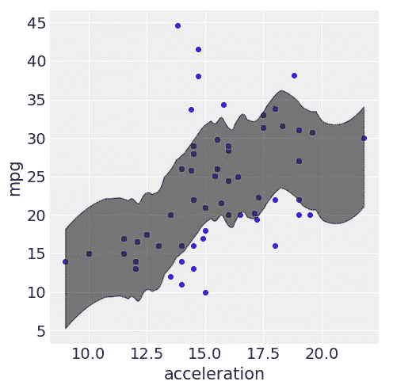

# 使用(Py)Stan 的应用贝叶斯推理的简单介绍

> 原文：<https://towardsdatascience.com/painless-introduction-to-applied-bayesian-inference-using-py-stan-36b503a4cd80?source=collection_archive---------14----------------------->

## 贝叶斯回归在 PyStan 中的应用

> 我们鼓励你在阅读这篇文章之前先看看这个[概念背景](/conceptual-background-for-painless-introduction-to-applied-bayesian-regression-using-pystan-c8f744e3823f)。

# 设置

**Stan**【1】是一个用于贝叶斯推理和模型拟合的计算引擎。它依赖于哈密尔顿蒙特卡罗(HMC) [2]的变体，从大量分布和模型的后验分布中进行采样。

下面是设置 Stan 的详细安装步骤:[https://pystan . readthedocs . io/en/latest/installation _ beginner . html](https://pystan.readthedocs.io/en/latest/installation_beginner.html)

对于 MacOS:

*   安装`miniconda` / `anaconda`
*   安装`xcode`
*   更新你的 C 编译器:`conda install clang_osx-64 clangxx_osx-64 -c anaconda`
*   创造环境`stan`或`pystan`
*   键入`conda install numpy`安装 numpy 或用您需要安装的包替换 numpy
*   安装 pystan: `conda install -c conda-forge pystan`
*   或者:`pip install pystan`
*   还要安装:`arviz`、`matplotlib`、`pandas`、`scipy`、`seaborn`、`statsmodels`、`pickle`、`scikit-learn`、`nb_conda`和`nb_conda_kernels`

设置完成后，我们可以打开(Jupyter)笔记本，开始工作。首先，让我们用以下代码导入我们的库:

```
import pystan
import pickle
import numpy as np
import arviz as az
import pandas as pd
import seaborn as sns
import statsmodels.api as statmod
import matplotlib.pyplot as plt
from IPython.display import Image
from IPython.core.display import HTML
```

# 掷硬币推理

回想一下在概念背景中，我是如何谈到在地上找到一枚硬币，并把它扔 K 次以获得公平感的。

我们满足于以下模型:


Y 的概率质量函数(PMF)如下:


首先，通过使用 NumPy 的`random`功能进行仿真，我们可以了解参数 a=b=5 的先验的行为:

```
sns.distplot(np.random.beta(5,5, size=10000),kde=False)
```


正如在概念背景中提到的，这个先验似乎是合理的:它在 0.5 左右是对称的，但在两个方向都有可能出现偏差。然后我们可以用下面的语法在`pystan`中定义我们的模型:

*   `data`对应我们模型的数据。在这种情况下，整数`N` 对应于投掷硬币的次数，而`y`对应于长度为`N`的整数向量，它将包含我们实验的观察结果。
*   `parameters`对应于我们模型的参数，在本例中为`theta`，或者获得“人头”的概率。
*   `model`对应于我们的先验(`beta`)和似然(`bernoulli`)的定义。

```
# bernoulli model
model_code = """
    data {
      int<lower=0> N;
      int<lower=0,upper=1> y[N];
    }
    parameters {
      real<lower=0,upper=1> theta;
    }
    model {
      theta ~ beta(5, 5);
      for (n in 1:N)
          y[n] ~ bernoulli(theta);
    }
    """data = dict(N=4, y=[0, 0, 0, 0])
model = pystan.StanModel(model_code=model_code)
fit = model.sampling(data=data,iter=4000, chains=4, warmup=1000)la = fit.extract(permuted=True)  # return a dictionary of arraysprint(fit.stansummary())
```

注意`model.sampling`的默认参数是`iter=1000`、`chains=4`和`warmup=500`。我们根据我们的时间和可用的计算资源来调整这些。

*   `iter` ≥ 1 对应于我们每个 MCMC 链的运行次数(对于大多数应用来说，不应少于 1000 次)
*   `warmup`或“老化”≥ 0 对应于我们采样开始时的初始运行次数。考虑到这些链在开始运行时非常不稳定和幼稚，实际上我们通常定义这个量来丢弃第一个 B= `warmup`数量的样本。如果我们不丢弃 B，那么我们就在估计中引入了不必要的噪声。
*   `chains` ≥ 1 对应于我们采样中的 MCMC 链数。

下面是上述模型的输出:

```
Inference for Stan model: anon_model_d3835c4370ff5e66f1e88bd3eac647ff.
4 chains, each with iter=4000; warmup=1000; thin=1; 
post-warmup draws per chain=3000, total post-warmup draws=12000. mean se_mean     sd   2.5%    25%    50%    75%  97.5% 
theta   0.36  1.8e-3   0.12   0.14   0.27   0.35   0.44   0.61   
lp__   -9.63  9.3e-3   0.71 -11.63  -9.81  -9.36  -9.18  -9.13 
```

*   我们的`theta`的后验均值大约是`0.36` < 0.5。尽管如此，95%的后验可信区间还是相当宽的:(0.14，0.61)。因此，我们可以说这个结果在统计学上不是结论性的，但是它指向偏见，而没有*偶然*跳到 0。

# 应用回归:汽车和每加仑英里数(MPG)


图片来自 [Pixabay](https://pixabay.com/?utm_source=link-attribution&amp;utm_medium=referral&amp;utm_campaign=image&amp;utm_content=980992) 的[苏珊·苏厄特](https://pixabay.com/users/Picsues-1416498/?utm_source=link-attribution&amp;utm_medium=referral&amp;utm_campaign=image&amp;utm_content=980992)

让我们构建一个贝叶斯线性回归模型来解释和预测不同规格和品牌的汽车数据集中的每加仑英里数(MPG)。尽管我的方法是一种“经典的”基于可能性的方法，或者更确切地说，是一种以分布为中心的方法，但是我们可以(并且应该！)使用原始的 ML 训练测试分割来评估我们预测的质量。

该数据集来自 [UCI ML 知识库](https://archive.ics.uci.edu/ml/datasets/auto+mpg)，包含以下信息:

```
 1\. mpg: continuous 
 2\. cylinders: integers
 3\. displacement: continuous 
 4\. horsepower: continuous 
 5\. weight: continuous 
 6\. acceleration: continuous 
 7\. model year: integers
 8\. origin: categorical
 9\. car name: string (index for each instance)
```

为什么我们不坚持我们的基本原则，使用标准线性回归？[3]回忆其功能形式如下:


*   y 对应于我们的因变量，或感兴趣的结果—这里是`mpg`。
*   x 是具有 P 个特征或独立变量的 N 个样本的 N×P 矩阵。
*   α是一个 N x 1 向量，表示模型截距，根据您的编码方案，可能有不同的解释。
*   β是回归量/特征系数的 P×1 向量。
*   ε是一个 N×1 随机向量，它遵循一个多变量正态分布，N×N**协方差**矩阵表示为σ。标准的线性回归情况要求该σ是沿对角线σ >为 0 的对角矩阵，即观测值之间的**独立性**。

现在，对于贝叶斯公式:


虽然前两条线看起来完全一样，但我们现在需要建立α、β和σ的先验分布。

在执行 EDA 时，我们应该始终考虑以下几点:

*   我的可能性有多大？
*   我的模型应该是什么？互动 vs 无互动？多项式？
*   我的参数(和超参数)是什么，我应该选择什么样的先验？
*   我是否应该考虑任何聚类、时间或空间相关性？

# 电子设计自动化(Electronic Design Automation)

与任何类型的数据分析一样，**至关重要的是**首先了解我们感兴趣的变量/特征，以及它们之间以及与我们的 y /结果之间的关系。

让我们从加载数据集开始:

```
cars_data = pd.read_csv("[~/cars.csv](https://raw.githubusercontent.com/sergiosonline/sergiosonline.github.io/master/files/cars.csv)").set_index("name")
print(cars_data.shape)
cars_data.head()
```


让我们检查一下目标变量和预测变量之间的关系(如果有的话)。这里`origin`表示汽车的产地——它有三个等级:“美国”、“日本”和“欧洲”

```
sns.distplot(cars_data[cars_data['origin']=='American']['mpg'],color="skyblue", label="American",kde=False)
sns.distplot(cars_data[cars_data['origin']=='Japanese']['mpg'],color="red", label="Japanese",kde=False)
sns.distplot(cars_data[cars_data['origin']=='European']['mpg'],color="yellow", label="European",kde=False)
plt.legend()
```


美国汽车和日本汽车似乎有一些有趣的区别。

现在让我们检查一下数字变量和`mpg`之间的关系:

*   我更喜欢将这些可视化，而不是简单地计算相关性，因为这给了我它们之间关系的视觉和数学感觉，超越了简单的标量。

```
f, axes = plt.subplots(2, 3, figsize=(7, 7), sharex=False)sns.relplot(x="cylinders", y="mpg", data=cars_data, ax=axes[0, 0]);
sns.relplot(x="displacement", y="mpg", data=cars_data, ax=axes[0, 1]);
sns.relplot(x="horsepower", y="mpg", data=cars_data, ax=axes[0, 2]);
sns.relplot(x="acceleration", y="mpg", data=cars_data, ax=axes[1, 0]);
sns.relplot(x="year", y="mpg", data=cars_data, ax=axes[1, 1]);
sns.relplot(x="weight", y="mpg", data=cars_data, ax=axes[1, 2]);# close pesky empty plots
for num in range(2,8):
    plt.close(num)

plt.show()
```


除了**年份**和**加速度**之外，其他年份都与 **mpg** 负相关，即排量每增加 1 个单位，mpg 就会减少。

# 培训/安装

让我们为拟合和测试准备数据集:

```
from numpy import random
from sklearn import preprocessing, metrics, linear_model
from sklearn.model_selection import train_test_split
from sklearn.metrics import mean_squared_errorrandom.seed(12345)cars_data = cars_data.set_index('name')
y = cars_data['mpg']
X = cars_data.loc[:, cars_data.columns != 'mpg']
X = X.loc[:, X.columns != 'name']
X = pd.get_dummies(X, prefix_sep='_', drop_first=False) 
X = X.drop(columns=["origin_European"]) # This is our reference categoryX_train, X_test, y_train, y_test = train_test_split(X, y, test_size=0.15, random_state=0)X_train.head()
```


现在，转到我们的模型规范，它基本上没有偏离上面的抛硬币问题，除了我使用矩阵符号来尽可能简化模型表达式的事实:

```
# Succinct matrix notationcars_code = """
data {
    int<lower=1> N; // number of training samples
    int<lower=0> K; // number of predictors - 1 (intercept)
    matrix[N, K] x; // matrix of predictors
    vector[N] y_obs; // observed/training mpg

    int<lower=1> N_new;
    matrix[N_new, K] x_new;
}
parameters {
    real alpha;
    vector[K] beta;
    real<lower=0> sigma;

    vector[N_new] y_new;
}
transformed parameters {
    vector[N] theta;
    theta = alpha + x * beta;
}
model {
    sigma ~ exponential(1);
    alpha ~ normal(0, 6);
    beta ~ multi_normal(rep_vector(0, K), diag_matrix(rep_vector(1, K)));
    y_obs ~ normal(theta, sigma);

    y_new ~ normal(alpha + x_new * beta, sigma); // prediction model
}
"""
```

*   `data`对应于我们模型的数据，如上面掷硬币的例子。
*   `parameters`对应我们模型的参数。
*   `transformed parameters`这里允许我将`theta`定义为我们的模型在训练集上的拟合值
*   `model`对应于我们对`sigma`、`alpha`、`beta`的先验的定义，以及我们对 P(Y|X，α，β，σ) ( `normal`)的似然。

上述先验是在初始数据检查后选择的:

*   为什么σ是指数先验？嗯，σ ≥ 0(根据定义)。为什么不是制服或者伽玛？ **PC 框架！**【4】——我的目标是最节俭的模式。
*   α 和β呢？这里最简单的事情是，给定一个正态概率，为这些参数选择正态先验是很方便的。您可能希望为这两个参数中的每一个选择不同的超参数。
*   为什么β是一个`multi_normal()`？数理统计中有一个众所周知的结果，即长度为< ∞且具有单位对角协方差矩阵和向量均值μ < ∞的多正态随机变量(向量 W)等价于一个服从 N(μ，1)分布的**独立**正态随机变量 W 的向量。

关于 stan 有趣的是，我们可以请求在测试集上进行预测而无需重新拟合——更确切地说，它们可以在第一次调用中被请求。

*   我们通过在上面的调用中定义`y_new`来实现这一点。
*   `theta`是我们对训练集的拟合预测。

我们指定要摄取的数据集，并继续从模型中取样，同时保存它以供将来参考:

```
cars_dat = {'N': X_train.shape[0],
            'N_new': X_test.shape[0],
            'K': X_train.shape[1],
            'y_obs': y_train.values.tolist(),
            'x': np.array(X_train),
            'x_new': np.array(X_test)}sm = pystan.StanModel(model_code=cars_code)
fit = sm.sampling(data=cars_dat, iter=6000, chains=8)# Save fitted model!
with open('bayes-cars.pkl', 'wb') as f:
    pickle.dump(sm, f, protocol=pickle.HIGHEST_PROTOCOL)# Extract and print the output of our model
la = fit.extract(permuted=True)
print(fit.stansummary())
```

以下是我打印的输出(出于本教程的目的，我去掉了`Rhat`和`n_eff`):

```
Inference for Stan model: anon_model_3112a6cce1c41eead6e39aa4b53ccc8b.
8 chains, each with iter=6000; warmup=3000; thin=1; 
post-warmup draws per chain=3000, total post-warmup draws=24000.mean se_mean     sd   2.5%    25%    50%    75%  97.5%  
alpha       -8.35    0.02   3.81 -15.79 -10.93  -8.37  -5.74  -0.97  
beta[1]     -0.48  1.9e-3   0.33  -1.12   -0.7  -0.48  -0.26   0.17  
beta[2]      0.02  4.6e-5 7.9e-3 6.1e-3   0.02   0.02   0.03   0.04  
beta[3]     -0.02  8.7e-5   0.01  -0.04  -0.03  -0.02-6.9e-3   0.01  
beta[4]   -7.0e-3  4.0e-6 7.0e-4-8.3e-3-7.4e-3-7.0e-3-6.5e-3-5.6e-3  
beta[5]       0.1  5.9e-4    0.1   -0.1   0.03    0.1   0.17    0.3  
beta[6]      0.69  2.7e-4   0.05    0.6   0.65   0.69   0.72   0.78  
beta[7]     -1.75  2.9e-3   0.51  -2.73  -2.09  -1.75  -1.41  -0.73  
beta[8]      0.36  2.7e-3   0.51  -0.64   0.02   0.36   0.71   1.38  
sigma        3.33  7.6e-4   0.13   3.09   3.24   3.32   3.41   3.59  
y_new[1]    26.13    0.02   3.37  19.59  23.85  26.11  28.39  32.75  
y_new[2]    25.38    0.02   3.36  18.83  23.12  25.37  27.65  31.95
...
...
theta[1]    24.75  2.7e-3   0.47  23.83  24.44  24.75  25.07  25.68  
theta[2]    19.59  2.6e-3   0.43  18.76   19.3  19.59  19.88  20.43 
...
... 
```

`fit.stansummary()`是一个像表格一样排列的字符串，它给出了拟合过程中估计的每个**参数**的**后验**均值、标准差和几个百分点。当`alpha`对应于截距时，我们有 8 个`beta`回归量，一个复杂性或观察误差`sigma`，我们在训练集`theta`上的拟合值，以及我们在测试集`y_new`上的预测值。

# 诊断

在引擎盖下运行 MCMC，我们以图表的形式检查基本诊断是至关重要的。对于这些图，我依靠优秀的`arviz`库进行贝叶斯可视化(和`PyMC3`一起工作也一样)。

*   **链式混合** —轨迹图。这些系列图应显示出**“厚毛**”链在真实直线的“合理尺寸”区间内振荡，以指示良好的混合。“稀疏”链意味着 MCMC 没有有效地探索，并且可能在某些异常处停滞不前。

```
ax = az.plot_trace(fit, var_names=["alpha","beta","sigma"])
```


粗毛铁链！由于图像大小，我省略了 alpha 和 beta[1:2]。

*   **我们参数的后验可信区间** —森林样地。这些应该作为我们的模型参数(和超参数)的比例和位置的可视化指南！).例如，σ(这里是 PC 框架[4]下的一个**复杂度**参数)不应该达到< 0。与此同时，如果ϐ预测值的可信区间不包含 0，或者如果 0 几乎不在其中，我们就可以获得“统计显著性”的意义

```
axes = az.plot_forest(
    post_data,
    kind="forestplot",
    var_names= ["beta","sigma"],
    combined=True,
    ridgeplot_overlap=1.5,
    colors="blue",
    figsize=(9, 4),
)
```


看起来不错。`**alpha**`这里可以看作是代表我们引用类别的“collector”(我用的是引用编码)。我们当然可以规范化我们的变量，以实现更友好的缩放——我鼓励你尝试一下。

# 预言；预测；预告

贝叶斯推理具有预测能力，我们可以通过从预测后验分布中取样来产生预测能力:


这些(以及整个贝叶斯框架)的伟大之处在于，我们可以使用**(预测)可信区间**来给我们估计的方差/波动性的感觉。毕竟，如果一个预测模型的预测 50 次中有 1 次“足够接近”目标，那么它有什么用呢？

让我们看看我们的预测值与测试集中的观察值相比如何:

```
dff = pd.DataFrame({'y_pred':la['y_new'].mean(0), 'y_obs':y_test})
grid = sns.JointGrid(dff.y_pred, dff.y_obs, space=0, height=6, ratio=50,
                    xlim=(0,50), ylim=(0,50))
grid.plot_joint(plt.scatter, color="b")
x0, x1 = grid.ax_joint.get_xlim()
y0, y1 = grid.ax_joint.get_ylim()
lims = [max(x0, y0), min(x1, y1)]
grid.ax_joint.plot(lims, lims, ':k')plt.subplots_adjust(top=0.9)
grid.fig.suptitle('Bayes Test Predicted vs Obs',fontsize=20)
plt.show()
```


直虚线表示完美的预测。我们离它不远了。

然后，我们可以对这些预测进行 ML 标准度量(MSE ),以评估它们相对于保留测试集中的实际值的质量。

```
bay_test_mse = metrics.mean_squared_error(y_test, la['y_new'].mean(0))
print('Bayes Test MSE:', bay_test_mse)##### Bayes Test MSE: 10.968931376358526
```

当我们改变一些模型输入时，我们还可以可视化我们预测的值(以及它们相应的 95%可信区间):

```
az.style.use("arviz-darkgrid")sns.relplot(x="weight", y="mpg")
            data=pd.DataFrame({'weight':X_test['weight'],'mpg':y_test}))
az.plot_hpd(X_test['weight'], la['y_new'], color="k", plot_kwargs={"ls": "--"})
```


```
sns.relplot(x="acceleration", y="mpg",
            data=pd.DataFrame({'acceleration':X_test['acceleration'],'mpg':y_test}))
az.plot_hpd(X_test['acceleration'], la['y_new'], color="k", plot_kwargs={"ls": "--"})
```



在下文中，我使用`statsmodels`比较了我的贝叶斯模型和普通最大似然线性回归模型的性能:


他们表现得非常接近(为了这颗特殊的种子)。

**最佳实践:**为了获得模型性能的“更好”想法，您应该通过运行 K ≥ 30 训练测试分割的实现，在测试 MSE 上引导 95% **置信度**区间(CLT)。

这是整个笔记本。py 导出格式:

[https://gist . github . com/sergiosonline/6 a3 E0 b 1345 c8 f 002d 0e 7 b 11 AAF 252d 44](https://gist.github.com/sergiosonline/6a3e0b1345c8f002d0e7b11aaf252d44)

# 考虑

*   请注意，回归分析是一个现代数据科学问题大家族的一个非常容易的起点。在本教程之后，我希望你开始思考它的两种风格:ML(基于损失)和 classical(基于模型/可能性)。
*   贝叶斯推理并不难结合到您的 DS 实践中。采用基于损失的方法作为贝叶斯方法是可能的，但这是我将在后面讨论的主题。
*   只要你知道自己在做什么就有用！事先说明**难**。但是当你没有有限数量的数据(昂贵的数据收集/标记、罕见事件等)或者你确切知道你想要测试或避免什么时，它特别有用。
*   贝叶斯框架很少在 ML 任务(预测、分类等)中胜过它的(频繁主义者)ML 对应物，特别是当数据集的规模增长时。当处理大型数据集(大数据)时，您的先验知识很容易被数据淹没。
*   正确指定的贝叶斯模型是一个生成模型，因此您应该能够轻松地生成数据，以检查您的模型与正在讨论的数据集/数据生成过程的一致性。
*   EDA 和 plots 在模型构建和检查过程之前、之中和之后都是至关重要的。[5]是一篇关于贝叶斯工作流中可视化重要性的精彩论文。

# 进一步的方向

我鼓励你批判性地思考改进这种预测的方法，不仅从贝叶斯的角度，而且从 ML 的角度。

数据集是否足够大或丰富，可以从严格的 ML 方法中受益？有哪些方法可以改进这个贝叶斯模型？在什么情况下，这个模型一定会优于 MLE 模型？如果观察值以某种方式相关(聚集的、自相关的、空间相关的等等)会怎样？当可解释性是建模优先考虑的问题时，该怎么做？

如果你想知道如何将贝叶斯方法扩展到深度学习，你也可以研究一下**变分推理** [6]方法，作为纯贝叶斯治疗的可扩展替代方案。[这里的](https://www.cs.jhu.edu/~jason/tutorials/variational.html)是“简单”的概述，[这里的](https://arxiv.org/abs/1601.00670)是技术回顾。

# **参考文献**

[1] B. Carpenter 等人 **Stan:一种概率编程语言** (2017)。统计软件杂志 76 卷 1 期。DOI 10.18637/jss.v076.i01。

[2]贝当古先生。**哈密顿蒙特卡罗概念介绍** (2017)。arXiv:1701.02434

[3] J .韦克菲尔德。**贝叶斯和频率主义回归方法** (2013)。统计学中的斯普林格级数。斯普林格纽约。doi:10.1007/978–1–4419–0925–1。

[4] D. Simpson 等人**惩罚模型组件复杂性:构建先验的原则性实用方法** (2017)。摘自:统计科学 32.1，第 1-28 页。doi: 10.1214/16-STS576。

[5] J. Gabry 等**贝叶斯工作流中的可视化** (2019)。J. R. Stat。社会主义者答:182:389–402。doi:10.1111/rssa.12378

[6] D.M. Blei et al. **变分推断:统计学家综述** (2016)。美国统计协会杂志，第 112 卷，Iss。518，2017 年 DOI:10.1080/01621459 . 5565656567