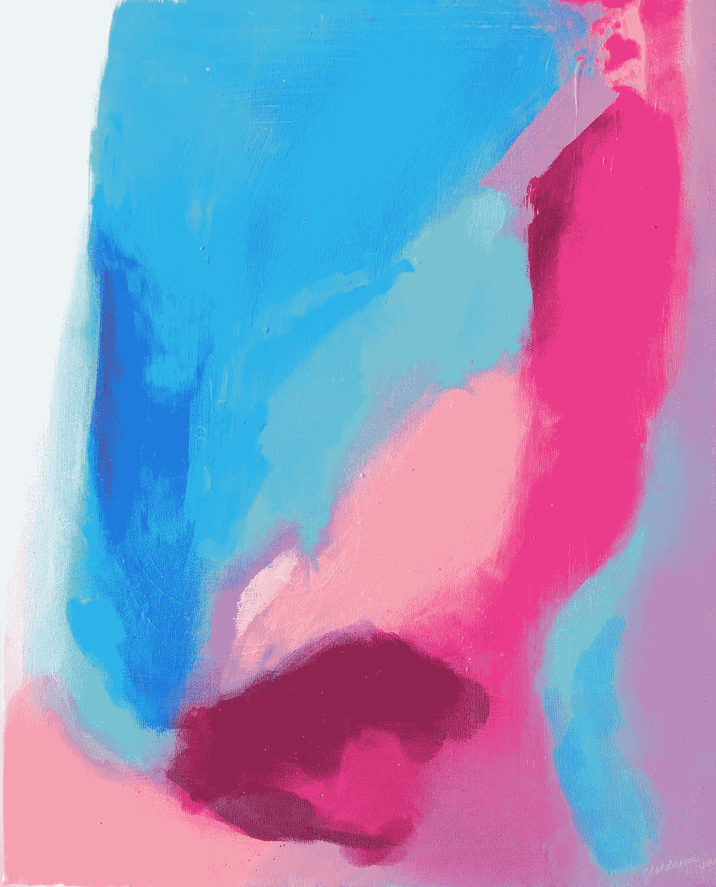
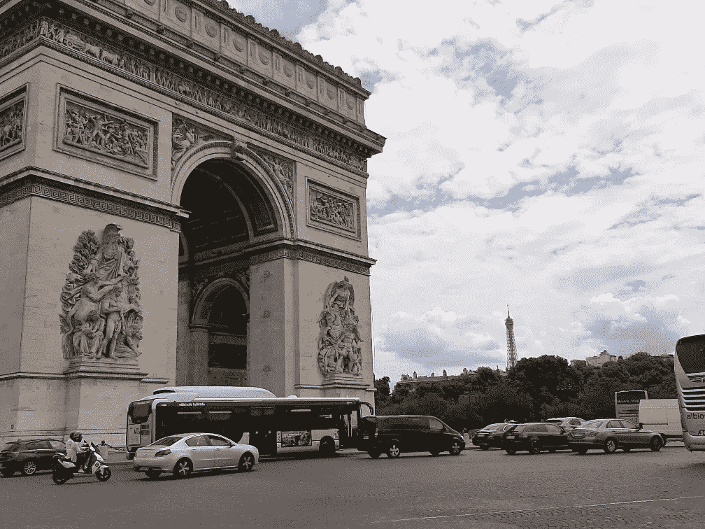
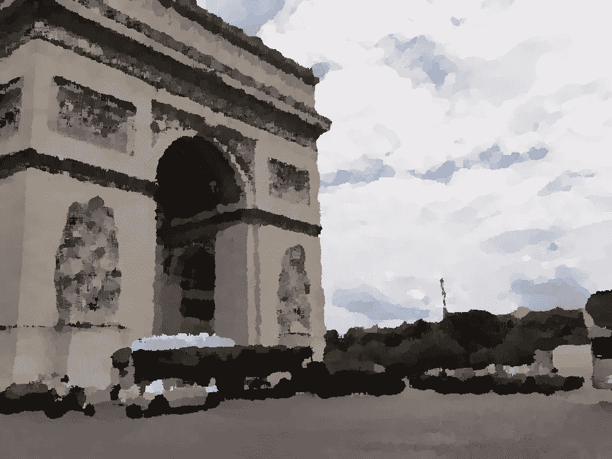
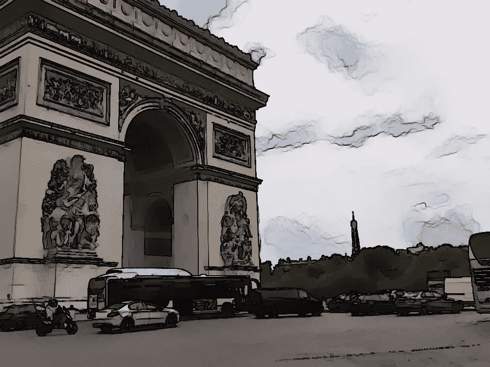
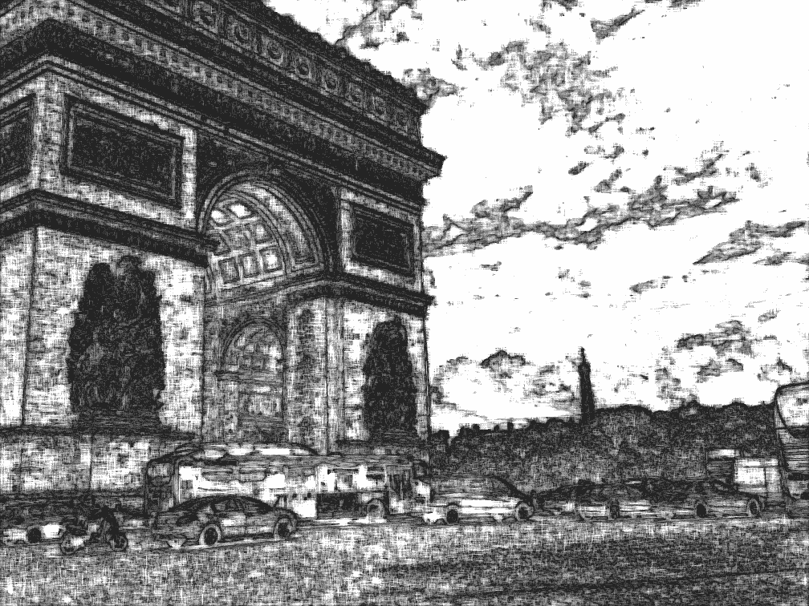
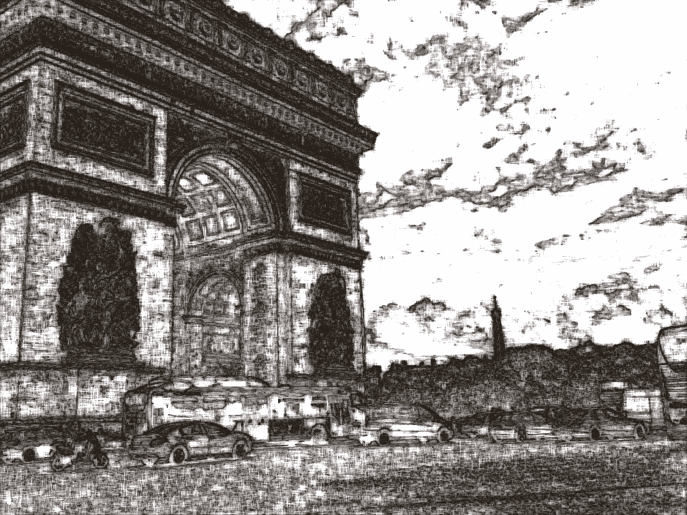
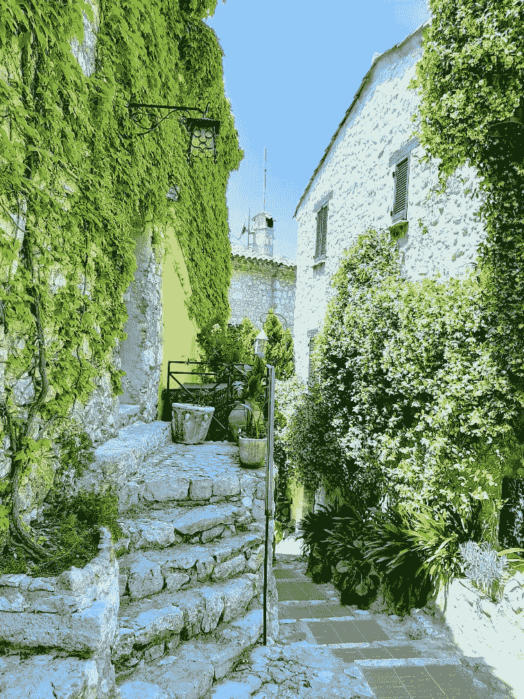
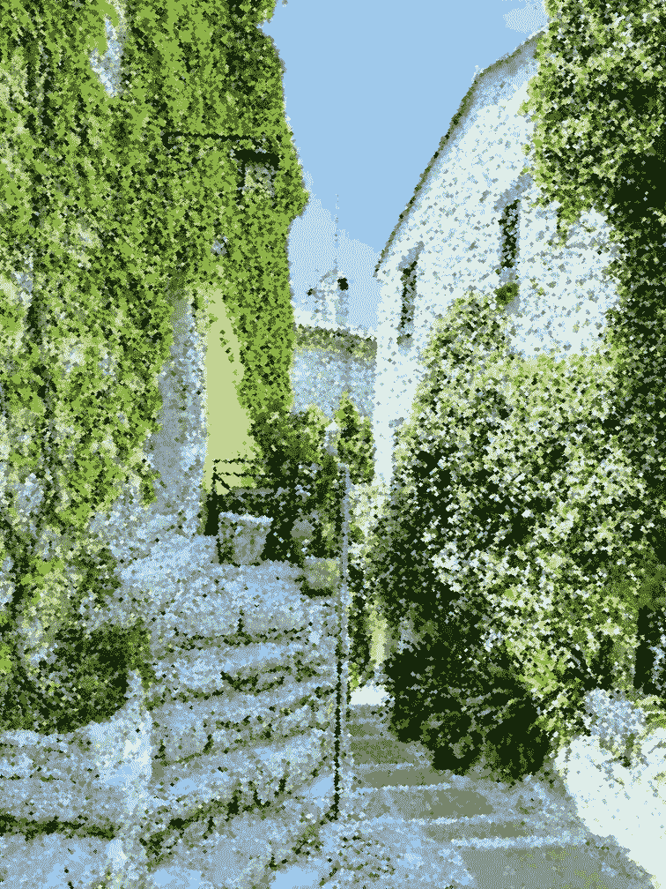

# 用 Python 中的 OpenCV 进行绘画和素描

> 原文：<https://towardsdatascience.com/painting-and-sketching-with-opencv-in-python-4293026d78b?source=collection_archive---------20----------------------->

## 制作油画和水彩画之类的艺术，画素描，用 Python 中的 OpenCV 创作点彩艺术。



由[乔丹娜·科德罗](https://unsplash.com/@geordannatheartist?utm_source=medium&utm_medium=referral)在 [Unsplash](https://unsplash.com?utm_source=medium&utm_medium=referral) 上拍摄的照片

OpenCV 是一个强大的计算机视觉库，具有强大的图像处理工具包。在本文中，我们将利用它来创建绘图和绘画，其中大多数将使用内置函数！让我们简短地介绍一下，直接进入激动人心的部分。

# 目录

*   要求
*   油画效果
*   水彩效果
*   黑白和彩色铅笔素描
*   点彩艺术

# 要求

油画效果需要 OpenCV Contrib 模块，而其他效果可以使用 OpenCV 的标准发行版来实现。除此之外，点彩艺术需要 Sklearn 和 Scipy。

```
pip install opencv-contrib-python==4.3.0.36
pip install scikit-learn
pip install scipy
```

# 油画效果

它包含在`cv2.xphoto()`中，它还具有其他几个很酷的功能，如图像修复、白平衡、图像去噪等。

```
import cv2img = cv2.imread('img.jpg')
res = cv2.xphoto.oilPainting(img, 7, 1)
```



原象



油画效果

# 水彩效果

像油画效果一样，水彩效果也可以用一行代码完成，不包括导入和图像读取。由`cv2.stylization()`完成。

```
import cv2img = cv2.imread('img.jpg')
res = cv2.stylization(img, sigma_s=60, sigma_r=0.6)# sigma_s controls the size of the neighborhood. Range 1 - 200# sigma_r controls the how dissimilar colors within the neighborhood will be averaged. A larger sigma_r results in large regions of constant color. Range 0 - 1
```



水彩效果

# 黑白和彩色铅笔素描

同样，只需要一行代码，我们就可以得到灰度和彩色的草图。

```
import cv2 img = cv2.imread('img.jpg')
dst_gray, dst_color = cv2.pencilSketch(img, sigma_s=60, sigma_r=0.07, shade_factor=0.05) # sigma_s and sigma_r are the same as in stylization.# shade_factor is a simple scaling of the output image intensity. The higher the value, the brighter is the result. Range 0 - 0.1
```



黑白素描



彩色素描

# 点彩艺术

根据[维基百科](https://en.wikipedia.org/wiki/Pointillism)，点彩艺术可以定义为:

> 点彩是一种绘画技巧，在这种技巧中，小的、不同的颜色点被应用到图案中以形成图像

要在 Python 中做到这一点，我们的第一步是计算使用 Kmeans 最多的颜色。我使用了 20 的调色板，这意味着点将由 20 个最常用的颜色在图像中出现。根据图像尺寸为点计算合适的半径尺寸。然后我们在图像上循环，找到最接近圆点的颜色，用它来画圆。

```
import scipy.spatial
import numpy as np
import random
import cv2
import math
from sklearn.cluster import KMeansdef compute_color_probabilities(pixels, palette):
    distances = scipy.spatial.distance.cdist(pixels, palette)
    maxima = np.amax(distances, axis=1)distances = maxima[:, None] - distances
    summ = np.sum(distances, 1)
    distances /= summ[:, None]
    return distancesdef get_color_from_prob(probabilities, palette):
    probs = np.argsort(probabilities)
    i = probs[-1]
    return palette[i]def randomized_grid(h, w, scale):
    assert (scale > 0)
    r = scale//2 grid = []
    for i in range(0, h, scale):
        for j in range(0, w, scale):
            y = random.randint(-r, r) + i
            x = random.randint(-r, r) + j grid.append((y % h, x % w)) random.shuffle(grid)
    return griddef get_color_palette(img, n=20): clt = KMeans(n_clusters=n)
    clt.fit(img.reshape(-1, 3))return clt.cluster_centers_def complement(colors):
    return 255 - colorsdef create_pointillism_art(image_path, primary_colors):

    img = cv2.imread(image_path)
    radius_width = int(math.ceil(max(img.shape) / 1000))
    palette = get_color_palette(img, primary_colors)
    complements = complement(palette)
    palette = np.vstack((palette, complements))
    canvas = img.copy() grid = randomized_grid(img.shape[0], img.shape[1], scale=3)

    pixel_colors = np.array([img[x[0], x[1]] for x in grid])

    color_probabilities = compute_color_probabilities(pixel_colors, palette)for i, (y, x) in enumerate(grid):
        color = get_color_from_prob(color_probabilities[i], palette)
        cv2.ellipse(canvas, (x, y), (radius_width, radius_width), 0, 0, 360, color, -1, cv2.LINE_AA) return canvasres = create_pointillism_art('img.jpg', 20)
```



原象



结果

点彩艺术的代码受到这个 [GitHub 库](https://github.com/atriwal/Points_Art)的启发，做了一些修改。

所以我们看到用 OpenCV 制作艺术是小菜一碟，尤其是使用内置函数。如果你想看到使用 OpenCV 的图像编辑操作，你可以参考这篇文章:

[](https://medium.com/dataseries/designing-image-filters-using-opencv-like-abode-photoshop-express-part-1-8765e3f4495b) [## 使用 OpenCV 设计图像滤镜(第 1 部分)

### 我们都编辑过我们的图像，也许是为了改善白平衡，增加温暖，使用不同的滤镜，甚至…

medium.com](https://medium.com/dataseries/designing-image-filters-using-opencv-like-abode-photoshop-express-part-1-8765e3f4495b)