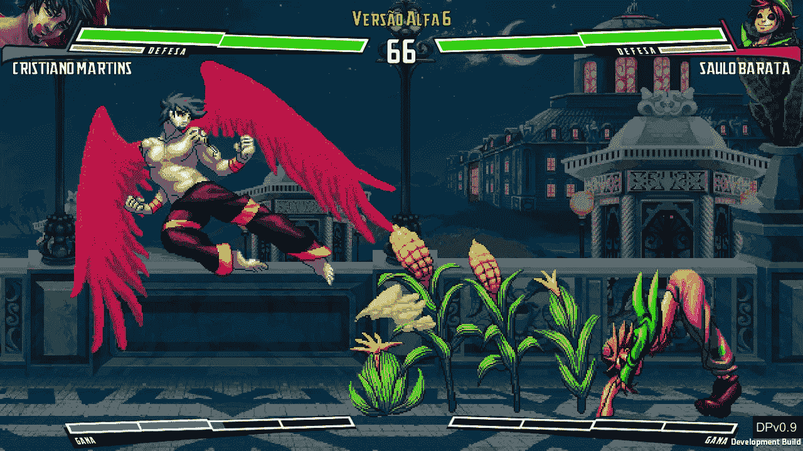

# 用机器学习绘制像素艺术

> 原文：<https://towardsdatascience.com/painting-pixel-art-with-machine-learning-5d21b260486?source=collection_archive---------5----------------------->

## 使用 GANs 帮助真正的艺术家更快地完成游戏

雪碧生产流水线的几个阶段。即草图、艺术线条、阴影、区域和索引。

上面的精灵来自 [Trajes Fatais: Suits of Fate](https://store.steampowered.com/app/953310/Trajes_Fatais_Suits_of_Fate/) 游戏，我是这个游戏的首席开发者。长话短说，每个精灵需要大约一个小时来绘制，每个角色平均需要五百个精灵。在[“面向游戏的机器学习辅助资产生成:像素艺术精灵表的研究”中，](https://ieeexplore.ieee.org/document/8924853)我们探索了 [Pix2Pix](https://arxiv.org/abs/1611.07004) 架构来自动化精灵生产流水线，将每个精灵花费的平均时间减少了 15 分钟(~25%)。这是我们第一个发表的关于精灵生成的工作，我们期望在未来进一步改进它。

这篇论文获得了 2019 年巴西游戏数字娱乐研讨会(SBGames 2019)颁发的[最佳论文奖](https://www.sbgames.org/sbgames2019/en/computing/)

P 像素艺术是电子游戏中最流行的美学之一。它努力重现旧任天堂和街机游戏的外观和感觉。在 90 年代，像素艺术是大多数游戏机的唯一选择。屏幕分辨率有限，大多数设备无法实时执行高级技术。今天，像素艺术是一种选择——一种昂贵的选择。

为了实现街机游戏的外观和感觉，艺术家必须接受时代的限制。最初的游戏机只有四种绿色。它的继任者 Game Boy Color 可以同时显示多达 56 种不同的颜色。后来的设备，被称为 16 位一代，允许每个字符多达 256 种颜色，这是美学上的一个重大变化。在我们的游戏中，我们把自己限制在每个角色 256 种颜色的范围内。

每个角色和背景都有自己的 256 种颜色

通常，角色是“索引精灵”和“调色板”的混合绘画时，艺术家用与调色板中 256 种颜色之一相关的“索引”来给每个像素着色。在游戏中，每个索引精灵都被替换为其相关的颜色，组成最终的图像。这个过程允许设计者为每个角色创建不同的“皮肤”，允许用户定制他们的体验，并为角色创建“邪恶”版本。下图描述了索引精灵、调色板和渲染混合。

索引精灵、调色板和最终渲染

将艺术家限制在 256 色是不自然的。选择色调是困难的。为了简化这项任务，工作在语义上进行了划分。在我们的管道中，生成了两个中间精灵:“着色”和“区域”精灵。前者最多使用 6 个色调，表示“光”，后者最多使用 42 个色调，表示精灵的“区域”，如手臂、头发、腿等。将两个精灵按像素相乘，我们得到了索引精灵，它允许多达 252 种颜色(6 * 42)。下图显示了着色、区域和索引精灵的示例。这个过程将 256 色问题转化为两个简单的子问题，每个子问题有 6 色和 42 色。

从左到右，着色，区域和索引精灵。

最后，每个角色都是由一个人设计的，这就产生了所有动画的概念艺术。这些被呈现在一个“素描”精灵中，然后被精炼成一个“艺术线条”精灵。前者用于快速制作游戏中新动画的原型，后者用于与其他艺术家交流最终的精灵应该是什么样子。这样，设计师可以在几天内构思出一个完整的角色，然后将剩余的工作外包给绘图团队。以下是素描和艺术线条精灵的示例:

素描和艺术线条精灵

将所有这些放在一起，设计师通过绘制每个动画来创建角色，然后制作他们各自的艺术线条。接下来，这些艺术线条精灵被交给绘图团队，他们将绘制各自的着色和区域精灵。最后，一个脚本将两者结合起来，生成游戏就绪的索引精灵。

总的来说，这个过程需要大约一个小时。草图、艺术线条和区域精灵的制作平均需要 10 分钟，而着色需要一个小时的剩余时间来完成。跟踪每幅画花费的确切时间几乎是不可能的。为了计算它们，我们检查了我们的生产日志，采访了团队，并以可控的方式测量了十几个精灵的步骤。

他的工作假设使用现代生成模型来产生阴影和颜色精灵是可行的。要被认为是有用的，生成的精灵必须足够好，人类艺术家可以在比从头开始更短的时间内完善它。

# 生成性对抗网络入门

在这项工作中，我们解决了两个图像映射问题:艺术线条到阴影和艺术线条到区域。形式上，我们必须创建一个生成器 G(x ),它从艺术线条域接收输入，并在阴影/区域域产生输出。这个问题也被称为图像翻译。

为了保证 G(x)是一个有用的映射，我们将创建一个鉴别器 D(x，y ),它查看 x 和 y 并判断 y 是否是一个高质量的精灵。换句话说，G 是我们的“虚拟艺术家”，D 是我们的虚拟“质量控制”如果我们能让 G 让 D 开心，我们就有了一个有用的映射。

更详细地说，考虑我们有几个艺术线条精灵(x)和已经绘制的阴影和区域精灵(y)，由人类艺术家制作。我们知道这些通过了质量控制，所以 D(x，y)会很高兴。我们现在的任务是训练 g，给定 x，产生ŷ(对真实 y 的模仿)。如果复制良好，d 会批准ŷ；否则，它会责备它。最后，我们剧透 D 是对是错，我们请它给 g 建设性的反馈。

我刚才描述的程序被称为对抗性训练。两个模型在某种意义上“竞争”,一个试图击败另一个。在我们的例子中，g 试图击败 d，让他认为ŷ是 y，而 d 拼命地分辨什么是真的，什么是假的。随着时间的推移，G 会成为一个成功的艺术家😄和 D 可能会被质量控制部门解雇💩。

通过使用神经网络来实现 G 和 D，我们得到了所谓的条件生成对抗网络。打破标题，“有条件”是因为 G 将 x 作为输入而不是随机噪声，“生成对抗性”是因为它训练对手成为声音生成器，“网络”是因为它是(惊喜！)一个神经网络。

在算法上，对于每个艺术线条 x 和阴影/区域子画面 y:

1.  使用 g，从 x 生成ŷ
2.  使用 d，评估ŷ看起来是否真实
3.  用 y 和 D 的反馈训练 G
4.  训练 d 认识到ŷ是假的，y 是真的

对整个数据集重复这一过程多次，最终将汇聚成一个 G 网络，创建看起来逼真的精灵和一个 D 网络，无法分辨哪些图像是真的还是假的。

# Pix2Pix 架构

[Pix2Pix](https://arxiv.org/abs/1611.07004) 架构基于 [U-Net](https://arxiv.org/abs/1505.04597) 生成器和基于补丁的鉴别器。组合架构如下图所示。鉴别器被训练以将ŷ的每个 32×32 的小块分类为真或假，并且用二进制交叉熵损失来训练。反过来，发生器被训练以最小化 y 和ŷ之间的 L1 损耗，并最大化鉴频器损耗。

高级 Pix2Pix 架构。

U-Net 模型是基于编码器-解码器思想的完全卷积神经网络。对于每个编码器层，跳过连接被添加到等效的解码器层。这允许网络利用来自编码层的“原始”信息和通过解码器层的“处理”信息。此处给出了该架构及其相关出版物的全面概述。

基于块的鉴别器是一个截断的网络，输出对几个图像块的判断，而不是对整个图像的单个判断。因此，鉴别器向生成器提供详细的反馈，指出哪些区域看起来真实，哪些看起来虚假。[在这里可以找到该建筑内部细节的完整概述。](/pix2pix-869c17900998)

与原始网络相比，我们进行了以下更改:

1.  我们使用了一个 Y 形网络。一个编码器、两个解码器和两个鉴别器。这样，着色和区域问题在一次处理中就解决了。
2.  对于分叉架构，每个分支有两个损耗。此外，我们使用 L2 规范，而不是 L1，因为它显示了更好的结果。
3.  原纸使用 [LeakyReLU 单位](/a-comprehensive-guide-on-activation-functions-b45ed37a4fa5)。我们使用了 [ELU 单位](/a-comprehensive-guide-on-activation-functions-b45ed37a4fa5)。
4.  在编码器中，我们对每个下采样步骤使用两次卷积运算，而不是一次卷积。

# 数据集

从 Trajes Fatais 游戏中，我们选择了 Sarah 和 Lucy 角色作为数据集来评估 Pix2Pix 架构的有用性。莎拉这个角色只有 87 个完成的精灵，还有 207 个有待绘制。它也是一个中等复杂的角色，有几个平滑和复杂的区域。另一方面，Lucy 已经完成了，所以它有 530 个完全绘制的精灵，并且非常容易绘制，具有大部分平滑的特征。

从某种意义上说，露西是我们的上限。它拥有我们所希望的所有数据，并且是一个容易画出的角色。如果算法不能处理 Lucy，那么它很可能对任何其他角色都失败。相比之下，莎拉是我们的理想场景:一个中等复杂的人物，只有几十个精灵准备接受训练。如果它对莎拉有用，那么它可能对我们有生产价值。

# 结果

可以看出，该算法对于阴影问题和区域精灵问题有很好的效果。也就是说，颜色发生了变化，女孩周围有一点噪声。对于着色精灵，只能检测到小问题，例如第二行中的肩膀和腿。

在第二批中，可以发现更多的问题。在生成的阴影列中，可以在阴影区域中看到许多伪影，例如在女孩(第一行)、鸭嘴兽背部(第二行)和鸭嘴兽喙(第三行)上。对于彩色精灵，存在大量的噪声，使得这些精灵不可用，因为人类很难手工修复噪声。

这第三批来自 207 个精灵，只有艺术线条可用。因此，这些需要主观分析。这些行分别由与训练中使用的精灵相似的精灵、具有以前未见过的姿势的精灵和具有完全不同的姿势的精灵组成。

虽然第一行是最有用的，但第二行和第三行的颜色精灵会很快退化。着色精灵的质量大多是一致的。然而，第三列的着色精灵显示它并不总是一致的。第二排的正面精灵应该有更亮的脸，而它正下方的精灵有不相干的灯光。

现在，我们可以安全地假设着色精灵是有用的，但是区域精灵没有用，因为它们太吵而且有颜色偏移问题。让我们把注意力转移到露西身上。

Lucy sprites 的数据是 Sarah 的五倍，显示出显著的改进。阴影精灵接近完美，只有阴影区域的小问题和头发的可容忍差异。然而，区域精灵还远未达到最佳状态。色偏问题和噪声仍然相关。这表明，增加数据集大小并没有在这些问题上有实质性的改善。

这第二批有我们手动选择在验证集中的精灵，因为它们与大多数其他精灵有很大的不同。尽管如此，着色精灵仍然与他们的人类绘制的对应物几乎相同。至于彩色图像，质量并没有下降太多，就像 Sarah 的情况一样。然而，这还远远不够理想。

考虑到这些结果，可以说增加数据集大小会显著改善阴影，但不会改善区域。因为 Lucy 是我们最好的情况，所以可以安全地假设我们需要另一个问题公式/架构来解决区域精灵问题。

为了更客观地量化生成内容的质量，我们计算了两个数据集的 [MSE](https://en.wikipedia.org/wiki/Mean_squared_error) 、 [MAE](https://en.wikipedia.org/wiki/Mean_absolute_error) 和 [SSIM](https://en.wikipedia.org/wiki/Structural_similarity) 分数。

从表中可以看出，灰色精灵在所有三个指标上都比彩色精灵有更好的均值(μ)和方差(σ)。此外，75%四分位数和最大可见值之间的差异非常大，这表明分布高度偏斜。

此外，Lucy 的结果始终比 Sarah 的好，方差低得多，偏差也小得多。

[SSIM](https://en.wikipedia.org/wiki/Structural_similarity) 分数范围从 0(完全不相似)到 1(完全相同),测量两幅图像的相似度。虽然 MSE 和 MAE 是纯粹的数学概念，但 SSIM 分数试图与人类感知更相关。在表格中，灰色精灵有接近 1 的分数，这表明它们与普通观察者几乎相同，而彩色精灵则不是这样。

作为第三次也是最后一次评估，我们要求设计团队对为莎拉角色生成的 207 个精灵进行评论。他们的反馈大多是积极的，赞扬了着色精灵的质量，并放弃了彩色精灵。总而言之，他们提出了四点意见:

1.  几乎一半的阴影精灵是有用的，可以在 20 到 30 分钟内完善。颜色精灵不可用。
2.  该算法在单个动画中是不一致的，这可能会使精灵的有用性无效。
3.  一些姿势有可怕的结果，甚至对于着色精灵也是如此。
4.  当将颜色量化为所使用的 6 和 42 色调时，会引入一些不想要的噪声。

下图说明了第 2、3 和 4 点。

八帧动画中不一致的身体照明

与训练中使用的姿势相差太大的姿势效果不好。

当量化到 6 和 42 音调时，会引入一些噪声。这在等高线上很容易看出来。

# 讨论

在这项工作中，我们评估了使用现代生成模型来解决像素艺术生成问题。也就是说，我们采用了修改过的 [Pix2Pix](https://arxiv.org/abs/1611.07004) 架构，取得了一定的成功。更详细地说，着色精灵被艺术团队认为是有用的，而彩色精灵因为无用而被丢弃。

对于公认的阴影精灵，团队规定平均需要 20 到 30 分钟来完善每一个，这比从头画一个要少 10 到 30 分钟。保守估计，每一个有用的精灵将节省 10 分钟的劳动，这意味着大约 15%以上的生产力。

尽管区域精灵有更多的颜色，但对于设计团队来说，它并不像着色精灵那样花费太多的时间。正如首席艺术家所解释的，动画中的区域更容易预测，并且可以很容易地从一个精灵复制到另一个精灵。因此，不生成它们并不是一个大问题。

从技术角度来看，这项工作证明了当前的模型可以有效地用作创造性任务的助手。其他作品也在[动漫领域](https://medium.com/syncedreview/meet-your-ai-generated-dream-anime-girl-5dc149c5eab4)中发现了类似的结论，该领域主要由平坦而充足的表面组成，比像素艺术的限制更少。此外，Pix2Pix 模型是为现实世界的图片而概念化的，但也适用于像素艺术和动漫数据，这证明了它的通用性。

# 未来的工作

我们当前的系统是基于像素回归的，如 Pix2Pix 模型。然而，我们的问题可以公式化为每像素分类，依赖于图像分割文献。这可能会大大改善我们的结果。

有时，简化问题可能会使它更容易处理。区域精灵总共有 42 种颜色，但是只有十几种出现在每个精灵上，并且占据了很大一部分。将问题缩小到一组更具选择性的色调可能会减轻我们生成器的工作。

Pix2Pix 是 2017 年的。自那以后，GAN 文献取得了一些进展，包括更好的损失函数、注意机制和改进的公式。使用更现代的技术可能会大大改善所获得的结果。

## U-Net 和 Pix2Pix 参考

O.Ronneberger，P. Fischer 和 T. Brox，[“U-net:生物医学图像分割的卷积网络”](https://arxiv.org/abs/1505.04597) 2016

页（page 的缩写）伊索拉，朱，周，埃夫罗斯，[“有条件对抗网络的图像到图像翻译”](https://arxiv.org/abs/1611.07004) 2017

如果你喜欢这篇评论，你可能会喜欢我在 Medium 上发表的其他文章。这里有一些建议:

*   [撰写科技论文的 10 个技巧](https://medium.com/swlh/10-tips-for-writing-scientific-papers-8c60ae18fed2)
*   [2020 年要读的 AI 论文](/ai-papers-to-read-in-2020-ac0e4e91d915)
*   [所有数据科学家都应该掌握的五项基本技能](/the-five-essential-skills-all-data-scientists-should-master-3f88b2ad456e)
*   [激活功能综合指南](https://medium.com/swlh/10-tips-for-writing-scientific-papers-8c60ae18fed2)

欢迎评论或[联系我](https://www.linkedin.com/in/ygorreboucas/)。如果你刚接触媒体，我强烈推荐[订阅](https://ygorserpa.medium.com/membership)。对于数据和 IT 专业人士来说，中型文章是 [StackOverflow](https://stackoverflow.com/) 的完美搭档，对于新手来说更是如此。注册时请考虑使用[我的会员链接。](https://ygorserpa.medium.com/membership)

感谢阅读:)