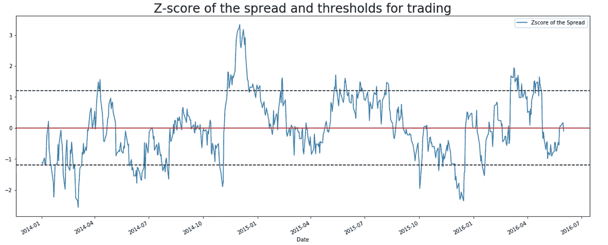
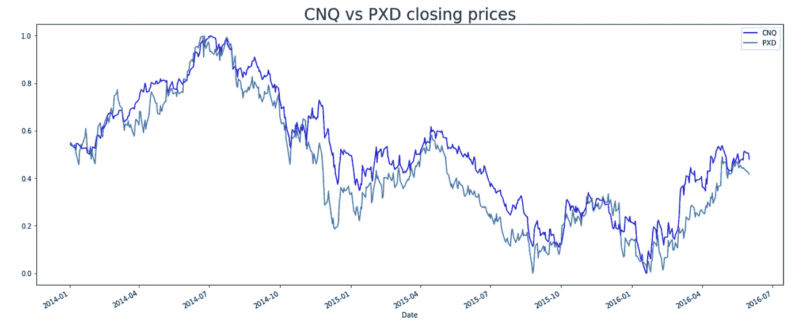
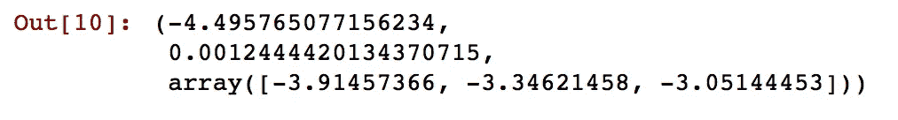
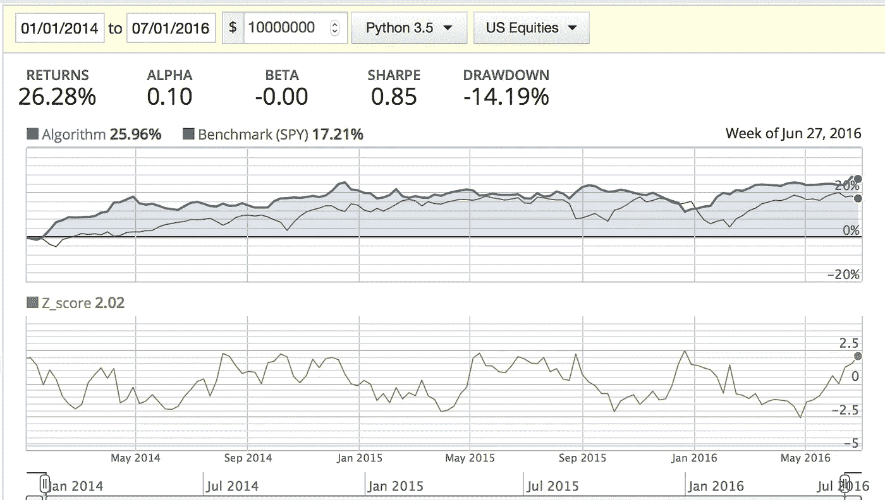

# Quantopian 上的 Pairs 校验实现

> 原文：<https://towardsdatascience.com/pairs-check-implementation-on-quantopian-3b10f4e06a34?source=collection_archive---------30----------------------->

## 两种证券的协整研究及配对检验交易策略的实施。


克里斯·利维拉尼在 [Unsplash](https://unsplash.com?utm_source=medium&utm_medium=referral) 上的照片

算法交易包括使用交易指令自动执行股票市场中的订单。这些指令是设计用于检测模式并将其用作执行操作的触发器的程序。这种技术利用了计算机相对于人类交易者的速度和情感。

这篇文章展示了如何在 Quantopian 上实现一个叫做 Pairs Check 的算法交易策略。

为了实现这一目标，我们将这篇文章分成 5 个部分:

1.  **结对检查，效果如何？**
2.  **分析股票对:CNQ 和 PXD**
3.  **quanto pian 上的代码实现**
4.  **回溯测试策略**
5.  **结论**

# 配对检查，它是如何工作的？

配对交易是一种独立于市场条件(上升趋势、下降趋势或横向运动)的市场交易策略，几乎在任何情况下都可以获得正回报。这种策略被归类为统计套利和集中交易策略。它的算法实现允许交易者在人类交易者有机会调整市场之前利用市场的低效率。

Pairs Check 监控两种历史上共同整合的证券的价差。协整背后的直觉可以用一个人遛狗的类比来说明。它们一起移动，它们之间的距离受到皮带长度的限制。在行走过程中，皮带会拉伸和放松，但大多数时候距离在这两个极端之间。

当两只股票之间的价差暂时增大时，例如一只股票上涨，而另一只股票下跌，配对交易将是做空表现出色的股票，做多表现不佳的股票，押注价格差异将会收敛。



两种证券之间的正常差价。

在上图中，我们可以看到两个共同整合证券之间的标准化利差。每当当前价差高于 1.2 或低于-1.2 时，算法就会下单做空价格过高的股票，做多价格过低的股票。

# 分析股票对:CNQ 和 PXD

在我们的案例研究中，我们将分析 CNQ(加拿大自然资源公司)和 PXD(先锋自然资源公司)之间的关系。我们将使用**stats models . TSA . stat tools**中的 **coint** 函数来测试协同集成。

我们将使用的软件包有:

```
import statsmodels.tsa.stattools as sts
import pandas as pd
import numpy as np
import yfinance
import matplotlib.pyplot as plt
```

然后导入数据:

```
*# importing data*
co1 = 'CNQ'
co2 = 'PXD'
tickers = co1 + " " + co2
raw_data = yfinance.download (tickers = tickers, interval = '1d', group_by = 'ticker',auto_adjust = **True**, treads = **True**)
```

并为分析做准备:

```
*# defining interval for analysis*
start = '2014-01-01'
end = '2016-06-01'cnq = pd.DataFrame(raw_data[co1][start:end].Close)
pxd = pd.DataFrame(raw_data[co2][start:end].Close)*# filling data gaps*
cnq = cnq.fillna(method = 'bfill')
pxd = pxd.fillna(method = 'bfill')*# renaming columns*
cnq = cnq.rename(columns = {'Close': 'CNQ'})
pxd = pxd.rename(columns = {'Close': 'PXD'})*# normalizing data*
cnq = cnq.apply(**lambda** x: (x-x.min())/(x.max()-x.min()))
pxd = pxd.apply(**lambda** x: (x-x.min())/(x.max()-x.min()))*# charting prices*
chart = pd.concat([cnq, pxd], axis = 1)
chart['CNQ'].plot(figsize = (20,8), color = 'blue')
chart['PXD'].plot()
plt.title('CNQ vs PXD closing prices', size = 24)
plt.legend()
plt.plot()
```



股票对的标准化价格

最后，我们运行协整检验:

```
*# co-integration test*
sts.coint(cnq, pxd)
```



在 **coint** 测试中的零假设是两个时间序列没有协整。

因此，从 2014 年到 2016 年，CNQ 和 PDX 高度协整，p 值为 0.0012，这使得这对夫妇成为我们算法的完美候选人。

# 量子乌托邦上的代码实现

下面的代码是在 Quantopian IDE 上实现的。时间表功能每天在市场关闭前 60 分钟运行程序。阈值根据经验定义为+-1.2。改变这些值可以改变策略的回报。

```
import numpy as npdef initialize(context):
    schedule_function(check_pairs, date_rules.every_day(), time_rules.market_close(minutes=60))

    # Canadian Natural Resources
    context.cnq = sid(21735)

    # Pioneer Natural Resources Company
    context.pxd = sid(17436)

    context.long_on_spread = False
    context.shorting_spread = False

def check_pairs(context, data):
    cnq = context.cnq
    pxd = context.pxd

    prices = data.history([cnq, pxd], 'price', 30, '1d')

    short_prices = prices.iloc[-1:]

    # Spread
    mavg_30 = np.mean(prices[cnq] - prices[pxd])
    std_30 = np.std(prices[cnq] - prices[pxd])
    mavg_1 = np.mean(short_prices[cnq] - short_prices[pxd])

    if std_30 > 0:
        zscore = (mavg_1 - mavg_30) / std_30

        # Spread = CNQ - PXD
        if zscore > 1.2 and not context.shorting_spread:
            order_target_percent(cnq, -0.5) 
            order_target_percent(pxd, 0.5) 
            context.shorting_spread = True
            context.long_on_spread = False

        elif zscore < 1.2 and not context.long_on_spread:
            order_target_percent(cnq, 0.5) 
            order_target_percent(pxd, -0.5) 
            context.shorting_spread = False
            context.long_on_spread = True

        elif abs(zscore) < 0.1:
            order_target_percent(cnq, 0)
            order_target_percent(pxd, 0)
            context.shorting_spread = False
            context.long_on_spread = False

        record(Z_score = zscore)
```

# 回溯测试策略

下面我们可以看到配对检查策略的回溯测试结果。



回报明显好于 SPY 基准，但夏普比率和提款可能会有所改善。

# 结论

如果这么简单，为什么不是每个人都用支票赚钱呢？嗯，共同整合的股票是独角兽，找到它们并不是一件容易的事情。除此之外，两种证券之间的共同整合可能会随着时间的推移而发生变化，原因有几个:管理和监管变化、客户基础多样化、新技术…

回溯测试结果显示了优于 SPY 基准的回报，但是夏普比率和提取可以改进。

我希望你喜欢这篇文章，我很想听听你关于如何改进这段代码的想法。

***来自《走向数据科学》编辑的提示:*** *虽然我们允许独立作者根据我们的* [*规则和指导方针*](/questions-96667b06af5) *发表文章，但我们不认可每个作者的贡献。你不应该在没有寻求专业建议的情况下依赖一个作者的作品。详见我们的* [*读者术语*](/readers-terms-b5d780a700a4) *。*