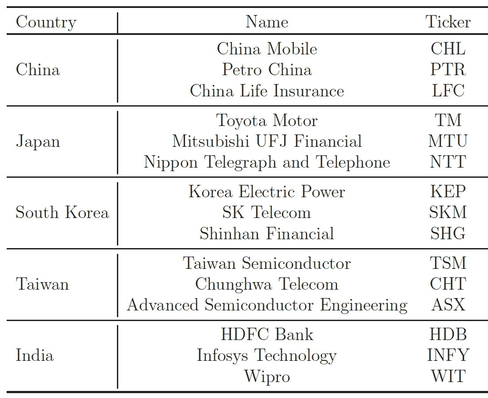
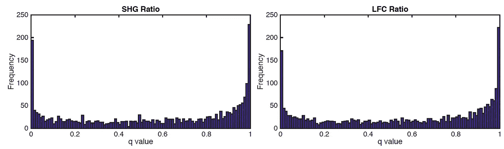
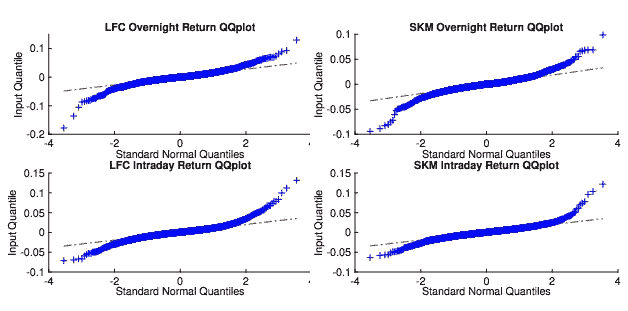
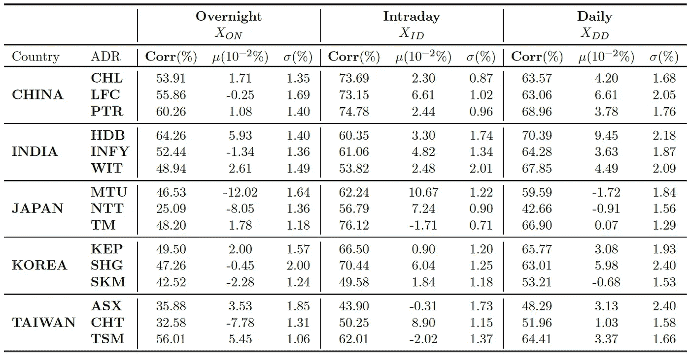
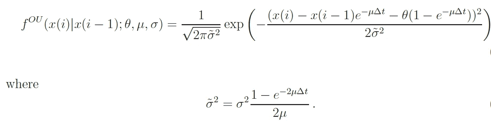
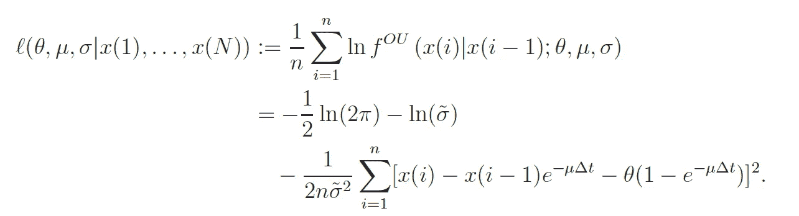
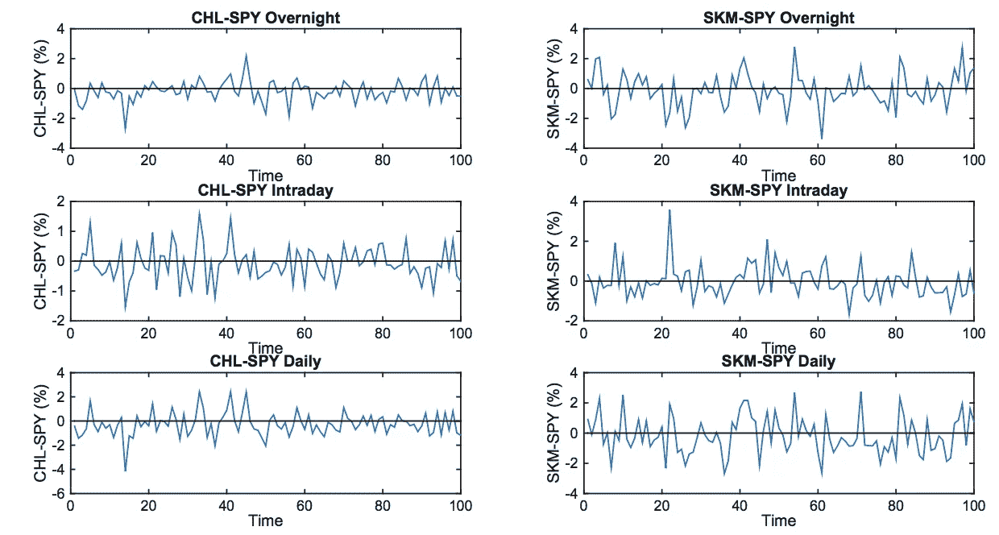
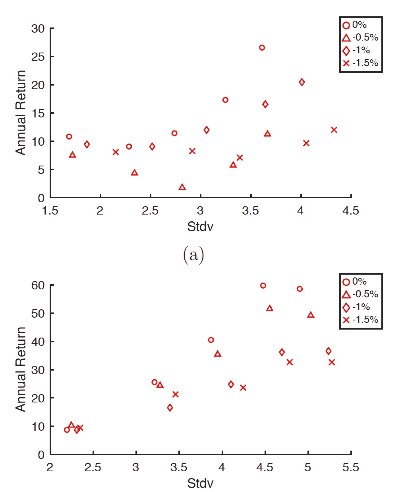

# 成对交易 ADR 和间谍

> 原文：<https://towardsdatascience.com/pairs-trading-adr-and-spy-b460c498025b?source=collection_archive---------33----------------------->

## 算法交易

## ADR 价格动态推动交易策略

看着同一个方向？由 [SK Yeong](https://unsplash.com/@yskeong?utm_source=unsplash&utm_medium=referral&utm_content=creditCopyText) 在 [Unsplash](https://unsplash.com/s/photos/pair?utm_source=unsplash&utm_medium=referral&utm_content=creditCopyText) 上拍摄的照片

# **美国存托凭证**

在美国交易所上市的外国公司股票通常被注册为**美国存托凭证**。这些是以美元计价的凭证，代表非美国公司证券的股份。约有 2000 种美国存托凭证在纽约证交所和纳斯达克交易，或通过场外交易市场交易，代表着至少 70 个不同国家的公司股票。

美国存托凭证是投资外国公司最直接和最受欢迎的金融工具之一，并被积极用于投资组合的多样化。2015 年，通过美国存托凭证和本地股票持有的外国股票占美国投资者股票投资组合的 19%。

具体而言，根据 JP 摩根的报告，全球对美国和非美国存托凭证的投资总额估计约为 1 万亿美元，其中约 90%投资于美国存托凭证。一些交易量最大的 ETF 也包含美国存托凭证。例如，2015 年末，14 只中国 ADR 被纳入 MSCI 新兴市场指数。跟踪这一指数的 iShares MSCI 新兴市场 ETF (EEM)市值为 240 亿美元，日均成交量为 7200 万股。

在美国交易所交易的亚洲 ADR 的例子。

由于其跨境性质，美国存托凭证的回报在很大程度上取决于美国和原产国市场的市场情绪。特别是，来自亚洲的**ADR**，如日本、中国香港、中国台湾、印度和韩国，尤其令人感兴趣。

这些美国存托凭证为美国投资者提供了投资外国和新兴市场的直接可行手段。因此，在非亚洲交易所上市的亚洲存托凭证占存托凭证总市值的 44%以上。

# **不重叠的时区**

上述国家的时区比纽约东部标准时间(EST)早 12-14 小时。因此，美国市场和他们本国市场的交易时间并不重叠。原始国内市场在美国市场收盘后开盘，反之亦然。

这导致 ADR 回报相对于其标的股票(在其本国)的*不同步* 。多资产投资者和其他机构投资者对完全异步的市场特别感兴趣。

类似地，**时区差异**允许我们将他们的回报分为日内和隔夜两部分，每一部分都有根本不同的价格驱动因素。对于本文研究的美国存托凭证，日内回报可以直观地归因于美国市场的新闻、条件和前景，而隔夜回报主要由当地亚洲市场驱动。在这里，每个市场的波动性贡献是令人感兴趣的。

# 回报率:隔夜与当天

我们根据由下式定义的*平方回报率*来比较隔夜回报率的每日比例

每天 *i.* 一般来说，对于大多数 ADR，该比率的平均值高于 0.5，但对于 SPY，该比率远低于 0.5。较高的比率意味着隔夜回报率比日内回报率有更多的变化。

收益率平方的分布*在区间[0，1]上通常是 u 形的，但不一定是对称的。*对于 SHG 和 LFC 而言，右侧能见度更高。

在 [Kang 和 Leung (2016)](https://www.emeraldinsight.com/doi/abs/10.1108/SEF-10-2016-0254) 中，我们展示了美国存托凭证的其他显著特征，包括日内回报和隔夜回报的关键统计数据、它们的分布以及与美国市场的相关性。

分位数-LFC(左)和 SKM(右)的每日隔夜和当天回报率的分位数图。对于每个图表，x 轴表示标准正态分布的理论分位数，y 轴表示数据真实分布的分位数。十字越靠近直线参考线，经验分布越正常。

2004 年 6 月 15 日至 2014 年 6 月 13 日 ADR 和 SPY 回报统计。每个时间成分的第一列报告 ADR 和 SPY 回报之间的相关系数。第二列报告了平均回报差价(ADR-SPY)。第三列报告回报差价的标准差。对于大多数美国存托凭证来说，日内回报往往与 SPY 有更高的相关性。

每个美国存托凭证与美国市场的相关性是有用的，因为它可以作为一些交易策略的基础。由于盘中回报反映了美国市场时段的价格波动，因此预计它们与美国市场回报的相关性相对较高。同样，隔夜回报率的相关性预计会显著降低。该研究确定了这些相关性，定量对比了它们对各种 ADR 的整体波动性和表现的影响。

# 均值回复传播

通过 SPDR S&P500 交易所交易基金(SPY)交易的 S&P500 指数和每个美国存托凭证之间的收益率差被发现是一个均值回复时间序列，并通过最大似然估计(MLE)拟合到奥恩斯坦-乌伦贝克过程。

我们用随机微分方程描述的奥恩斯坦-乌伦贝克过程来模拟收益率差

然后，给定在时间 *i-1* 的先前数据，我们可以将在时间步长 *i* 的扩散的条件概率表示为

对序列(x(1)，x(2)，)的一个观察。。。x(N))允许我们计算，从而最大化平均对数似然，定义如下

隔夜、日内和每日收益价差的时间序列:CHL-SPY(左)和 SKM-SPY(右)。

# **价差交易**

为了利用均值回复 ADR-SPY 价差，引入了成对交易策略(ADR 中的多头头寸和 SPY 中的空头头寸)并进行了回溯测试。

在我们的配对交易策略中，我们**多头 ADR** 和**空头 SPY** 。我们选择 SPY 做空，因为它的流动性明显高于 ADR，而且更容易借入。

为了获得最佳结果，我们设置了一个特定的进场水平阈值，并在收益率差 ADR-SPY 低于该阈值 *k* %时进场。

我们在这里假设多头和空头头寸都值 100 美元，因此净现金流出为零。因此，我们报告的回报不是百分比，而是其支付的现金价值。我们通过将进场门槛从 0%变为-1.5%，步长为-0.5%，平仓天数从 1 天变为 5 天来检验 pairs 交易策略。

基于 2004 年 6 月 15 日至 2014 年 6 月 13 日的经验数据，对(a) CHL 和(b) ASX，在不同的进入阈值(k%)下，均值回复交易策略的平均收益与风险(标准差)的比较。

这篇论文的 pdf 格式如下:[https://ssrn.com/abstract=2858048](https://ssrn.com/abstract=2858048)

# 参考

[Kang，J.](https://www.emerald.com/insight/search?q=Jamie%20Kang) 和 [Leung，T.](https://www.emerald.com/insight/search?q=Tim%20Leung) (2017)，**异步美国存托凭证:隔夜与日内收益与交易策略**，*《经济与金融研究》，第 34 卷第 4 期，第 580-596 页。[https://doi.org/10.1108/SEF-10-2016-0254](https://doi.org/10.1108/SEF-10-2016-0254)*

*Leung T .和 Li X. (2016)，**最优均值回归交易:数学分析和实际应用**，世界科学出版公司(2016)*

*[谷歌学术](https://scholar.google.com/citations?user=P40aOHIAAAAJ&hl=en) // [领英页面](https://www.linkedin.com/in/timstleung/) // [主页](https://sites.google.com/site/timleungresearch/research)*

****来自《走向数据科学》编辑的提示:*** *虽然我们允许独立作者根据我们的* [*规则和指南*](/questions-96667b06af5) *发表文章，但我们并不认可每个作者的贡献。你不应该在没有寻求专业建议的情况下依赖一个作者的作品。详见我们的* [*读者术语*](/readers-terms-b5d780a700a4) *。**