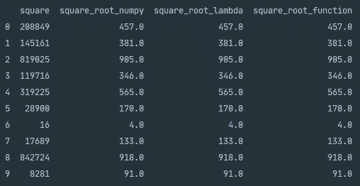
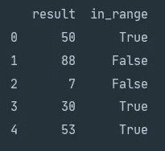

# 熊猫申请电力用户

> 原文：<https://towardsdatascience.com/pandas-apply-for-power-users-f44d0e0025ce?source=collection_archive---------41----------------------->

## 通过学习熊猫内置的 apply()函数成为超级用户

由[托德·特拉帕尼](https://unsplash.com/@ttrapani?utm_source=medium&utm_medium=referral)在 [Unsplash](https://unsplash.com?utm_source=medium&utm_medium=referral) 拍摄的照片

# 介绍

在我们的数据科学职业生涯中，我们会遇到质量差的数据，无论是部分完成的记录还是格式不正确的属性。作为一名成功的数据科学家，能够管理质量差的数据已经成为一项至关重要的技能。

令人欣慰的是，已经开发了许多库，如 [Pandas](https://pandas.pydata.org/pandas-docs/stable/index.html#) ，我们可以用它们来有效地操作数据集。今天我们来看看如何利用熊猫的内置功能。apply()学习如何操作数据集。

# 熊猫应用功能

pandas apply 函数顾名思义，它允许你在一个[数据帧](https://pandas.pydata.org/pandas-docs/stable/reference/api/pandas.DataFrame.html)的轴上或一个[系列](https://pandas.pydata.org/pandas-docs/stable/reference/series.html)上应用一个函数。当需要在重新格式化或清理数据的情况下操作列或行时，这个函数非常强大。

显示应用函数及其参数的 Python 代码片段

第一个参数`func`允许你传入一个函数。这可以是一个导入包中的函数，一个你在脚本中声明的函数，甚至是一个 lambda 函数。下面的 python 代码片段演示了如何在第 21–23 行之间传递三种不同类型的函数。这里我们通过传递产生相同结果的三个不同的函数来创建由 Pandas `.apply()`函数生成的三个新列。

Python 代码片段显示了可以传递给应用函数的不同类型的函数。

控制台输出显示了执行上述代码片段的结果。

第二个参数`axis`允许您定义函数将应用于哪个轴。这可以是数据框中行的`0`或`index`，也可以是列的`1`或`columns`。就个人而言，我更喜欢使用`index`和`columns`，因为对于那些不理解`0`和`1`背后含义的人来说，这可以提高代码的可读性。第三个参数`raw`决定传递的是行还是列，还是 n 维数组( [ndarray](https://numpy.org/doc/stable/reference/generated/numpy.ndarray.html) )对象。如果`raw=False`被传递，则行或列作为[系列](https://pandas.pydata.org/pandas-docs/stable/reference/api/pandas.Series.html)被传递给应用函数，如果`raw=True`被传递，则 ndarray 对象被传递给函数。

参数`result_type`改变应用函数如何应用于数据帧的列轴。默认情况下`result_type`设置为`None`，但是，可以接受`expand` `broadcast`和`reduce`。如果`expand`被传递，则返回的任何列表类型结果都将跨列展开。如果返回列表的长度大于数据帧中的列数，则将创建额外的列来扩展。在列表扩展期间，数据帧的原始列名将被覆盖为范围索引。如果需要保留数据框的原始形状，那么可以传递`broadcast`，这也将确保保留原始的列名。如果你需要确保列表类型的结果不被扩展，那么你可以将`reduce`传递给`result_type`。

Python 代码片段显示了熊猫应用结果类型可以接受的不同参数。

最后一个参数`args=()`允许您将值传递给正在应用的函数。在下面的例子中，我们将传递`25`和`75`作为函数`between_range()`的`lower`和`higher`参数。当该函数应用于该列时，将评估`result`系列中的每个值是在该值范围之内还是之外，并将在`in_range`列中返回一个布尔值。

Python 代码片段展示了如何将 arge=()与 Pandas 内置函数 apply()一起使用。

显示在 args=()内调用 between_range()的结果的控制台输出。

# 摘要

Pandas 内置的 apply()函数是一个非常强大的工具，在处理质量差的数据时，它是一个非常好的工具。它提供了一种沿数据帧的轴应用函数来清理或操作数据的有效方法。apply()函数可以灵活地传递参数，这将允许您处理几乎所有的数据质量问题。

感谢您花时间阅读我们的故事，我们希望您已经发现它的价值:)