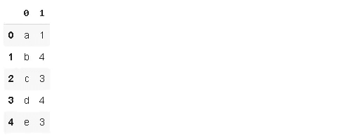
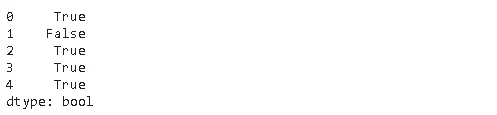

# 数字之外的熊猫:使用文本数据

> 原文：<https://towardsdatascience.com/pandas-beyond-numbers-working-with-textual-data-19cf353b23a5?source=collection_archive---------23----------------------->

## 举例说明。


照片由 [Aaron Burden](https://unsplash.com/@aaronburden?utm_source=unsplash&utm_medium=referral&utm_content=creditCopyText) 在 [Unsplash](https://unsplash.com/s/photos/write?utm_source=unsplash&utm_medium=referral&utm_content=creditCopyText)

Pandas 是使用最广泛的 Python 数据分析和操作库。由于数据并不总是以清晰的数字表示，数据分析库应该能够处理任何格式的数据。熊猫做到了，而且做得很好。

在这篇文章中，我们将探索熊猫的文本数据(如字符串)的能力。让我们从文本数据的数据类型开始。

# 对象与字符串

在 pandas 1.0 之前，只有“object”数据类型用于存储字符串，这导致了一些缺点，因为非字符串数据也可以使用“object”数据类型来存储。例如，具有对象数据类型的列可以包含数字、文本、日期和列表，这对于数据分析来说不是最佳方式。

Pandas 1.0 引入了一种新的特定于字符串数据的数据类型，即**string type**。到目前为止，我们仍然可以使用 object 或 string type 来存储字符串，但是在将来，我们可能会被要求只使用 string type。

到目前为止，“object”仍然是存储字符串的默认数据类型。为了使用 StringDtype，我们需要显式地声明它。

```
import pandas as pdpd.Series(['aaa','bbb','ccc']).dtype
dtype('O')pd.Series(['aaa','bbb','ccc'], dtype='string').dtype
StringDtypepd.Series(['aaa','bbb','ccc'], dtype=pd.StringDtype()).dtype
StringDtype
```

如果“**字符串**或 **pd，则使用 StringDtype。string type()**作为参数传递给 Dtype 参数。

我们需要文本数据来处理。我会先从熊猫的[维基百科](https://en.wikipedia.org/wiki/Pandas_(software))页面获取一段，并存储在一个列表中。

```
text = ["Developer Wes McKinney started working on pandas in 2008 while at AQR Capital Management out of the need for a high performance, flexible tool to perform quantitative analysis on financial data. Before leaving AQR he was able to convince management to allow him to open source the library."]
```

文本是只有一项的列表。我将把它转换成一个熊猫系列，将每个单词作为一个单独的项目。

```
A = pd.Series(text).str.split().explode().reset_index(drop=True)A[:5]
0    Developer 
1          Wes 
2     McKinney 
3      started 
4      working 
dtype: object
```

Str 是访问字符串操作的属性。顾名思义，Split 根据指定的字符(默认为空格)拆分数据。然后，我们使用 explode 函数将每个分离的单词作为系列中的一个新项目。

如果我们不重置索引，由于 explode 函数的性质，序列 A 中的所有项目的索引都将为 0。值得一提的是，还有其他方法来创建一个文字系列，这是关于熊猫的一件好事。它几乎总是提供多种方法来完成一项任务。

有些单词以大写字母开头，这在数据分析中是不可取的。我们希望尽可能有一个标准。我们可以将它们全部转换成大写或小写字母。

```
A.str.upper()[0]
'DEVELOPER'A.str.lower()[0]
'developer'
```

所有项目都已转换，但我们只访问了第一个项目。

len 函数返回对象的长度。如果是列表，len 返回列表中的项数。如果 len 与 str 属性一起使用，它将返回每个字符串的长度。

```
A.str.len()[:5]
0    9 
1    3 
2    8 
3    7 
4    7
```

如果您想将此系列中的所有字符串组合回其原始格式，您可能会使用的函数是 **cat** :

```
A.str.cat(sep=" ")developer wes mckinney started working on pandas in 2008 while at aqr capital management out of the need for a high performance, flexible tool to perform quantitative analysis on financial data. before leaving aqr he was able to convince management to allow him to open source the library.
```

字符串操作提供了很大的灵活性。例如，我们不仅可以用其他字符串替换一个字符串，还可以替换一个字符串的一部分(即按字符)。

```
A.str.replace('the', 'not-a-word')[-3:]
45        source 
46    not-a-word 
47      library.A.str.replace('deve', ' ')[:3]
0       loper 
1         wes 
2    mckinney
```

str 访问器提供对字符串字符的索引。例如，我们只能得到前 3 个字符。如果在一个字符串的末尾或开头有一些多余的字符，这就很方便了。

```
first_three = A.str[:3]first_three[:2]
0    dev 
1    wes
```

熊猫字符串方法也兼容**正则表达式** (regex)。正则表达式的整个范围太详细了，但是我们将做几个简单的例子。假设我们有包含一个字母和一个数字的字符串，那么模式就是字母-数字。我们可以用这个模式提取部分字符串。

```
B = pd.Series(['a1','b4','c3','d4','e3'])B.str.extract(r'([a-z])([0-9])')
```



我们可能还想检查是否所有的字符串都有相同的模式。

```
C = pd.Series(['a1','4b','c3','d4','e3'])C.str.contains(r'[a-z][0-9]')
```



我们还可以计算字符串中特定字符的数量。

```
B = pd.Series(['aa','ab','a','aaa','aaac'])B.str.count('a')
0    2 
1    1 
2    1 
3    3 
4    3
```

在某些情况下，我们可能需要根据条件过滤字符串。例如，startswith 和 endswith 函数可以与 str 属性一起使用。

```
B = pd.Series(['aa','ba','ad'])B.str.startswith('a')
0     True 
1    False 
2     TrueB.str.endswith('d')
0    False 
1    False 
2     True
```

一些机器学习算法需要对分类变量进行编码。str 属性支持 get_dummies 函数。

```
cities = ['New York', 'Rome', 'Madrid', 'Istanbul', 'Rome']pd.Series(cities).str.get_dummies()
```


Pandas 字符串操作并不局限于我们在这里讨论的内容，但是我们讨论的函数和方法肯定会有助于处理字符串数据并加快数据清理和准备过程。

感谢阅读。如果您有任何反馈，请告诉我。