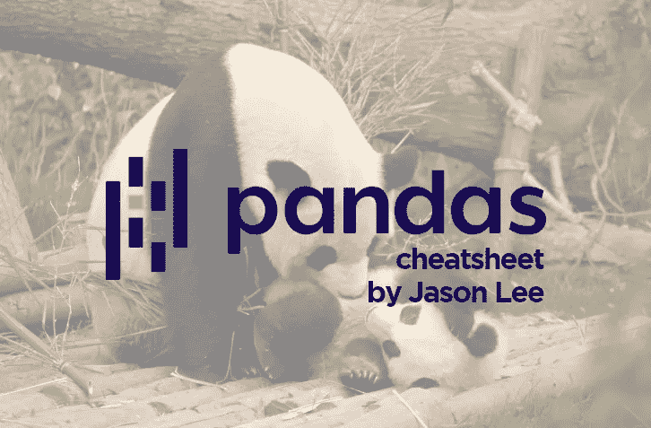
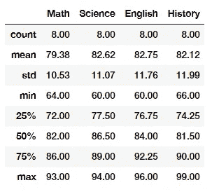
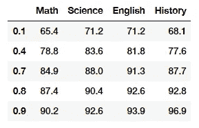
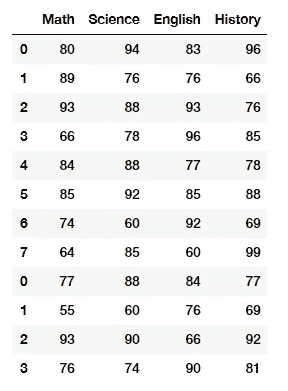
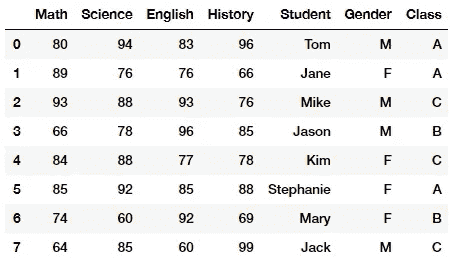
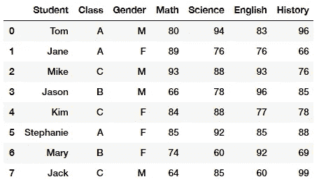
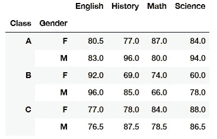
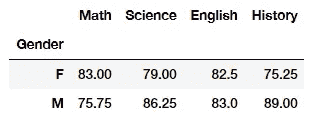
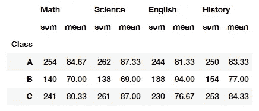

# 熊猫小抄

> 原文：<https://towardsdatascience.com/pandas-cheat-sheet-4c4eb6802a4b?source=collection_archive---------12----------------------->

## 使用 Python 与熊猫一起行动



照片由[戴安娜·西拉瑞亚](https://www.pexels.com/@diana-silaraja-794257?utm_content=attributionCopyText&utm_medium=referral&utm_source=pexels)从[派克斯](https://www.pexels.com/photo/photo-of-panda-and-cub-playing-1661535/?utm_content=attributionCopyText&utm_medium=referral&utm_source=pexels)拍摄

> 掌握一项技能的 10000 小时法则

在他的名著《局外人》中，马尔科姆·格拉德威尔曾经说过，一个人需要投入 10000 个小时才能成为任何技能的真正大师。这背后的想法是熟能生巧，这是另一个已经铭刻在一些人心中的流行说法。

虽然我当然同意，随着时间的推移，一项新技能的不断练习和重复会形成一致的习惯和表现，但很难想象有人在任何时候都知道一切。如果你曾经对熊猫进行过任何数据分析，有一些基本的功能是你不需要的。

这是熊猫基本功能的备忘单。

# 入门指南

对于这个小抄，我们将创建一个学校不同科目的**成绩**的小型数据框架。先从进口熊猫说起吧。

```
# import the package
import pandas as pd# creating a dataframe with all the grades and subjects
grades = pd.DataFrame(
                 {'Math'     : [80, 89, 93,66, 84, 85,74,64],
                  'Science'  : [94, 76, 88, 78, 88, 92, 60, 85],
                  'English'  : [83, 76, 93, 96, 77, 85, 92, 60],
                  'History'  : [96, 66, 76, 85, 78, 88, 69, 99]})
```

## 头

为了显示数据框的顶部，我们可以使用 *head* 功能。默认情况下，我们将获得前 5 行。如果我们想要另一个数字，我们可以将一个特定的数字作为 *n* 传递。

```
# first 5 rows
grades.head()# first 10 rows
grades.head(n = 10)
```

## 尾巴

类似地，我们可以通过调用数据帧上的 tail 来获得最后 5 行，并传递 *n* 作为参数来更改显示的数字，从而获得与`head`相反的结果。

```
# last 5 rows
grades.tail()# last 10 rows
grades.tail(n = 10)
```

## 列

如果我们只想用数据帧的*命名*，我们可以使用`.columns`函数

```
# column names
grades.columns
```

输出如下→ *Index(['数学'，'科学'，'英语'，'历史']，dtype= '对象')*

## 形状

如果您正在处理大型数据框，并且很难手动计算行数或列数，我们使用`.shape`来查找维度。

```
# size of the dataframe
grades.shape
```

## 信息

在开始任何分析之前，了解您正在处理的数据类型是很重要的。使用`.info()`您可以了解您拥有的数据类型的概况。

```
# data types
grades.info()
```

在我们的例子中，所有的数据都是整数类型，因为我们对每个年级都使用整数。

## 形容

和`.info()`一样，您很可能想知道数据报的描述性统计数据。使用`.describe()`可以观察*计数、平均值、标准偏差、数量、最小值、*和*最大值*。在这个例子中，我使用了`.round(2)`来清理输出。

```
# descriptive statistics with chained round
grades.describe().round(2)
```



## 分位数

使用`.describe()`函数，我们自动获得了 25、50 和 75 的分位数。我们也可以陈述我们自己的分位数。下面我选了 10%、40%、70%。注意——我们可以在下面的公式中传递尽可能多的分位数。

```
# quantitles
grades.quantile([0.1,0.4,0.7, 0.8, 0.9])
```



## 平均值、标准差、方差、计数、中值、最小值和最大值

我们可以在数据帧上使用各种函数来获得聚合结果。您也可以传入一个列名，以便只检索该列的值。

```
# mean
grades.mean()
grades['Math'].mean()# standard deviation
grades.std()
grades['Math'].std()# variance
grades.var()
grades['Math'].var()# count
grades.count()
grades['Math'].count()# median
grades.median()
grades['Math'].median()# min
grades.min()
grades['Math'].min()# max
grades.max()
grades['Math'].max()
```

## 重命名列

如果我们要重命名列，例如，将列名改为大写的*。*

```
*# using inplace means making change to itself. 
grades.rename(columns = {'Math':'MATH'}, inplace = True)# if we don't state inplace as True we need to save it back to itself manually
grades = grades.rename(columns = {'Math':'MATH'})*
```

*上面两段代码将返回相同的结果。`inplace = True`利用这个论证，我们告诉它要把它保存到自身中去，并记住结果。如果我们不声明`inplace = True`，我们将不得不在`=`中编码，以声明我们希望将值保存回*等级*数据帧中。*

## *索引子集设置— iloc*

*使用代表*索引位置的 iloc，*我们可以根据索引位置找到数据帧的子集。我们可以通过多种方式建立索引，因此了解使用下面的 *iloc* 的不同变化非常重要。iloc 的第一部分代表行，第二部分代表列。*

*如果你以前在 Python 中不知道这一点，索引从 0 开始。这意味着第一个数字将是索引 **0** ，而不是索引 **1。***

```
*# iloc - indexinggrades.iloc[0]           # first column
grades.iloc[[0]]         # frist row
grades.iloc[:, 1]        # all rows second column
grades.iloc[3, 1]        # 4th row second column only
grades.iloc[[1,3], :]    # row 1 and 3, with all columns
grades.iloc[:, 1:3]      # all rows and columns 1 to 3 (*not                              including 3)
grades.iloc[4:, : 3]     # from row 5 till last row, and first col to 4th col (not including 4th)*
```

*注意我们在某些情况下包含了一个`:`。`:`代表范围符号，`:`左边的数字表示起始位置，右边的数字表示索引到的位置，但**不包括**。例如`grades.iloc[:, 1:3]`它被分成两部分。*

1.  *第一个`:` →所有行，因为它前面没有开始索引，后面也没有结束索引*
2.  *第二个`1:3` →从第**栏 1** 起，但**不包括第**栏 3。这意味着在本例中，结果将只返回第 1 列和第 2 列。*

## *位置子集 loc*

*与子集化相反，我们有基于位置的子集化。这里我们引用我们需要的变量的名字，而不是索引。*

```
*grades.loc[:, 'Math']                  # all rows in Math column
grades.loc[2:3, ['Math', 'English']]   # rows 3 and 4, for Math and English
grades.loc[4:, 'Math': 'English']      # row 5 onwards, and Math TO English
grades.loc[:5, 'Science': ]*
```

*对于我们的数据，我们只有列的位置子集名称。如果我们有行标签，我们也可以引用它们。我们将在后面看到这个例子。*

## *排序值*

*如果我们想根据特定的值对数据帧进行排序，我们可以使用`sort_values()`默认情况下，值按**升序**排序，我们可以传入一个 False 参数，将其更改为**降序**。*

```
*# sort by a column - default asc
grades.sort_values('Math')
grades.sort_values('Math', ascending = False)*
```

## *串联*

*使用 concat，我们可以基于一个轴将两个数据框合并在一起。例如，我们可以在两种情况下向数据帧添加新值。*

1.  *添加更多行—轴= 0*
2.  *添加更多列—轴= 1*

```
*# concat
grades2 = pd.DataFrame(
                        {'Math'     : [77,55,93,76],
                         'Science'  : [88,60,90,74],
                         'English'  : [84,76,66,90],
                         'History'  : [77,69,92,81]})# attach dataframes together, reset index and drop the index col
pd.concat([grades, grades2], axis = 0).reset_index(drop=True)*
```

*首先，我们创建了第二个包含附加等级值的数据框，称为**等级 2** 。然后我们把新的数据帧放到旧的数据帧上。我们将轴标为 0，因为我们添加了更多的行。如果我们要添加一个全新的主题，比如 *Geography，*，那么我们希望使用 axis = 1。*

*如果我们没有添加`reset_index`，指数就不会排成一行。下面是它的样子。*

**

*使用`reset_index(drop=True)`我们正在做两件事。让指数组织起来，回到一个连续的形式。我们删除索引是因为 pandas 会自动创建一个额外的索引列，这是我们不需要的——所以我们删除了它。*

## *布尔索引*

*熊猫中一个有用的技术叫做布尔索引。它本质上是一种基于布尔条件(即真或假)查找值的过滤技术。布尔索引的一般语法如下。*

```
*dataframe[dataframe['column_name'] == 'filter_objective']*
```

*使用布尔索引，我们需要在括号内重述数据帧。*

```
*# boolean subseting
grades[grades['Math'] > 80]# subsetting but only calling a column
grades[grades['Math'] > 80]['Science']# subsetting but only calling a column using iloc
grades[grades['Math'] > 80].iloc[:, 3]# AND  conditions
grades[(grades['Math'] > 80) & (grades['Science'] < 80)]# OR conditions but only want History score
grades[(grades['Math'] > 80) | (grades['Science'] < 80)]['History']*
```

*如上所述，我们可以组合多个布尔条件来深化过滤能力。使用`&`和`|`我们可以陈述条件。如果两个条件都满足，`&` (AND)将返回结果。如果条件的任何一方得到满足，`|` (OR)将返回结果。*

*观察上面的代码。我们可以看到，添加 iloc 或列名可以为我们提供一个结果，如果满足条件，则只返回所选的列。*

## *子集化列*

*您可以将 pandas 中的列子集化为一个系列或一个数据框架。*

*[系列](https://www.geeksforgeeks.org/python-pandas-series/)是 pandas 中的一种列表类型，可以接受整数值、字符串值、双精度值等等。但是在[熊猫系列](https://www.geeksforgeeks.org/python-pandas-series/)中，我们以列表的形式返回一个对象，索引从 *0* 到 *n* ，其中 *n* 是系列中值的长度。系列只能包含一个带索引的列表，而数据帧可以由多个系列组成，或者我们可以说数据帧是可用于分析数据的系列的集合。*

```
*# subseting a column as a series
grades['Math']# subseting as a dataframe
grades[['Math']]# multiple columns
grades[['Math', 'History']]*
```

## *添加列*

*向 dataframe 中添加更多的列就像创建一个新的列名并设置与之相等的值一样简单。*

```
*# new columns
grades['Student']   = ['Tom', 'Jane', 'Mike', 'Jason', 'Kim', 'Stephanie', 'Mary', 'Jack']
grades['Gender']    = ['M','F', 'M', 'M', 'F', 'F', 'F', 'M']
grades['Class']     = ['A', 'A', 'C', 'B', 'C', 'A', 'B', 'C']*
```

**

## *重新排列列*

*如果是上面的例子，将学生作为第一列会更有意义。如果我们想对列进行重新排序，我们可以创建一个我们希望数据帧列的顺序列表，并在数据帧上对它们进行索引。*

```
*# reorder columns - pass a list as a list and index#order we want
cols = ['Student', 'Class','Gender', 'Math', 'Science', 'English','History']# overwrite the old dataframe with the same dataframe but new column order
grades = grades[cols]*
```

**

## *数据透视表*

*[数据透视表](https://en.wikipedia.org/wiki/Pivot_table)是一个统计表，它汇总了一个更大的表(例如来自数据库、电子表格或商业智能程序)的数据。该汇总可能包括总和、平均值或其他统计数据，数据透视表以一种有意义的方式将它们组合在一起。*

*数据透视表是[数据处理](https://en.wikipedia.org/wiki/Data_processing)中的一项技术。他们安排和重新安排(或“旋转”)统计数据，以引起对有用信息的注意。*

```
*# pivot tables
grades.pivot_table(index= ['Class','Gender'])*
```

**

*我们可以看到，我们首先根据值的*类别*对值进行分组，然后根据性别进行分组。这提供了数据帧的聚合结果。*

## *分组依据*

*一个 [groupby](https://pandas.pydata.org/pandas-docs/stable/reference/api/pandas.DataFrame.groupby.html) 操作包括分割对象、应用函数和组合结果的某种组合。这可用于对大量数据进行分组，并对这些组进行计算操作。*

```
*# groupby combined with aggreagate function
grades.groupby(by ='Gender').mean()*
```

**

*按性别分组，平均值*

*pandas 中的`groupby`函数的伟大之处在于使用`agg`函数链接了几个聚合函数。*

```
*# groupby and adding several funcitons with agg
grades.groupby(by ='Class').agg(['sum', 'mean']).round(2)*
```

**

# *概观*

*我希望这能给你提供在熊猫身上使用的新工具，或者刷新你对已有知识的记忆。记住，要坚持练习，如果你能达到所谓的“大师”水平，马尔科姆·格拉德威尔说，也许有一天，你将不再需要小抄来参考。*

*在 [**Linkedin**](https://www.linkedin.com/in/jasonmchlee/) 或 [**Github**](https://github.com/jasonmchlee) 上与我联系*