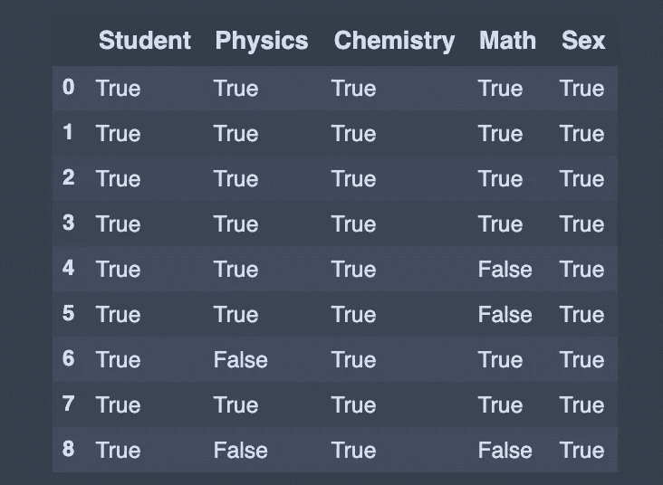

# 熊猫小抄

> 原文：<https://towardsdatascience.com/pandas-cheat-sheet-7e2ea6526be9?source=collection_archive---------22----------------------->

Python 数据分析库 Pandas 基础知识快速指南，包括代码示例。


由[马尔科·汉克基拉](https://unsplash.com/@maccorzo?utm_source=medium&utm_medium=referral)在 [Unsplash](https://unsplash.com?utm_source=medium&utm_medium=referral) 上拍摄的照片

我最喜欢的教授告诉我“软件工程师读教科书是作为参考；我们不会记住所有的东西，但我们知道如何快速查找。”

能够快速查找和使用函数允许我们在进行机器学习模型时实现一定的流程。所以我创建了这个熊猫函数的备忘单。这不是一个全面的列表，但包含了我在建立机器学习模型时最常用的函数。让我们开始吧！

这张纸条的结构是:

1.  输入数据
2.  导出数据
3.  创建测试对象
4.  查看/检查数据
5.  选择
6.  数据清理
7.  筛选、排序和分组依据
8.  统计数字

首先，我们需要进口熊猫来开始:

```
import pandas as pd
```


来源: [gacafe。Github](https://gacafe.github.io/vala_tc/content/)

# 1.输入数据

使用功能`pd.read_csv`将 CSV 直接转换成数据帧。

N 注意:对于 excel 文件，还有另一个类似的函数叫做`pd.read_excel`。

```
# Load data 
df = pd.read_csv('filename.csv') # From a CSV file
df = pd.read_excel('filename.xlsx') # From an Excel file
```

# 2.导出数据

`to_csv()`转储到与笔记本相同的目录。我们可以通过`df[:10].to_csv()`保存前十行。我们还可以使用`df.to_excel()`将数据帧保存并写入 Excel 文件或 Excel 文件中的特定表格

```
df.to_csv('filename.csv') # Write to a CSV file
df.to_excel('filename.xlsx') # Write to an Excel file
```

# 3.创建测试对象

## 从输入的数据构建数据帧

当我们想要手动实例化简单数据以查看数据流经管道时的变化时，这很有用。

```
# Build data frame from inputted data
df = pd.DataFrame(data = {'Name': ['Bob', 'Sally', 'Scott', 'Katie'],
 'Physics': [68, 74, 77, 78],
 'Chemistry': [84, 100, 73, 90],
 'Algebra': [78, 88, 82, 87]})
```


df

## 或者从列表中创建一个系列

```
#  Create a series from an iterable my_list
my_list = [['Bob',78],
          ['Sally',91], 
          ['Scott',62],
          ['Katie',78],
          ['John',100]]
df1 = pd.Series(my_list) # Create a series from an iterable my_list
```


df1

# 4.查看/检查数据

## 头部()，尾部()

`head()`功能显示数据帧中的第一个`n`记录。我经常把一个数据帧的最上面的记录打印在笔记本上，这样如果我忘记了里面的内容，就可以回头查阅。

```
df.head(3) # First 3 rows of the DataFrame
```


df.head()

`tail()`函数用于返回最后 n 行。这对于快速验证数据非常有用，尤其是在排序或追加行之后。

```
df.tail(3) # Last 3 rows of the DataFrame
```


df.tail()

## 添加或插入行

为了向 DataFrame 追加或添加一行，我们创建新行作为系列并使用`append()`方法。

在本例中，新行被初始化为 python 字典，使用`append()`方法将该行追加到 DataFrame。

当我们向`append(),`添加 python 字典时，确保我们传递了`ignore_index=True,`,这样索引值就不会沿着串联轴使用。结果轴将被标记为数字序列`0, 1, ..., n-1`，这在串联轴没有有意义的索引信息时很有用。

`append()`方法返回带有新添加行的 DataFrame。

```
#Append row to the dataframe, missing data (np.nan)
new_row = {'Name':'Max', 'Physics':67, 'Chemistry':92, 'Algebra':np.nan}
df = df.append(new_row, ignore_index=True)
```


df

## **向数据帧添加多行**

```
# List of series  
list_of_series = [pd.Series(['Liz', 83, 77, np.nan], index=df.columns),
                pd.Series(['Sam', np.nan, 94,70], index=df.columns ),
                pd.Series(['Mike', 79,87,90], index=df.columns),
                pd.Series(['Scott', np.nan,87,np.nan], index=df.columns),]
# Pass a list of series to the append() to add multiple rows
df = df.append(list_of_series , ignore_index=True)
```


df

## 或者我们可以添加新的列

```
# Adding a new column to existing DataFrame in Pandas
sex = ['Male','Female','Male','Female','Male','Female','Female','Male','Male']
df['Sex'] = sex
```


df

## 获取数据帧信息

`info()`函数对于获取一些常规信息很有用，比如标题、值的数量和列的数据类型。一个类似但不太有用的函数是`df.dtypes`，它只给出列数据类型。

```
df.info() #Index, Datatype and Memory information
```


df.info()

```
# Check data type in pandas dataframe
df['Chemistry'].dtypes 
>>> dtype('int64')#  Convert Integers to Floats in Pandas DataFrame
df['Chemistry'] = df['Chemistry'].astype(float) 
df['Chemistry'].dtypes
>>> dtype('float64')# Number of rows and columns
df.shape 
>>> (9, 5)
```

## 计算唯一的行

`value_counts()`函数用于获取包含唯一值计数的序列。

```
# View unique values and counts of Physics column
df['Physics'].value_counts(dropna=False)
```


# 5.选择

## 获取列的值列表或系列

如果我们需要将列中的值放入`X`和`y`变量中，这样我们就可以适应机器学习模型，这样就可以了。

```
df['Chemistry'] # Returns column with label 'Chemistry' as Series
```


```
df[['Name','Algebra']] # Returns columns as a new DataFrame
```


```
df.iloc[0] # Selection by position
```


```
df.iloc[:,1] # Second column 'Name' of data frame
```


```
df.iloc[0,1] # First element of Second column
>>> 68.0
```

# 6.数据清理

## 重命名列

`rename()`当我们需要重命名一些选定的列时，该功能非常有用，因为我们只需要为要重命名的列指定信息。

```
# Rename columns
df = df.rename({'Name':'Student','Algebra':'Math'}, axis='columns')
```


df

## 处理熊猫中缺失的数据

在 DataFrame 中，有时许多数据集只是在到达时丢失了数据，要么是因为它存在而未被收集，要么是因为它从未存在过。

> NaN(非数字的首字母缩写)是一个特殊的浮点值，被所有使用标准 IEEE 浮点表示法的系统所识别

熊猫将`NaN`视为本质上可互换的，用于指示缺失值或空值。为了促进这种约定，有几个有用的函数用于检测、删除和替换 Pandas 数据帧中的空值。

```
# Checks for null Values, Returns Boolean Arrray
check_for_nan = df.isnull()
```


为 nan 检查

为了检查 Pandas 数据帧中的空值，我们使用了`isnull()`或`notnull()`方法。`isnull()`方法返回对 NaN 值为真的布尔值的数据帧。在相反的位置，`notnull()`方法返回布尔值的数据帧，对于 NaN 值为假。

```
value = df.notnull() # Opposite of df2.isnull()
```



价值

我们使用`dropna()`函数删除所有缺少值的行。

```
drop_null_row = df.dropna() # Drop all rows that contain null values
```


删除空行

有时，我们可能只想删除一个缺少一些值的列。

```
# Drop all columns that contain null values
drop_null_col = df.dropna(axis=1)
```


删除空列

我们可以通过使用`fillna()`来填充缺失的值。例如，我们可能希望用零替换“NaN”。

```
replace_null = df.fillna(0) # Replace all null values with 0
```


替换空值

或者我们可以用平均值代替 NaN。

```
# Replace all null values with the mean (mean can be replaced with almost any function from the statistics module)
df = round(df.fillna(df.mean()),2)
```


df

`replace()`方法可以用来替换数据帧中的值

```
one = df.replace(100,'A') # Replace all values equal to 1 with 'one'
```


一个

# 7.筛选、排序和分组依据

## 按行值过滤熊猫数据帧

我们希望看到物理成绩达到 80 分或更高的学生

```
fil_80 = df[df['Physics'] > 80]
```


fil_80

如果我们想看到化学得 80 分或更高，但数学考试不到 90 分的学生怎么办

```
fil = df[(df['Chemistry'] > 80) & (df['Math'] < 90)]
```


费尔（伊拉克的钱币）

## 排序值()

我们经常想以特定的方式对熊猫数据帧进行排序。通常，可能希望根据一个或多个列的值对 Pandas 数据帧进行排序，或者根据 Pandas 数据帧的行索引值或行名进行排序。

例如，我们希望按学生姓名以升序对值进行排序。

```
ascending = df.sort_values('Student')
```


上升的

按降序排列化学分数。

```
descending = df.sort_values('Chemistry',ascending=False)
```


下降

更复杂的是，我们想按物理分数升序排序，然后按化学分数降序排序。

```
df.sort_values(['Physics','Chemistry'],ascending=[True,False])
```

在这种情况下，数据帧将分别针对物理和化学列进行排序。我们还可以向' ascending '参数传递一个列表，告诉 Pandas 对哪一列如何排序。


## groupby()

Groupby 是一个非常简单的概念。我们可以创建一组类别，并对这些类别应用一个函数。这是一个简单的概念，但却是我们经常使用的一个非常有价值的技术。Groupby 概念很重要，因为它能够高效地聚合数据，无论是性能还是代码量都非常可观。

让我们对性别列中的唯一值进行分组

```
group_by = df.groupby(['Sex']) # Returns a groupby object for values from one column
group_by.first() # Print the first value in each group
```


group_by.first()

计算每个唯一性别组的所有列的平均值

```
average = df.groupby(‘Sex’).agg(np.mean)
```


平均的

# 8.统计数字

我们可能熟悉 Excel 中的数据透视表，以便轻松洞察我们的数据。类似地，我们可以使用 Pandas 中可用的`pivot_table()` 函数创建 Python 数据透视表。该功能与`group_by()`功能非常相似，但是提供了更多的定制功能。

假设我们要按性别对值进行分组，并计算物理和化学列的平均值和标准差。我们将调用`pivot_table()`函数并设置以下参数:

*   `index`为`'Sex'`，因为这是来自`df`的列，我们希望在每一行中显示为唯一值
*   `values` as `'Physics','Chemistry'`因为这是我们想要应用一些聚合操作的列
*   `aggfunc`至`'len','np.mean','np.std` `len`将计算性别列中唯一的不同值，`np.mean`和`np.std`将分别计算平均值和标准差。

```
pivot_table = df.pivot_table(index='Sex',
                             values=['Physics','Chemistry'],
                             aggfunc=[len, np.mean, np.std])
```


数据透视表 _ 表格

N 注意:使用`len`假设我们的数据报中没有`NaN`值。

**describe()** 用于查看一些基本的统计细节，如百分位数、平均值、标准差等。一个数据帧或一系列数值。

```
df.describe() # Summary statistics for numerical columns
```


描述()

使用`max()`找到每行和每列的最大值

```
# Get a series containing maximum value of each row
max_row = df.max(axis=1)
```


最大行数

```
# Get a series containing maximum value of each column without skipping NaN
max_col = df.max(skipna=False)
```


max_col

同样，我们可以用`df.min()`来求每行或每列的最小值。

其他有用的统计功能:

`df.sum()`:返回所请求轴的值的总和。默认情况下，轴是索引(轴=0)。

`df.mean():`返回平均值

`df.median():` 返回每列的中值

`df.std():`返回数值列的标准偏差。

`df.corr() :`返回数据帧中各列之间的相关性。

`df.count()`:返回每列中非空值的个数。

本笔记中的代码可从 [Github](https://github.com/Nothingaholic/Python-Cheat-Sheet/blob/master/pandas.ipynb) 获得。

这些都是好东西。希望这张小抄能成为你的参考指南。随着我发现更多有用的熊猫功能，我会不断更新。如果有什么你离不开的功能，请在下面的评论中与我分享！

学习永远不会太迟，所以如果你刚刚开始你的 Python 之旅，继续学习吧！


来源: [quantumcomputingtech](https://quantumcomputingtech.blogspot.com/2019/12/data-science-meme.html)

已经有很多很多关于 Python 编程的书籍。我当然没有涵盖足够的信息来填补一个章节，但这并不意味着你不能继续学习！从下面的链接开始，让你的头脑充满更多的精彩。

1.  [熊猫装置](https://pandas.pydata.org/pandas-docs/stable/getting_started/install.html)
2.  [Python 手册](https://jakevdp.github.io/PythonDataScienceHandbook/)
3.  [熊猫初学者入门](https://www.learndatasci.com/tutorials/python-pandas-tutorial-complete-introduction-for-beginners/)
4.  [熊猫基础知识](https://www.kaggle.com/learn/pandas)
5.  [如何学习熊猫](https://medium.com/dunder-data/how-to-learn-pandas-108905ab4955)
6.  [熊猫在 Python 中有什么用](https://www.quora.com/What-is-the-use-of-pandas-in-Python)