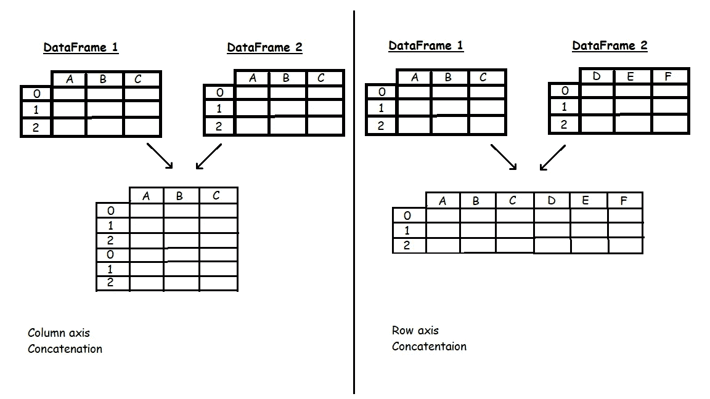

# 熊猫:组合数据

> 原文：<https://towardsdatascience.com/pandas-combining-data-b190d793b626?source=collection_archive---------76----------------------->

## [PyTrix 系列](https://towardsdatascience.com/tagged/pytrix-series)

## PyTrix #5:对熊猫进行更多的数据操作


美国宇航局在 [Unsplash](https://unsplash.com?utm_source=medium&utm_medium=referral) 拍摄的照片

Pandas 框架配备了`Series`和`DataFrame`对象，它们是数据探索和分析的强大工具。这些对象拥有的部分能力可以归因于它们采用多方面的方法来组合单独的数据集。Pandas 提供的功能允许你**合并**、**连接**、**连接**和**追加**数据。然而**，**在我看来我发现只需要学习 2 个就是**合并**和**串联**这里是为什么:

`df.append()`:将 other 的行追加到调用者的末尾，返回一个新的对象。

`pd.concat()`:沿特定轴连接熊猫对象，沿其他轴连接可选的集合逻辑。

`df.join()`:连接另一个数据框架的列。

`pd.merge()`:用数据库风格的连接合并数据帧或命名系列对象。

> **注:所有描述均来自官方熊猫** [**文档**](https://pandas.pydata.org/pandas-docs/stable/reference/frame.html)

阅读组合数据的不同方法的细节，您可能会注意到`df.append()`和`pd.concat()`本质上具有非常相似的功能，但是`pd.concat()`更加灵活。同样，`df.join()`和`pd.merge()`具有相似的功能，但是`pd.merge()`比`df.join()`提供了更多的灵活性。出于这个原因，我认为更有必要对`pd.concat()`和`pd.merge()`都有很好的理解，并使用这些顶级函数来完成你在 pandas 中的所有组合——在我看来。

> “应该有一种——最好只有一种——显而易见的方法来做到这一点，”Python 的 Zen。

对于这个故事，我将使用`pandas`和来自`seaborn`的提示数据集来演示每个功能。让我们载入数据…

```
**import** **pandas** **as** **pd** 
**import** **seaborn** **as** **sns***# load tips data from seaborn* 
data = sns.load_dataset("tips")
print(data.shape)
data.head()>>>> (244, 7)
```


图 1:上面代码块中生成的代码的结果；来自 seaborn 的 Tips 数据集。

您可能会立即注意到只有一个数据集。为了组合数据，我们需要多个数据集，因此我将数据集分成两个数据帧——我们假设这两个数据集是分开的。

```
*# splitting the data into two seperate df* 
bill = data.groupby(["sex", "smoker"])["total_bill", "tip"].sum()
tip = bill.copy() 
*# removing bill from tip and tip from bill* 
**del** tip["total_bill"]
**del** bill["tip"]# *visualizing bill dataset*
bill.reset_index(inplace= **True**)
print(bill.shape)
bill.head()>>>> (4, 3)
```


图 2:账单数据集

让我们看看 tip 数据框是什么样子的…

```
# visualizing tip dataset
tip.reset_index(inplace= **True**) 
print(tip.shape)
tip.head()>>>> (4, 3)
```


图 3: Tip 数据集

本故事中使用的代码可以在以下位置找到:

[](https://github.com/kurtispykes/demo/blob/master/pytrix/pytrix_combing_data_in_pandas.ipynb) [## kurtispykes/演示

### permalink dissolve GitHub 是超过 5000 万开发人员的家园，他们一起工作来托管和审查代码，管理…

github.com](https://github.com/kurtispykes/demo/blob/master/pytrix/pytrix_combing_data_in_pandas.ipynb) 

## 合并

在展示`pd.merge()`的一些功能之前，让我们花点时间来理解我们可以连接数据的不同方式:

> 注意:如果您熟悉 SQL，那么您可能会从`JOIN`语法中认出不同的操作名。

*   **内部联接** —选择在两个数据帧中具有匹配值的记录。

```
*# Inner join* 
inner_join = pd.merge(bill, tip, how="inner", on=["sex", "smoker"])
print(inner_join.shape)
inner_join.head()>>>> (4, 4)
```


图 4:对我们的数据执行内部连接

*   **外部连接** —外部连接将从左侧和右侧数据帧返回所有记录。如果数据帧列中没有匹配，不匹配的结果将用`nan`填充。

```
*# Outer join* 
outer_join = pd.merge(bill.tail(2), tip.head(2), how= "outer", on=["sex", "smoker"], indicator=**True**)
print(outer_join.shape)
outer_join.head()>>>> (4, 5)
```


图 5:数据帧上的外部连接；请注意，有一个额外的“_merge”列指示合并是如何完成的。这是因为在 pd.merge()中将 indicator 设置为 True。

*   **左连接** —左连接将返回左表中的所有记录，以及右表中的匹配记录。对于只存在于左侧数据帧中的键，右侧数据帧中不匹配的值将用`nan`填充。

```
# left join
left_join = pd.merge(bill, tip.head(2), how= "left", on=["sex", "smoker"], indicator=**True**)
print(left_join.shape)
left_join.head()>>>> (4, 5)
```


图 6:左连接数据帧

*   **右连接** —右连接将返回右数据帧中的所有记录，以及左数据帧中的匹配记录。对于只存在于右侧数据帧中的键，左侧数据帧中不匹配的值将用`nan`填充。

```
*# Right join*
right_join = pd.merge(bill.head(2), tip, how= "right", on=["sex", "smoker"], indicator= **True**)
print(right_join.shape)
right_join.head()>>>> (4, 5)
```


图 7:右连接数据帧

*图 8* 为我们提供了上述不同连接的可视化表示。


图 8:不同连接的可视化表示；假设维恩图中的两个圆是两个数据帧。此外，我们还必须假设外部连接指示两个数据帧(集合并集)中的所有内容，而不是两个数据帧之外的所有内容。

有时，您想要合并的数据帧中的列可能是不同的，但是跨两个数据帧的索引是相同的。例如，按日期分组的显示开盘价的财务数据可以是一个数据框架，而按日期分组的显示收盘价的财务数据可以是另一个数据框架。我们可以使用`pd.merge()`合并指数上的数据框架，这将导致一个数据框架显示特定日期的开盘价和收盘价。

这里有一个例子:

```
*# Setting indexes* bill.set_index(keys= ["sex", "smoker"], inplace= **True**) tip.set_index(keys= ["sex", "smoker"], inplace= **True**)bill.head()
```


图 9:以“性”和“吸烟者”为索引的账单数据框架

```
tip.head()
```


图 10:以“性别”和“吸烟者”为索引的 Tip 数据框架

```
*# Merging on index*
index_merge= pd.merge(bill, tip, how="inner", left_index=**True**, right_index=**True**)
index_merge.head()
```


图 11:索引合并

通过简单地将`left_index`和`right_index`设置为`True`，我们可以在索引上进行合并。此外，通过将一个要合并的索引设置为`True`，并定义与另一个数据帧中的索引相匹配的列，可以合并索引和列。例如…

```
*# Merging partial index and column* 
partial_merge= pd.merge(bill, tip, how="inner", left_index=**True**, right_on=["sex", "smoker"])
partial_merge.head()
```

这将返回*图 11* 。

**额外信息**

根据输入的数据，`pd.merge()`允许我们进行各种类型的连接，例如*一对一*、*多对一*和*多对多*:

***一对一*** —一个数据帧中的每一行都使用“键”列与另一个数据帧中的一行相关。

***一对多*** —一个数据帧中的每一行都使用“键”列链接到另一个数据帧中的一行或多行。

***多对多*** —一个数据帧中的一行或多行使用“键”列与另一个数据帧中的一行或多行相关。

## 串联

我们可以认为串联是沿着一个轴将我们的数据集粘合在一起——或者是**行轴**或者是**列轴**。`pd.concat()`允许我们做非常简单的连接，因此`pd.merge()`是必要的。

> 注意:`[**concat()**](https://pandas.pydata.org/pandas-docs/stable/reference/api/pandas.concat.html#pandas.concat)`(因此也是`**append()**`)制作了数据的完整副本，不断地重用这个函数会对性能产生重大影响。如果需要在几个数据集上使用该操作，请使用列表理解。—来源 Pandas 文档。



图 12:连接的可视化。

`pd.concat()`的默认行为是保留两个轴数据的外部连接。但是，通过调整`join`参数，您可以修改函数来执行内部连接，这可能会导致一些数据丢失——只有轴标签匹配的地方才会保留行和列数据。

```
*# Gluing dataframes row-wise* 
row_glue= pd.concat([bill, tip], axis=0, sort=**False**)
row_glue.head(8)
```


图 13:行连接

```
*# Gluing dataframes column-wise* col_glue= pd.concat([bill, tip], axis=1, sort=**False**)
col_glue.head()
```


图 14:列连接

我们还可以通过向`keys`传递一个序列来添加一个指示器，指示每个连接开始的位置。

```
*# Adding an indicator* 
indicator_glue = pd.concat([bill, tip], axis=0, sort=**False**, keys=["df1", "df2"])
indicator_glue
```


图 15:添加了一个指示器来标识 concat 数据的来源。

## 包裹

Pandas 有许多用于组合数据的有用技术，在我看来，这些技术允许你将 Pandas 框架变成你自己的，正如我所做的那样，我只选择使用 2 个顶级函数来组合数据，以完成我所有的组合操作。

感谢您花时间阅读这个故事。如果你喜欢它，你可以在 PyTrix 系列中找到更多类似的文章。

[](https://towardsdatascience.com/tagged/pytrix-series) [## Pytrix 系列-走向数据科学

### 阅读《走向数据科学》中关于 Pytrix 系列的文章。共享概念、想法和代码的媒体出版物。

towardsdatascience.com](https://towardsdatascience.com/tagged/pytrix-series) 

如果您想亲自联系我，我是 LinkedIn 上最活跃的用户，我会非常乐意与您联系！

[](https://www.linkedin.com/in/kurtispykes/) [## Kurtis Pykes -人工智能作家-走向数据科学| LinkedIn

### 在世界上最大的职业社区 LinkedIn 上查看 Kurtis Pykes 的个人资料。Kurtis 有一个工作列在他们的…

www.linkedin.com](https://www.linkedin.com/in/kurtispykes/)