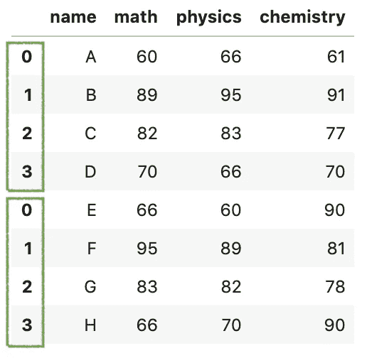

# 你应该知道的提高数据分析速度的技巧

> 原文：<https://towardsdatascience.com/pandas-concat-tricks-you-should-know-to-speed-up-your-data-analysis-cd3d4fdfe6dd?source=collection_archive---------1----------------------->

## 你应该知道的一些最有用的熊猫把戏


图片来自 [Pixabay](https://pixabay.com/?utm_source=link-attribution&utm_medium=referral&utm_campaign=image&utm_content=1892023) 的 [GraphicMama-team](https://pixabay.com/users/graphicmama-team-2641041/?utm_source=link-attribution&utm_medium=referral&utm_campaign=image&utm_content=1892023)

Pandas 提供了各种内置函数来轻松组合数据帧。其中，`concat()`函数看起来使用起来相当简单，但仍有许多技巧你应该知道，以加快你的数据分析。

在这篇文章中，你将学习熊猫`concat()`处理以下常见问题的技巧:

1.  处理索引和轴
2.  避免重复索引
3.  使用`keys`和`names`选项添加分层索引
4.  列匹配和排序
5.  从一堆 CSV 文件中加载和连接数据集

源代码请查看我的 [Github repo](https://github.com/BindiChen/machine-learning/blob/master/data-analysis/016-pandas-concat/pandas-concat.ipynb) 。

# 1.处理索引和轴

假设我们有两个关于考试成绩的数据集。

```
df1 = pd.DataFrame({
    'name': ['A', 'B', 'C', 'D'],
    'math': [60,89,82,70],
    'physics': [66,95,83,66],
    'chemistry': [61,91,77,70]
})df2 = pd.DataFrame({
    'name': ['E', 'F', 'G', 'H'],
    'math': [66,95,83,66],
    'physics': [60,89,82,70],
    'chemistry': [90,81,78,90]
})
```

与`concat()`最简单的连接是传递一系列数据帧，例如`[df1, df2]`。默认情况下，它沿着轴`0`垂直连接，并保留所有现有的索引。

```
pd.concat(**[df1, df2]**)
```



默认情况下，df1 和 df2 的索引都会保留

如果您希望串联忽略现有的索引，您可以设置参数`ignore_index=True`。然后，产生的数据帧索引将用`0`、…、`n-1`标记。

```
pd.concat([df1, df2], **ignore_index=True**)
```


`pd.concat([df1, df2], ignore_index=True)`的输出

要沿轴`1`水平连接数据帧，可以设置参数`axis=1`。

```
pd.concat([df1, df2], **axis=1**)
```


`pd.concat([df1, df2], axis=1)`的输出

# 2.避免重复索引

现在，我们知道`concat()`函数保留了索引。如果您想验证`pd.concat()`结果中的索引没有重叠，您可以设置参数`verify_integrity=True`。设置为`True`时，如果有重复的索引，将引发异常。

```
try:
    pd.concat([df1,df2], **verify_integrity=True**)
except ValueError as e:
    print('ValueError', e)ValueError: Indexes have overlapping values: Int64Index([0, 1, 2, 3], dtype='int64')
```

# 3.使用`keys`和`names`选项添加分层索引

增加一个[层次索引](https://pandas.pydata.org/pandas-docs/stable/user_guide/advanced.html#hierarchical-indexing-multiindex)(也叫多级索引)对于更复杂的数据分析还是挺有用的。在这种情况下，我们分别为`df1`和`df2`增加指标**第一年**和**第二年**。为此，我们可以简单地指定`keys`参数。

```
res = pd.concat([df1, df2], **keys=['Year 1','Year 2']**)
res
```


并访问一组特定的值，例如， **Year 1** :

```
res.**loc['Year 1']**
```

此外，参数`names`可用于为产生的分层索引添加名称。例如:将 name ***Class*** 添加到我们刚刚创建的最外层索引中。

```
pd.concat(
    [df1, df2], 
    keys=['Year 1', 'Year 2'],
    **names=['Class', None],**
)
```


要重置索引并将其转换为数据列，可以使用`reset_index()`

```
pd.concat(
    [df1, df2], 
    keys=['Year 1', 'Year 2'],
    names=['Class', None],
).**reset_index(level=0)** **# reset_index(level='Class')**
```


重置类别索引

# 4.列匹配和排序

`concat()`函数能够以不同的顺序连接数据帧和列。默认情况下，结果数据帧将与第一个数据帧具有相同的排序。比如下面这个例子，和`df1`的顺序一样。


如果您希望得到的数据帧按字母顺序排序，您可以设置参数`sort=True`。

```
pd.concat([df1, df2], **sort=True**)
```


按列名排序

如果您喜欢自定义排序，以下是如何进行的:

```
**custom_sort** = ['math', 'chemistry', 'physics', 'name']
res = pd.concat([df1, df2])
**res[custom_sort]**
```


自定义排序

# 5.从一堆 CSV 文件中加载和连接数据集

假设我们需要从一堆 CSV 文件中加载和连接数据集。这是一个使用 for 循环的解决方案。

```
# Bad
import pathlib2 as pl2
ps = pl2.Path('data/sp3')res = None
**for p in ps.glob('*.csv'):**
    if res is None:
        res = pd.read_csv(p)
    else:
        res = **pd.concat([res, pd.read_csv(p)])**
```

这当然有用。但是`pd.concat()`在每次 for 循环迭代中都会被调用。我们可以使用列表理解有效地解决这个问题。

```
import pathlib2 as pl2
ps = pl2.Path('data/sp3')dfs = (
    **pd.read_csv(p, encoding='utf8') for p in ps.glob('*.csv')**
)res = **pd.concat(dfs)**
res
```

一行代码读取所有 CSV 文件并生成一个数据帧列表`dfs`。然后，我们只需要调用一次`pd.concat(dfs)`就可以得到相同的结果。

如果你用`%%timeit`计算两次执行的时间，你可能会发现列表理解解决方案节省了一半的时间。

```
# for-loop solution
**298 ms ± 11.8 ms per loop** (mean ± std. dev. of 7 runs, 1 loop each)# list comprehension solution
**153 ms ± 6 ms per** loop (mean ± std. dev. of 7 runs, 1 loop each)
```

列表理解节省时间和代码。与使用循环相比，这是一种简单的生成列表的方法。

# 好了

感谢阅读。

源代码请查看[笔记本](https://github.com/BindiChen/machine-learning/blob/master/data-analysis/016-pandas-concat/pandas-concat.ipynb)。

如果你对机器学习的实用方面感兴趣，请继续关注。

## 你可能会对我的其他一些熊猫文章感兴趣:

*   [如何对熊猫数据帧进行自定义排序](/how-to-do-a-custom-sort-on-pandas-dataframe-ac18e7ea5320)
*   [何时使用熊猫变换()函数](/when-to-use-pandas-transform-function-df8861aa0dcf)
*   [使用熊猫方法链接提高代码可读性](https://medium.com/@bindiatwork/using-pandas-method-chaining-to-improve-code-readability-d8517c5626ac)
*   [在 Pandas 数据帧中处理日期时间](/working-with-datetime-in-pandas-dataframe-663f7af6c587)
*   [处理熊猫中缺失的值](/working-with-missing-values-in-pandas-5da45d16e74)
*   [熊猫阅读 _csv()你应该知道的招数](https://medium.com/@bindiatwork/all-the-pandas-read-csv-you-should-know-to-speed-up-your-data-analysis-1e16fe1039f3)
*   [用 Pandas read_csv()解析日期列应该知道的 4 个技巧](/4-tricks-you-should-know-to-parse-date-columns-with-pandas-read-csv-27355bb2ad0e)

更多可以从我的 [Github](https://github.com/BindiChen/machine-learning) 中找到