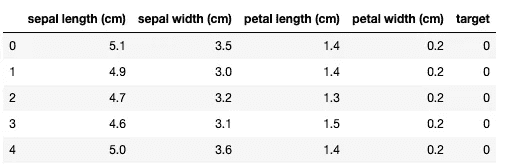
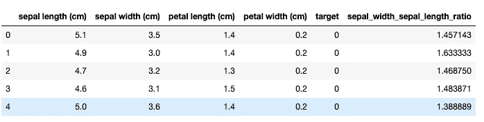
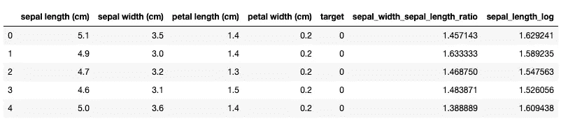
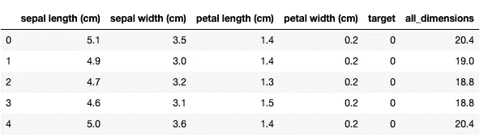
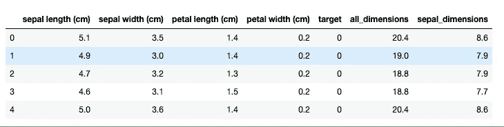
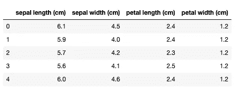
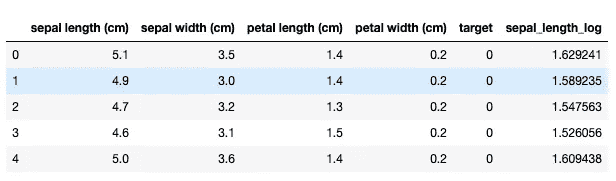
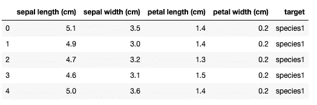

# Pandas 数据操作函数:apply()、map()和 applymap()

> 原文：<https://towardsdatascience.com/pandas-data-manipulation-functions-7b3519fc1370?source=collection_archive---------20----------------------->

## 以及如何在熊猫身上正确使用它们…


图片来自 [Pixabay](https://pixabay.com/?utm_source=link-attribution&utm_medium=referral&utm_campaign=image&utm_content=3601194) 的 [Couleur](https://pixabay.com/users/Couleur-1195798/?utm_source=link-attribution&utm_medium=referral&utm_campaign=image&utm_content=3601194)

一旦你开始使用 pandas，你会注意到为了处理数据，你需要对你的数据集做一些转换。几乎从来没有这样的情况，您加载数据集，并可以继续使用它的原始形式。您可能需要这样做有几个原因，例如:

> 改变单位(例如，数据集以千克为单位，而您需要以磅为单位)
> 
> 做一些数学变换(对数、根等)
> 
> 小写或大写字符串，
> 
> 还有更多…

本文将解释如何使用 apply()、map()和 applymap()来实现它，以及何时使用其中一个而不使用另一个。

**数列上的算术运算**

在深入研究 apply()、map()和 applymap()之前，需要注意的是，一些简单的基本算术运算可以在不使用上述任何函数的情况下完成。这些是:

*   添加
*   减法
*   增加
*   或者以上的任意组合

让我们加载 Iris 数据集并查看一些示例:

```
from sklearn import datasets
import pandas as pdiris_data = datasets.load_iris()
df_iris = pd.DataFrame(iris_data.data,columns=iris_data.feature_names)
df_iris['target'] = pd.Series(iris_data.target)
df_iris.head()
```



做基本的算术运算是非常容易的。如果我们想要计算萼片长度与萼片宽度的比率，您只需将一列除以另一列:

```
df_iris['sepal_width_sepal_length_ratio'] = df_iris['sepal length (cm)'] / df_iris['sepal width (cm)']df_iris.head()
```



正如您所看到的，我们添加了一个新列，这是这个基本算术运算的结果。但是，如果你想使用更复杂的操作，如日志，地板，立方体等，会发生什么呢？

> 这就是 apply()，map()和 applymap()成为你的朋友的时候。

**对系列**应用()

让我们开始看看如何在 Series 对象上使用 apply()。我们将假装对记录萼片长度感兴趣。用 apply()很容易做到。我们只需要传递一个参数，一个我们希望应用于系列中每个元素的可调用函数。在我们的例子中，这是 math.log:

```
import math
df_iris['sepal_length_log'] = df_iris['sepal length (cm)'].apply(math.log)
df_iris.head()
```



如您所见，我们已经成功创建了一个名为 sepal_length_log 的新列，该日志应用于每个 sepal length 条目。

我们现在可以说明 apply()如何处理数据框，这是一个更复杂的例子。


[JESHOOTS.COM](https://unsplash.com/@jeshoots?utm_source=unsplash&utm_medium=referral&utm_content=creditCopyText)在 [Unsplash](https://unsplash.com/s/photos/math?utm_source=unsplash&utm_medium=referral&utm_content=creditCopyText) 上的照片

**在数据帧上应用()**

在 DataFrame 上使用的 Apply 函数与在 Series 上使用的 apply 函数略有不同。apply 函数应用于整行或整列，您需要指定轴。它再次将函数的可调用性作为参数。它最常见的用法是发送一整行作为函数的参数。

让我们看一些例子:

```
df_iris['all_dimensions'] = df_iris.drop('target', axis=1).apply(sum, axis=1)
df_iris.head()
```



在上例中，我们使用 apply()创建了*‘all _ dimensions*’列。为此，我删除了一个“目标”列，并使用 sum()函数对每行的所有其他列值求和。注意，我必须使用 axis=1 作为参数，以便将函数应用于每一行。

上面的用法可能不是最有用的，但是 apply 的强大之处在于定义你自己的函数。让我们在这里说明这一点。

假设您只想将给定的整行 sepal 数据相加。你可以这样定义你的函数:

```
def sepal_sum(row):
    return row['sepal length (cm)'] + row['sepal width (cm)']
```

现在，您可以使用 apply()将函数应用于每一行，如下所示:

```
df_iris['sepal_dimensions'] = df_iris.drop('target', axis=1).apply(sepal_sum, axis=1)
df_iris.head()
```



那很有用！当您愿意使用自己的更复杂的函数时，它会变得更加有用。

**applymap()**

在 DataFrame 上使用 apply()时，函数参数会变成整行或一列，具体取决于您定义的轴。但是，如果您想对数据框的每个元素应用某种函数，而不是对每一行或每一列应用某种函数，该怎么办呢？这就是 applymap()变得有用的时候。

假设有人犯了一个错误，你想在你的数据中的每一个条目上加 1，因为你已经发现这是一个测量中的一致错误。让我们从定义一个助手函数开始:

```
def add_one(item):
    return item + 1
```

让我们使用 applymap()将它应用于原始 iris 数据帧的每个元素，不包括目标列。

```
df_iris.drop('target', axis=1).applymap(add_one).head()
```



现在，如果您将此输出与原始输出进行比较，您会注意到每个条目都添加了一个。它显示了 applymap 的强大。

[](/7-practical-pandas-tips-when-you-start-working-with-the-library-e4a9205eb443) [## 当你开始与图书馆合作时，7 个实用的熊猫提示

### 解释一些乍一看不那么明显的东西…

towardsdatascience.com](/7-practical-pandas-tips-when-you-start-working-with-the-library-e4a9205eb443) 

**地图()**

Map()函数只能在 Series 对象上使用，其工作方式与在 Series 上的 apply()相同。让我们将它与我们之前用来演示 apply()和 series 的日志示例一起使用。唯一的变化是在代码中我们交换应用到 map:

```
import math
df_iris['sepal_length_log'] = df_iris['sepal length (cm)'].map(math.log)
df_iris.head()
```



即使应用于序列，map 和 apply 之间也有区别。不同之处在于，在处理 series 时，apply 只能将一个可调用的函数作为参数。另一方面，Map()也可以接受一个集合(如字典),并根据映射应用它来更改序列中的值。让我们看一个例子:

```
df_iris.target = df_iris.target.map({0: 'species1', 1: 'species2'})
df_iris.head()
```



正如您所看到的，我们在这里使用了一个字典来将 0 和 1 相应地转换为' *species1'* 和' *species2'*

**应用()，应用地图()和地图()摘要**

这里总结一下最重要的区别。

> **Apply()** 在数据帧的行/列基础上工作，或者在序列上应用时在元素上工作。
> 
> **Applymap()** 处理数据帧上的单个元素。
> 
> **Map()** 类似于 apply on Series，但它不仅可以接受可作为参数调用的函数，还可以接受字典之类的集合。

> 它们都非常有用，毫无疑问，掌握它们的用法会让你成为一名优秀的数据科学家。

我希望你喜欢这篇文章，并在今天学到一些新东西！

*最初发布于 aboutdatablog.com:* [熊猫数据操作函数:apply()、map()和 applymap()](https://www.aboutdatablog.com/post/pandas-data-manipulation-functions-apply-map-and-applymap) 、*2020 年 4 月 8 日。*

***PS:我正在***[***aboutdatablog.com***](https://www.aboutdatablog.com/)上撰写深入浅出地解释基本数据科学概念的文章。 ***如果你喜欢这篇文章，还有一些其他的你可能会喜欢:***

[](/sorting-data-frames-in-pandas-a5a3af6f346a) [## 对熊猫中的数据框进行排序

### 如何快速有效地排序数据帧

towardsdatascience.com](/sorting-data-frames-in-pandas-a5a3af6f346a) [](/jupyter-notebook-autocompletion-f291008c66c) [## Jupyter 笔记本自动完成

### 数据科学家的最佳生产力工具，如果您还没有使用它，您应该使用它…

towardsdatascience.com](/jupyter-notebook-autocompletion-f291008c66c)