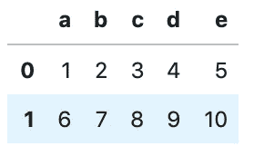
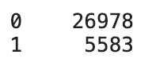
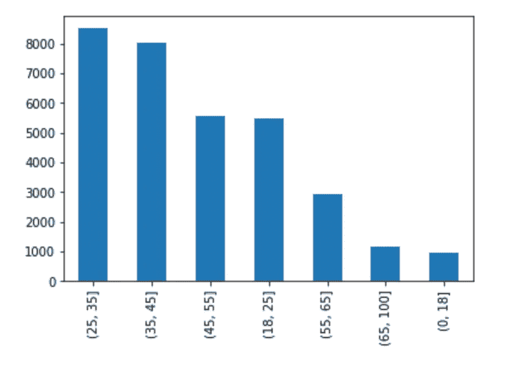
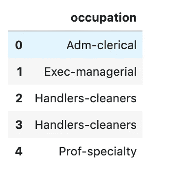

# 熊猫数据框架基础

> 原文：<https://towardsdatascience.com/pandas-dataframe-basics-3c16eb35c4f3?source=collection_archive---------27----------------------->

## 开始使用这种非常有用的数据结构

丹尼尔·麦金尼斯在 [Unsplash](https://unsplash.com/s/photos/start?utm_source=unsplash&utm_medium=referral&utm_content=creditCopyText) 上的照片

在使用 Python 处理和分析数据时，Pandas 通常是数据科学家、分析师和工程师的默认选择。使用该库时使用的基本数据结构是 DataFrame。Pandas DataFrame 是由行和列数据组成的二维结构，与 Excel 电子表格或 SQL 数据库表没有什么不同。

一旦数据在这个数据结构中可用，您就可以执行各种操作来准备您的数据进行分析。在下面的文章中，我将向你介绍一些使用熊猫数据框架的基本概念。

# 创建数据框架

`[pandas.DataFrame()](https://pandas.pydata.org/pandas-docs/stable/reference/api/pandas.DataFrame.html)`函数可用于将序列、数组、常量或列表形式的数据转换成数据帧。

下面的代码接受一个整数列表，并将它们转换成熊猫数据帧。我们传入一个列名列表，并使用`pandas.head()`函数显示前几行数据。

作者图片

# 导入数据

在本教程的剩余部分，我们将使用来自 UCI 机器学习知识库的开源数据集。该数据集包括一个成年人的许多特征，如年龄、教育水平和婚姻状况，以及一个表明他们年收入是否超过 5 万美元的目标。

我们可以使用`[pandas.reas_csv()](https://pandas.pydata.org/pandas-docs/stable/reference/api/pandas.read_csv.html)`函数直接从 URL 下载这个数据集。这个函数以熊猫数据帧的形式返回数据。

Pandas 支持多种导入数据的方法，包括:

*   用`pandas.read_excel()`从 Excel 电子表格中读取。
*   用`pandas.read_sql()`从 SQL 表中读取。
*   来自一个带`pandas.read_json`的 JSON 文件。

# 添加新的列和行

需要向数据帧中添加新列以方便对数据的进一步分析是很常见的。有很多方法可以让你做到这一点。

例如，您可能希望根据条件添加新列。在下面的代码中，我们使用`numpy.where()`函数创建一个名为“兼职时间”的列，如果“每周小时数”小于 35，则该列的值为 1。我还调用了`pandas.value_counts()`来快速查看这个新列中每个值的成人数量。

作者图片

在我们使用的数据集中，有一列包含每个人的年龄。更好地分析这种数据类型的常用方法是将年龄分组或分类。我们可以使用`pandas.cut()`函数创建一个新的列来完成这项工作。我已经使用 pandas [绘图功能](https://pandas.pydata.org/pandas-docs/version/0.23.4/generated/pandas.DataFrame.plot.html)结合`value_counts()`创建了一个简单的分布可视化表示。

作者图片

# 索引和选择数据

在数据分析期间，通常执行的任务是从数据集中选择行和列的子集。Pandas 提供了许多方法来执行这种类型的操作。

如上所示，我们可以根据条件选择数据子集。假设我们想要选择年龄超过 65 岁的人所在的所有行和列。我们可以使用下面的代码做到这一点。

熊猫数据帧被索引，因此也可以根据索引选择数据。您可以使用索引来选择数据，或者通过标签(在这种情况下，您将使用`DataFrame.loc()`函数)或者通过基于整数的位置(使用`DataFrame.iloc()`)。

以下代码选择标签为“occupation”的列的所有行。

这个代码片段使用列的整数位置执行完全相同的操作。

# 清理数据

真实世界的数据通常包含需要清除的缺失值或错误值。Pandas 有清除所有数据类型(包括整数、浮点数和对象)中缺失数据的方法。

为了用合适的值填充缺失的值，我们可以使用`DataFrame.fillna()`。在 fill 参数中，我们可以指定一个值，比如 0，或者指定一个字典，为每一行和/或每一列指定不同的值。

或者，我们可以选择使用`DatFrame.dropna()`删除包含缺失值的行。

# 导出数据

一旦你完成了你的数据帧，你可以把它导出回一个文件或数据库。Pandas 支持多种数据导出方法，包括:

*   用`pandas.to_csv()`导出到 CSV 文件。
*   使用`pandas.to_excel()`导出到 Excel 电子表格。
*   用`pandas.to_sql()`写回 SQL 数据库。

熊猫图书馆包含大量有用的数据分析功能和工具。DataFrame 不仅为组织数据提供了一种清晰有序的方法，还为您提供了这些丰富的数据分析工具。本教程提供了基本数据框架功能的简单介绍，但是一旦数据以这种结构组织起来，就有更多的使用范围。如果你想更深入地探索我在这篇文章中概述的一些功能，我邀请你看看我以前的一些熊猫教程。

 [## 关于熊猫你不知道的 10 件事

### 直到现在…

towardsdatascience.com](/10-things-you-didnt-know-about-pandas-d20f06d1bf6b)  [## 熊猫里的情节越来越漂亮了

### 创建丰富的可视化和仪表板与熊猫绘图后端为 Plotly 和 Bokeh

towardsdatascience.com](/plotting-in-pandas-just-got-prettier-289d0e0fe5c0)  [## 熊猫绘图 5 分钟指南

### 了解如何使用这个流行的 python 工具快速可视化数据

towardsdatascience.com](/5-minute-guide-to-plotting-with-pandas-e8c0f40a1df4) 

感谢阅读！

[**我每月都会发一份简讯，如果你想加入，请点击此链接注册。期待成为您学习旅程的一部分！**](https://mailchi.mp/ce8ccd91d6d5/datacademy-signup)