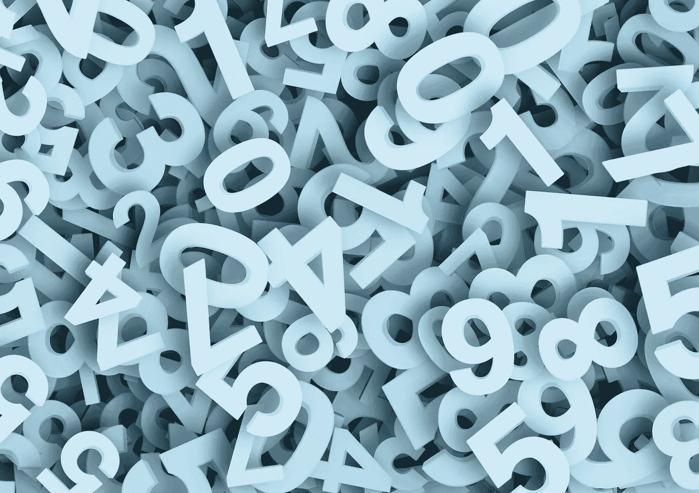
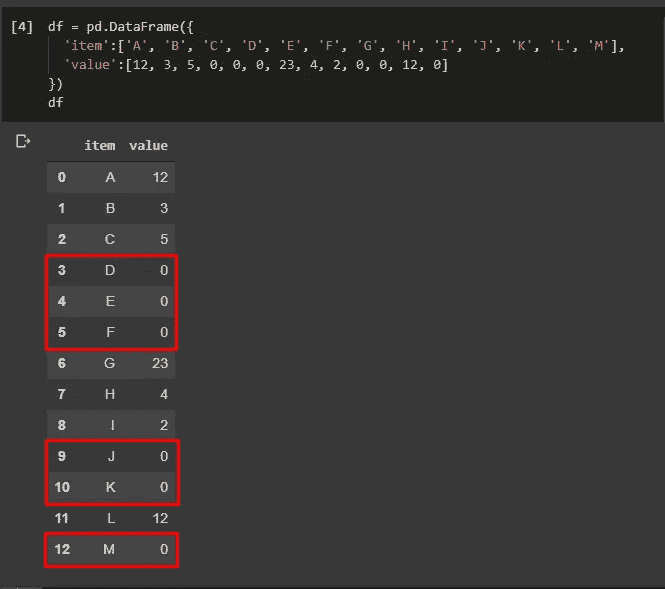
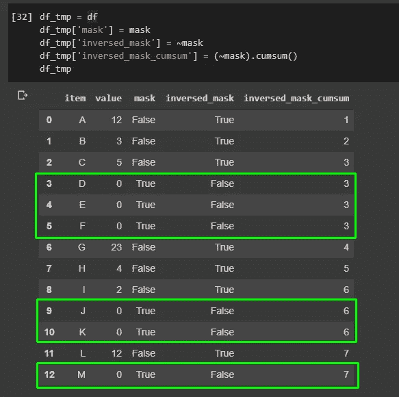
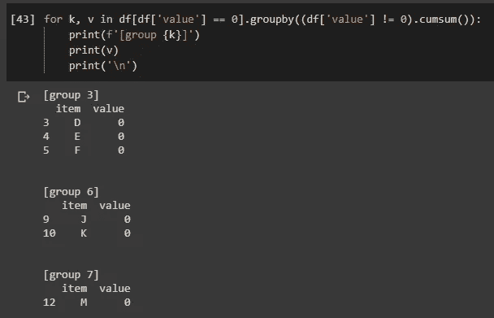

# 熊猫数据帧按连续的特定值分组

> 原文：<https://towardsdatascience.com/pandas-dataframe-group-by-consecutive-certain-values-a6ed8e5d8cc?source=collection_archive---------7----------------------->



照片由 [geralt](https://pixabay.com/users/geralt-9301/) 在 [Pixabay](https://pixabay.com/illustrations/pay-digit-number-fill-count-mass-1036469/) 上拍摄

## Python 编程技巧

## 按任意行中出现的连续特定值对数据帧进行分组

我们通常希望通过连续的值来分割熊猫数据帧。然而，在任何情况下处理连续值几乎总是不容易的，比如 SQL，Pandas 也是如此。

标准 SQL 提供了一堆窗口函数来促进这种操作，但是在 Pandas 中没有太多的窗口函数。幸运的是，Python 中有许多变通方法，有时甚至比经典的窗口函数更简单。

在本文中，我将演示如何按照任意时间出现的某些值对熊猫数据帧进行分组。

# 问题定义


由 [geralt](https://pixabay.com/users/geralt-9301/) 在 [Pixabay](https://pixabay.com/illustrations/problem-solution-help-support-3303396/) 上拍摄的照片

如果您对这个标题有些困惑，下面的示例数据会让您明白。让我们首先创建示例数据帧。

```
df = pd.DataFrame({
  'item':['A', 'B', 'C', 'D', 'E', 'F', 'G', 'H', 'I', 'J', 'K', 'L', 'M'], 
  'value':[12, 3, 5, 0, 0, 0, 23, 4, 2, 0, 0, 12, 0]
})
```



在本例中，我们希望为任意数量的连续值 0 分割数据帧。红色方块表示预计将从该原始数据帧中分离出三个数据段。

# 直觉


图片由 [geralt](https://pixabay.com/users/geralt-9301/) 在 [Pixabay](https://pixabay.com/illustrations/board-font-chalk-enlightenment-953154/) 拍摄

我们在这里尝试做的事情通常有两个:

1.  用具有`value == 0`的行过滤数据帧。
2.  如果这些行不连续，请将它们分开。换句话说，至少有一行有`value != 0`。

第一步很容易，但第二步显然不容易。在对解决方案进行编码之前，让我们先看看直观的步骤。

1.  用所有布尔值创建一个“遮罩”系列。`True`若为`value == 0`，否则为`False`。
2.  使用掩码系列过滤数据帧。所以，我们有了所有带`value == 0`的行。
3.  反转遮罩系列，因此`True`变为`False`，反之亦然。
4.  对反转的掩码系列执行累积求和。
5.  累积和数列可以用来分组，达到我们想要的。

重要的是要澄清，如果我们在 Python 中累加布尔值，`True`将被视为`1`，而`False`将被视为`0`。

我知道，可能还是会让人困惑。让我们来看看下面的数据框架，它只是为了这种直觉而创建的，并不作为解决方案的一部分。

```
# This is not part of the solution, just for demo purposes
df_tmp = df
df_tmp['mask'] = mask
df_tmp['inversed_mask'] = ~mask
df_tmp['inversed_mask_cumsum'] = (~mask).cumsum()
```



绿色矩形显示了我们期望获得的预期行组。

那么，为什么我们需要在这里对反转的掩码列执行`cumsum()`？

1.  对于任何非零值，反转的掩码将具有`True (1)`，对于任何零，反转的掩码将具有`False (0)`。
2.  当我们对这个反转的掩码列应用`cumsum()`时，连续`0`的结果将保持不变，而如果不是`0`，累积和将使值增加。

# 解决办法


[奇莫诺](https://pixabay.com/users/qimono-1962238/)在 [Pixabay](https://pixabay.com/illustrations/key-keyhole-lock-security-unlock-2114046/) 上的照片

直觉过后，你可能会觉得这并不容易。然而，当你看到解决方案时，你可能会嘲笑它是多么容易。

```
df[df['value'] == 0].groupby((df['value'] != 0).cumsum())
```

对，就是这样。

我们可以验证这些组是否正确。

```
for k, v in df[df['value'] == 0].groupby((df['value'] != 0).cumsum()):
    print(f'[group {k}]')
    print(v)
    print('\n')
```



这正是我们所期待的:)

# 摘要


照片由 [janjf93](https://pixabay.com/users/janjf93-3084263/) 在 [Pixabay](https://pixabay.com/vectors/desk-notes-notebook-album-write-2906792/) 上拍摄

事实上，我不会说熊猫提供了许多有用的窗口功能。但是，Python 中的 Pandas 是典型的不像 SQL 的“编程语言”。因此，它提供了更多的可能性，有时甚至能以更简单的方式解决问题。

[](https://medium.com/@qiuyujx/membership) [## 通过我的推荐链接加入 Medium 克里斯托弗·陶

### 作为一个媒体会员，你的会员费的一部分会给你阅读的作家，你可以完全接触到每一个故事…

medium.com](https://medium.com/@qiuyujx/membership) 

如果你觉得我的文章有帮助，请考虑加入 Medium 会员来支持我和成千上万的其他作者！(点击上面的链接)