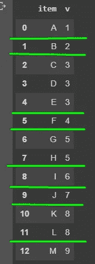
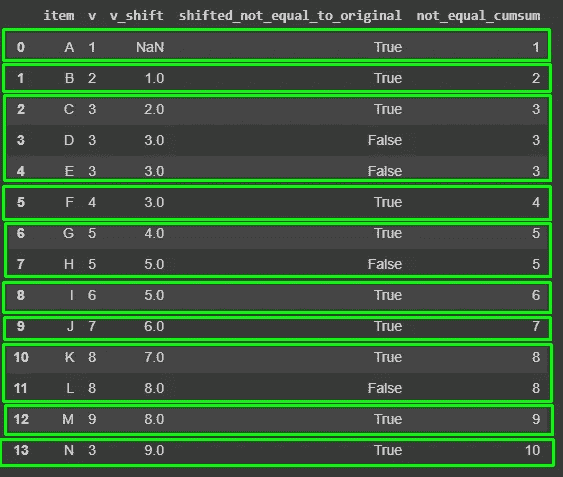

# 熊猫数据帧按连续的相同值分组

> 原文：<https://towardsdatascience.com/pandas-dataframe-group-by-consecutive-same-values-128913875dba?source=collection_archive---------8----------------------->


照片由 [MichaelGaida](https://pixabay.com/users/MichaelGaida-652234/) 在 [Pixabay](https://pixabay.com/photos/stadium-sit-auditorium-grandstand-1750794/) 上拍摄

## Python 编程技巧

## 按重复多次的连续相同值对熊猫数据帧进行分组

我们通常希望通过连续的值来分割熊猫数据帧。然而，在任何情况下处理连续值几乎总是不容易的，比如 SQL，Pandas 也是如此。此外，标准 SQL 提供了一堆窗口函数来促进这种操作，但是在 Pandas 中没有太多的窗口函数。幸运的是，Python 中有许多变通方法，有时甚至比经典的窗口函数更简单。

在本文中，我将演示如何通过重复一次或多次的连续相同值对 Pandas 数据帧进行分组。

# 问题定义


照片由[Pixabay](https://pixabay.com/users/Anemone123-2637160/)[上的](https://pixabay.com/photos/question-question-mark-survey-2736480/)银莲花 123拍摄

如果您仍然不太确定我们要解决的问题是什么，请不要担心，您将通过如下生成的示例数据了解这一点:

```
df = pd.DataFrame({
    'item':['A', 'B', 'C', 'D', 'E', 'F', 'G', 'H', 'I', 'J', 'K', 'L', 'M'], 
    'v':[1, 2, 3, 3, 3, 4, 5, 5, 6, 7, 8, 8, 9]
})
```



在截图中，绿线划分了我们预期的组。

在这个例子中，对这些值进行分组实际上非常容易。就简单`groupby('v')`。

然而，它实际上是假设值`v`必须单调递增。

如果值列不是单调递增的怎么办？

```
df = pd.DataFrame({
    'item':['A', 'B', 'C', 'D', 'E', 'F', 'G', 'H', 'I', 'J', 'K', 'L', 'M', 'N'], 
    'v':[1, 2, 3, 3, 3, 4, 5, 5, 6, 7, 8, 8, 9, 3]
})
```


在这个新示例中，我们再次添加了第 13 行，它的值为`v == 3`。如果我们单纯的`groupby('v')`，第 13 排会和 2、3、4 排放在同一个组，这不是我们想要的。

换句话说，第 13 行应该在一个单独的组中，因为它不是连续的。

# 直觉


[奇莫诺](https://pixabay.com/users/qimono-1962238/)在 [Pixabay](https://pixabay.com/photos/light-bulbs-chosen-bulb-light-1875384/) 上的照片

基本思想是创建这样一个列，它可以根据。对于连续的原始值，它必须具有相同的值，但是当原始值改变时，它必须具有不同的值。我们可以用`cumsum()`。以下是直观的步骤。

1.  创建一个新列，将原始值下移一行
2.  将移位值与原始值进行比较。如果相等，则为真，否则为假
3.  在布尔列上使用`cumsum()`,得到的列可以用于分组

这是一个仅为直观目的而创建的示例数据帧。



为什么有效？如果你关注每一组:

*   `shifted_not_equal_to_original`的第一个布尔值为`True`，其余为`False`(如果该组有多行)。因此，`cumsum()`函数将使每组的第一行与前一组的最后一行有所不同。
*   布尔值为`True` ，因为如果前一行值不同于当前行值，则移位后的值不同于原始值。另一方面，从这个连续条纹的第二行开始，它将是`False`,因为该值等于它的前一行。

# 解决办法


照片由 [rubylia](https://pixabay.com/users/rubylia-2153926/) 在 [Pixabay](https://pixabay.com/photos/hand-rubik-cube-puzzle-game-2208491/) 上拍摄

我知道直觉看起来很复杂，但是一旦你理解了这些，使用这种方法就很容易了，如下所示。

```
df.groupby((df['v'].shift() != df['v']).cumsum())
```

让我们验证这些组:

```
for k, v in df.groupby((df['v'].shift() != df['v']).cumsum()):
    print(f'[group {k}]')
    print(v)
```


非常重要的是，第 13 排与第 2、3、4 排分开分组，这正是我们所期待的。

因此，这种方法将能够对连续的值进行分组，而不管这些值后来是否重复，只要它不是连续的，就会创建另一个组。

# 摘要


由[自由照片](https://pixabay.com/users/Free-Photos-242387/)在 [Pixabay](https://pixabay.com/photos/macbook-notebook-home-office-336704/) 上拍摄的照片

事实上，我不会说熊猫提供了许多有用的窗口功能。但是，Python 中的 Pandas 是典型的不像 SQL 的“编程语言”。因此，它提供了更多的可能性，有时甚至能以更简单的方式解决问题。

[](https://medium.com/@qiuyujx/membership) [## 通过我的推荐链接加入 Medium 克里斯托弗·陶

### 作为一个媒体会员，你的会员费的一部分会给你阅读的作家，你可以完全接触到每一个故事…

medium.com](https://medium.com/@qiuyujx/membership) 

如果你觉得我的文章有帮助，请考虑加入 Medium 会员来支持我和成千上万的其他作者！(点击上面的链接)