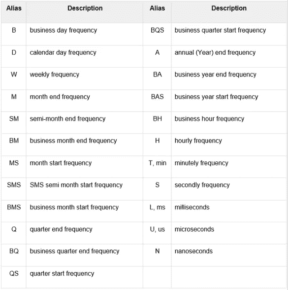
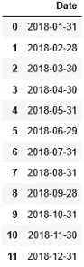

# 熊猫日期范围函数详细信息

> 原文：<https://towardsdatascience.com/pandas-date-range-function-details-fc1bd91b80a0?source=collection_archive---------56----------------------->

## 考虑不同条件生成一系列日期


来源:王思然·哈德森

时间序列数据是以固定或恒定的时间间隔收集的数据集。时间序列数据用于跟踪长期预测，观察时间相关趋势或季节性趋势。这非常有用，通常用于金融机构、零售企业、房地产和许多其他类型的企业。但是如果你有数据但是没有记录日期呢？今年需要用去年的数据生成实验报告怎么办？或者，你可能需要在本季度使用上季度的数据。有时它是研究、分析或预测所必需的。

# 生成一系列日期

幸运的是[熊猫](https://pandas.pydata.org/)有一个名为日期范围的函数来生成一系列日期或时间。我们将看到如何利用它来解决我们在工作中可能遇到的一些问题。在这里，我们将解决几个问题。

1.  先说最简单的。**以一天的频率生成一系列日期。**

```
import pandas as pd
pd.date_range(start = '1/1/2020', end='1/15/2020')#Output:
DatetimeIndex(['2020-01-01', '2020-01-02', '2020-01-03', '2020-01-04', '2020-01-05', '2020-01-06', '2020-01-07', '2020-01-08',                '2020-01-09', '2020-01-10', '2020-01-11', '2020-01-12',                '2020-01-13', '2020-01-14', '2020-01-15'],               dtype='datetime64[ns]', freq='D')
```

**2。生成一系列间隔两天的日期**

```
pd.date_range('1/1/2020', '1/15/2020', freq='2D')#Output:
DatetimeIndex(['2020-01-01', '2020-01-03', '2020-01-05', '2020-01-07', '2020-01-09', '2020-01-11', '2020-01-13', '2020-01-15'],               dtype='datetime64[ns]', freq='2D')
```

如果你注意到，我们不需要一直提到开始和结束。默认情况下，第一个日期作为开始日期，第二个日期作为结束日期。

**3。制作一个只有工作日的时间序列**

```
pd.date_range('1/1/2020', '1/15/2020', freq='B')#Output:
DatetimeIndex(['2020-01-01', '2020-01-02', '2020-01-03', '2020-01-06', '2020-01-07', '2020-01-08', '2020-01-09', '2020-01-10',                '2020-01-13', '2020-01-14', '2020-01-15'],               dtype='datetime64[ns]', freq='B')
```

在这里，“频率= 'B '表示工作日。

4.如果我们有开始日期，没有结束日期，该怎么办。在这种情况下，我们可以只输入一个句点，这意味着我们需要的日期或次数。

```
pd.date_range('1/1/2020', periods = 9, freq='B')#Output:
DatetimeIndex(['2020-01-01', '2020-01-02', '2020-01-03', '2020-01-06', '2020-01-07', '2020-01-08', '2020-01-09', '2020-01-10',                '2020-01-13'],               dtype='datetime64[ns]', freq='B')
```

**5。如果我们有一个结束日期和一个周期(或者我们需要多少个日期)，**

```
pd.date_range(end='1/1/2020', periods = 5)#Output:
DatetimeIndex(['2019-12-28', '2019-12-29', '2019-12-30', '2019-12-31', '2020-01-01'],               dtype='datetime64[ns]', freq='D')
```

如果我们不指定频率，date_range 函数将使用“freq='D '”。

6.频率不一定要以天数或工作日为单位。它可以是月、小时、分钟、秒和许多其他频率。**让我们用一个 3M 的频率。**

```
pd.date_range('1/1/2020', periods = 5, freq='3M')#Output:
DatetimeIndex(['2020-01-31', '2020-04-30', '2020-07-31', '2020-10-31', '2021-01-31'],               dtype='datetime64[ns]', freq='3M')
```

以下是所有频率的完整列表:



**7。找出每个月的业务月末日期。**

使用“BM”作为上面频率表中的频率。提供开始日期和“周期”值。

```
pd.DataFrame(pd.date_range('1/1/2018', periods=12, freq='BM'), columns=['Date'])
```



这里是 2018 年每个月的最后一个工作日。

**7。你的客户可能在不同的时区**，比如在非洲:

```
pd.date_range('1/11/2019', periods=5, tz='Africa/Abidjan', freq='3H')#Output: 
DatetimeIndex(['2019-01-11 00:00:00+00:00', '2019-01-11 03:00:00+00:00', '2019-01-11 06:00:00+00:00', '2019-01-11 09:00:00+00:00',  '2019-01-11 12:00:00+00:00'],               dtype='datetime64[ns, Africa/Abidjan]', freq='3H')
```

这里我使用的是每小时一次的频率。点击所有[时区](https://en.wikipedia.org/wiki/List_of_tz_database_time_zones)的链接。

下面是熊猫 date_range 函数的视频:

我希望它有帮助。