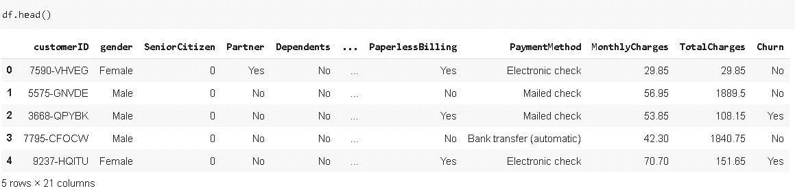
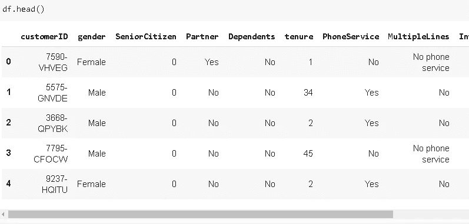
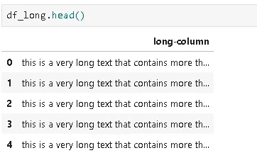
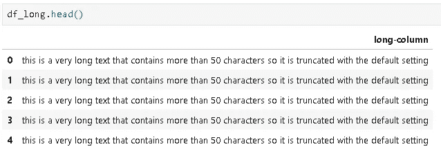
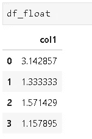
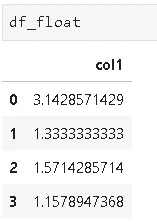

# 熊猫显示选项

> 原文：<https://towardsdatascience.com/pandas-display-options-8b77ab25d7fe?source=collection_archive---------41----------------------->

## 当默认设置不符合您的要求时


马特·派克在 [Unsplash](https://unsplash.com/s/photos/display?utm_source=unsplash&utm_medium=referral&utm_content=creditCopyText) 上的照片

Pandas 是一个非常强大的 Python 数据分析库，可以加速项目的预处理步骤。Pandas 的核心数据结构是 **DataFrame** ，它用带有标签的行和列的表格形式表示数据。Pandas 为数据帧提供了许多显示选项。默认设置在大多数情况下都适用，但您可能需要根据数据集的特征来调整它们。通过广泛的设置选项，pandas 允许创建一个定制的显示偏好。

显示选项可以用两个函数来处理:

*   get_option:显示设置的选项
*   set_option:允许改变选项

让我们导入一个示例数据帧，并通过示例来完成:

```
import pandas as pd
import numpy as npdf = pd.read_csv("/content/Telco-Customer-Churn.csv")df.shape
(7043, 21)df.head()
```



数据帧有 21 列，但只显示了 10 列。中间的用点表示。我们可以很容易地调整它，但让我们首先了解显示列的选项:

```
pd.get_option("display.max_columns")
10
```

不出所料，现在是 10 点。我们可以使用 set_option 函数和指示要显示多少列的类似语法来调整它:

```
pd.set_option("display.max_columns", 25)df.head()
```



现在所有的列都显示出来了。它们不适合屏幕，但我们可以使用底部的滚动条看到它们。

当我们拥有包含许多观察特征的宽数据框架时，此选项非常有用。

显示行也有类似的选项:

```
pd.get_option("display.max_rows")
60
```

因此，如果我们想要查看 100 行，我们可以类似地调整此设置:

```
pd.set_option("display.max_rows", 100)
```

还有一个调整列的显示宽度的选项。在某些情况下，数据集包含长字符串，这些字符串太长，无法使用默认设置显示。如果我们想查看完整的字符串，我们可以使用 **max_colwidth** 参数。让我们先来看看默认选项:

```
pd.get_option("display.max_colwidth")
50
```

因此，如果一个单元格包含的字符超过 50 个，我们就无法看到所有的字符。我创建了一个简单的数据框架来展示它在截断视图下的样子:



让我们增加宽度以查看完整的文本:

```
pd.set_option("display.max_colwidth", 150)
```



我们可能需要调整的另一个显示选项是浮点数的精度。默认值应该就可以了，但是可能会有一些极端的情况需要更高的精度:

```
pd.get_option("display.precision")
6
```



默认值为 6。让我们把它增加到 10。我们可能还想减少它，使它看起来更简单。

```
pd.set_option("display.precision", 10)
```



有更多的熊猫显示选项可以调整。我想强调一下你可能更经常需要的那些。如果你想看完整的列表，你可以随时访问[熊猫文档](https://pandas.pydata.org/pandas-docs/stable/reference/api/pandas.set_option.html)。

如果你想了解更多关于熊猫的信息，这里有一个详细的熊猫帖子列表:

*   [完整的熊猫指南](/a-complete-pandas-guide-2dc53c77a002)
*   [与熊猫的时间序列分析](/time-series-analysis-with-pandas-e6281a5fcda0)
*   [用熊猫处理缺失值](/handling-missing-values-with-pandas-b876bf6f008f)
*   [熊猫——用这些简单的技巧节省内存](/pandas-save-memory-with-these-simple-tricks-943841f8c32)
*   [重塑熊猫数据帧](/reshaping-pandas-dataframes-9812b3c1270e)
*   [熊猫串操作—解释](/pandas-string-operations-explained-fdfab7602fb4)
*   [熊猫分组——解释](/pandas-groupby-explained-453692519d0)
*   [如何和熊猫“读 _ CSV”](/how-to-read-csv-with-pandas-e91ea6016e76)

感谢您的阅读。如果您有任何反馈，请告诉我。