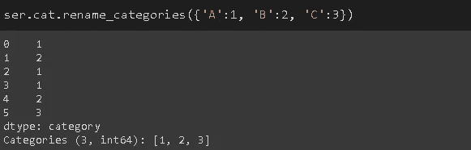

# 特定于熊猫数据类型的操作:访问器

> 原文：<https://towardsdatascience.com/pandas-dtype-specific-operations-accessors-c749bafb30a4?source=collection_archive---------32----------------------->

## 举例说明。

蒂埃拉·马洛卡在 [Unsplash](https://unsplash.com/s/photos/key?utm_source=unsplash&utm_medium=referral&utm_content=creditCopyText) 上拍摄的照片

> 注:除非另有说明，所有图片均由作者创作。

Pandas 是 Python 中一个广泛使用的数据分析和操作库。它提供了许多函数和方法来处理任何类型的数据。还有一些方法只适用于特定的数据类型。这些方法通过 4 个访问器来访问。

访问器扩展了 Pandas 的功能，并提供了特定的操作。例如，可以使用 dt 访问器从日期中提取月份。

在本帖中，我们将看到熊猫的 4 个访问器的各种操作，它们是:

*   Str:字符串数据类型
*   分类数据类型
*   Dt:日期时间、时间增量、周期数据类型
*   稀疏:稀疏数据类型

> 注意:我们将使用 Pandas 系列的示例，该系列也可以视为 DataFrame 列。

# **Str**

Str 访问器提供了处理文本数据的方法。让我们首先创建一个包含文本单词的系列。

顾名思义，Split 根据指定的字符(默认为空格)拆分数据。然后，我们使用 explode 函数将每个分离的单词作为系列中的一个新项目。

猫是分裂的反义词。它将字符串串联成一系列。

upper 和 lower 方法分别将所有字符转换为大写和小写。

大写方法只将第一个字母转换成大写。

replace 方法可用于用另一个字符串替换整个或部分字符串。

len 方法返回一系列字符串的长度。

字符串访问器允许对字符串使用索引。例如，我们可以只选择前两个字符，如下所示:

我们也可以用 isalpha 方法检查是否所有字符都是字母顺序的。

如果至少有一个非字母字符，则返回 false。

Startswith 和 endswith 方法允许检查字符串是以特定字符开始还是结束。

我们还可以计算一个字符或一组字符在一个字符串中出现的次数。

lstrip 和 rstrip 方法可用于修剪字符串。例如，我们可以去掉 c 系列末尾的数字、空格和逗号。

# **Dt**

Dt 访问器允许从日期时间数据中提取许多有用的属性。它还提供了操作方法。让我们首先创建一个简单的日期序列。

date_range 函数返回 datetimeindex。为了使用 dt 访问器，我们需要将其转换为一个序列。

我们可以通过简单地使用年、月和日属性从日期中提取年、月或日。

在某些情况下，我们可能需要日期的日历周。可以按如下方式完成:

还可以提取日期的星期几。从 0(周一)开始，一直到 6(周日)。

我们能够检查一个日期是一个月、一个季度还是一年的开始还是结束。让我们做一个例子来检查一个月的开始。季度和年度的语法类似。

# **猫**

Cat 是分类数据类型的访问器。对于分类数据，使用分类数据类型比使用对象数据类型更有效。这在内存和速度方面有很大的不同，尤其是当数据基数较低时(即，与观察值相比，类别数较低)。

让我们首先创建一个具有分类数据类型的序列。

我们可以检查类别。

也可以重命名类别。

使用类别数据类型时要记住的一件重要事情是，新值必须在现有类别中。

例如，ser 中的类别是 A、B 和 c。我们不能将一个项目更新到除这三个类别之外的类别。如果我们试图这样做，就会得到一个值错误。

为了解决这个问题，我们可以添加新的类别，即使还没有数据点属于该类别。

我们现在可以将一个数据点更新为 d 类。

# **稀疏**

Pandas 的稀疏数据结构允许高效地存储稀疏数据。谈到稀疏性，我们倾向于认为数组主要由零组成。然而，稀疏也可能是由于其他值(例如 NaN)。稀疏数据结构意味着通过省略匹配特定值(例如 0，1，NaN)的数据点来压缩对象。

让我们坚持传统的大部分是零的情况。下面的 numpy 数组包含 20 个 1 和 9980 个 0。

让我们创建两个系列。一个具有稀疏数据类型，一个具有浮点数据类型。

在内存使用方面会有巨大的差异。

内存使用量减少了 200 多倍。

稀疏数据结构的数据类型有两个元素。第一个是实际存储的元素的数据类型。第二个显示了未存储的稀疏元素。

在有序的情况下，稀疏性是由于零，所以零实际上没有被存储。

稀疏存取器提供了检查稀疏数据结构属性的方法。npoints 方法返回非 fill_value 点(实际存储的点)的数量。fill_value 点是稀疏度的值。

稀疏数组包含 20 个 1，其余值为零。

fill_value 方法显示稀疏元素，density 返回非 fill_value 点与整个数组的比率。

最后，sp_values 方法返回一个只包含非 fill_value 点的数组。

我们已经讨论了与访问器相关的方法的重要部分。当然，还有更多的方法，但我认为这些是你在数据分析过程中会经常用到的方法。他们肯定会让你的事情变得更容易。

您可以随时访问访问器官方文档的 API 来查看方法的完整列表。

感谢您的阅读。如果您有任何反馈，请告诉我。