# 熊猫相当于 10 个有用的 SQL 查询

> 原文：<https://towardsdatascience.com/pandas-equivalent-of-10-useful-sql-queries-f79428e60bd9?source=collection_archive---------0----------------------->

## …或者是面向 SQL 开发人员的熊猫


图片由[PublicDomainPictures](https://pixabay.com/ro/users/PublicDomainPictures-14/?utm_source=link-attribution&utm_medium=referral&utm_campaign=image&utm_content=214260)@[Pixabay](https://pixabay.com/ro/?utm_source=link-attribution&utm_medium=referral&utm_campaign=image&utm_content=214260)提供

如果你不知道，pandas 是一个用于数据操作和分析的 python 库。特别是，它提供了数据结构和操作来操作数字表和时间序列。这个名字来源于术语“面板数据”，这是一个计量经济学术语，指的是包含同一个人在多个时间段的观察结果的数据集。

基本上，它是 python 中处理表格的一种方式。在熊猫中，数据表被称为。

如标题所示，在本文中，我将向您展示一些最有用的 SQL 查询的 pandas 等价物。这既可以作为那些已经知道 SQL 的人对 pandas 的介绍，也可以作为您可能需要的常见 pandas 操作的备忘单。

对于下面的例子，我将使用[这个](https://www.kaggle.com/datasnaek/youtube-new#USvideos.csv)数据集，它包含了美国 YouTube 视频的趋势数据。它由 40949 行和 16 列组成:video_id、trending_date、title、channel_title、category_id、
publish_time、tags、views、likes、unless、comment_count、
thumbnail_link、comments_disabled、ratings_disabled、
video_error_or_removed、description。

```
import numpy as np
import pandas as pd# Reading the csv file into a DataFrame
df = pd.read_csv('USvideos.csv')
```

默认情况下，Pandas 操作不会修改您正在处理的数据框；它们只是返回其他数据框，您需要将这些数据框赋给一个变量，或者如果您想要保存更改，请使用参数 inplace=True。对于下面的大多数例子，我们不改变我们的原始数据框，我们只是显示返回的结果。

# 1.挑选

`SELECT col1, col2, ... FROM table`

SELECT 语句用于从表中选择数据列。

要在 pandas 中做同样的事情，我们只需在数据框上使用数组符号，并在方括号内传递一个包含您想要选择的列名的列表。

```
df[['video_id', 'title']]
```


同样的事情也可以用下面的语法来实现，这样以后翻译 WHERE 语句就更容易了:

```
df.loc[:, ['video_id', 'title']]
```

`SELECT DISTINCT col1, col2, ... FROM table`

SELECT DISTINCT 语句只返回表中唯一的行。

数据框中可能存在重复值。如果您只想获得不同的行(删除重复的行),那么调用`.drop_duplicates()`方法就很简单。根据该方法的名称判断，您可能认为它从初始数据框中移除了重复行，但它实际上是返回移除了重复行的新数据框。

```
df.loc[:, ['channel_title']].drop_duplicates()
```


`SELECT TOP number col1, col2, ... FROM table`
或
`SELECT col1, col2, ... FROM table LIMIT number`

SQL 中的 TOP 或 LIMIT 关键字用于限制从表顶部返回的行数。对于熊猫来说，用`.head(number)`方法很容易做到这一点。Pandas 也有从数据帧末尾开始显示行的`.tail(number)`方法。

```
df.loc[:, ['video_id', 'title']].head(5)
```


```
df.loc[:, ['video_id', 'title']].tail(5)
```


SQL 的 MIN()、MAX()、COUNT()、AVG()和 SUM()函数很容易翻译成 pandas:

`SELECT MIN(col) FROM table`

```
df.loc[:, ['views']].min()
```

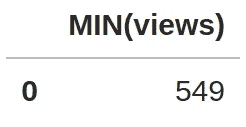

`SELECT MAX(col) FROM table`

```
df.loc[:, ['views']].max()
```

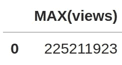

`SELECT COUNT(col) FROM table`

```
df.loc[:, ['views']].count()
```

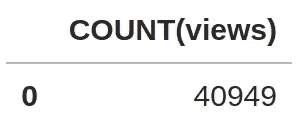

`SELECT AVG(col) FROM table`

```
df.loc[:, ['views']].mean()
```

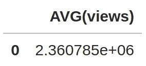

`SELECT SUM(col) FROM table`

```
df.loc[:, ['views']].sum()
```

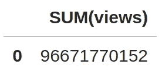

现在，如果我们想做这样的事情呢:
`SELECT MAX(likes), MIN(dislikes) FROM table`？我们需要采取更多的步骤:

```
new_df = df.loc[:, ['likes']].max().rename({'likes': 'MAX(likes)'})
new_df['MIN(dislikes)'] = df.loc[:, ['dislikes']].min().values[0]
```

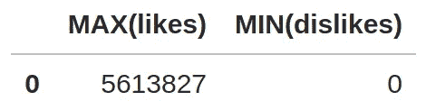

# 2.在哪里

`SELECT col1, col2, ... FROM table WHERE condition`

WHERE 子句用于仅提取满足指定条件的行。

回想一下我们到目前为止用于选择列的语法:
`df.loc[:, ['col1', 'col2']]`
在`.loc`的方括号内有两个参数；到目前为止，我们只使用了第二个选项，它用于指定您想要选择的列。猜猜第一个参数是什么？用于选择行。Pandas 数据帧期望一个行索引或布尔标志的列表，它根据这个列表提取我们需要的行。到目前为止，我们只使用了表示“返回所有行”的符号`:`。如果我们只想提取索引从 50 到 80 的行，我们可以在那个地方使用`50:80`。

为了根据某种条件提取行，我们通常会传递一个由某种(矢量化)布尔运算返回的布尔标志数组。位置为 False 的行不会包含在结果中，只会返回位置为 True 的行。

使用等式和不等式运算符 **=，<，< =，>，> =，！=** 在条件是直截了当的。例如，要仅返回赞数> = 1000000 的行，我们可以使用:

```
df.loc[df['likes'] >= 1000000, ['video_id', 'title']]
```

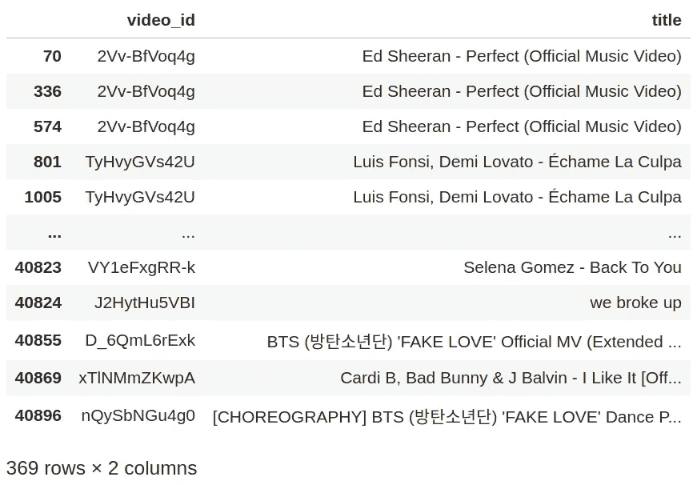

请注意，我们之所以能做上面(`df['likes'] >= 1000000`)的事情，是因为 pandas 已经覆盖了> =操作符的默认行为，因此它将操作符应用于元素，并返回我们需要的形状(行数)的布尔数组。
但是操作符 **and，or，not** 不是这样工作的。所以，我们就用 **&** 代替**， **|** 代替**或**， **~** 代替**而不是**。**

```
df.loc[(df['likes'] >= 1000000) & (df['dislikes'] <= 5000), ['video_id', 'title']].drop_duplicates()
```

**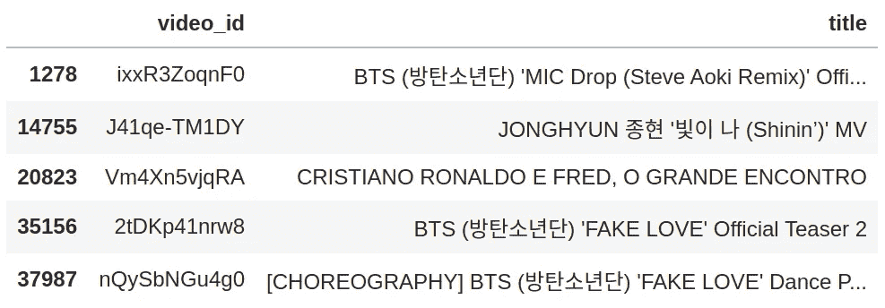**

**`SELECT col1, col2, ... FROM table WHERE colN IS NOT NULL`**

**在 SQL 中，您可以使用`IS NULL`或`IS NOT NULL`来获取包含/不包含空值的行。**

**如何检查熊猫中的空值？我们将使用熊猫包中的`isnull(array-like)`功能来实现。注意这不是数据框对象的方法，不要用`df.isnull(...)`；而是做`pd.isnull(df['column'])`。所以要小心。**

**下面的示例返回 description 不为 null 的所有行。**

****

**`SELECT col1, col2, ... FROM table WHERE colN LIKE pattern`**

**LIKE 关键字可以在 WHERE 子句中用来测试列是否匹配某个模式。**

**在 pandas 中，我们可以使用 python 的本地 **re** 正则表达式模块来完成同样的事情，甚至更多，因为 python 的 re 模块允许测试一组更丰富的模式，而不是 SQL 之类的。**

**我们将创建一个函数`like(x, pattern)`，其中 x 是一个类似数组的对象，pattern 是一个包含我们想要测试的模式的字符串。这个函数首先将模式编译成一个正则表达式对象，然后我们可以使用`.fullmatch(val)`方法根据我们的模式测试`val`的值。为了对 x 向量中的每个元素进行测试，我们将使用 numpy 的`vectorize(func)`函数为正则表达式匹配操作创建一个向量等价物。最后，我们将这个矢量化函数应用到我们的 x 输入向量。然后我们需要做的就是在`.loc[]`中传递`like(df['column'], pattern)`作为第一个参数。**

```
import redef like(x, pattern):
    r = re.compile(pattern)
    vlike = np.vectorize(lambda val: bool(r.fullmatch(val)))
    return vlike(x)
```

**例如，下面的代码返回所有描述中包含单词“math”的视频。**

```
df_notnull = df.loc[~pd.isnull(df['description']), :]
df_notnull.loc[like(df_notnull['description'], '.* math .*'), ['video_id', 'title']].drop_duplicates()
```

**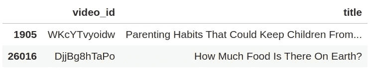**

# **3.以...排序**

**`SELECT col1, col2, ... FROM table ORDER BY col1, col2 ASC|DESC`**

**这个 SQL 关键字用于按升序或降序对结果进行排序。**

**将它翻译成 pandas 很简单，只需在数据帧上调用`.sort_values(by=['col1', ...], ascending=True/False)`方法。**

```
df.loc[df['likes'] >= 2000000, ['video_id', 'title'] ].sort_values(by=['title'], ascending=True).drop_duplicates()
```

****

# **4.分组依据**

**`SELECT col1, col2, ... FROM table GROUP BY colN`**

**GROUP BY 语句对特定列中具有相同值的行进行分组。它通常与聚合函数(最小值、最大值、计数、总和、AVG)一起使用。**

**在 pandas 中，简单到调用`.groupby(['col1', ...])`方法，然后调用`.min()`、`.max()`、`.count()`、`.sum`、`.mean()`方法之一。**

```
df.loc[:, ['channel_title', 'views', 'likes', 'dislikes'] ].groupby(['channel_title']).sum()
```

**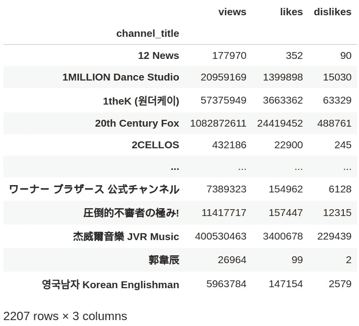**

# **5.拥有**

**`SELECT col1, col2, ... FROM table GROUP BY colN HAVING condition`**

**HAVING 关键字用于根据组级别的条件过滤结果。**

**在熊猫中，我们有`.filter(func)`方法，可以在`groupby()`调用之后调用。我们需要向该方法传递一个函数，该函数将一个组的数据帧作为参数，并返回一个布尔值，该值决定该组是否包含在结果中。
但是如果我们想在 pandas 中一次做更多的事情，例如，在列上应用聚合函数，并基于组级别的条件过滤结果，我们需要在更多的步骤中这样做。而在 SQL 中，我们只需要一个查询就可以做到。**

**在下面的例子中，我们希望按 *channel_title* 分组，只允许表中至少有 100 个视频的频道，并对*的浏览量*、*喜欢*、*不喜欢*应用平均函数。**

**在 SQL 中，这将是:**

```
**SELECT** channel_title, AVG(views), AVG(likes), AVG(dislikes)
**FROM** videos_table
**GROUP** **BY** channel_title
**HAVING** **COUNT**(video_id) **>=** 100;
```

**在熊猫身上:**

```
g = df.groupby(['channel_title'])
g = g.filter(lambda x: x['video_id'].count() > 100)
g = g.loc[:, ['channel_title', 'views', 'likes', 'dislikes']]
g = g.groupby(['channel_title']).mean()
```

**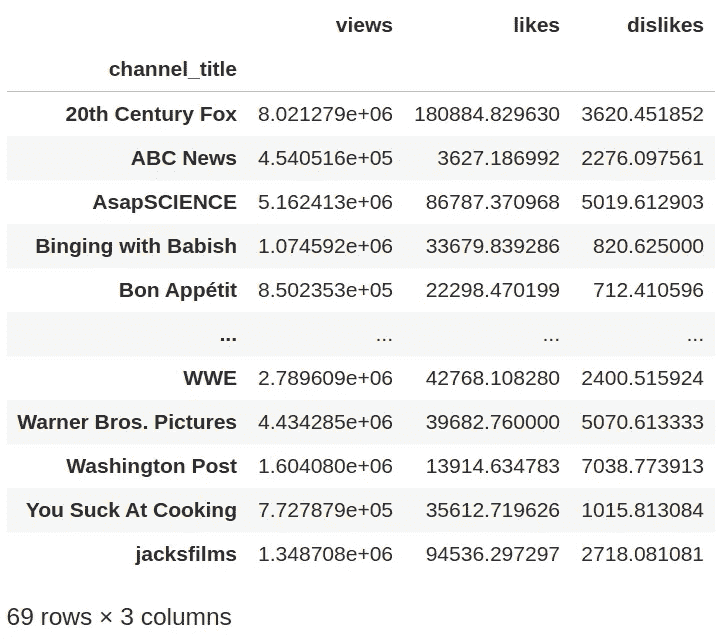**

# **6.插入**

**`INSERT INTO table (column1, column2, ...) VALUES (value1, value2, ...)`**

**这个 SQL 语句用于在表中插入新行。**

**在 pandas 中，我们可以使用`.append()`方法在现有数据帧的末尾添加一个新的数据帧。我们将使用`ignore_index=True`从旧数据帧的最后一行开始继续索引。**

```
new_row = pd.DataFrame({'video_id': ['EkZGBdY0vlg'],
                        'channel_title': ['Professor Leonard'],
                        'title': ['Calculus 3 Lecture 13.3: Partial Derivatives']})
df = df.append(new_row, ignore_index=True)
```

**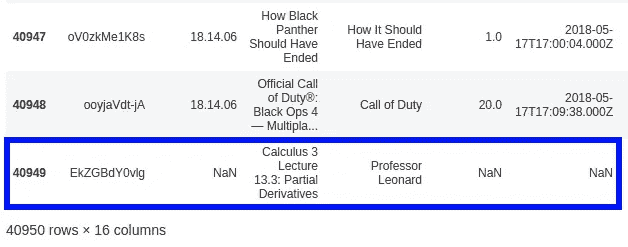**

# **7.删除**

**`DELETE FROM table WHERE condition`**

**DELETE 语句用于根据某种条件从表中删除现有的行。**

**在 pandas 中，我们可以使用`.drop()`方法删除我们传入索引的行。与其他方法不同，这个方法不接受布尔数组作为输入。因此，我们必须将条件的输出转换为索引。我们可以通过`np.where()`功能来实现。**

**在下面的例子中，我们删除了所有包含 *channel_title！= '3Blue1Brown'* 。**

```
df = df.drop(np.where(df['channel_title'] != '3Blue1Brown')[0])
```

**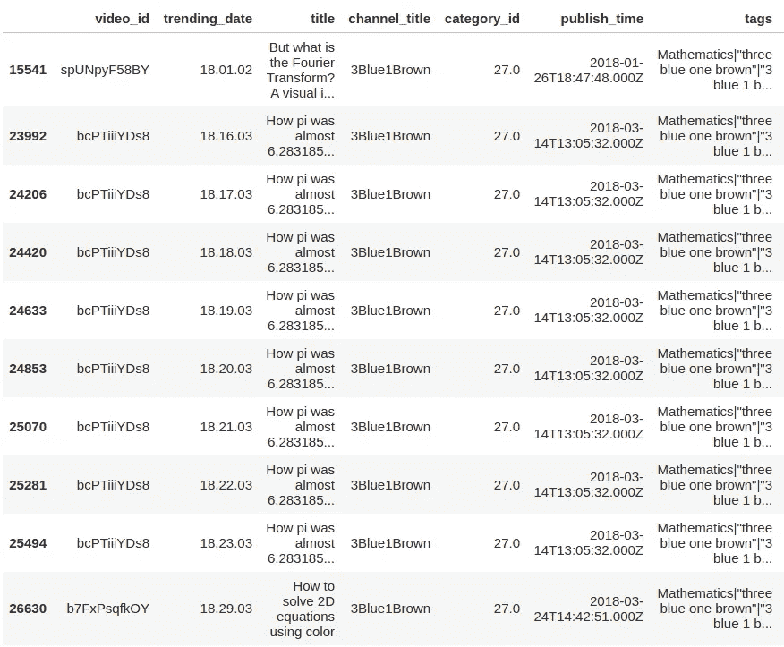**

# **8.改变**

**`ALTER TABLE table ADD column`**

**此 SQL 语句添加新列。**

**在熊猫身上，我们可以这样做:`df['new_column'] = array-like`。**

**下面我们添加一个新列‘like _ ratio’:**

```
df['like_ratio'] = df['likes'] / (df['likes'] + df['dislikes'])
```

**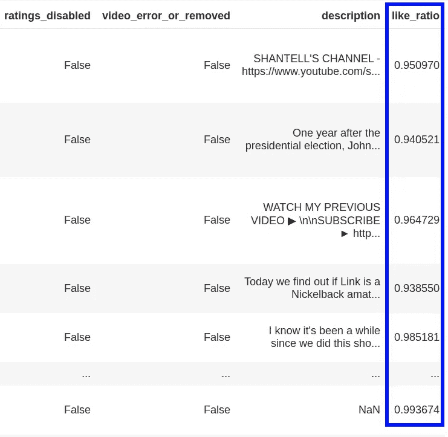**

**`ALTER TABLE table DROP COLUMN column`**

**此 SQL 语句删除一列。**

**`del df['column']`我们在熊猫身上就是这么做的。**

**例如，删除“comments_disabled”列将是:**

```
del df['comments_disabled']
```

# **9.更新**

```
**UPDATE** table_name
**SET** column1 **=** value1, column2 **=** value2, ...
**WHERE** condition;
```

**UPDATE 语句用于根据某些条件改变表中的值。**

**为了在 python 中做到这一点，我们可以使用 numpy 的`where()`函数。当我们用这个函数将一个布尔数组转换成索引数组时，我们在上面几行也看到了这个函数。这就是这个函数在只有一个参数的情况下所做的事情。这个函数可以接收 3 个相同大小的数组作为参数，第一个是布尔数组。让我们称它们为 c，x，y。它返回一个相同大小的数组，其中填充了以这种方式选择的来自 x 和 y 的元素:如果 c[i]为真，则选择 x[i]否则选择 y[i]。
要修改一个数据框列我们可以这样做:**

```
df['column'] = np.where(condition, new_values, df['column'])
```

**在下面的例子中，我们将赞数增加 100，其中 channel_title == 'Veritasium '。**

**这是之前的数据:**

```
df.loc[df['channel_title'] == 'Veritasium', ['title', 'likes']]
```

**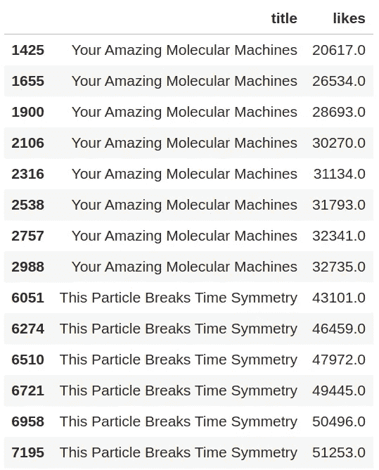**

**将 Veritasium 频道的赞数增加 100:**

```
df['likes'] = np.where(df['channel_title'] == 'Veritasium', df['likes']+100, df['likes'])
```

**运行上述查询后:**

**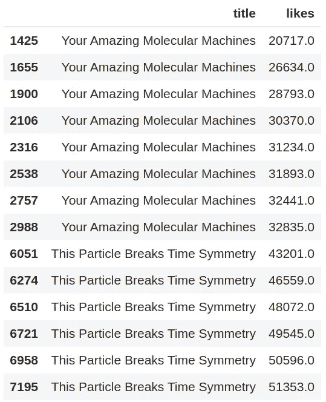**

# **10.加入**

**JOIN 子句用于根据两个或多个表之间的相关列来组合它们中的行。**

**为了展示连接的例子，我至少需要两个表，所以我将把目前使用的数据框分成两个更小的表。**

```
df_titles = df.loc[:, ['video_id', 'title']].drop_duplicates()
```

**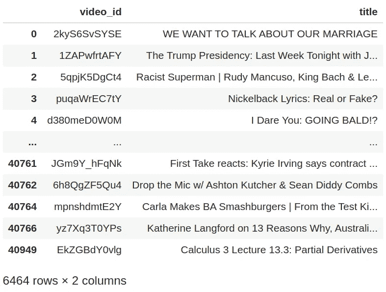**

```
df_stats = df.loc[:, ['video_id', 'views', 'likes', 'dislikes'] ].groupby('video_id').max()
# transform video_id from index to column
df_stats = df_stats.reset_index()
```

**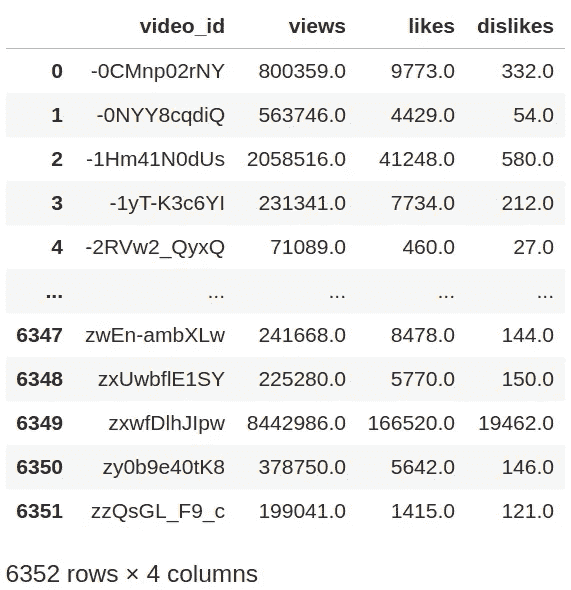**

**在 pandas 中进行连接很简单:数据帧有一个`.join()`方法，我们可以这样使用:
`df1.join(df2.set_index('key_column'), on='key_column')`**

**还有更多类型的联接:内部联接、完全联接、左联接和右联接。**

*   **内部联接:返回在两个表中都有匹配值的行**
*   **完全(外部)联接:返回在任一表中具有匹配值的行**
*   **LEFT JOIN:返回左侧表中的所有行，以及右侧表中匹配的行**
*   **右连接:返回右表中的所有行，以及左表中匹配的行**

**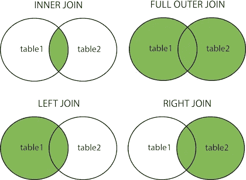**

**图片来自 [w3schools](https://www.w3schools.com/sql/sql_join.asp)**

**要在 pandas 中指定您想要的连接类型，您可以使用`.join()`方法中的 **how** 参数。此参数可以是以下之一:“内部”、“外部”、“左侧”、“右侧”。**

**下面是“video_id”列上两个数据帧的内部连接示例。其他类型的连接以相同的方式完成，只需相应地更改“how”参数。**

**SQL 中的内部联接:**

```
**SELECT** *
**FROM** df_titles
**INNER** **JOIN** df_stats
**ON** df_titles.video_id **=** df_stats.video_id;
```

**熊猫的内心世界:**

```
df_titles.join(df_stats.set_index('video_id'), on='video_id', how='inner')
```

**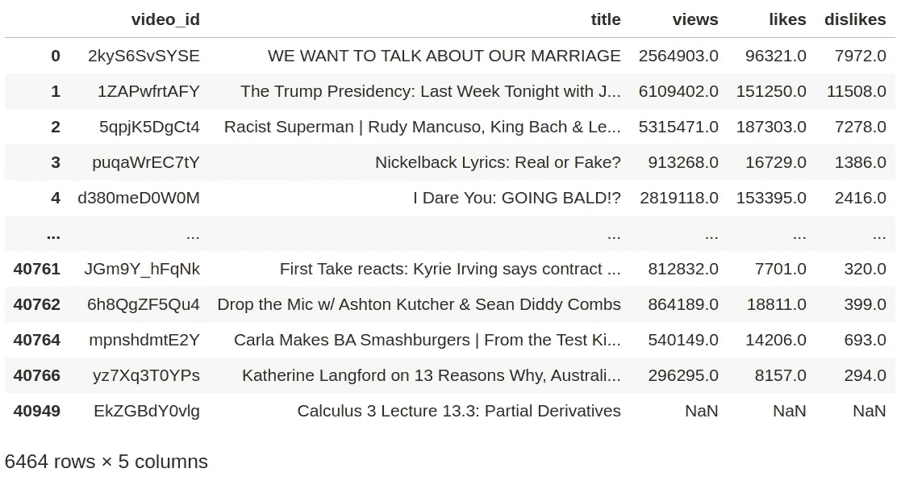**

**这篇文章的笔记本可以在[这里](https://www.kaggle.com/dorianlazar/pandas-equivalent-of-10-useful-sql-queries)找到。**

**我希望这些信息对你有用，感谢你的阅读！**

**这篇文章也贴在我自己的网站[这里](https://www.nablasquared.com/pandas-equivalent-of-10-useful-sql-queries/)。随便看看吧！**