# 生物学家的熊猫

> 原文：<https://towardsdatascience.com/pandas-for-biologists-f01c8a548b7c?source=collection_archive---------29----------------------->

## ***为什么生命科学家要学习如何编码以及从哪里开始***

照片由[émile Perron](https://unsplash.com/@emilep?utm_source=medium&utm_medium=referral)在 [Unsplash](https://unsplash.com?utm_source=medium&utm_medium=referral) 拍摄

## 赶上那班火车！

学习如何编码对许多生命科学家来说仍然是令人生畏的。研究生和博士后普遍感到，他们的背景教育没有让他们为挑战做好准备。学习新的计算技能的时间似乎已经过去了。*“他们误了火车”。*

事实是，从零开始学习如何编码是非常耗时的，对于我们大多数在高度竞争的环境中工作的人来说，在生产和发布我们的工作的无尽压力下，这可能感觉像是我们在给定时间内进行的智力努力的一个弯路。我们有很多事要做。我们总是有很多事情要做。然而，大多数人没有理解的是，研究人员没有必要成为尖端的程序员，拥有构建网络内容或移动应用的敏锐能力。边际水平的编码技能将使大多数科学家有能力自动化重复的任务，操纵数据和图像，并增加他们在分享和展示他们的工作时的资源。此外，越来越明显的是，在不久的将来，仅使用电子表格和标准软件来跟踪和操作信息将变得不切实际。缺乏理解基本代码和编写自己定制的脚本来分析和优化实验的能力的科学家将很难跟上步伐。今天看来具有挑战性的妥协，从长远来看肯定会有回报。花在笔记本电脑上的时间可能比许多实验更有价值。编程专业知识将使我们成为更好的科学家，我们研究问题的答案将更快更有效地到来。

也许你错过了一班火车，但还有许多其他的火车要赶。这篇短文是我试图在下一篇文章中给你一点启发。

## **边做边学&熊猫**

你可能还没注意到，我不是数据科学家。事实上，我是那种'*经典'*的实验生物化学家，在整个大学期间从未写过一行代码。学习如何编程的动力来自于我已经读了一半博士学位的时候。随着我的数据越积越多，我发现自己花了几个小时重复相同的分析协议，要么优化参数，要么用新数据填充我的模型。我意识到，标准软件和电子表格是一个脆弱的东西。因此，我决定投身到编程世界中去，以获得能让我自动完成工作中枯燥部分的技能。这让我接触到了 **Python、**，这是我目前博士旅程中的一个游戏改变者。我在任何类型的数据和图像分析方面都变得更加省时，从我的同龄人中脱颖而出，并增加了我在各种数据驱动领域的职业前景。

最初，我的主要斗争是认识到我所学的东西的价值。我花了很多空闲时间，却很少应用那些*【知识】*。学习曲线似乎非常陡峭，感觉我可以用一个简单的 Excel 表完成所有这些任务。你知道那种感觉，对吧？在线平台通常依赖概念练习，对生命科学家没有明显的应用，并提供过多的指导和许多指令。当您决定从头开始编写自己的代码时，您会发现自己正看着一张空白页，不知道如何开始。两件事让我克服了这些困难，更快地跳到了那个学习曲线的上部: ***边做边学*** 和**熊猫，**一个强大的 **Python** 的数据科学库。

*本质上是指一种更具实践性的方法。阅读代码不是编码。您需要迈出这一步，开始在您的机器上编写代码。我试图用 Python 再现我在 Excel 或 OriginLab 中可以做的事情，例如，处理数据、绘图、应用统计测试以及将数学模型与我的实验数据相匹配。我不得不花费大量的时间调试和查看他人的代码来理解和修复我的错误，但最终，这是对我来说最有成效的策略:弄清楚如何让一些有意义的东西工作，调用非常支持的 python 社区(google 是你的朋友！)，调查错误消息以修复我的问题，并在此过程中学习。*

*有许多语言，但 Python 对我来说是理想的——开源，非常直观，并拥有针对常见科学问题的大量科学库。**熊猫**只是让 **Python** 更加出色！ **Pandas** 可以说是 Python 中最重要的数据科学库，也是说服非程序员深入研究编码的一个很好的工具。熊猫依赖于一种叫做`DataFrame`的数据结构。这类似于一个 Excel 电子表格，包括各种内置函数，用很少的编程知识就可以操作和分析数据。*

## ***开始使用 Anaconda***

*如果你认为自己是一个'*琼恩·雪诺'*谈到代码(*你一无所知！开头可能会引起愤怒。你需要与命令行交互，在黑色的屏幕上写下抽象的文字，只是为了下载软件和软件包，很快你就会感觉自己迷失在*矩阵*中。然而，Python 通过 [**Anaconda**](https://www.anaconda.com/products/individual) 提供了一种替代初始压力的方法(至少目前如此)。Anaconda 发行版像其他软件一样工作:从网页下载并安装。Anaconda 不仅包括 python 的最新版本，还包括许多用于数据科学的标准库，否则必须从命令行手动安装。这些包包括用于许多科学计算任务的`numpy`和`scipy`，以及 Python 中最常用的可视化库`matplotlib`。事实上，熊猫是建立在`numpy`之上的，与`scipy`和`matplotlib`配合得非常好。Anaconda 附带了其他开源平台，包括 *R studio、*和两个用于 python 的 ide([集成开发环境](https://en.wikipedia.org/wiki/Integrated_development_environment))(**spyder**和 **jupyther** )。ide 基本上是编写和编译代码的编辑器。有很多，这可能是另一个混乱的来源。然而，jupyter 通常是生命科学家的一个很好的起点。它们比许多其他 ide 更简单，并提供了一种笔记本式的风格，用户可以同时拥有代码、情节和笔记。**

*下面，我用一个 **jupyter 笔记本**对**熊猫**做了一个简短而温和的介绍。如果您的机器上安装了 anaconda，那么您已经准备好跟随它了。本指南使用了一个公众熟知的乳腺[癌症诊断数据集](https://archive.ics.uci.edu/ml/datasets/Breast+Cancer+Wisconsin+%28Diagnostic%29)。我的目标是说明你可以用有限的编程技能做多少关于熊猫的事情，也许会激励你从这里开始学习更多。在[介质](https://medium.com/)上处理代码的灵活性非常有限，所以我分享一个 [github 链接](https://github.com/paulocaldas/how-to-python/tree/master/pandas_for_biologists_medium)，其中包含一个 jupyter 笔记本，上面有我在这里展示的所有例子。我们可以开始了吗？*

***读取&操纵数据***

*每一个 python 脚本都以几个`import`命令开始，用户在这里设置他们想要使用的库/包，除了那些已经默认包含在 *raw* 语言中的库/包。你可以把它们想象成包含不同功能和参数的文件夹。按照惯例，我们`import`将它们打包，并用它们名字的较短版本来表达，以避免在文档中写太多的单词。例如，我们使用`import pandas as pd`，这样我们就不必每次想使用库时都写`pandas`，只需写`pd`。同样适用于`np`和`plt`而不是它们的全名。*

*下面的脚本显示了如何使用`pandas`中的`pd.read_csv`函数加载数据集。该功能直接从您机器上的文件夹中读取`.txt`或`.csv`文件，并以一种让您想起典型电子表格的格式显示数据。我们将函数的输出归属于一个变量(`breast_cancer_data`)，以便在脚本中使用它。*

*如何用熊猫读取文件*

*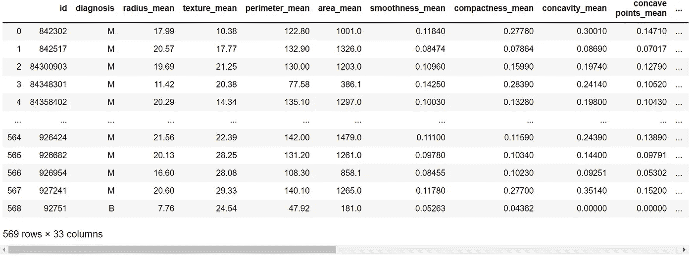*

*乳腺癌诊断数据集([来源](https://archive.ics.uci.edu/ml/datasets/Breast+Cancer+Wisconsin+%28Diagnostic%29))*

*我们的数据集包含 569 个样本(患者)、分类数据(诊断结果)和数值数据(与肿瘤形状和大小相关的 31 个属性，以及每个患者的 id)。我们现在已经准备好按照我们的意愿开始探索和操作数据。下面的脚本展示了几个简单操作的例子，只需一行代码就可以实现。*

*熊猫的基本操作*

*注意，这里我们只是检查给定函数的输出，而不是永久地改变数据。为了做到这一点，我们需要为每个操作的输出添加一个新的变量。或者，我们也可以使用参数`inplace = True`，它告诉`pandas`我们想要直接在原始表上实现动作。为了总结第一部分，我们可以使用上面的一些函数创建数据的子集，用于下一部分，我们称之为`breast_cancer_data_subset`。*

*创建新表:breast_cancer_data_subset*

*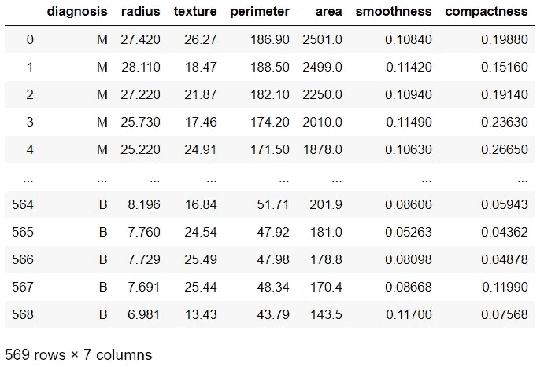*

*乳腺癌数据子集*

***基本操作***

*当您开始探索大型数据集时，`pandas`中的两个有用工具是`pd.describe()`函数和`pd.corr()`函数，前者返回所有数字列的汇总统计数据，后者返回数据框中所有列之间的相关性。下面你可以分别看到它们的样子。*

**

*乳腺癌数据子集描述()输出*

*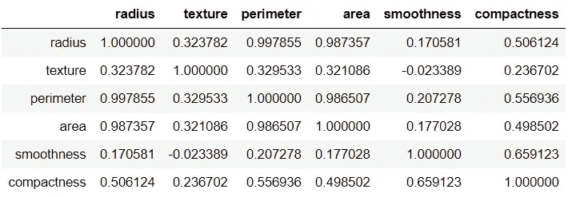*

*乳腺癌数据子集 corr()输出*

*请注意，仅用两行简单的代码就可以从数据中检索出多少信息！这些函数只使用包含数字数据的列，因此没有显示诊断列。可以按照类似的模式应用其他简单的操作。这里还有几个例子。*

*总的来说，排序，计数，切片和基本的数学运算可以毫不费力地应用。所有函数通常都包含可选参数，这些参数可以让我们对它们的输出进行更多的控制。关于每个参数作用的详细信息可在`pandas`文档中找到。*

***可视化数据***

*我们上面所做的所有操作都是可能的，因为`pandas`是建立在科学计算的基础包`numpy`之上的。同样，`pandas`也整合了部分`matplotlib`库来创建快速的数据可视化。为此，我们使用`plot()`函数，并将变量(`x`和`y`)和绘图类型(`kind`)设置为该函数的参数。*

*和熊猫一起策划*

*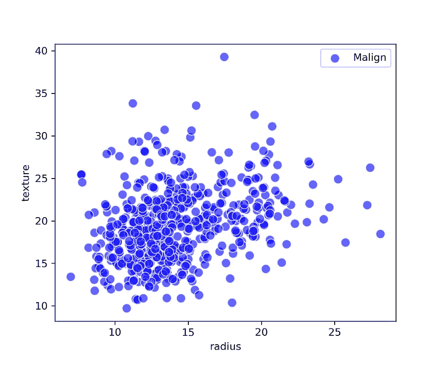**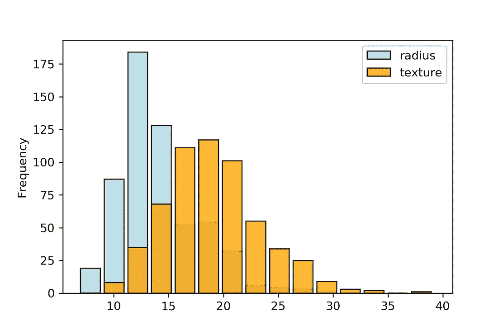*

*散点图:纹理与半径*

*就我个人而言，我宁愿直接使用`matplotlib`库来绘制数据，在那里我对颜色、轴、大小和形状有更多的控制。然而，为了讨论的缘故，我将坚持用`pandas`向你展示这些情节已经可以有多么丰富的信息和视觉吸引力。实际上，有另一个基于`matplotlib`的数据可视化库叫做`seaborn`，它与`pandas.`配合得非常好。这是本文主要目标的一个小弯路，但是`seaborn`是一个非常棒的相关性可视化工具，比单独使用`matplotlib`来创建盒状图要好，并且对初学者来说非常用户友好。这里有一个例子。*

*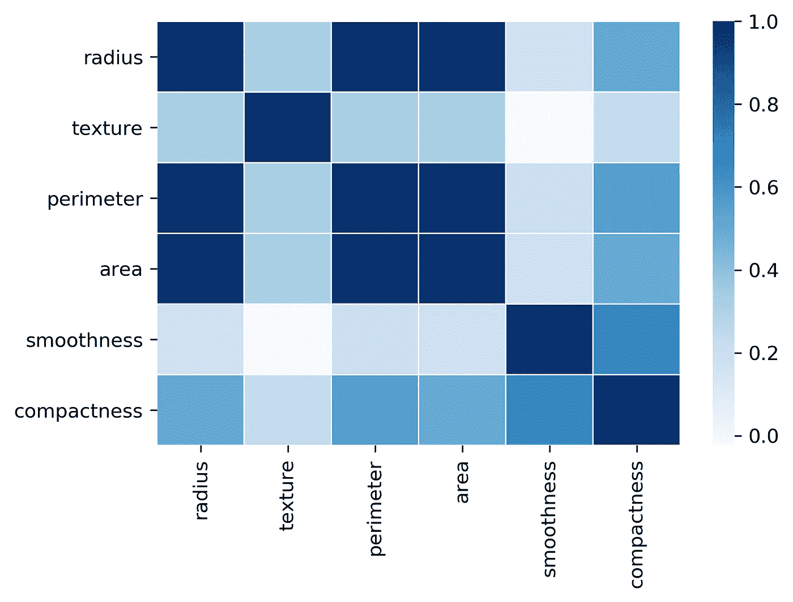*

*相关矩阵的 seaborn 热图*

*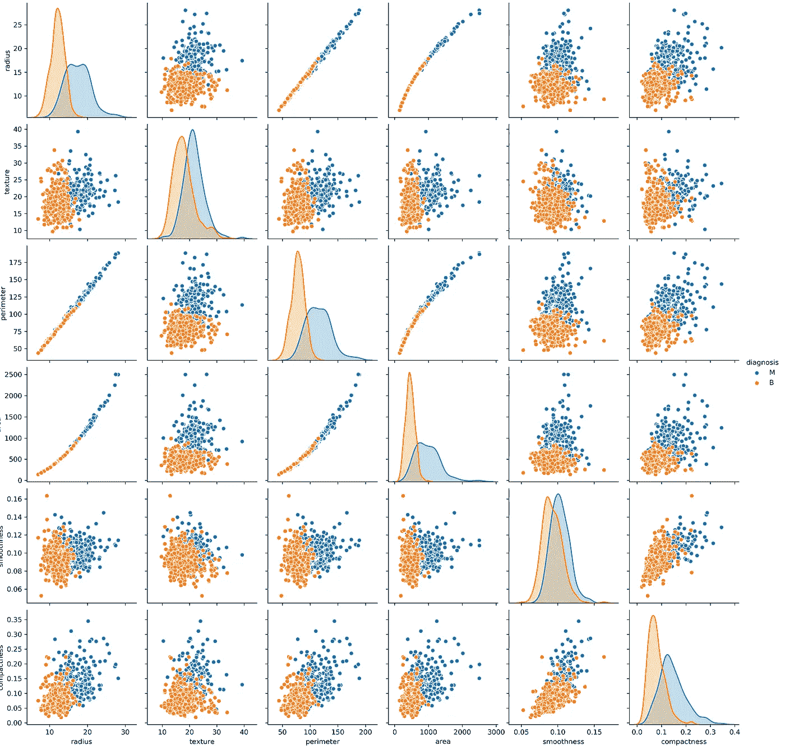*

*seaborn pairplot 函数。诊断结果用于将数据分成两组*

*从这些例子中可以看出，`seaborn`非常有助于初步了解多个变量之间的相关性。此外，它还提供了一种使用`sns.boxplot`功能直接从数据框绘制箱线图的简单方法。下面的代码片段展示了如何操作。*

*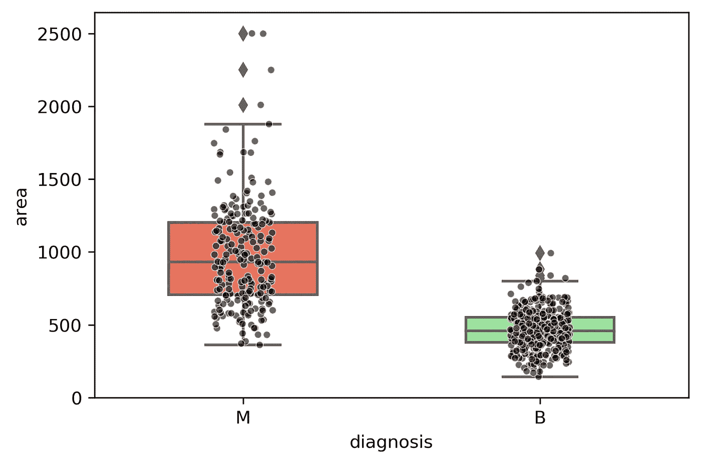*

*seaborn 箱线图诊断与面积*

*通过结合`pandas`和`seaborn`可以做更多的事情，但是这只是一个展示，即使知道*太少*也可以做多少事情。*

## *过滤和分组*

*最后，让我介绍两种方便的技术:使用简单条件参数的数据过滤和`groupby`函数，可以说是`pandas`提供的最好工具之一。条件遵循一个简单的模式，我们定义我们想要应用于一列或一行的条件(例如`>`、`<`或`==`)，我们以调用列的相同方式传递该条件。可以使用符号`|`(*或*)和`&` ( *和*)组合多个条件。这里有一些例子。*

*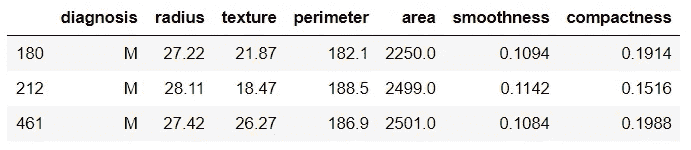*

*输出:肿瘤面积和周长分别大于 1000 和 180 的患者*

*最后，`groupby`函数根据给定列中的分类或数字标签将数据分组。然后，数学运算可以分别应用于这些组中的每一组。在我们的示例中，诊断列中的两个标签(B 或 M)可用于此目的，使我们能够研究每个类别(良性和恶性肿瘤)中的数据有何不同。*

*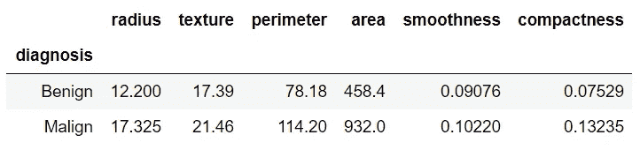*

*breast _ cancer _ data _ subset . group by('诊断')。中位数()*

*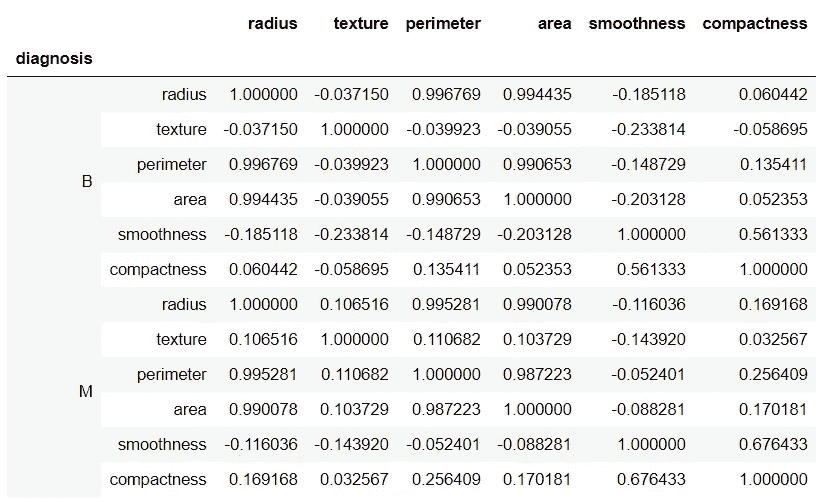*

*breast _ cancer _ data _ subset . group by('诊断')。更正()*

*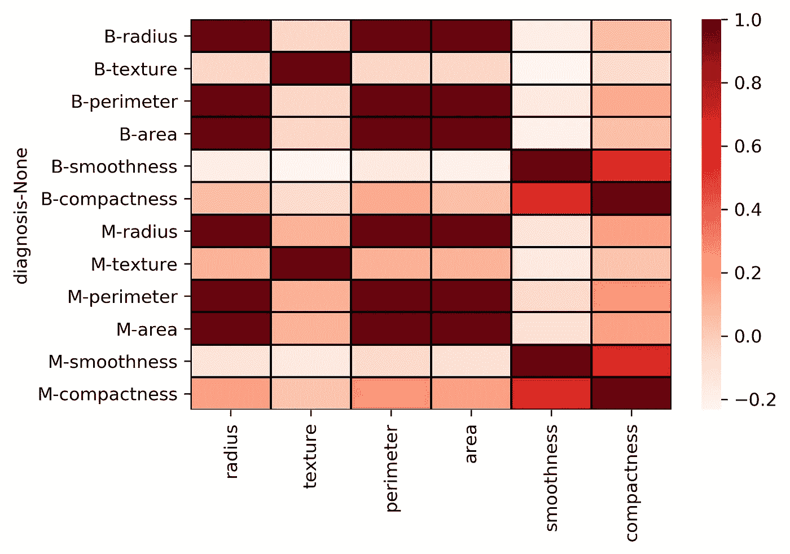*

*两组相关矩阵的 seaborn 热图*

*通过简单地应用`groupby`函数，我们可以快速比较数据中不同的基础人群，并调查特征之间的差异是否具有统计相关性。我发现这个功能非常有用，我可以围绕它再写一篇文章。也许在后续的帖子里。*

## ***包装***

*这只是你可以用`pandas`结合`matplotlib`和`seaborn`做的事情的冰山一角。也许这篇文章可以激励你去拿一个你自己的数据集并开始实验。从这里，您可以很快推断出其他库，如`scipy`，它可以用来将数学模型与数据相匹配，并应用统计测试。*

*当然，这篇短文并没有为您提供 python 语言的所有构件。最终，你将不得不更深入地学习不同的数据类型(字符串、列表、数组和字典)以及类似循环的*或列表理解的*。*然而，通过用这种语言构建一些有意义的东西，而不仅仅是在线解决随机的任务，可能会给你一些额外的动力，让你继续前进，并在前进的道路上找到所有的东西。学习如何编程是一项真正的赋权技能，不仅可以提升你的职业前景，还可以平稳地导航这个技术时代。**