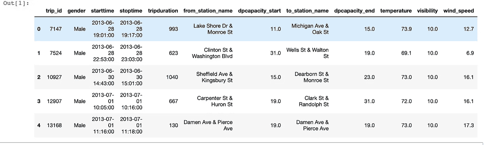
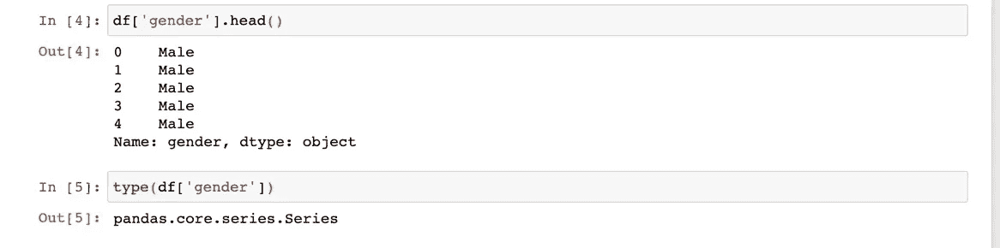
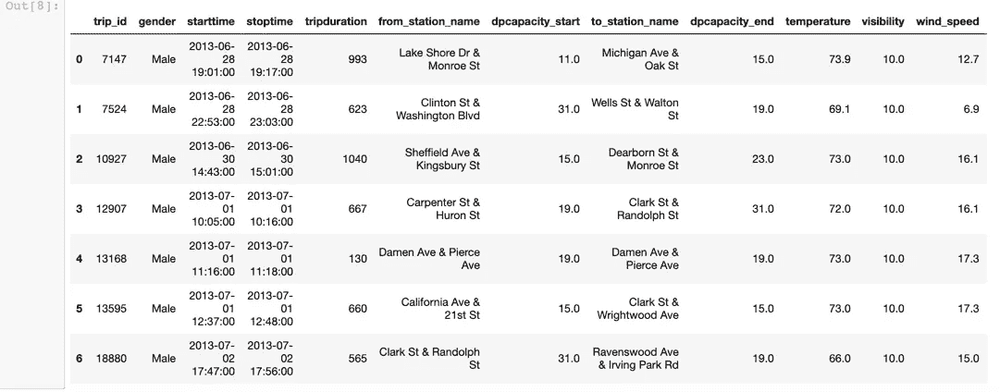
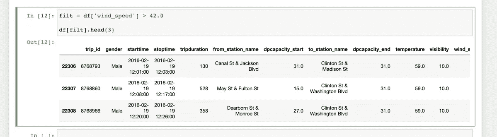
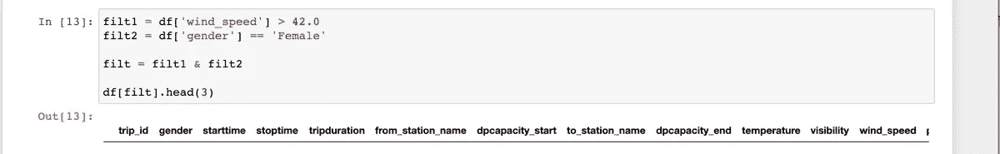
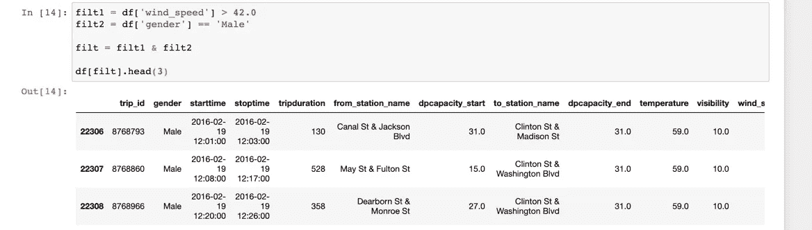
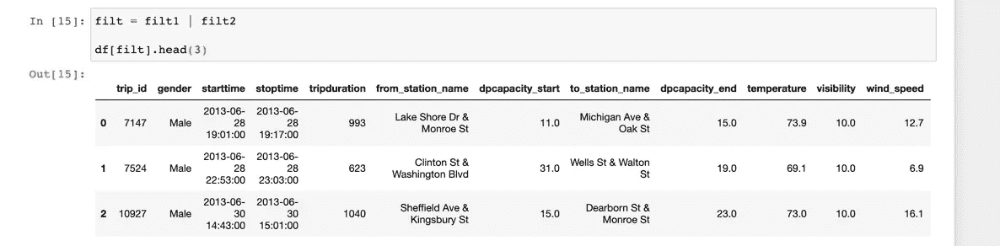
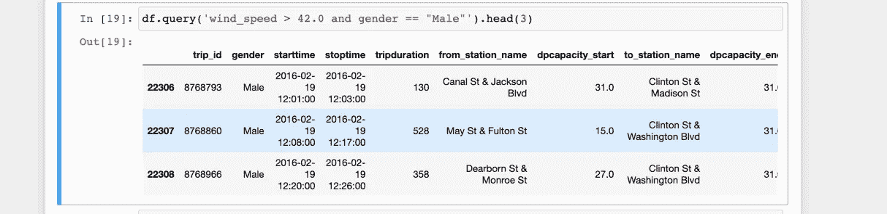

# 熊猫给新手:介绍第一部分

> 原文：<https://towardsdatascience.com/pandas-for-newbies-an-introduction-part-i-8246f14efcca?source=collection_archive---------37----------------------->


当谈到熊猫和蟒蛇时，我们都从同一个地方开始。照片由 Pexels 的 Victoria Borodinova 拍摄

对于那些刚刚开始学习数据科学的人来说，Python 编程语言是学习数据科学的先决条件，所以如果你不熟悉 Python，请熟悉一下，然后回到这里开始学习 Pandas。

你可以从我刚刚开始的一系列文章开始学习 Python，这些文章叫做[数据科学所需的最小 Python](https://medium.com/@sammylee_30865/minimal-python-required-for-data-science-part-i-b61e2baf56f9?source=friends_link&sk=d0a1c226244327b092bf208d4ed3d728)。

谈到数据科学，工具箱中最重要的工具之一是 pandas，这是 Wes McKinney 在对冲基金任职期间开发的 Python 数据分析库。

在这整个系列的文章中，我们将使用 [Anaconda](https://www.anaconda.com/) ，它是一个面向数据科学和机器学习的奇特的 Python 包管理器。如果您不熟悉我刚刚谈到的内容，请继续观看这个视频，它将向您介绍 Anaconda 和 Jupyter Notebook，这是数据科学工作的核心。

您可以通过以下方式激活 conda 环境([虚拟环境](https://www.youtube.com/watch?v=N5vscPTWKOk)):

```
$ conda activate [name of environment]# my environment is named `datascience` so$ conda activate datascience
```

激活 conda 虚拟环境后，您应该会在终端上看到:

```
(datascience)$
```

假设您的系统上安装了 [miniconda](https://docs.conda.io/en/latest/miniconda.html) 或 anaconda，您可以很容易地安装 pandas:

```
$ conda install pandas
```

我们还将使用 Jupyter Notebook 来编写代码，请继续

```
$ conda install -c conda-forge notebook
```

启动 Jupyter 笔记本:

```
$ jupyter notebook
```

# 熊猫是把所有东西粘在一起的粘合剂


照片由[尤哈什·伊姆雷](https://www.pexels.com/@sevenstormphotography?utm_content=attributionCopyText&utm_medium=referral&utm_source=pexels)从[派克斯](https://www.pexels.com/photo/auto-automobile-automotive-bmw-439405/?utm_content=attributionCopyText&utm_medium=referral&utm_source=pexels)拍摄

随着我们在数据科学的更高层次上冒险进入机器学习领域，熊猫变得越来越重要，因为它允许数据在进入随机森林和神经网络等算法之前被“清洗”和“争论”。如果 ML 算法是 Doc，那么熊猫就是马蒂。

# 有导游的巴士旅游


我的最爱。文卡特·拉加文摄于 Pexels

我从小就喜欢去的地方之一是圣地亚哥动物园。我经常做的一件事就是一边喝着蓝月亮一边坐有导游的巴士旅游。

我们将做一些类似的事情，我将简单介绍一下你可以对熊猫做的一些事情。你独自面对蓝月亮。

这个中型系列的[数据](https://github.com/Captmoonshot/medium_data)和灵感都来自 Ted Petrou 关于 [Dunder Data](https://www.dunderdata.com/) 的优秀课程。

Pandas 主要处理表格数据:行和列。在这方面，它非常像一个 Excel 电子表格。

在 pandas 中，您将与两个主要对象交互，即**系列**和**数据框**。数据帧是由行和列组成的二维数据。

如果你不知道下面的代码是做什么的，没关系，我们稍后会详细讲解。我们在这里使用的数据是关于芝加哥的骑自行车的人，Illnoise。



数据框架:表格数据

Series 是一维数据或相对于 DataFrame 的单列数据:



系列:单列数据

如上所示，pandas 的一个亮点是它允许将数据从任何源文件加载到 Jupyter 笔记本会话中，无论是 CSV(逗号分隔)、XLSX(Excel)、SQL 还是 JSON。

我们经常做的第一件事就是通过使用`head`方法来查看我们正在研究的数据集。默认情况下,`head`将显示前五行数据。我们可以传递一个整数来控制我们希望看到多少行:

```
df.head(7)
```



前七排

如果我们想看到最后五行:

```
df.tail()
```

## 读入数据

我们使用`read_csv`函数来加载 CSV 格式的数据。

我们将包含数据的文件路径作为字符串传递给 pandas 的`read_csv`方法。在我的例子中，我使用的是我的 [GitHub Repo](https://github.com/Captmoonshot/medium_data) 的 url，它保存了我将要使用的所有数据。我强烈推荐阅读关于熊猫`read_csv`功能的[文档](https://pandas.pydata.org/pandas-docs/stable/reference/api/pandas.read_csv.html)，因为它是整个图书馆中最重要和最动态的功能之一。

## 过滤数据

我们可以用条件逻辑过滤熊猫数据帧的行。对于熟悉 SQL 的程序员来说，这就像使用`WHERE`子句。

要仅检索`wind_speed`大于 42.0 的行，我们可以这样做:



过滤器变量代表“过滤器”

我们可以像这样过滤多个条件:



这里我们过滤风速大于 42.0(我假设是每小时英里数)和骑车人的性别是女性的情况。正如我们看到的，它返回一个空数据集。

我们可以通过尝试相同的多个过滤器来验证我们没有犯某种导致空查询的错误，但是对于男性骑手。



我们也可以这样做:



## 查询:过滤的一种更简单的替代方法

Pandas 也有一个`query`方法，它的能力有点受限，但是允许更简单和更可读的代码。和以前一样，熟悉 SQL 的程序员应该会对这种方法感到很舒服。



# 待续

《熊猫给新手》是一个中等系列，所以请关注下一个即将发布的教程 [**熊猫给新手:介绍第二部分**](https://medium.com/@sammylee_30865/pandas-for-newbies-an-introduction-part-ii-9f69a045dd95?sk=6199972972472edf8f292e64e4864c8b) ，它将很快发布。