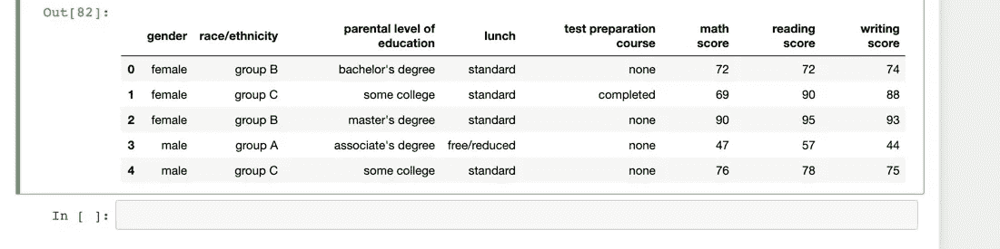
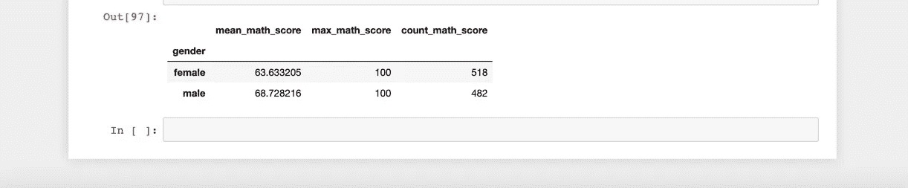
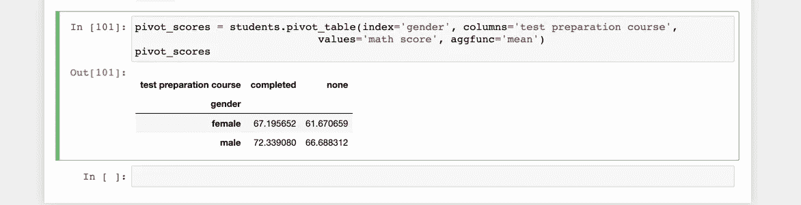
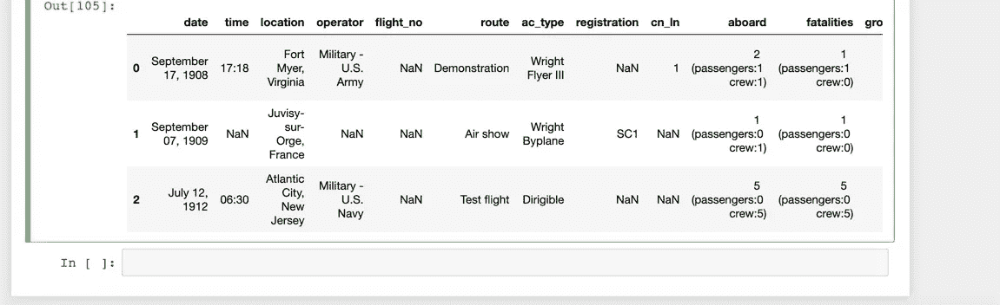
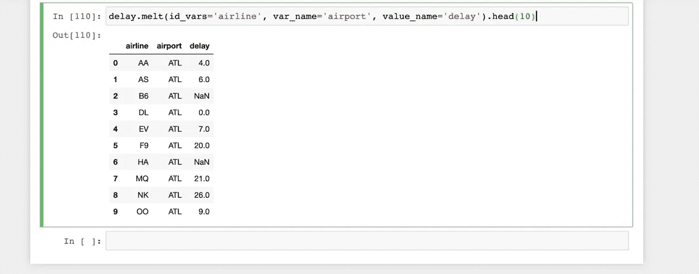
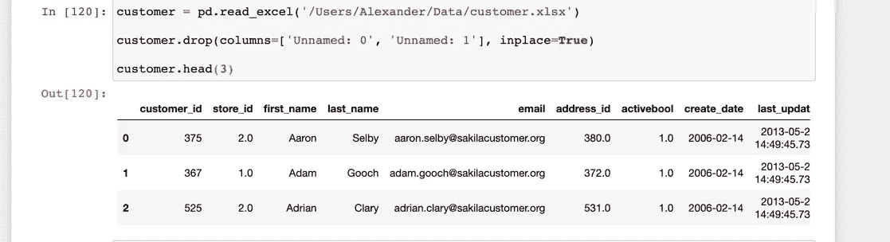
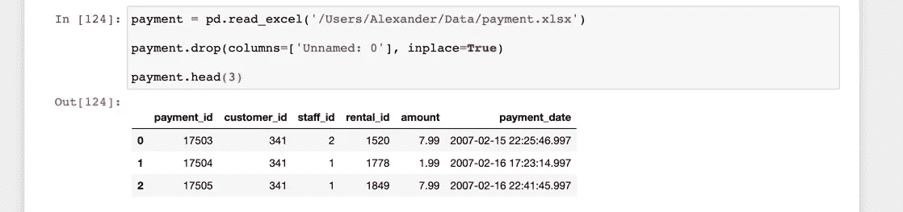
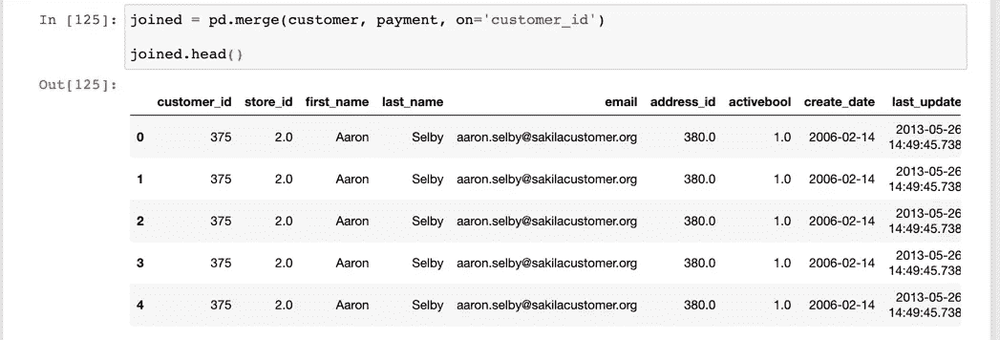
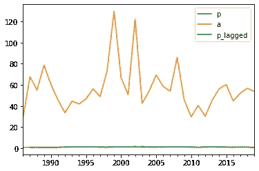
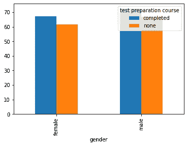

# 熊猫给新手:介绍第二部分

> 原文：<https://towardsdatascience.com/pandas-for-newbies-an-introduction-part-ii-9f69a045dd95?source=collection_archive---------44----------------------->


来自 [Pexels](https://www.pexels.com/photo/baby-on-fur-rug-1648375/?utm_content=attributionCopyText&utm_medium=referral&utm_source=pexels) 的 [Victoria Borodinova](https://www.pexels.com/@victoria-borodinova-392079?utm_content=attributionCopyText&utm_medium=referral&utm_source=pexels) 的照片

本文是上一篇文章的延续，上一篇文章开启了学习 Python 进行数据分析的旅程。你可以在这里查阅以前的文章:[熊猫给新手:介绍第一部分](https://medium.com/@sammylee_30865/pandas-for-newbies-an-introduction-part-i-8246f14efcca?source=friends_link&sk=24fe0749f95dd638af21d60578da78d5)。

对于那些刚刚开始学习数据科学的人来说，Python 编程语言是学习数据科学的先决条件，所以如果你不熟悉 Python，请熟悉一下，然后回到这里开始学习 Pandas。

你可以从我刚刚开始的一系列文章开始学习 Python，这些文章叫做[数据科学所需的最小 Python](https://medium.com/@sammylee_30865/minimal-python-required-for-data-science-part-i-b61e2baf56f9?source=friends_link&sk=d0a1c226244327b092bf208d4ed3d728)。

作为一个提醒，我在这里做的是一个简短的旅行，只是一些你可以用熊猫做的事情。这是真正的深潜之前的深潜。

这个系列的数据和灵感都来自 Ted Petrou 关于 Dunder Data 的优秀课程。

## 先决条件

1.  计算机编程语言
2.  熊猫
3.  朱皮特

一旦你把这三件事都准备好了，你就可以开始了。

# 聚合

我们上次停止了使用 pandas `query`方法作为通过布尔条件逻辑进行常规过滤的替代方法。虽然有它的局限性，但是`query`是一个可读性更好的方法。

今天我们继续讨论汇总，这是用一个数字汇总数据的行为。示例包括总和、平均值、中值、最小值和最大值。

让我们在不同数据集上尝试一下。



通过调用 mean 方法得到平均值。

```
students.mean()math score       66.089
reading score    69.169
writing score    68.054
dtype: float64
```

使用`axis`参数来计算各行中所有分数(数学、阅读和写作)的总和:

```
scores = students[['math score', 'reading score', 'writing score']]scores.sum(axis=1).head(3)0    218
1    247
2    278
dtype: int64
```

# 非聚集方法

对数据执行计算，不一定要聚合数据。即`round`方法:

```
scores.round(-1).head(3)math score  reading score  writing score0          70             70             701          70             90             902          90            100             90
```

# 在组内聚集

让我们获得单个列中唯一值的频率。

```
students['parental level of education'].value_counts()some college          226
associate's degree    222
high school           196
some high school      179
bachelor's degree     118
master's degree        59
Name: parental level of education, dtype: int64
```

使用`groupby`方法创建一个组，然后应用和聚合。这里我们得到了每个性别的平均数学分数:

```
students.groupby('gender').agg(
    mean_math_score=('math score', 'mean')
)mean_math_scoregenderfemale        63.633205male          68.728216
```

# 多重聚集

这里我们同时进行多个聚合。

```
students.groupby('gender').agg(
    mean_math_score=('math score', 'mean'),
    max_math_score=('math score', 'max'),
    count_math_score=('math score', 'count')
)
```



我们可以从多个列创建组。

```
students.groupby(['gender', 'test preparation course']).agg(
    mean_math_score=('math score', 'mean'),
    max_math_score=('math score', 'max'),
    count_math_score=('math score', 'count')
)
```


看起来，为两性考试做准备的学生比没有做准备的学生得分更高。

# 数据透视表

向信息消费者呈现信息的更好方法是使用`pivot_table`函数，该函数与`groupby`做同样的事情，但是使用一个分组列作为新列。



同样，同样的信息以更易读、更直观的格式呈现。

# 数据争论

让我们用一个新的数据集来检查缺失值的数据集



提供`na_values`参数会将数据集中的空值标记为 NaN(不是数字)。

您可能还会遇到这样的数据集，其中所有的列都应该是一列的一部分。


我们可以使用`melt`方法一个接一个地堆叠列。



# 合并数据集

学习熊猫库的这一部分时，了解一点 SQL 会派上用场。

在 pandas 中有多种连接数据的方法，但是您应该非常熟悉的一种方法是`merge`方法，它基于一个或多个键连接数据帧中的行。它基本上是 SQL 连接的一个实现。

假设我有来自电影租赁数据库的以下数据:



使用`merge`执行“内部”连接:



SQL (PostgreSQL)的等价形式如下:

```
SELECT * FROM customer
INNER JOIN payment 
ON payment.customer_id = customer.customer_id
ORDER BY customer.first_name ASC
LIMIT 5;
```

# 时间序列分析

熊猫这个名字实际上来源于面板数据分析，该分析将横截面数据与在医学研究和经济学中最广泛使用的时间序列相结合。

假设我有以下数据，我知道它是时间序列数据，但没有用`DatetimeIndex`指定它是时间序列:

```
p      a0  0.749  28.961  1.093  67.812  0.920  55.153  0.960  78.624  0.912  60.15
```

我可以简单地将索引设置为一个`DatetimeIndex`,用:

这导致:

```
p       a1986-12-31  0.749   28.961987-12-31  1.093   67.811988-12-31  0.920   55.151989-12-31  0.960   78.621990-12-31  0.912   60.151991-12-31  1.054   45.541992-12-31  1.079   33.621993-12-31  1.525   44.581994-12-31  1.310   41.94
```

这里我们有一个数据集，其中 p 是因变量，a 是自变量。在运行名为 AR(1)的计量经济模型之前，我们必须滞后因变量来处理自相关，我们可以使用:

```
p      a  p_lagged1986-12-31  0.749  28.96       NaN1987-12-31  1.093  67.81     0.7491988-12-31  0.920  55.15     1.0931989-12-31  0.960  78.62     0.9201990-12-31  0.912  60.15     0.960
```

# 形象化

`matplotlib`和`pandas`的结合让我们可以在眨眼之间制作出基本的简单情节:

```
# Using the previous datasetbangla.plot();
```



```
pivot_scores.plot(kind='bar');
```



这就结束了我们对熊猫数据分析工具箱的简短巴士之旅。在我的下一系列文章中，我们将深入探讨更多内容。敬请关注！