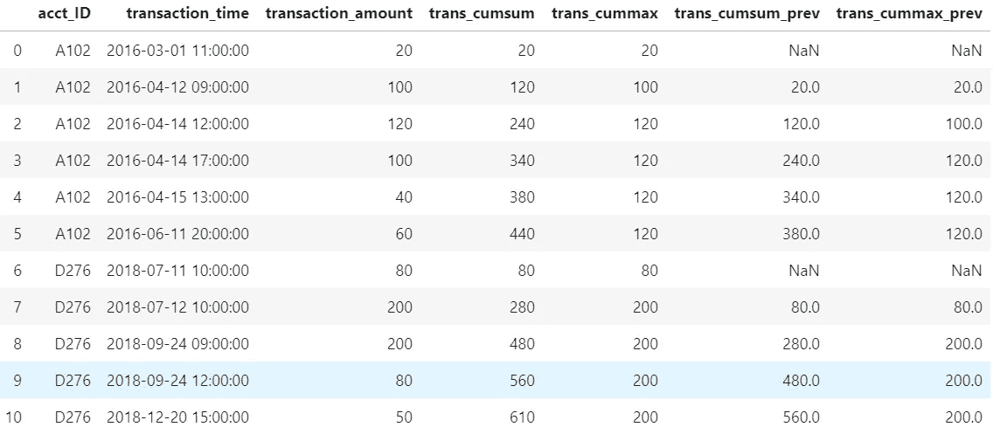

# 熊猫小组:一个简单而详细的教程

> 原文：<https://towardsdatascience.com/pandas-groupby-a-simple-but-detailed-tutorial-314b8f37005d?source=collection_archive---------15----------------------->

## Groupby 是一个很好的生成分析的工具，但是为了充分利用它并正确使用它，这里有一些众所周知的技巧


由[德克·冯·隆-瓦格纳](https://unsplash.com/@dvlw?utm_source=unsplash&utm_medium=referral&utm_content=creditCopyText)在 [Unsplash](https://unsplash.com/s/photos/lake?utm_source=unsplash&utm_medium=referral&utm_content=creditCopyText) 上拍摄的照片

Pandas **groupby** 是一个相当强大的数据分析工具。但是对于初学者来说使用起来并不是很直观，因为 **groupby** 的输出并不是 Pandas **Dataframe** 对象，而是 Pandas**data frame group by**对象。DataFrame 对象可以很容易地被可视化，但对于 Pandas DataFrameGroupBy 对象来说却不是这样。如果一个物体不能被可视化，那么它就更难被操纵。

我在网上找到的一些教程要么包含了太多对用户来说不必要的信息，要么没有足够的信息让用户知道它是如何工作的。我认为包含数据科学家日常工作中经常使用的关键工具的指南肯定会有所帮助，这就是为什么我写这篇文章来帮助读者更好地了解 pandas groupby。

**重要注意事项**。
1。我假设读者在开始之前，已经知道了在 R、SQL、Excel(或其他工具)中 **group by** 计算是如何工作的。
2。所有代码都经过测试，它们适用于熊猫 1.0.3 。旧的熊猫版本可能会有错误。

每一节都将提供示例—可能有不同的方法来生成相同的结果，我会选择我经常使用的方法。

大纲如下:

1.  使用创建分析。 **groupby()** 和**。agg()** :内置函数
2.  使用创建分析。 **groupby()** 和**。agg()** :用户定义的函数和 lambda 函数
3.  使用**。transform()** 将组统计数据连接到原始数据帧
4.  分组处理时间序列

## 使用创建分析。 **groupby()** 和**。agg()** :内置函数

为了生成数据集中每个组的统计数据，我们需要根据一个或多个列将数据分类成组。

```
# group by a single column
df.groupby('column1')# group by multiple columns
df.groupby(['column1','column2'])
```

然后，我们决定想要创建什么样的统计数据。这可以用`.agg()`来完成。使用`.agg()`有几种不同的方式:

A.使用字典作为`.agg()`的输入。
B .使用单个聚合函数或聚合函数列表作为输入。
C .使用命名聚合(Pandas 0.25.0 中的新功能)作为输入。

我将用下面的例子来演示这些不同的解决方案是如何工作的。

```
import pandas as pd
import numpy as np 
df = pd.DataFrame(dict(Gender=['M', 'F', 'M', 'F',
                               'F', 'M', 'M', np.nan],
                       State=['NY','IL', 'NY', 'CA',
                              'IL', 'CA', 'CA', 'IL'],
                       col_1=[10,20,30,np.nan,40,50,60,70],
                       col_2=[1,6,2,4,6,9,np.nan,3]))
```


**A .字典** *什么时候用？—* 当我们需要在不同的列上运行不同的聚合，并且我们不关心聚合列的名称是什么样子时。

对于字典中的每个键-值对，键是我们想要运行聚合的变量，值是聚合函数。

```
tbl = df.groupby(['Gender','State'])\
        .agg({'col_1': ['mean', 'std'],
              'col_2': [sum, 'size' ,'count']})
```


如果对于每一列，只使用一个聚合函数，那么我们就不必将聚合函数放在一个列表中。在这种情况下，`tbl`将是单索引的，而不是多索引的。

```
tbl = df.groupby(['Gender','State'])\
        .agg({'col_1': 'mean',
              'col_2': sum})
```


**B .单个聚合函数或者列表聚合函数** *什么时候使用？—* 当我们需要对所有列运行相同的聚合，并且我们不关心聚合列的名称是什么样子时。

如果我们想对每一列应用相同的集合函数，我们只需要在`.agg()`中包含一个函数或一列函数。

```
tbl = df.groupby(['Gender','State'])\
        .agg([min, max])    # a list of aggregation functions
```


如果我们只想查看选定列的结果，我们可以在代码中应用过滤器:

```
# filter by a single column
tbl = df.groupby(['Gender','State'])\
        ['col_1'].agg([min, max]) tbl = df.groupby(['Gender','State'])\
        [['col_1']].agg([min, max])# filter by a multiple columns
tbl = df.groupby(['Gender','State'])\
        ['col_1', 'col_2'].agg([min, max])tbl = df.groupby(['Gender','State'])\
        [['col_1', 'col_2']].agg([min, max])
```

**注。**如果我们按多列过滤，那么无论使用哪种方法,`tbl.columns`都是多索引的。如果我们按单列过滤，那么`[['col_1']]`使`tbl.columns`成为多索引，而`['col_1']`使`tbl.columns`成为单索引。

**C .命名聚合(熊猫≥ 0.25)** *什么时候用？—* 当我们需要在不同的列上运行不同的聚合时，我们希望在运行`.agg()`后能够完全控制列名

在每个元组中，第一个元素是列名，第二个元素是聚合函数。

```
tbl = df.groupby(['Gender','State'])\
        .agg(col_1_mean=('col_1','mean'),
             col_1_max=('col_1',max),
             col_2_sum=('col_2',sum))
```


**关于** `.agg()`的几点说明。

1.  数据按列 A 和列 B 分组，但列 A 中有缺失值。在任一列中有缺失值的行将从使用`.agg()`生成的统计数据中排除。
2.  对于使用 **sum、max、min、【中值】、【均值】、【计数】**(非空元素的计数)、**、【标准】、**、【唯一】、**(不同元素的计数)创建的组统计，数据中缺失的值将从计算中排除。但是**‘size’**(所有元素的计数)仍然包括缺失值。**
3.  可以做 `tbl.columns =["_".join(i) for i in tbl.columns.ravel()]`将多索引列转换成单索引列。
4.  可以使用`tbl = tbl.reset_index()`将索引转换为表
    的列。
5.  在使用`.agg()`创建的表格中，组可能没有按照首选顺序排列。一个人可以

```
df['Gender'] = pd.Categorical(df['Gender'], ['F', 'M'])
df['State']  = pd.Categorical(df['State'],  ['NY', 'CA', 'IL'])
```

在运行`.agg()`之前，将列转换为用户指定级别的分类系列。(注。`pd.Categorical`可能不适用于较老的熊猫版本)

## 使用创建分析。 **groupby()** 和**。agg()** :用户定义的函数和 lambda 函数

让我们看另一个例子，看看我们如何在`.agg()`中使用用户定义的函数或 lambda 函数来计算统计数据。

```
df = pd.DataFrame(dict(StoreID=[1,1,1,1,2,2,2,2,2,2],
                       ProductID=['A01', 'A02', 'B01','C01',  
                                  'B01', 'B02', 'B03', 'C01', 
                                  'C02', 'C03'],
                       price=[10,20,50,100,50,60,70,100,150,200]))
```


我们希望计算每个商店的以下统计数据:
A .以“A”开头的产品数量
B .所有产品的列表
C .最高产品价格和最低产品价格的差异
D .产品价格的第一个分位数(第 25 个百分位数)

首先，我们定义一个函数来计算一个序列中以“A”开头的元素的数量。

```
def cnt_A(x):
    ctr = 0
    for item in x:
        if item[0] == 'A':
            ctr += 1
    return ctr# If you prefer a Pythonic approach:  
def cnt_A(x):
    return (x.str[0] == 'A').sum()
```

然后，我们可以使用命名聚合+用户定义函数+ lambda 函数来优雅地完成所有计算。

```
df.groupby(['StoreID'])\
  .agg(number_of_product_A =('ProductID', cnt_A),
       product_list=('ProductID', lambda x: ', '.join(x)),
       price_Q1    =('price', lambda x: np.percentile(x, 25)),
       price_gap   =('price', lambda x: x.max()-x.min())
      )
```


当函数不复杂时，使用 lambda 函数会使您的生活更轻松。`lambda x: x.max()-x.min()`和

```
def gap(x):
    return x.max()-x.min()
```

生成相同的输出。

**注**。如果在有重复的时候你需要一个唯一的列表，你可以用`lambda x: ', '.join(x.unique())`代替`lambda x: ', '.join(x)`。

## 使用**。transform()** 将组统计信息附加到原始数据中

让我们使用上一节中的数据来看看如何使用`.transform()`将组统计信息添加到原始数据中。

```
df = pd.DataFrame(dict(StoreID=[1,1,1,1,2,2,2,2,2,2],
                       ProductID=['A01', 'A02', 'B01','C01',  
                                  'B01', 'B02', 'B03', 'C01', 
                                  'C02', 'C03'],
                       price=[10,20,50,100,50,60,70,100,150,200]))df['cnt A in each store'] = df.groupby('StoreID')['ProductID']\
                              .transform(cnt_A)
```

使用`.transform()`，我们可以轻松地将统计数据添加到原始数据集。


**注 1。**与`.agg()`不同，`.transform()`不以字典为输入。
**注二。**为了正确地追加数据，我们需要确保`.groupby()`中使用的列中没有缺失值。(根据 Pandas 用户指南，`.transform()`返回与被分组的对象索引相同(大小相同)的对象。)

**示例—百分比计数**:

```
df = pd.DataFrame(dict(bank_ID=[1,1,1,1,
                                2,2,2,2,2],
                       acct_type=['checking','checking', 
                                  'checking','credit',
                                  'checking','credit', 
                                  'credit','credit', 
                                  'checking']))
```


**问题**:如何计算各银行账户类型的百分比？首先，我们计算每个 bank_ID + acct_type 组合的组总数:

```
tbl = df.groupby(['bank_ID', 'acct_type'])\
        .agg(group_total=('acct_type','count'))\
        .reset_index()
```

然后计算每个银行的总数，并使用`.transform()`添加信息。

```
tbl['total count in each bank'] = tbl.groupby('bank_ID')\
                                     ['group_total']\
                                     .transform(sum)
tbl['% in each bank'] = (tbl['group_total'] * 100.0 
                       / tbl['total count in each bank'])
```


另一个没有`.transform()`的解决方案:只按 bank_ID 分组，用`pd.merge()`把结果联接回`tbl`。

## 分组处理时间序列

```
import datetime
df = pd.DataFrame(dict(acct_ID=['A102','A102','A102','A102',
                                'A102','A102','D276','D276',
                                'D276','D276','D276'],
           transaction_time=[datetime.datetime(2016, 3, 1, 11, 0),
                             datetime.datetime(2016, 4, 12, 9, 0),
                             datetime.datetime(2016, 4, 14, 12, 0),
                             datetime.datetime(2016, 4, 14, 17, 0),
                             datetime.datetime(2016, 4, 20, 13, 0),
                             datetime.datetime(2016, 6, 11, 20, 0),
                             datetime.datetime(2018, 7, 11, 10, 0),
                             datetime.datetime(2018, 7, 12, 10, 0),
                             datetime.datetime(2018, 9, 24, 9, 0),
                             datetime.datetime(2018, 9, 24, 12, 0),
                             datetime.datetime(2018, 12, 20, 15, 0)
                            ],
           transaction_amount=[20, 100, 120, 100, 40, 
                               60, 80, 200, 200, 80, 50]))
```


对于上面的交易数据，我们希望将以下各列添加到每个交易记录中:

1.  交易行号(按交易时间排序)
2.  前一笔交易的交易金额
3.  前一笔交易与当前交易的交易金额差额
4.  前一个交易与当前交易之间的时间间隔(以天为单位，向下舍入)
5.  截至当前交易的所有交易的累计总额
6.  截至当前交易的所有交易的累计最大值
7.  截至上一笔交易的所有交易的累计总额
8.  截至前一笔交易的所有交易的累计最大值

**注。在进行以下计算之前，请确保先对数据进行排序。该表已经排序，但如果没有排序，您可以执行`df.sort_values(by=['acct_ID','transaction_time'], inplace=True)`。**

对于 1。，我们能做什么

```
df['rowID'] = df.groupby('acct_ID')['transaction_time']\
                .rank(method='first', ascending=True)\
                .astype(int)
```

两个人的。-6.，可以通过以下代码轻松完成:

```
df['prev_trans']  =df.groupby('acct_ID')['transaction_amount']\
                     .shift(1)
df['trans_diff']  =df.groupby('acct_ID')['transaction_amount']\
                     .diff(1)
df['time_diff']   =df.groupby('acct_ID')['transaction_time']\
                     .diff(1).dt.days
df['trans_cumsum']=df.groupby('acct_ID')['transaction_amount']\
                     .cumsum()
df['trans_cummax']=df.groupby('acct_ID')['transaction_amount']\
                     .cummax()
```

为了得到 7。和 8。，我们简单的把`.shift(1)`加到 5。和 6。我们计算出:

```
df['trans_cumsum_prev']  = df.groupby('acct_ID')['trans_cumsum']\
                             .shift(1)
df['trans_cummax_prev']  = df.groupby('acct_ID')['trans_cummax']\
                             .shift(1) 
```

所有这些计算的关键思想是，像
`.rank()`、`.shift()`、`.diff()`、`.cummax()`、`.cumsum()`这样的窗口函数不仅适用于熊猫数据帧，也适用于熊猫分组对象。

让我们看看运行上面的计算后会得到什么。结果被分成两个表。



读者可以使用不同的参数来使用这些窗口函数，看看会发生什么(比如说，试试`.diff(2)`或`.shift(-1)`？).

**读者提问** :
1。我们如何计算不同窗口大小的交易金额的移动平均值？(提示:组合`.shift(1)`、`.shift(2)`、…)
2。我们如何按照降序来计算事务行号？(提示:使用`.rank()`中的`ascending`参数——参见此[链接](https://pandas.pydata.org/pandas-docs/stable/reference/api/pandas.DataFrame.rank.html)。)

*

教程到此结束，感谢阅读。欢迎提出建议——欢迎在评论中发表新想法/更好的解决方案，这样其他人也可以看到它们。