# 熊猫分组——解释

> 原文：<https://towardsdatascience.com/pandas-groupby-explained-453692519d0?source=collection_archive---------13----------------------->

## 如何高效利用熊猫的分组功能

Pandas 是一个非常强大的 Python 数据分析库，可以加速项目的预处理步骤。在这篇文章中，我将用许多例子来介绍熊猫的功能，帮助你全面理解这个功能。


由[马库斯·斯皮斯克](https://unsplash.com/@markusspiske?utm_source=unsplash&utm_medium=referral&utm_content=creditCopyText)在 [Unsplash](https://unsplash.com/s/photos/different-colors?utm_source=unsplash&utm_medium=referral&utm_content=creditCopyText) 上拍摄的照片

Groupby 是一个多功能且易于使用的函数，有助于获得数据的概览。这使得探索数据集和揭示变量之间的潜在关系变得更加容易。

Groupby 最好通过例子来解释。我将使用 Kaggle 上可用的客户流失数据集。我只取了其中足以展示 groupby 函数每个细节的一部分。

一如既往，我们从进口熊猫开始:

```
import pandas as pd
import numpy as np
```

让我们快速看一下数据集:

```
df.shape
(7043, 9)df.head()
```

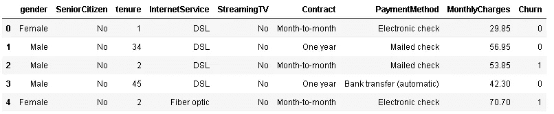

该数据集包括关于客户以及客户是否离职(即离开公司)的 8 个特征。

在对数据集应用 groupby 函数之前，让我们先看一个可视化的例子。可视化总是解释概念的好方法。假设我们有两个特征。一个是颜色，它是分类特征，另一个是数值特征，即值。我们希望**按**颜色对值**分组，并计算不同颜色值的**平均值**(或任何其他集合)。然后最后**基于平均值对颜色进行分类**。下图显示了此过程的步骤。**

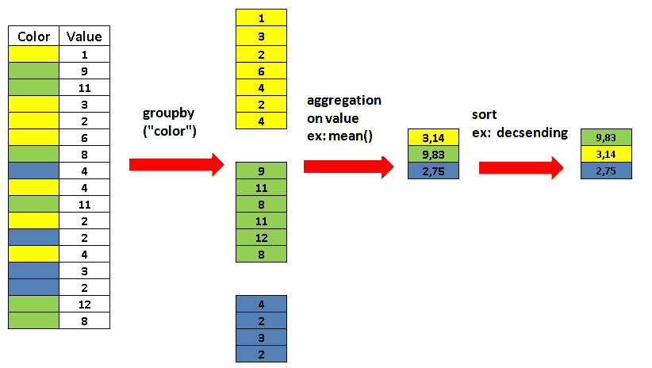

让我们回到我们的数据集。为了查看性别是否在搅动中起作用，我们可以将**性别**和**搅动**列按**性别**分组。然后我们可以应用均值函数。

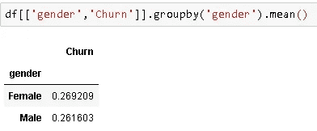

男性和女性的流失率非常接近。

如果我们不选择列并直接将 groupby 应用于数据框架，所有数值列都将根据聚合函数进行计算:

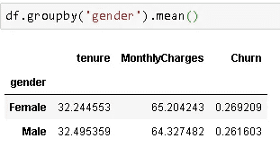

似乎所有的数字特征对男性和女性来说都大致相同。

我们还可以通过添加 **sort_values** 函数对结果进行排序:

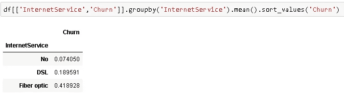

默认情况下，它按升序排序。我们可以通过设置**上升**参数为假来改变它。

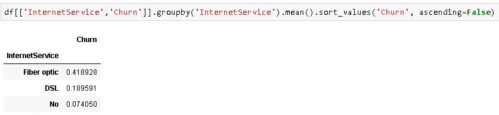

拥有光纤互联网服务的客户比其他客户更容易流失。

我们可以通过在方括号中传递列名来根据多个列进行分组:

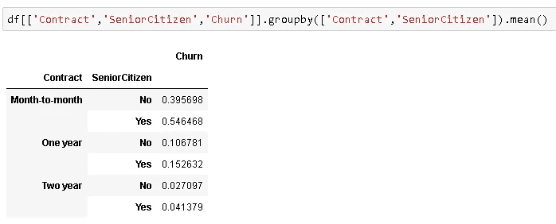

“合同”栏有 3 个类别，“老年人”栏有 2 个类别，所以我们总共有 6 个组。对于每个组，计算平均“流失”率。

**多个聚合函数**

在某些情况下，应用 groupby 函数后，您可能希望查看不同组的计数和平均值。如果类分布不均衡，只查均值可能会造成错误的假设。您可以对 groupby 的结果应用多个聚合函数。它们不仅限于计数和均值，你可以将函数的名称作为参数传递给 **agg()** 函数。

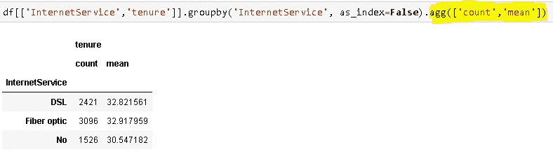

**as_index 参数**

groupby 函数中的变量作为结果数据帧的索引返回。我们可以通过设置 **as_index** 参数为 false 来改变它。

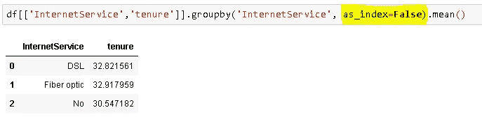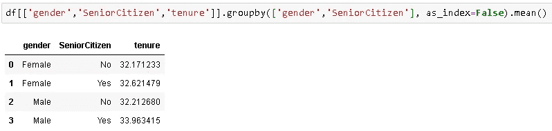

让我们看看每月费用是否取决于合同类型。我们需要从数据集中提取“contract”和“MonthlyCharges”列，按“contract”分组，并对结果应用均值函数。

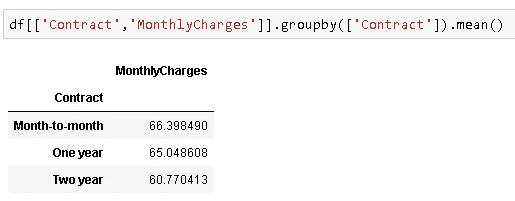

正如预期的那样，长期合同的平均月费用较低。

我们可以根据任务应用其他聚集函数。例如，我们可能希望看到不同 internet 服务类型的合同类型分布。由于两者都是分类变量，我们可以应用计数函数:

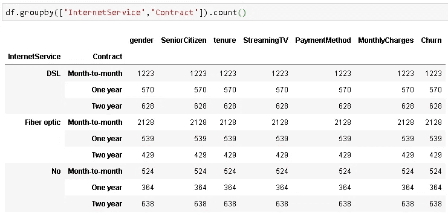

因为我们应用了 count 函数，所以返回的 dataframe 包括所有其他列，因为它可以计算值，而不管 dataframe 是什么。所有列上的值的数量都是相同的，所以我们可以只选择一列来查看值。熊猫的一个好处是通常有不止一种方法来完成一项任务。

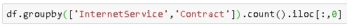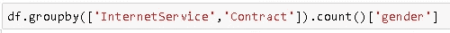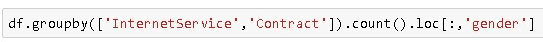

这三行返回以下输出:

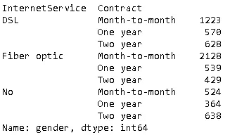

您也可以执行如下相同的任务，但返回的对象将是 dataframe:

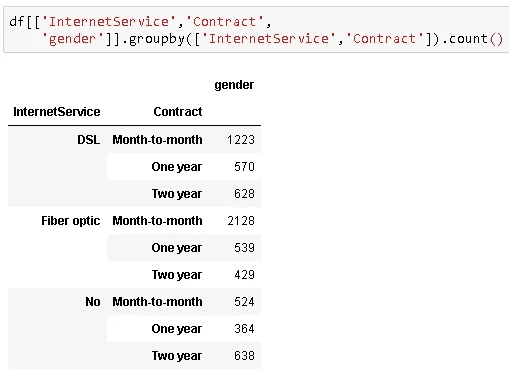

请注意，一些聚合函数需要数值。例如，如果我们只有分类变量并试图应用均值函数，我们将得到一个错误:

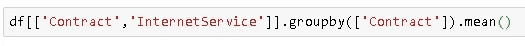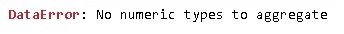

我们可以多样化的例子，但基本的逻辑是相同的。Groupby 函数可用作探索性数据分析过程的第一步，因为它让我们了解数据集中变量之间的关系。

感谢阅读。如果您有任何反馈，请告诉我。