# Pandas Groupby vs SQL Group By

> 原文：<https://towardsdatascience.com/pandas-groupby-vs-sql-group-by-39ccd7d2b779?source=collection_archive---------20----------------------->

## 举例说明


马库斯·斯皮斯克在 [Unsplash](https://unsplash.com/s/photos/different-colors?utm_source=unsplash&utm_medium=referral&utm_content=creditCopyText) 上的照片

Pandas 是 Python 的一个数据分析和操作库。SQL 是大多数关系数据库管理系统(RDBMS)用来管理数据库的编程语言。它们的共同点是 Pandas 和 SQL 都操作表格数据(即表格由行和列组成)。

虽然有不同的语法，但类似的操作或查询可以使用 Pandas 或 SQL 来完成。典型数据分析过程中最常见的操作之一是根据数字特征比较类别。两者在执行此类任务时效率都很高。

在本帖中，我们将做很多例子来掌握这些操作是如何用熊猫的 **groupby** 函数和 SQL 的 **GROUP BY** 语句完成的。

下图说明了“groupby”操作背后的逻辑。

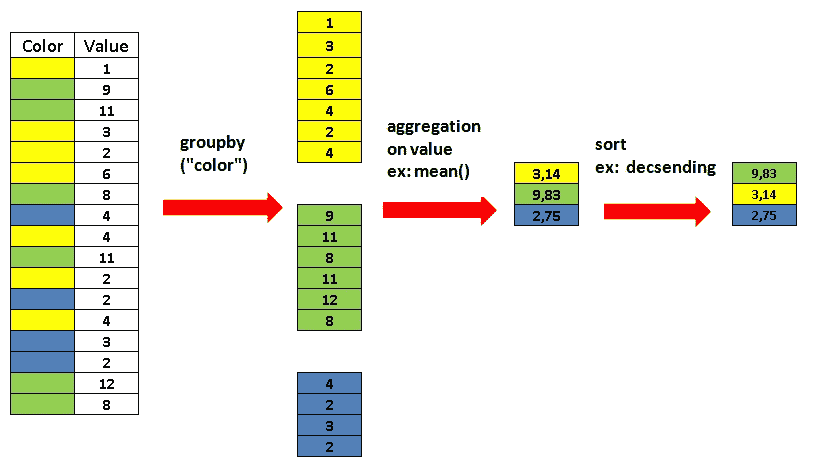

Groupby 操作(图片由作者提供)

我们将使用 Kaggle 上提供的[客户流失数据集](https://www.kaggle.com/shubh0799/churn-modelling)。对于熊猫，数据集存储在“变动”数据帧中。对于 SQL，数据在“变动”表中。

这是数据集的快照。

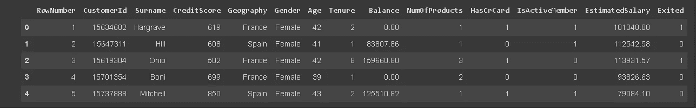

(图片由作者提供)

有一些功能可以提供关于客户及其银行账户的信息。“已离开”栏显示客户是否离开银行。

我将定义一些有助于我们探索数据集的度量，并使用 Pandas 和 SQL 来计算它们。

我们开始吧。

# **基于国家/地区的流失率**

这将有助于我们了解不同国家的流失率是否存在差异。将 exited 列按 geography 列分组并取平均值将得到结果。

**熊猫**

```
churn[['Geography','Exited']].groupby('Geography').mean()
```

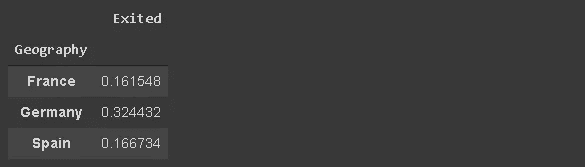

(图片由作者提供)

**SQL**

```
SELECT Geography, AVG(Exited)
FROM CHURN
GROUP BY Geography;
```

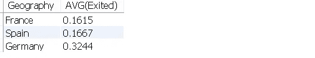

(图片由作者提供)

主要的区别在于我们应用聚合函数的地方。SQL 允许在选择列时直接应用函数，而在 Pandas 的 groupby 函数之后应用。

# 基于国家和性别的流失率

SQL 和 Pandas 都允许基于多个列进行分组，这可以提供更多的洞察力。例如，我们可能想要检查性别如何影响不同国家的客户流失。

我们将首先按性别对平均流失率进行分组，然后按国家分组。

**熊猫**

```
churn[['Gender','Geography','Exited']]\
.groupby(['Gender','Geography']).mean()
```

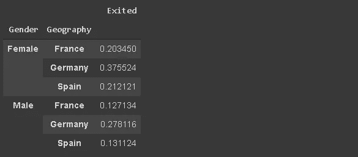

(图片由作者提供)

**SQL**

```
SELECT Gender, Geography, AVG(Exited)
FROM CHURN
GROUP BY Gender, Geography
ORDER BY Gender, Geography;
```

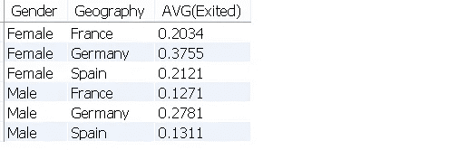

(图片由作者提供)

我添加了 ORDER BY 子句来匹配 Pandas 返回的顺序，并使它看起来更有结构。

对于 Pandas 和 SQL，分组中列的顺序对结果帧的结构很重要。这些值不会改变。

# 每个国家的平均余额和客户总数

Pandas 和 SQL 都提供了对不同的列应用不同的聚合函数的方法。例如，我们可能想要检查每个国家的平均余额和客户总数。

这是怎么做的。

**熊猫**

```
churn[['Geography','Balance','Exited']].groupby(['Geography'])\
.agg({'Balance':'mean', 'Exited':'sum'})
```

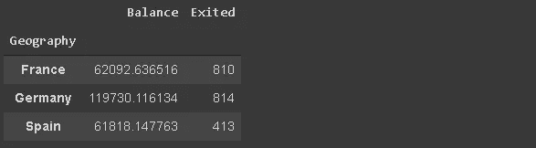

(图片由作者提供)

我们向 agg (aggregate)函数传递一个字典，指定哪个函数应用于哪个列。

**SQL**

```
SELECT Geography, AVG(Balance), SUM(Exited)
FROM CHURN
GROUP BY Geography;
```

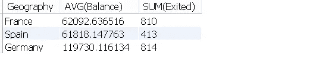

(图片由作者提供)

使用 SQL 很简单，因为它允许我们在选择列时指定函数。

# **基于产品数量的平均和总流失率**

我们可以在同一个数字列上应用多个聚合函数。如果类别之间不平衡，建议同时检查平均值和计数。在这种情况下，只检查平均值可能会产生误导。

让我们来看看产品数量和客户流失之间的关系。我们将计算平均流失率和流失客户总数。

**熊猫**

```
churn[['NumOfProducts','Exited']]\
.groupby('NumOfProducts').agg(['mean','count'])
```

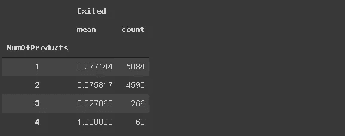

(图片由作者提供)

因为只有一个数值列，所以我们不必向 agg 函数传递字典。我们将只使用函数列表。

**SQL**

```
SELECT NumOfProducts, AVG(Exited), COUNT(Exited)
FROM CHURN
GROUP BY NumOfProducts;
```

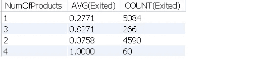

(图片由作者提供)

仅仅检查平均值会产生误导，因为拥有 2 件以上产品的客户数量远远少于拥有 1 件或 2 件产品的客户数量。

# **结果排序怎么样？**

分组的目标是根据计算出的数值列找到具有高值或低值的类别。因此，排序是分组操作的一个重要部分。

SQL 和熊猫在排序上都很灵活。我们可以根据任何计算值和任何顺序进行排序。

考虑前面的查询，我们根据产品数量检查客户流失。

让我们对结果进行排序。

熊猫

可以使用 sort_values 函数。我们通常只传递其值将用于排序的列的名称。但是，如果使用多个聚合函数，我们需要传递一个指示列索引的元组。

以下代码将根据平均流失率(Exited，mean)对结果进行排序。

```
churn[['NumOfProducts','Exited']]\
.groupby('NumOfProducts').agg(['mean','count'])\
.sort_values(by=('Exited','mean'))
```

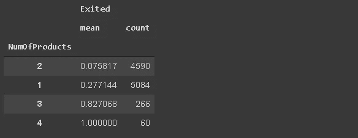

(图片由作者提供)

**SQL**

我们只需要在末尾添加一个 ORDER BY 子句。

```
SELECT NumOfProducts, AVG(Exited), COUNT(Exited)
FROM CHURN
GROUP BY NumOfProducts
ORDER BY AVG(Exited);
```

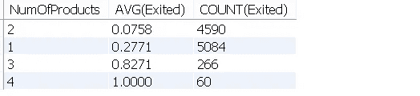

(图片由作者提供)

默认情况下，Pandas 和 SQL 都按升序对值进行排序。为了按降序排序，只需修改代码如下:

*   熊猫:`sort_values(by=(‘Exited’,’mean’), ascending=False)`
*   SQL: `ORDER BY AVG(Exited) DESC;`

# **结论**

正如我们在示例中看到的，Pandas 和 SQL 的分组背后的逻辑非常相似。一旦你熟悉了其中的一种，学习另一种就相当容易了。这只是一个语法问题。

如果你正在从事或者打算从事数据科学领域的工作，我强烈推荐你学习熊猫和 SQL。

感谢您的阅读。如果您有任何反馈，请告诉我。