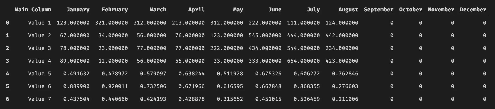

# 熊猫有阅读 Excel 文件的超能力

> 原文：<https://towardsdatascience.com/pandas-has-superpowers-in-reading-excel-files-44344bfdaac?source=collection_archive---------14----------------------->

## Pandas 有不同的阅读器将数据读入数据框。其中一个是 Excel 阅读器。你知道即使你有一些*复杂的*财务管理报告，阅读器的功能有多强大吗？


照片由[卢卡斯·布拉塞克](https://unsplash.com/@goumbik?utm_source=medium&utm_medium=referral)在 [Unsplash](https://unsplash.com?utm_source=medium&utm_medium=referral) 上拍摄

大多数公司都有财务部门，他们制作带有关键数字和表格的 Excel 文件，并配有复杂的辅助计算和图表。似乎他们喜欢复杂的文件，里面有一堆表格和一个封面，上面显示了后面表格中数字的汇总。这些文件相对来说比较容易被人类理解。但如果你想作为一名数据分析师进入数字领域，你会面临一些障碍，因为乍一看没有逻辑结构。将工作表作为数据框读取会导致表格混乱。这些表通常在一页上有许多带有不同标题和布局的表格。你知道熊猫有一些打开和处理这种 Excel 文件的超能力吗？

Pandas Excel-Reader 功能强大，您不必使用复杂的 Python 脚本来整理整个数据框架。让我们用两个(半设计的)案例来看看一些特性。

[在我的 GitHub 库](https://github.com/casarock/pandas_excel_reader)中，我添加了示例文件和一个 [Jupyter 笔记本](https://github.com/casarock/pandas_excel_reader/blob/master/excel_wrangling.ipynb)以及一些注释。

## 熊猫 Excel-读者准备

在我们开始使用 pandas `read_excel`功能之前，我们必须安装 python 包`xlrd`。只需使用您最喜欢的软件包管理器并安装它。

```
conda install xlrd# orpip install xlrd
```

熊猫准备打开和阅读 Excel 文件。我已经[准备了两个文件](https://github.com/casarock/pandas_excel_reader)来解释一些很棒的特性。

## 一个简单的例子

让我们从第一个文件开始，一个有一张纸的简单文件。该表包含两个表格，一些解释，一个图表和辅助计算。


财务报表使用的表格示例

如果你用`pd.read_excel('Filename.xlsx')`读文件，你会得到一些杂乱无章的数据框。


试图读取文件时创建的数据帧

工作起来很费时间。但是不要害怕，熊猫会帮助你的！仔细看看这个表，我们会发现我们必须限制要读取的表的边界。熊猫 Excel 阅读器有一些很好的功能来传递列，哪一行是标题，应该读多少行。

让我们在这个简单的例子中深入研究这些参数。

第一个表位于 A 到 m 列之间，标题在第 2 行，我们需要读取 7 行。注意:不要计算标题行，这是隐含的。现在看看需要的参数。

为了定义标题，我们使用`header`。Header 要求工作表的行从 0 开始！Excel 从一开始计数！在我们的工作表中，我们需要第 2 行，这意味着我们将 1 作为标题参数传递。

我们对 A-M 列感兴趣。Pandas Excel reader 支持选择列的 Excel 语法。在这种情况下，我们有`"A:M"`，我们将它作为一个字符串传递给`usecols`参数。我们需要的最后一个参数是熊猫应该读取的行数。相应的参数称为`nrows,`，我们传递 7，因为我们需要从第二行开始的七行！

让我们读一读有熊猫的表格:

```
df = pd.read_excel("demosheet1.xlsx", header=1, usecols="A:M", nrows=7)
```

我们的数据框现在包含了我们想要的表的清晰表示



去杂乱的数据帧，随时可用！

很好，不是吗？现在让我们读这张纸的第二张表。

```
df_employees = pd.read_excel("200910_Produktivitätsreport August 2020.xlsx", header=12, usecols="A:G", nrows=10)
```


工作表中第二个表格的数据框

标题位于第 13 行(记住，pandas 从 0 开始，所以我们传递 12)，我们读取列 A-G，并且我们正在读取接下来的 10 行。第二桌就这样。

这是一个只有一张纸的简单文件。正如开头所说，大多数文件都更复杂。它们可能包含几页纸和一个封面。让我们来看看熊猫 Excel reader 如何处理这种工作表。

## 分而治之—更复杂的工作表

想象一下[下面的例子](https://github.com/casarock/pandas_excel_reader/blob/master/complex_file.xlsx)。我们有一份带有封面的管理报告。在文件中，我们还有另外三张包含更多信息/数字的表格。它们都有相似的结构，除了有有趣数字的表格外，它们还包含描述和进一步的(对我们来说没用的)计算。我们对封面不感兴趣，因为我们希望使用以下表格中的数据。

如果 Pandas 读取这种类型的文件，它将只解释文件中找到的第一个工作表。在我们的例子中:封面。

现在让我们弄清楚如何用熊猫 Excel 阅读器阅读其他工作表。

阅读器支持一个名为`sheet_name`的参数，用于传递我们想要读取的工作表的编号或名称。让我们假设一个名为`Sheet 1`的工作表位于封面后的第二个位置，我们想要读取这个工作表。我们有两种选择来阅读表单:

1.  通过位置从 0 开始计数，其中 0 是第一个，1 是第二个，依此类推。
2.  将工作表的名称作为字符串传递。在这种情况下`"Sheet 1"`

```
# Pass the position
df = pd.read_excel("complex_one.xlsx", sheet_name=1)

# Pass the name as a string
df = pd.read_excel("complex_one.xlsx", sheet_name='Sheet 1')
```

因为我们只对从第十行开始的数据感兴趣，所以我们只需传递上面示例中描述的参数来访问数据。

```
df = pd.read_excel("complex_one.xlsx", 
	sheet_name='Sheet 1', 
	header=9, 
	usecols="A,B,D:H", 
	nrows=19, )
```

您可以看到，我一直在使用一个更复杂的字符串来选择列。我使用 A，B 列和 D 到 h 列，我跳过了 C，因为它没什么意思。我的标题在第十行(记住熊猫是从 0 开始计数的)，我总共要读取 19 行。19，因为该工作表的作者决定有 19 个可能的数据行。即使使用较少。


包含大量 nan 的数据帧

要去掉带有 *NaN* 的行，只需使用

```
df_sheet1 = df_complex.dropna()
```


没有那些 nan 的数据帧。

那很容易。但是在我们的 Excel 文件中还有两张工作表。该阅读器支持读取多张纸。`sheet_name`也可以处理工作表名称或编号的列表。你可以把名字和数字混在一起。

如果使用工作表列表，pandas 会返回一个包含数据框的字典。由于我们示例中的所有工作表都具有相同的结构，我们可以使用

```
df = pd.read_excel("complex_one.xlsx", 
	sheet_name=['Sheet 1', 2, 3], 
	header=9, 
	usecols="A,B,D:H", 
	nrows=19)
```

我们得到了三个结构相同的数据帧。现在，您可以进一步处理原始数据:

```
df_sheet1 = df_complex['Sheet 1'].dropna()
df_sheet2 = df_complex[2].dropna()
df_sheet3 = df_complex[3].dropna()
```

Pandas Excel reader 中最后一个有用的参数是设置列的数据类型。名为`#`的专栏被熊猫解释为 *float* 。但是它应该是一个*对象*，因为它包含一个雇员号。Excel reader 有一个名为`dtype`的参数，它需要一个带有。

`Name_of_col: dtype`

例如:

```
types = {
	'#': object
}

df = pd.read_excel("complex_one.xlsx", 
	sheet_name=['Sheet 1', 2, 3], 
	header=9, 
	usecols="A,B,D:H", 
	nrows=19,
	dtypes=types)
```

现在`#`被解释为一个对象。不错！

## 下一步是什么，为什么？

熊猫 Excel 阅读器有更多的功能。阅读文档以获得更多灵感，在 pandas 中使用 Excel 表格可以做什么。

现在你可以从复杂的表格中读取原始数据，这些表格是为人类阅读而创建的。我们可以在阅读数据框的时候整理它们。下一步是用这些数据做出令人惊叹的东西。基于 Excel 创建由管理报告触发的仪表板、可视化和模型。或将数据添加到数据库等。由于 Excel 仍然是公司中几乎所有与数字打交道的人的首选工具，所以知道如何阅读和使用它们进行数据分析是很方便的。我希望你能学到一些新的东西，我很高兴看到笔记和评论。

[1]半设计，因为这些文件是基于我正在处理的真实世界场景。