# 熊猫变得容易(指南)

> 原文：<https://towardsdatascience.com/pandas-made-easy-the-guide-i-81834f075893?source=collection_archive---------36----------------------->

## 提供了一些最常用的函数和方法的例子。


照片由 [Sid Balachandran](https://unsplash.com/@itookthose?utm_source=medium&utm_medium=referral) 在 [Unsplash](https://unsplash.com?utm_source=medium&utm_medium=referral) 上拍摄

作为每个数据科学家都非常了解和使用的最受欢迎和最常用的工具之一， **Pandas** 库非常适合数据操作、分析和可视化，如果你经常练习，它应该很快就会在你的手指下流动。

为了帮助你完成这个任务并对你的 Python 编码更有信心，我用熊猫上一些最常用的函数和方法创建了这个指南。我真心希望这对你有用。

# 内容:

0.导入库
1。导入/导出数据
2。显示数据
3。基本信息:快速浏览数据
4。基本统计数据
5。调整数据
6。布尔索引:loc
7。布尔索引:iloc
8。基本处理数据

我们将致力于“泰坦尼克号”数据集，主要有两个原因:(1)很可能你已经熟悉它了，以及(2)它非常小，简单，并且有(也没有)我们举例说明所需的所有数据。

泰坦尼克号的数据集可以在[这里](https://bit.ly/33tOJ2S)下载。

# 0.导入库

对于我们的目的来说，‘熊猫’图书馆是我们起步的武器。

`import pandas as pd`

# 1.导入/导出数据

**“泰坦尼克号数据集”与文章一起被指定为“数据”**。

**a)使用`read_csv`将一个 csv** 文件**导入到笔记本中。您应该在文件中添加数据的分隔类型。**

`data = pd.read_csv("file_name.csv", sep=';')`

**b)** **使用`read_excel.`从 **excel** **文件**中读取**数据

`data = pd.read_excel('file_name.xls')`

**c)** **导出**数据帧到一个 **csv** **文件**中使用`to_csv,`逗号分隔且不带索引。如果没有给定，则 header 和 index 为 True。

`data.to_csv("file_name.csv", sep=';', index=False`

**d)** **使用`to_excel.`将**数据帧导出到一个 **excel** **文件**

`data.to_excel("file_name.xls´)`

# 2.显示数据

**a)** 打印第**第‘n’行**。如果没有给定，默认显示 5 行。

`data.head()`

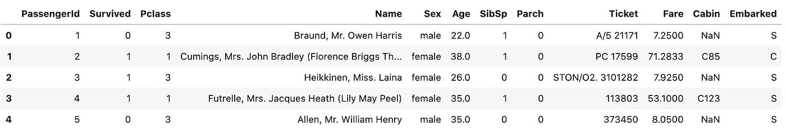

作者图片

**b)** 打印最后‘n’行的**。下面显示了最后 7 行。**

`data.tail(7)`

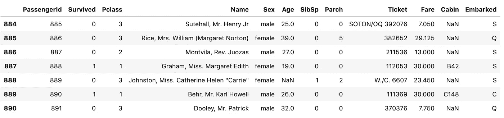

作者图片

# 3.基本信息:快速浏览数据

**a)** 显示数据集的**维度**:行**和列**的总数。

`data.shape` (891，12)

**b)** 显示**类型的变量**。

`data.dtypes`

```
PassengerId      int64
Survived         int64
Pclass           int64
Name            object
Sex             object
Age            float64
SibSp            int64
Parch            int64
Ticket          object
Fare           float64
Cabin           object
Embarked        object
dtype: object
```

**c)** 显示由**排序的变量类型值。**

`data.dtypes.sort_values(ascending=True)`

```
PassengerId      int64
Survived         int64
Pclass           int64
SibSp            int64
Parch            int64
Age            float64
Fare           float64
Name            object
Sex             object
Ticket          object
Cabin           object
Embarked        object
dtype: object
```

**d)** 计数变量**由**型**型**型。

`data.dtypes.value_counts()`

```
object     5
int64      5
float64    2
dtype: int64
```

**e)** 计算每种类型的值，由**命令值**。

`data.dtypes.value_counts(ascending=True)`

```
float64    2
int64      5
object     5
dtype: int64
```

**f)** 检查**在**绝对值**中幸存者与非幸存者数量之间的平衡**。

`data.Survived.value_counts()`

```
0    549
1    342
Name: Survived, dtype: int64
```

**g)** 检查特征的**比例**，占**百分比**。

`data.Survived.value_counts() / data.Survived.value_counts().sum()`

...与以下内容相同:

`data.Survived.value_counts(normalize=True)`

```
0    0.616162
1    0.383838
Name: Survived, dtype: float64
```

**h)** 检查特征的**比例**，在**百分比中，将**四舍五入 4。

`data.Survived.value_counts(normalize=True).round(decimals=4) * 100`

```
0    61.62
1    38.38
Name: Survived, dtype: float64
```

**i)** 评估**数据集中缺失值**的存在。

`data.isnull().values.any()`

```
True
```

**j)** 使用`isnull()`变量的**缺失值**的数量。

`data.isnull().sum()`

```
PassengerId      0
Survived         0
Pclass           0
Name             0
Sex              0
Age            177
SibSp            0
Parch            0
Ticket           0
Fare             0
Cabin          687
Embarked         2
dtype: int64
```

**k)** 数量**现有值**使用`notnull()`。

`data.notnull().sum()`

```
PassengerId    891
Survived       891
Pclass         891
Name           891
Sex            891
Age            714
SibSp          891
Parch          891
Ticket         891
Fare           891
Cabin          204
Embarked       889
dtype: int64
```

**l)** **百分比(%)** 因变量而缺失的值。

`data.isnull().sum() / data.isnull().shape[0] * 100`

…等同于:

`data.isnull().mean() * 100`

```
PassengerId     0.000000
Survived        0.000000
Pclass          0.000000
Name            0.000000
Sex             0.000000
Age            19.865320
SibSp           0.000000
Parch           0.000000
Ticket          0.000000
Fare            0.000000
Cabin          77.104377
Embarked        0.224467
dtype: float64
```

**m)** **舍入小数**值(在本例中为 2)。

`(data.isnull().sum() / data.isnull().shape[0] * 100).round(decimals=2)`

…等同于:

`(data.isnull().mean() * 100).round(decimals=2)`

```
PassengerId     0.00
Survived        0.00
Pclass          0.00
Name            0.00
Sex             0.00
Age            19.87
SibSp           0.00
Parch           0.00
Ticket          0.00
Fare            0.00
Cabin          77.10
Embarked        0.22
dtype: float64
```

**n)** 奖金 **:** **使用组合文本打印**答案。

`print("The percentage of 'Age' is missing values:",(data.Age.isnull().sum() / data.Age.isnull().shape[0] * 100).round(decimals=2), "%")`

```
The percentage of 'Age' is missing values: 19.87 %
```

`print(f"The feature 'Age' has {data.Age.isnull().sum()} missing values")`

```
The feature 'Age' has 177 missing values
```

`print("'Age' has {} and 'Cabin' has {} missing values".format(data.Age.isnull().sum(), data.Cabin.isnull().sum()))`

```
'Age' has 177 and 'Cabin' has 687 missing values
```

**o)** **一般** **形状、变量类型和缺失值的概述**。

`data.info()`

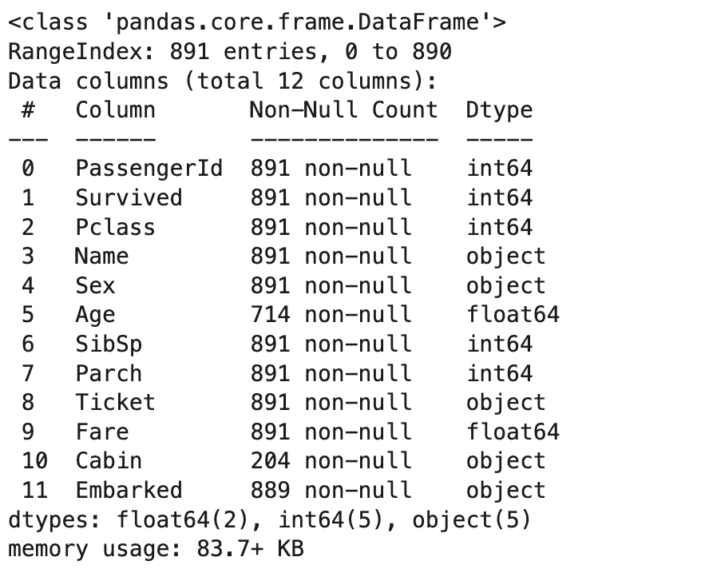

作者图片

**p)** 概述**具体特征**(下面例子中的‘性别’和‘年龄’)。

`data[['Sex','Age']].info()`

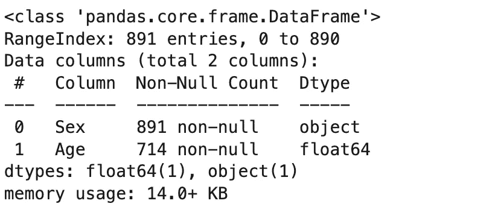

作者图片

# 4.基本统计

**a)**`describe`方法只给我们关于数据的基本统计。默认情况下，它将只计算数字数据的**主统计。结果表示为熊猫数据框。**

`data.describe()`

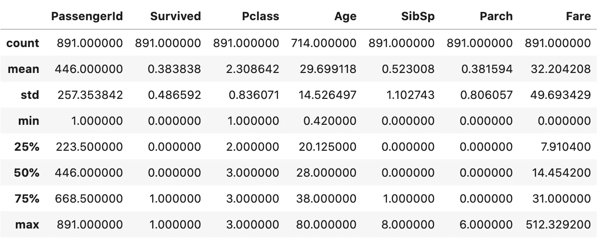

作者图片

**b)** 添加**其他非标准**值，例如‘方差’。

`describe = data.describe()`

`describe.append(pd.Series(data.var(), name='variance'))`

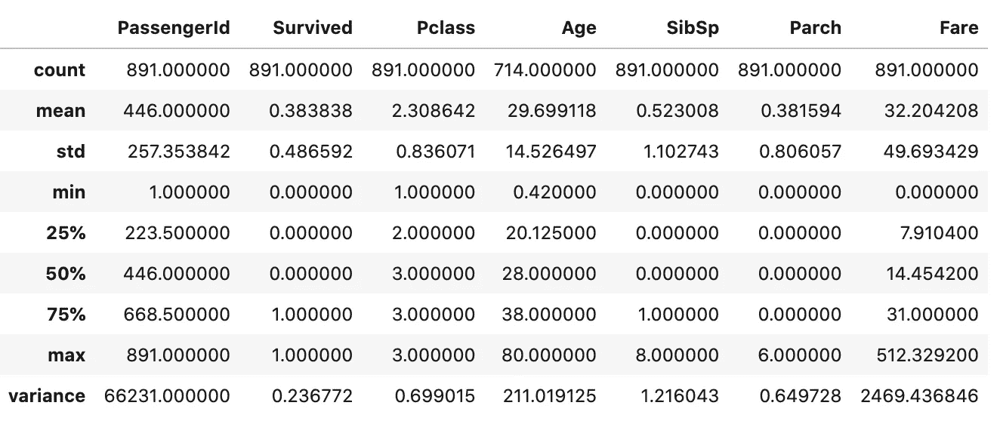

作者图片

**c)** 显示**分类**数据。

`data.describe(include=["O"])`

…等同于:

`data.describe(exclude=['float64','int64'])`

…也等同于:

`data.describe(include=[np.object])`

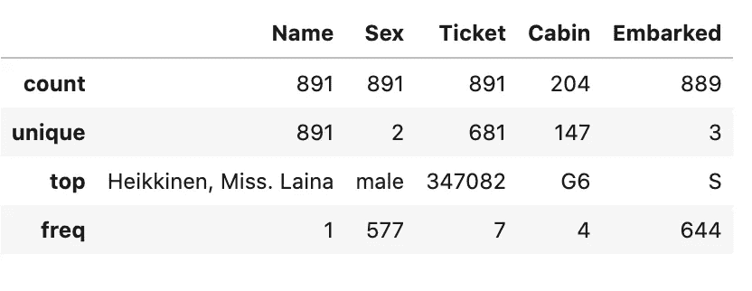

作者图片

**d)** 通过传递参数`include='all'`，将同时显示数值和非数值数据。

`data.describe(include='all')`

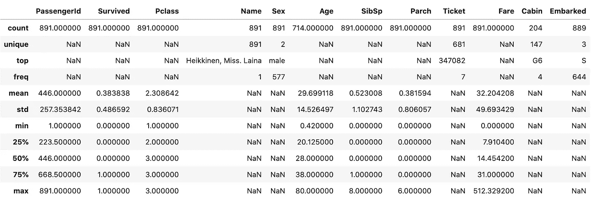

作者图片

**e)** 不要忘记**通过在末尾添加`.T`来转置数据帧**。这也是适用于每个数据框的非常有用的资源。

`data.describe(include='all').T`

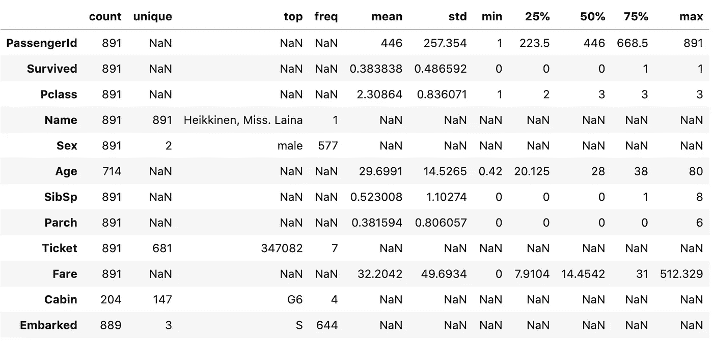

作者图片

**f)** **百分位数演算** 1%、5%、95%、99%。正如所料，它将只计算数字特征的统计数据。

`data.quantile(q=[.01, .05, .95, .99])`

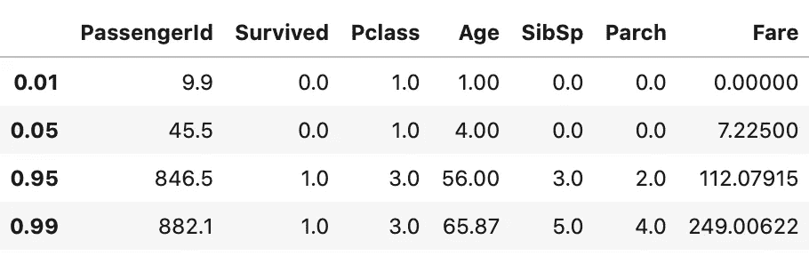

作者图片

**g)** **汇总**统计数据

*   显示某个特征的**唯一值**。

`data.Embarked.unique()`

```
array(['S', 'C', 'Q', nan], dtype=object)
```

*   计算某个特性的唯一值的总数**。**

`data.Sex.nunique()`

```
2
```

*   计算**的总值**。

`data.count()`

```
PassengerId    891
Survived       891
Pclass         891
Name           891
Sex            891
Age            714
SibSp          891
Parch          891
Ticket         891
Fare           891
Cabin          204
Embarked       889
dtype: int64
```

*   **某些特性的最高值**。

`data.Age.max()`

```
80.0
```

*   **某特性的最低值**。

`data.Age.min()`

```
0.42
```

*   某些特征的**平均值**(平均值)。

`data.Age.mean()`

```
29.69911764705882
```

*   某些特征的**中值**。

`data.Age.median()`

```
28.0
```

*   **某些特征的第 99 个分位数**。

`data.Age.quantile(q=[.99])`

```
0.99    65.87
Name: Age, dtype: float64
```

*   某些特征的**标准偏差**。

`data.Age.std()`

```
14.526497332334044
```

*   某些特征的**差异**。

`data.Age.var()`

```
211.0191247463081
```

**h)** 奖金…

**Q1**——显示分类特征“已装船”中两个最常见的独特特征。

`data[‘Embarked’].value_counts().head(2)`

```
S    644
C    168
Name: Embarked, dtype: int64
```

**Q2**——已登船的最高独一无二的百分比是多少？(相对于所有其他部分而言，最常见的部分)。

`top_unique = data['Embarked'].value_counts(normalize=True)[0]`

`print(f'{top_unique:.2%}')`

```
72.44%
```

变量之间的相关性。正如所料，它将只显示数字数据的统计信息。

`data.corr()` #皮尔逊相关默认

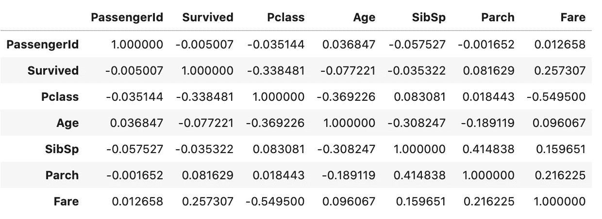

作者图片

**J)一个**选择变量**(本例中为“存活”)与其他变量之间的相关性**。

`correlation = data.corr()`

`correlation.Survived.sort_values().sort_values(ascending=False)` #有序值

```
Survived       1.000000
Fare           0.257307
Parch          0.081629
PassengerId   -0.005007
SibSp         -0.035322
Age           -0.077221
Pclass        -0.338481
Name: Survived, dtype: float64
```

# 5.调整数据

**a)** **列出各列的**名称。

`data.columns`

```
Index(['PassengerId', 'Survived', 'Pclass', 'Name', 'Sex', 'Age', 'SibSp', 'Parch', 'Ticket', 'Fare', 'Cabin', 'Embarked'], dtype='object')
```

**b)** **重命名某列**(在下面的示例中，通过“Id”重命名“PassengerId”)。

`data.rename(columns = {data.columns[0]:'id'}, inplace=True)`

…等同于:

`data.rename(columns = {'PassengerId':'id'}, inplace=True)`

```
Index(['id', 'Survived', 'Pclass', 'Name', 'Sex', 'Age', 'SibSp', 'Parch', 'Ticket', 'Fare', 'Cabin', 'Embarked'], dtype='object')
```

**c)** **重命名** **几列** ('PassengerId '，' Pclass '和' SibSp ')。

`data.rename(columns = {'PassengerId':'Passenger_Id', 'Pclass':'P_Class', 'SibSp':'Sib_Sp'}, inplace=True)`

```
Index(['Passenger_Id', 'Survived', 'P_Class', 'Name', 'Sex', 'Age', 'Sib_Sp', 'Parch', 'Ticket', 'Fare', 'Cabin', 'Embarked'], dtype='object')
```

**d)** **通过列表理解用点**代替 **下划线(仅适用于‘乘客标识’，‘P _ Class’和‘Sib _ Sp’)。**

`data.columns = [x.replace('_', '.') for x in data.columns]`

```
Index(['Passenger.Id', 'Survived', 'P.Class', 'Name', 'Sex', 'Age', 'Sib.Sp', 'Parch', 'Ticket', 'Fare', 'Cabin', 'Embarked'], dtype='object')
```

**e)** **降低上部字符**和**去除** **圆点**(适用于‘乘客。Id '，' P.Class '和' Sib '。仅 Sp)。

`data.columns = [x.lower().replace('.', '') for x in data.columns]`

```
Index(['passengerid', 'survived', 'pclass', 'name', 'sex', 'age', 'sibsp', 'parch', 'ticket', 'fare', 'cabin', 'embarked'], dtype='object')
```

**f)** **将**列名大写。

`data.columns = [x.capitalize() for x in data.columns]`

```
Index(['Passengerid', 'Survived', 'Pclass', 'Name', 'Sex', 'Age', 'Sibsp', 'Parch', 'Ticket', 'Fare', 'Cabin', 'Embarked'], dtype='object')
```

# 6.布尔索引:loc

`data.loc[<lines>, <columns>]` #按职位和姓名选择

**一)**选择**一排**。

`data.loc[[3]]`

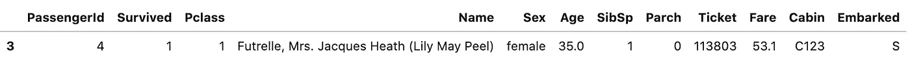

作者图片

**b)** 选择**一排** **的行**。

`data.loc[6:8]`

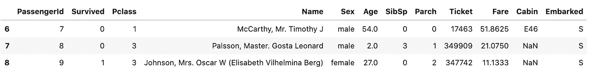

作者图片

**c)** 选择**几行**。

`data.loc[[7,28,39]]`

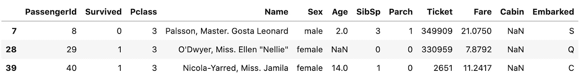

作者图片

**d)** 从几列‘姓名’、‘年龄’、‘性别’、‘幸存’中选择**一行。**

`data.loc[[7], ['Name', 'Age', 'Sex', 'Survived']]`


作者图片

**e)** 从几列中选择**多行**。

`data.loc[[7,28,39], ['Name', 'Age', 'Sex','Survived']]`


作者图片

**f)** 选择**特定值**在某种**条件下**使用`loc`。在这种情况下，从第 4 行到第 10 行选择年龄大于或等于 10 岁的乘客。

`data.loc[4:10, ['Age']] >= 10`

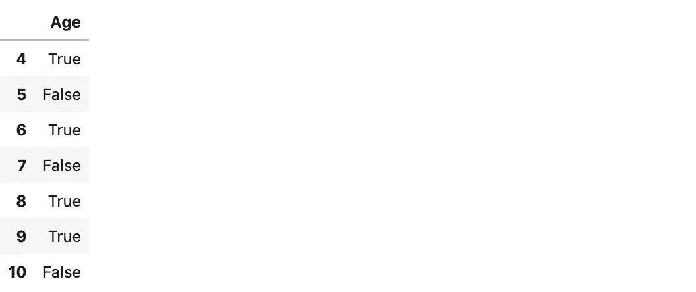

作者图片

**g)** 选择**特定值** s 在某种**条件下**使用`loc`。在这种情况下，从前 5 行中选择乘坐 C123 客舱的乘客。

`data.loc[:4, ['Cabin']] == 'C123'`


作者图片

# 7.布尔索引:iloc

`data.iloc[<lines>, <columns>]` #按位置和数字选择

**a)** 选择数据集的**第一行**。

`data.iloc[3]`


作者图片

**b)** 从所有列中选择一个**行数组**。

`data.iloc[6:12]`

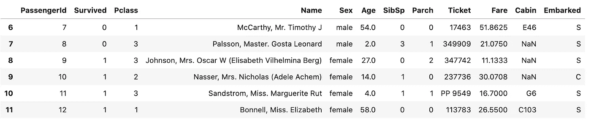

作者图片

**c)** 从所有列中选择**几行**。

`data.iloc[[7,28,39],:]`

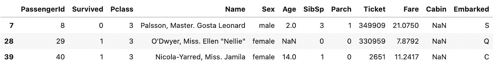

作者图片

**d)** 从栏“姓名”、“年龄”、“性别”和“幸存”中选择一个**行。**

`data.iloc[[7], [3,5,4,1]]`


作者图片

**e)** 从几列中选择**多行。**

`data.iloc[[7,28,39], [3,5,4,1]]`


作者图片

**f)** 选择**多行形成列的序列**。

`data.iloc[[7,28,39], 3:10]`


作者图片

**g)** 选择**其他值**。

*   从第 6 行到第 12 行，最后一列。

`data.iloc[6:13, -1]`

*   第 3 列和第 6 列的所有行。

`data.iloc[:, [3,6]]`

*   7，28，39 行，从第 3 列到第 6 列。

`data.iloc[[7,28,39], 3:7]`

*   最后一列的最后 20 行。

`data.iloc[-20:, -1:]`

# 8.基本处理数据

*   Axis = 0，表示行，如果没有给定，则默认为 axis = 0。
*   Axis = 1，表示列。

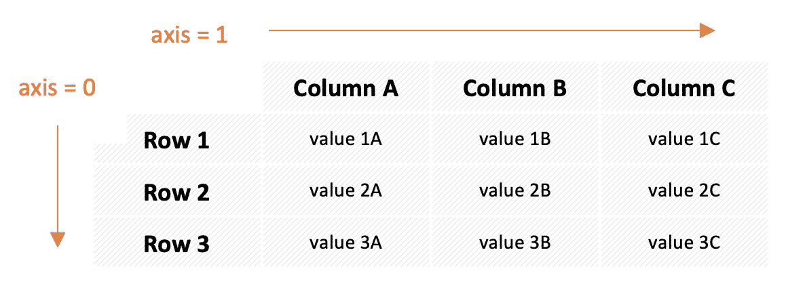

作者图片

**a)**删除缺失值 (nan)。

`data.isnull().values.any()` #是否有数据缺失？

```
True
```

如果没有将它赋给一个(新的)变量，您应该指定`inplace=True`，这样任何更改都可以在同一个评估上生效。

`data.dropna(axis=0, inplace=True)` #从行中删除 nan

`data.isnull().values.any()` #有没有数据缺失？

```
False
```

**b)移除立柱**。

`data.drop(columns=['PassengerId', 'Name'], axis=1).head()`

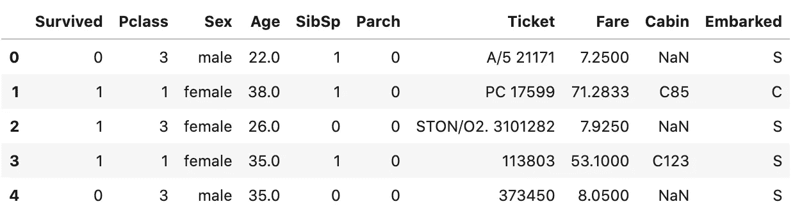

作者图片

**c)** 数值计数**也可以显示 NaN** 数值。

`data.Age.value_counts(dropna=False)`

```
NaN      177
24.00     30
22.00     27
18.00     26
28.00     25
        ... 
36.50      1
55.50      1
66.00      1
23.50      1
0.42       1
Name: Age, Length: 89, dtype: int64
```

**d)** **替换缺失值**(逐步)。

*   创建一个新的数据帧，**数据的副本** #以保持原始数据的完整性。

`new_df = data.copy()`

数据的平均值。年龄:

`new_df.Age.mean()`

```
29.69911764705882
```

*   用数据的平均值填充任意 **NAN。年龄并将结果分配给新列。**

`new_df['Age_mean'] = new_df.Age.fillna(new_df.Age.mean())`

数据的中间值。年龄:

`new_df.Age.median()`

```
28.0
```

*   用数据的中间值填充任何 **NAN。年龄并将结果分配给新列。**

`new_df['Age_median'] = new_df.Age.fillna(new_df.Age.median())`

*   **验证**结果。

`new_df[['Age', 'Age_mean', 'Age_median']].isnull().sum()`

```
Age           177
Age_mean        0
Age_median      0
dtype: int64
```

**显示第 106 至 110 行**以验证两个 NAN 样本的插补(在第 107 和 109 行)。

`new_df[['Age', 'Age_mean', 'Age_median']][106:110]`

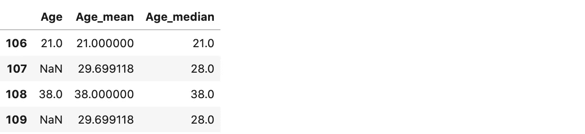

作者图片

## 已经累了？


乔希·威瑟斯在 [Unsplash](https://unsplash.com?utm_source=medium&utm_medium=referral) 上拍摄的照片

# 结论

我真诚地希望你发现这个指南是有用的，因为它可以对你的代码开发有所帮助。我将在未来更新它，并将其链接到其他 Python 教程。

请在下面的评论中发表你离不开的其他功能和方法，并强调它们。我想听听你的意见！

[](/machine-learning-costs-prediction-of-a-marketing-campaign-exploratory-data-analysis-part-i-758b8f0ff5d4) [## 机器学习:营销活动的成本预测(探索性数据分析——第一部分)

### 预测营销活动最佳目标候选人的数据科学方法

towardsdatascience.com](/machine-learning-costs-prediction-of-a-marketing-campaign-exploratory-data-analysis-part-i-758b8f0ff5d4) [](/costs-prediction-of-a-marketing-campaign-data-cleaning-feature-selection-part-ii-6aa5298909b5) [## 营销活动的成本预测(数据清理和特征选择——第二部分)

### 预测营销活动最佳目标候选人的数据科学方法

towardsdatascience.com](/costs-prediction-of-a-marketing-campaign-data-cleaning-feature-selection-part-ii-6aa5298909b5) 

# 联系人

*   [Linkedin](http://bit.ly/2ybRqYT)
*   [推特](https://bit.ly/3gAwMTP)
*   [中等](https://bit.ly/3gDC5Sp)
*   [GitHub](https://bit.ly/3hHvuHR)
*   [卡格尔](https://bit.ly/31Co038)
*   [电子邮件](mailto:goncaloggomes@gmail.com)

好的阅读，伟大的编码！