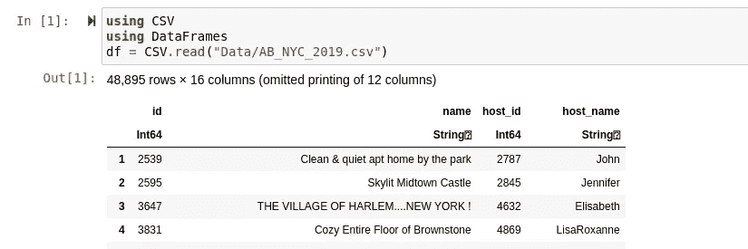
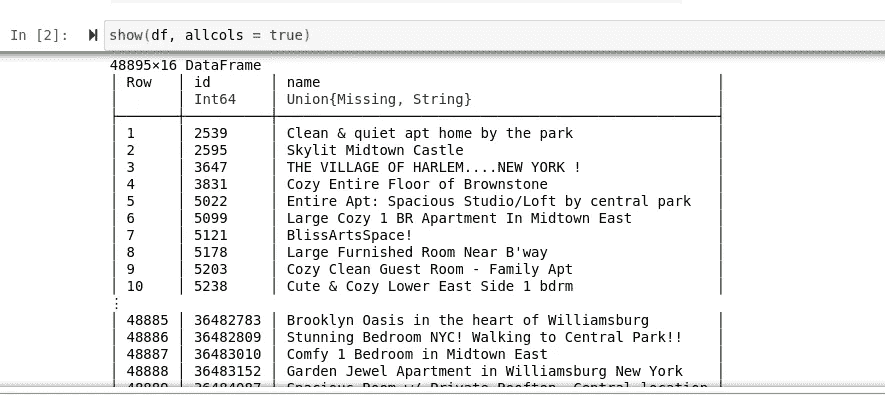
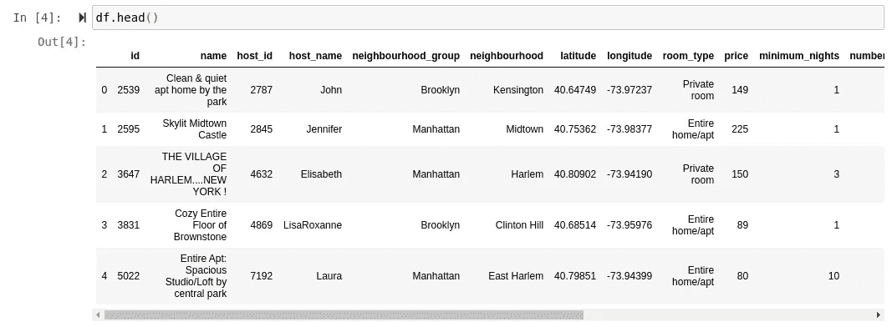
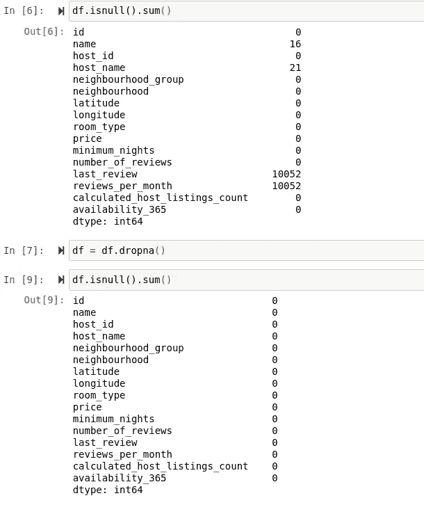
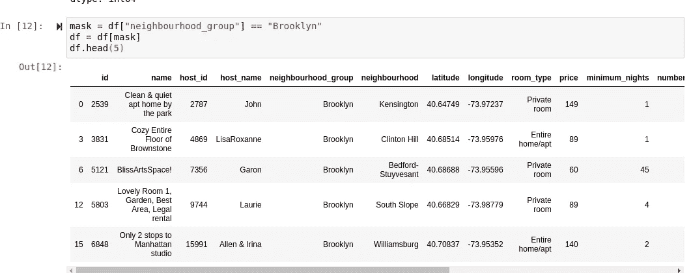
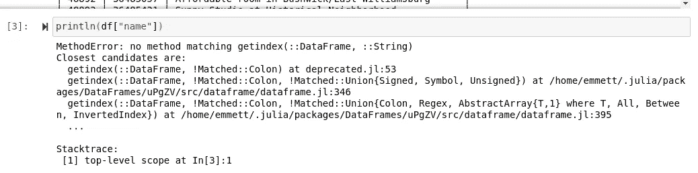
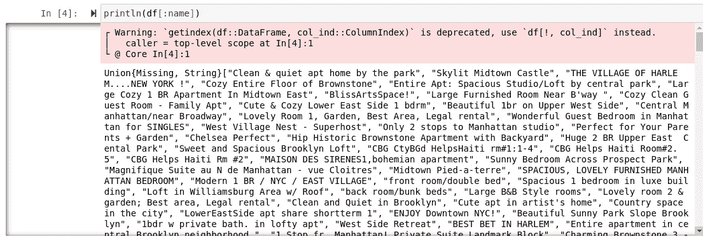

# 熊猫让 Python 变得更好

> 原文：<https://towardsdatascience.com/pandas-makes-python-better-ec6cc1e30233?source=collection_archive---------14----------------------->

## 熊猫携带 Python 进行数据处理


我想谈论很久的一件事是熊猫给 Python 带来的力量。Pandas 是 Python 中数据科学的一个基本包，因为它功能多样，非常擅长处理数据。我非常喜欢熊猫的一个部分是它奇妙的 IPython 和 Numpy 集成。这就是说，熊猫是直接与 Numpy 交织在一起的，就像花生酱与果冻交织在一起一样。难怪这两种组合在一个完整的包装中一起出售。


*抛开 Smucker 的 Goober* 笑话不谈，Pandas 巧妙地让 Python 成为一种更可行的数据科学语言，仅仅是因为它内置于其中。这并不是说 Python 没有大量模拟这种确切效果的精彩包，因为 Python 有无数用于机器学习和数据处理的包。Pandas 使得相对困难的事情，或者在其他语言中比较痛苦的事情，在 Python 中变得非常简单。

# IPython

支持熊猫的最大因素是——嗯，熊猫本身。该包从一开始就设计为包含 IPython 笔记本和 Numpy 等数据科学的主要产品。所有这些拼凑在一起的方式很有意义，但我不会告诉你这些，我将向你展示使用另一种语言的包是什么样子的，这是我最喜欢的:

> 朱莉娅

有趣的是，我们用来创建数据框的包是 DataFrames.jl。当然，我们现在将使用逗号分隔值文件(CSV 文件)。所以第一步是读入我们的数据…但是我们怎么做呢？在变更日志中，有一个叫做 read_table 的方法的简短提及，但是在大多数情况下，这似乎肯定是不赞成的。


这就是诀窍，为了用 DataFrames.jl 读入我们的 DataFrames，我们实际上必须得到另一个名为 CSV.jl 的包，添加这个包后，我们可以用 read()方法打开我们的 CSV 文件:

```
using CSV
df = CSV.read("Fizzbuzz")
```

太棒了，现在我们已经读取了我们的数据，但是我们在顶部得到了一个有趣的消息…



> “省略打印 12 列”

很好，但是为什么呢？出于某种奇怪的原因，他们选择在 Iframe 之外呈现数据帧，根据特定的列长度省略列。那么我们如何显示所有的列呢？显示所有的列非常容易，只需向 show 方法添加一个 bool 类型的参数，如下所示:



等等，那是什么？没错，它会转到一个基于文本的数据框，并打印出列

> 在彼此之上。

好消息是，老 showall！()方法，这意味着当我们显示所有列时，不必显示所有行。这很可能是我不久前开始使用字典的原因…

好吧，现在我们知道这对朱莉娅来说有多难，但是熊猫呢？嗯，你不会认为它会这么简单，但是你需要的唯一的包是 Pandas，你需要的唯一的方法是 read_csv，最后，但同样重要的是，你可以使用函数 df.head()打印出你选择的头部长度，使用 df.tail()打印出你选择的尾部长度。更不用说，看起来是这样的:



相信我，R 的数据框架也没有 panda 好，而且大多数使用 R 和 Julia 的人倾向于 PyCall Pandas，而不是使用他们各自语言的数据框架包。

# Numpy


umpy 是 Python 数据科学包三剑客的另一部分。Numpy 集成允许在数据框内使用 Numpy 的所有线性代数。此外，Numpy 的某些部分使数据处理变得更加容易。看看我一眨眼就销毁了一千多个空值！



重要的是要记住，鉴于 Python 是一种编程语言，普通 Python 和线性代数实际上并不像你想象的那样相处融洽。我认为这仅仅是因为 Python 比“线性代数”更高级，当然也不希望它成为许多公司现在深陷其中的统计语言。当然，我的 df.dropna()例子很简单，但是可以肯定的是，在某种程度上，与 Numpy 的紧密集成将使您的生活变得更加轻松！

# 熊猫本身

除了 Pandas 出色的集成和围绕其他 Python 包的方法论之外，Pandas 还有许多好处，这些好处是他们所做的所有出色的开源工作所提供的。每一个扭曲，每一个旋转，索引，连接，融合，旋转，甚至交叉制表都可以在熊猫的一行中完成。这些任务在其他包裹中确实可以提供一个完整小时的工作，但是用熊猫——它很容易而且即时。

通过 replace()函数这样的简单工具，使用 Pandas 变得更加容易，replace()函数可用于替换 nan，或者只是奇怪的数据。熊猫让很多工作变成了一点点工作，这就是它如此受欢迎和令人印象深刻的原因。但是熊猫还有更多巨大的好处。

## 字符串存取器

是的，传说是真的:

> 数据框被美化成字典。

但是并不是所有的字典都是一样的。首先，在我所知道的语言中，熊猫的条件掩蔽是迄今为止最好的。



在一个简单的步骤中，数据被完全过滤并准备就绪，所有这些都包含在 Pandas 中，而不需要实际运行任何额外的方法——因为毕竟，它只是一个字典。

Julia 也有字典，他们的 DataFrames.jl 包当然是完全相同的系统，但在我看来，在这种情况下，当它试图与熊猫站在一起时，它就彻底失败了。首先，为了使用布尔型遮罩，我们使用了过滤器！()方法。没问题，它有点不太优雅，但不管怎样，它工作得非常好。但是总的来说，在朱莉娅的字典中，有一个非常重要的问题很少被提及，这让我很惊讶。

Julia 的字典命名方案使用符号而不是字符串。这是一个很大的问题，因为我们所有键盘的底部都有一个邪恶的东西，

> 空格键。



如您所见，典型的字符串命名方案在 Julia 中不起作用。相反，Julia 使用的符号是通过在变量名前加一个冒号创建的。所以让我们用一个符号来代替:



好的，这是可行的，但是我们如何用一个空格来做这件事呢？这是个大问题，如果名称中有空格，就没有办法访问这个列，根本没有办法。当然，大多数数据框的列名中没有空格，因为使用 _ 比空格更合适，但是如果有呢？在 Julia 中唯一有意义的解决方案是打开 CSV 文件并更改其中的列名，这是一个大问题。

# 结论

> 我喜欢熊猫。

Pandas 是一个非常棒的包，它让数据科学在很大程度上变得非常容易。我当然希望 DataFrames.jl 可以模仿 Pandas 为 Python 数据科学社区所创造的东西。熊猫真正伟大的地方在于它周围的整个技术体系如何与它无缝衔接。

> Python 世界当然是一个美丽的世界。