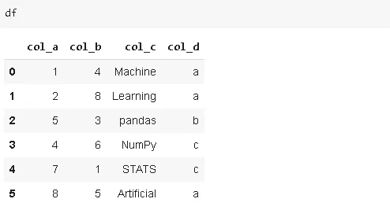
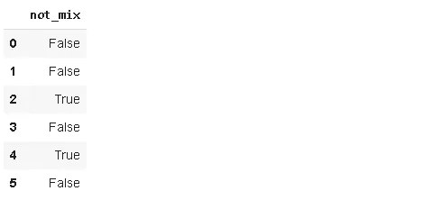
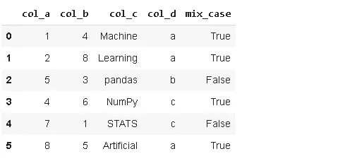
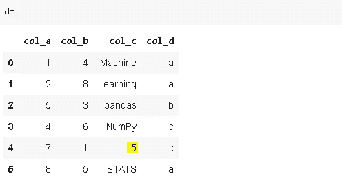
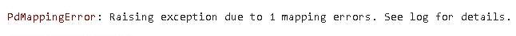
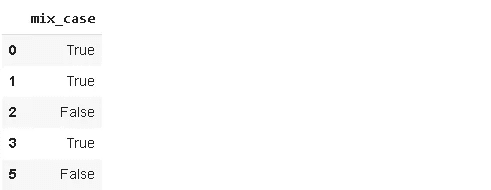
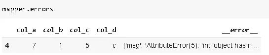

# 熊猫-mapper API

> 原文：<https://towardsdatascience.com/pandas-mapper-api-2f93400d1dca?source=collection_archive---------39----------------------->

## 以及它与应用功能有何不同


[公园巡警](https://unsplash.com/@parktroopers?utm_source=unsplash&utm_medium=referral&utm_content=creditCopyText)在 [Unsplash](https://unsplash.com/s/photos/community?utm_source=unsplash&utm_medium=referral&utm_content=creditCopyText) 拍摄的照片

Pandas 是一个非常强大和通用的 Python 数据分析库，它加速了数据科学项目的预处理步骤。它提供了许多在数据分析中非常有用的函数和方法。

虽然 Pandas 的内置功能能够执行高效的数据分析，但定制的库或 API 为 Pandas 增加了价值。在本帖中，我们将探索其中的一个，那就是[熊猫测绘员](https://pypi.org/project/pandas-mapper/)。

让我们从安装和导入开始。我们还需要进口熊猫，因为我们将在数据帧上工作。

```
pip install pandas-mapperimport pandas_mapper
import pandas as pd
```

Pandas-mapper 根据转换映射数据帧中的值。不如先做个例题，再解释语法。

考虑以下数据帧:



(图片由作者提供)

我们希望创建一个列来指示“col_c”中的字符串包含大写字母和小写字母。除了“pandas”和“STATS”之外的所有行都符合我们的描述。下面是我们如何用熊猫制图仪来完成这项任务。

```
df.mapping([('col_c', 'not_mix', 
lambda row: row.isupper() | row.islower())])
```

一旦安装了 pandas-mapper，我们就有了一个关于数据帧的新方法，即**映射**。

第一个参数是元组列表，它依次包含源列、目标列和转换。

应用**映射**时，定义的映射完成。

```
df.mapping([('col_c', 'not_mix', 
lambda row: row.isupper() | row.islower())]).**mapped**
```



(图片由作者提供)

我们可以用映射返回的内容创建一个新列，或者使用 inplace 参数。

```
df.mapping([('col_c', 'not_mix', 
lambda row: row.isupper() | row.islower())], **inplace=True**).mapped
```



(图片由作者提供)

Pandas-mapper 也接受用户定义的函数作为转换。下面的代码块将获得相同的结果。

```
def not_mix(row):
   if row.isupper() | row.islower():
      return False
   else:
      return Truedf.mapping([('col_c', 'mix_case', not_mix)], inplace=True).mapped
```

pandas-mapper 和 apply 函数的主要区别在于错误处理。

考虑一种情况，其中一个字符串列包含数字，我们需要基于字符串进行转换。



(图片由作者提供)

让我们尝试进行与上一步相同的转换。

```
mapper = df.mapping([('col_c', 'mix_case', not_mix)])df_transformed = mapper.mapped
```



我们出错了。 **on_error** 参数可用于处理此类错误。

```
mapper = df.mapping([('col_c', 'mix_case', not_mix)], **on_error**='redirect')df_transformed = mapper.mappeddf_transformed
```



任务在适当的行上完成。索引为 4 且不包含字符串的行保存在单独的数据帧中。我们可以使用**错误**方法来访问它。



(图片由作者提供)

到目前为止，我们一直致力于一对一的映射。Pandas-mapper 还支持一对多和多对多映射。

pandas 的功能丰富了第三方软件包，通过展示不同的方法和视角来改进数据分析过程。

用熊猫完成一项任务几乎总是有多种方式。例如，我们在这篇文章中做的一些事情也可以使用列表理解或 pandas 自己的字符串操作来完成。但是，最好知道其他替代方案，以防需要。

感谢您的阅读。如果您有任何反馈，请告诉我。