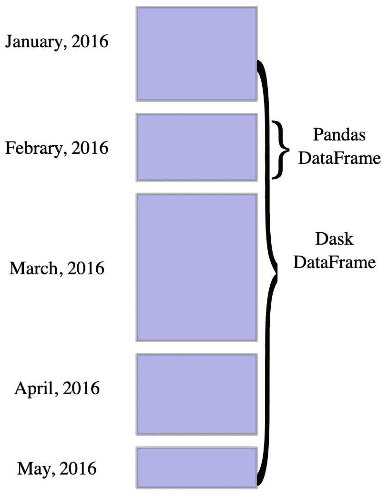
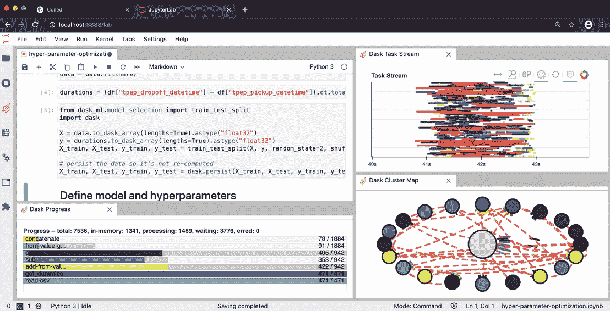

# 和达斯克一起在云上的熊猫

> 原文：<https://towardsdatascience.com/pandas-on-the-cloud-with-dask-9451199b0226?source=collection_archive---------26----------------------->

## 使用 Dask 将 Pythonic 数据科学和机器学习扩展到云。所有这些都来自您自己的笔记本电脑。


Elena Mozhvilo 在 [Unsplash](https://unsplash.com?utm_source=medium&utm_medium=referral) 上的照片

在进行数据科学和/或机器学习时，需要将分析扩大到更大的数据集变得越来越常见。

在 Python 和 PyData 生态系统中工作时，Dask 是一个流行的工具。原因有很多，其中之一是 Dask 可以很好地与所有 PyData 工具兼容。这是一个简单的系统，旨在并行化任何 PyData 库。

当开始处理更大的数据集时，您首先会希望*扩展*您的分析，以利用单个工作站的所有内核。

在这之后，你可能需要*横向扩展*你的计算来利用云上的集群(例如，AWS、Azure 或 Google 云平台)。

在本帖中，我们

*   使用熊猫演示数据科学工作流中的常见模式，
*   展示我们如何使用 Dask 来利用单个工作站的内核，并
*   展示我们如何使用[盘绕云](http://cloud.coiled.io/)将其扩展至云。有许多向外扩展到云的解决方案，但我对 Coiled 特别感兴趣，因为我们刚刚发布了我们的云产品。

你也可以在 Github 上找到所有的代码[。](https://github.com/coiled/data-science-at-scale/blob/master/01-data-analysis-at-scale.ipynb)

注意:你应该总是试着思考你是否真的需要扩展你的计算。例如，在这样做之前，也许你可以让你的熊猫代码更有效。如果你在做机器学习，画出学习曲线，以确保包含更多的数据将真正导致改善你的模型。

# 熊猫:数据科学中的一种常见模式

在这里，我们介绍数据科学中的一个常见模式，并展示如何在内存数据集上使用 pandas 来执行它。我们将检查纽约出租车数据集的 700MB 子集(总共约 10 GB)。

我们读入数据，并使用 groupby DataFrame 方法检查平均小费金额，作为乘客人数的函数:

```
# Import pandas and read in beginning of 1st file 
import pandas as pd 
df = pd.read_csv("data_taxi/yellow_tripdata_2019-01.csv") # Compute average tip as a function of the number of passengers df.groupby("passenger_count").tip_amount.mean()
```

这在我的笔记本电脑上花了大约 15 秒，在我愿意等待我的分析的容忍时间内。

接下来，我想对整个数据集执行完全相同的分析。

# DASK:扩展您的数据科学

回想一下，整个数据集大约有 10GB，这超过了我笔记本电脑上的可用 RAM，这意味着我无法将它存储在内存中。

我可以写一个 for 循环:

```
for filename in glob("~/data_taxi/yellow_tripdata_2019-*.csv"):
    df = pd.read_csv(filename)
    df.groupby("passenger_count").tip_amount.mean()
```

这没有利用我的笔记本电脑上的多个内核，也不是特别优雅。输入 Dask 表示单机并行度。

我们导入 Dask 的几个部分，启动一个本地集群并实例化一个 Dask 客户端:

```
from dask.distributed import LocalCluster, Client 
cluster = LocalCluster(n_workers=4) 
client = Client(cluster) 
client
```

然后，我们导入 Dask DataFrame，读入所有数据(延迟)，并计算相同的 groupby，就像上面我们对 pandas 所做的那样。

```
import dask.dataframe as dd

df = dd.read_csv(
    "data_taxi/yellow_tripdata_2019-*.csv",
    dtype={'RatecodeID': 'float64',
       'VendorID': 'float64',
       'passenger_count': 'float64',
       'payment_type': 'float64'}
)

mean_amount = df.groupby("passenger_count").tip_amount.mean().compute()
```

这在我的笔记本电脑上需要大约 3.5 分钟，这是可以忍受的。我想是的。然而，如果你想做任何稍微复杂一点的事情(提示:你通常会做)，这个时间会很快结束。

因此，如果我能够访问云上的集群，使用它将是一个好主意！



在此之前，让我们注意一下我们刚刚完成的几个方面:

*   我们使用了 Dask 数据帧，它本质上是一个大的虚拟数据帧，沿着索引分成多个 Pandas 数据帧。
*   我们正在研究一个本地集群，包括
*   一个*调度器*(它管理并发送工作/任务给工人)和
*   *工人*，他们计算任务。
*   我们实例化了一个 Dask 客户端，“集群用户面向用户的入口点。”

这意味着，无论你在哪里编写 Python 代码，客户机都在那里，客户机与调度程序对话，把任务传递给调度程序。



# 盘绕:横向扩展您的数据科学

现在是时候奔向云了。如果您能够访问云资源(比如 AWS ),并且知道如何配置 Kubernetes 和 Docker 容器，那么您就可以在云中运行 Dask 集群。然而，这仍然需要大量的时间。

另一种方法是使用线圈，我们将在这里介绍。为此，我还登录了[盘绕云](http://beta.coiled.io/)，安装了盘绕 pip，并通过了身份验证。如果您想继续学习，可以在终端中自己完成这项工作

```
pip install coiled --upgrade
coiled login  # redirects you to authenticate with github or google
```

然后，我们执行必要的导入，启动一个集群(大约需要一分钟)，并实例化我们的客户端:

```
import coiled
from dask.distributed import LocalCluster, Client
cluster = coiled.Cluster(n_workers=10)
client = Client(cluster)
```

然后我们可以导入我们的数据(这次是从 s3 ),并按以下方式执行分组:

```
import dask.dataframe as dd

# Read data into a Dask DataFrame
df = dd.read_csv(
    "s3://nyc-tlc/trip data/yellow_tripdata_2019-*.csv",
    dtype={
        'RatecodeID': 'float64',
       'VendorID': 'float64',
       'passenger_count': 'float64',
       'payment_type': 'float64'
    },
    storage_options={"anon":True}
mean_amount = df.groupby("passenger_count").tip_amount.mean().compute()
```

在 Coiled Cloud 上，这一切只花了不到 30 秒的时间，比我在笔记本电脑上花的时间少了一个数量级，即使对于这个相对简单的分析也是如此。

请注意能够在单个工作流程中完成这组分析的强大功能。没有必要转换上下文或环境。最重要的是，在 Coiled 中，当我们完成后，可以直接在我的本地工作站或 pandas 上使用 Dask。云计算在必要时很棒，但在不必要时会成为负担。

# 你需要更快的数据科学吗？

您也可以立即开始使用盘绕式集群。Coiled 还处理安全性、conda/docker 环境和团队管理，因此您可以继续研究数据科学。今天就在[卷云](https://cloud.coiled.io/)上免费开始吧。

*原载于 2020 年 9 月 23 日*[*https://coiled . io*](https://coiled.io/blog/dask-in-the-cloud/)*。*