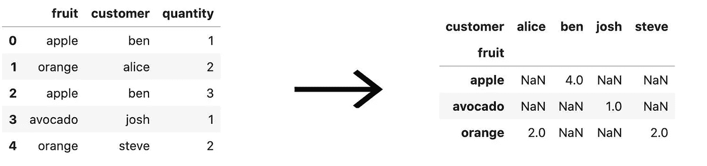
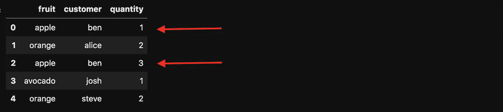
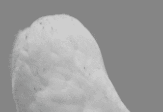
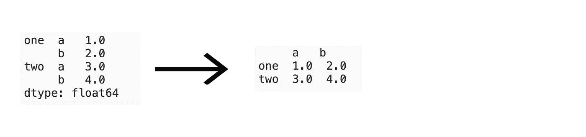
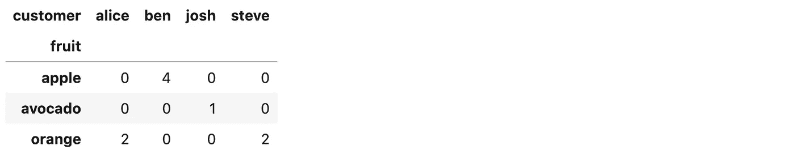
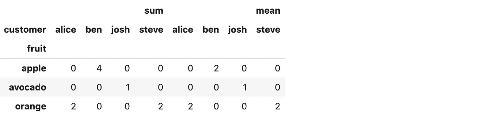
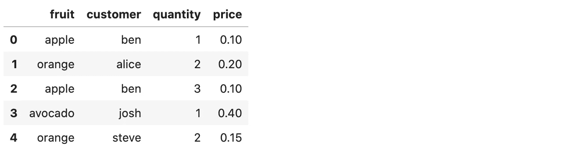
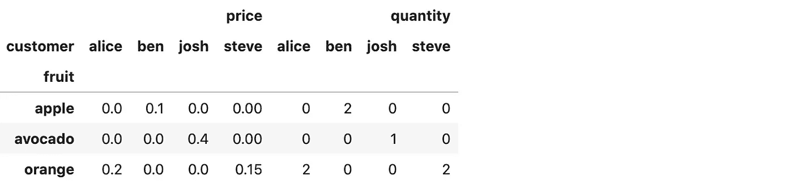
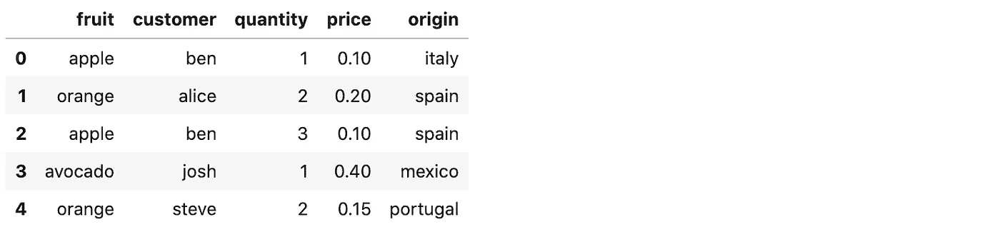
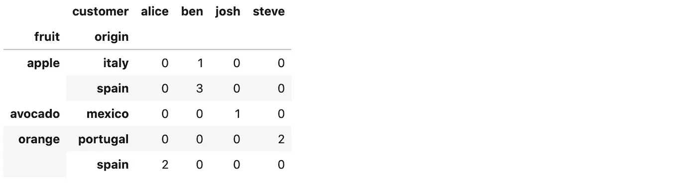

# 熊猫支点——终极指南

> 原文：<https://towardsdatascience.com/pandas-pivot-the-ultimate-guide-5c693e0771f3?source=collection_archive---------4----------------------->

## 你一直想知道但不敢问的关于熊猫的一切。


克里斯蒂安·弗雷南在 [Unsplash](https://unsplash.com?utm_source=medium&utm_medium=referral) 上拍摄的照片

andas pivot 是每个数据科学家的必备工具。有些人每天都使用它，有些人避免使用它，因为它看起来很复杂。我在后一组呆了很长时间。在我花时间做了一些研究后，我觉得我浪费了很多时间来编写不必要的代码。令我惊讶的是，我已经知道熊猫的主要组成部分了。这比看起来要简单。

**这里有几个你可能会感兴趣的链接:**

```
- [Complete your Python analyses 10x faster with Mito](https://trymito.io/) [Product]- [Free skill tests for Data Scientists & ML Engineers](https://aigents.co/skills) [Test]- [All New Self-Driving Car Engineer Nanodegree](https://imp.i115008.net/c/2402645/1116216/11298)[Course]
```

你愿意阅读更多这样的文章吗？如果是这样，你可以点击上面的任何链接来支持我。其中一些是附属链接，但你不需要购买任何东西。

# **什么是数据透视表？**

数据透视表是一个统计表，它汇总了一个更广泛的表中的数据。实际上，数据透视表是根据值的细分来计算统计数据的。对于第一列，它将值显示为行，第二列显示为列。

让我们来看一个数据透视表的例子，它根据水果和顾客的分类来计算总和统计:



左边的表是右边数据透视表的基表。

# 我如何能在熊猫里旋转一张桌子？

Pandas 有一个 pivot_table 函数，它在数据帧上应用透视。它还支持 aggfunc，该函数定义旋转时要计算的统计数据(aggfunc 默认为 np.mean，它计算平均值)。我在下面的例子中使用总和。

让我们定义一个数据帧并应用 pivot_table 函数。

```
df = pd.DataFrame(
    {
        "fruit": ["apple", "orange", "apple", "avocado", "orange"],
        "customer": ["ben", "alice", "ben", "josh", "steve"],
        "quantity": [1, 2, 3, 1, 2],
    }
)
```

我想有一个水果行(指定索引)和列(指定列)的客户细分。对于每一项，我想计算数量的总和。结果与上表相同。

```
df.pivot_table(index="fruit", columns="customer", values="quantity", aggfunc=np.sum)
```

# 为什么我在透视时得到一个值错误？


Gif 来自 [giphy](https://giphy.com/gifs/in-name-last-h4Z6RfuQycdiM)

最可能的原因是您使用了 pivot 函数而不是 pivot_table。这让我困惑了很多次。Pandas pivot 函数是一个功能不太强大的函数，它不需要聚合就可以处理非数字数据。

出现错误“值错误:索引包含重复条目，无法重新整形”,因为您的 DataFrame 中有重复条目。如果我要透视上面的数据帧，我会得到同样的错误，因为 apple 和 ben 是重复的，并且透视函数不聚合。



当我浏览 pivot 函数的 [pandas 源代码时，它帮助我理解了这个问题。基本上，它的功能与下面的命令相同:](https://github.com/pandas-dev/pandas/blob/master/pandas/core/reshape/pivot.py#L427)

```
df.set_index(["fruit", "customer"])["quantity"].unstack()
```

# 旋转时实际上发生了什么操作？



Gif 来自 [giphy](https://giphy.com/gifs/gets-smart-question-vQqeT3AYg8S5O)

起初，旋转对你来说似乎是一个难以理解的概念。但是如果我告诉你你一直都在使用它——至少是熊猫旋转的核心命令。让我们看看下面的命令:

```
df.groupby(['fruit', 'customer']).quantity.sum().unstack()
```

你在熊猫用过 groupby 功能吗？sum 命令呢？什么事？我想是的。上述命令的输出与 pivot_table 的输出相同。

我没有多次使用过拆分，但它基本上可以将多索引拆分成列，如下图所示



拆垛操作

# 如何将缺失值设置为 0？

不要再说了！pivot_table 有一个 fill_value 参数来替换缺少的值。默认情况下没有。让我们试一试。

```
df.pivot_table(index="fruit", columns="customer", values="quantity", aggfunc=np.sum, fill_value=0)
```



# 我可以同时计算多个统计数据吗？

pivot_table 函数的参数 aggfunc 采用函数列表。让我们用和与平均来试试。

```
df.pivot_table(index="fruit", columns="customer", values="quantity", aggfunc=[np.sum, np.mean], fill_value=0)
```



# 我可以同时聚合多个值吗？


Gif 来自 [giphy](https://giphy.com/gifs/doctor-who-guitar-peter-capaldi-wCiFka9RsSW9W)

你可以！与 aggfunc 参数类似，values 参数接受列名列表。让我们给数据框架添加一个价格列。

```
df['price'] = [0.1, 0.2, 0.1, 0.4, 0.15]
```



现在我们有两列值，让我们应用 pivot_table 函数:

```
df.pivot_table(index="fruit", columns="customer", values=["quantity", "price"], aggfunc=np.mean, fill_value=0)
```



# 我可以进一步细分行/列吗？

答案还是肯定的。参数 index 和 column 都采用列表。让我们将水果的来源列添加到数据框架中。

```
df['origin'] = ['italy', 'spain', 'spain', 'mexico', 'portugal']
```



现在，让我们按行和按列对水果和产地进行细分。

```
df.pivot_table(
    index=["fruit", "origin"],
    columns=["customer"],
    values=["quantity"],
    fill_value=0,
    aggfunc=np.mean,
)
```



它就像一个魔咒！

# 在你走之前

在 [Twitter](https://twitter.com/romanorac) 上关注我，在那里我定期[发布关于数据科学和机器学习的](https://twitter.com/romanorac/status/1328952374447267843)消息。


照片由[Courtney hedge](https://unsplash.com/@cmhedger?utm_source=medium&utm_medium=referral)在 [Unsplash](https://unsplash.com/?utm_source=medium&utm_medium=referral) 拍摄