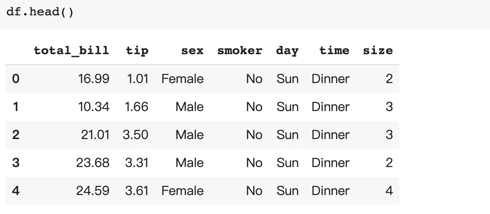
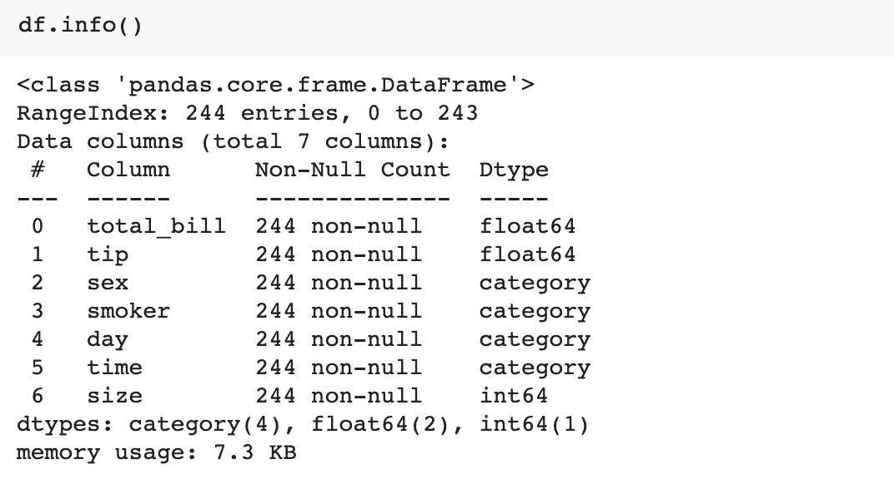
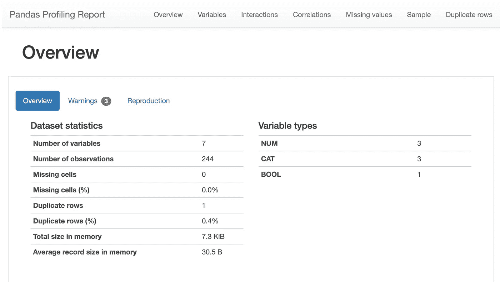
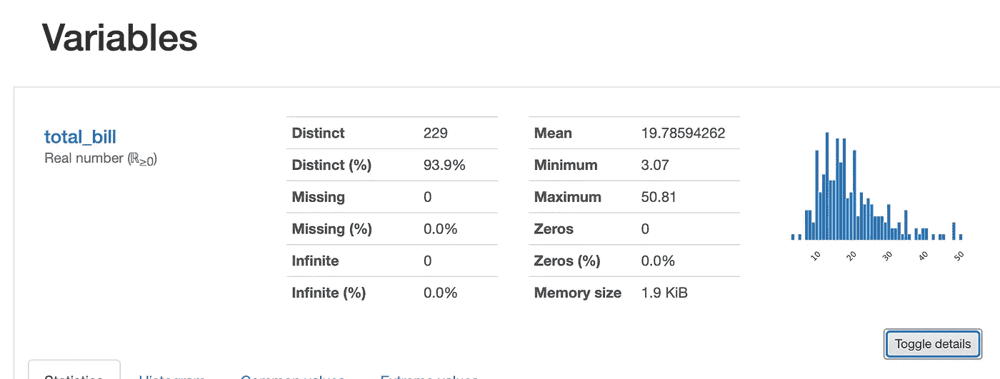
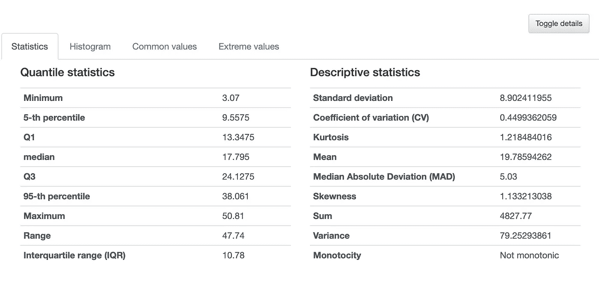
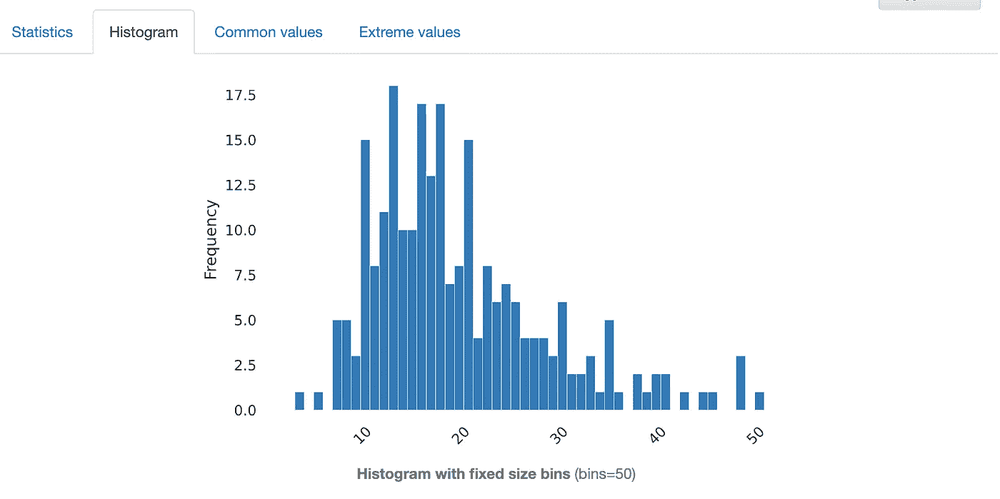
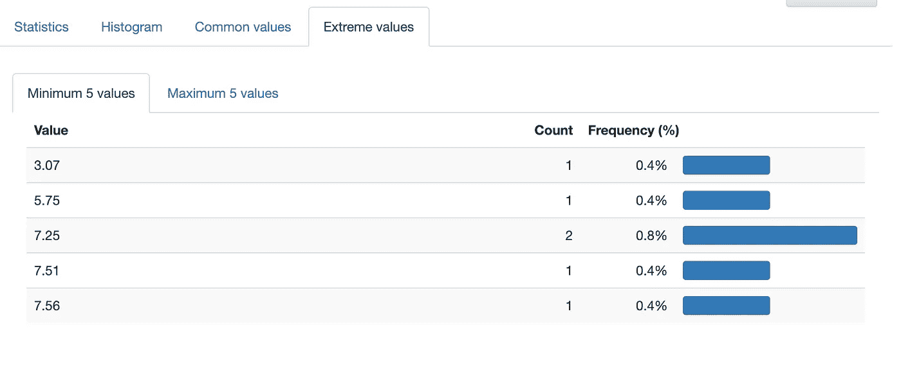
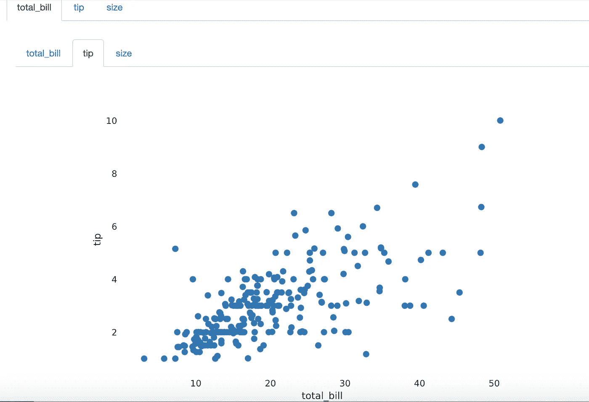
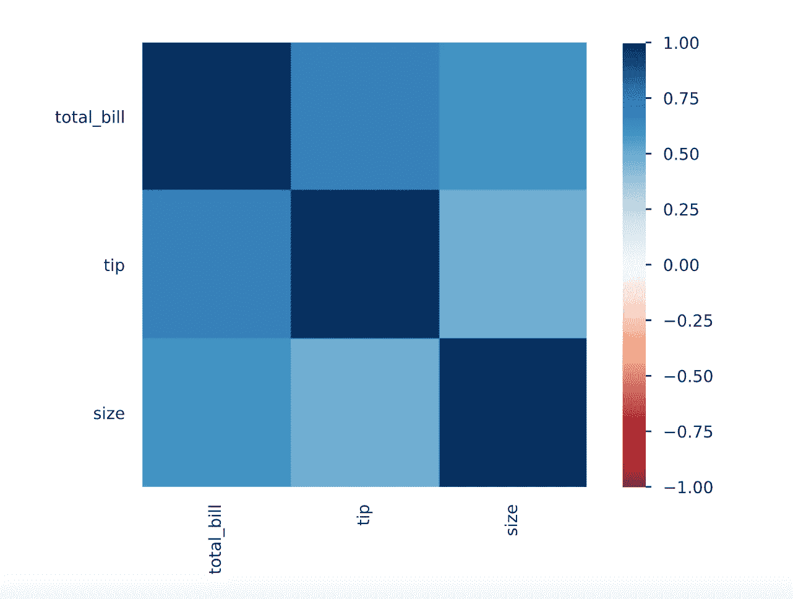

# 熊猫图谱——一个强大的探索性数据分析工具

> 原文：<https://towardsdatascience.com/pandas-profiling-a-powerful-exploratory-data-analysis-tool-9c245079be4?source=collection_archive---------49----------------------->

## 只用一行代码就可以快速浏览您的数据


照片由 [Sid Balachandran](https://unsplash.com/@itookthose?utm_source=medium&utm_medium=referral) 在 [Unsplash](https://unsplash.com?utm_source=medium&utm_medium=referral) 上拍摄

# 介绍

在获得用于分析的新数据集之后，第一步是理解数据，例如，理解数据类型、唯一值的数量、缺失值、数据的分布等..

Pandas 提供了一些有用的函数，比如用`info()`获得数据集的概览，`summary()`获得数值变量的汇总，`nunique()`获得唯一值的数量，`hist()`检查分布，等等。每当我们得到一个新的数据集时，人们都必须做这种多步骤的工作。

[**Pandas-profiling**](https://pandas-profiling.github.io/pandas-profiling/docs/master/rtd/)是一个强大的工具，只需一行代码就能使 EDA 过程变得容易得多。它分析数据集—结合多个步骤，并创建一个交互式 HTML 报告。

# 熊猫-侧写

首先，我们需要安装软件包。

```
!pip install -U pandas-profiling[notebook]
```

这里我将使用一个提示数据集作为例子。一旦我们加载了数据集，通常我们会打印出几行来检查数据。



并使用`info()`来大致了解数据结构。



然后通常检查其他函数，例如重复、缺失值、唯一值、分布、统计等。

在 **pandas_profiling** 中，这些 EDA 步骤可以简化为一个步骤。

```
from pandas_profiling import ProfileReportprofile = ProfileReport(df, title='Pandas Profiling Report')
```

然后使用:

```
profile.to_widgets()
```

以生成报告。这将在 Juypter notebook 中创建一个交互式小部件。

或者您可以使用:

```
profile.to_notebook_iframe()
```

做出这样的 HTML 报告。您将获得数据的概述:



变量分析:



直方图，以及离群值。



它还检查变量之间的相互作用和相关性:



如有必要，您可以保存 HTML。

```
profile.to_file(output_file="pandas_profiling.html")
```

# **结论**

总的来说，在数据分析的开始阶段快速了解数据集是一个有用的工具。它在一行代码中结合了我们通常使用纯熊猫所采取的步骤。

感谢阅读，我希望你喜欢这个工具。

请随意查看我的其他文章:

[](/data-visualization-in-pandas-2a7898e65114) [## 熊猫中的数据可视化

### 仅使用熊猫进行快速数据可视化

towardsdatascience.com](/data-visualization-in-pandas-2a7898e65114) [](/10-pandas-tricks-to-make-my-data-analyzing-process-more-efficient-part-2-b72ea43a0bb5) [## 让我的数据分析过程更高效的 10 个熊猫窍门:第二部分

### 我希望我早点知道的技巧

towardsdatascience.com](/10-pandas-tricks-to-make-my-data-analyzing-process-more-efficient-part-2-b72ea43a0bb5) [](/10-pandas-tricks-to-make-my-data-analyzing-process-more-efficient-part-1-78a0cc1636f3) [## 让我的数据分析过程更高效的 10 个熊猫窍门:第 1 部分

### 我希望我早点知道的技巧

towardsdatascience.com](/10-pandas-tricks-to-make-my-data-analyzing-process-more-efficient-part-1-78a0cc1636f3) [](/7-numpy-tricks-to-make-my-code-better-and-smarter-9e8a4ccf43d1) [## 让我的代码更好更聪明的 7 个小技巧

### 我希望我早点知道的技巧

towardsdatascience.com](/7-numpy-tricks-to-make-my-code-better-and-smarter-9e8a4ccf43d1) [](/7-python-tricks-to-make-my-code-better-and-smarter-60dfde0b6c49) [## 让我的代码更好更聪明的 7 个 Python 技巧。

### 我希望我能早点知道的技巧。

towardsdatascience.com](/7-python-tricks-to-make-my-code-better-and-smarter-60dfde0b6c49)