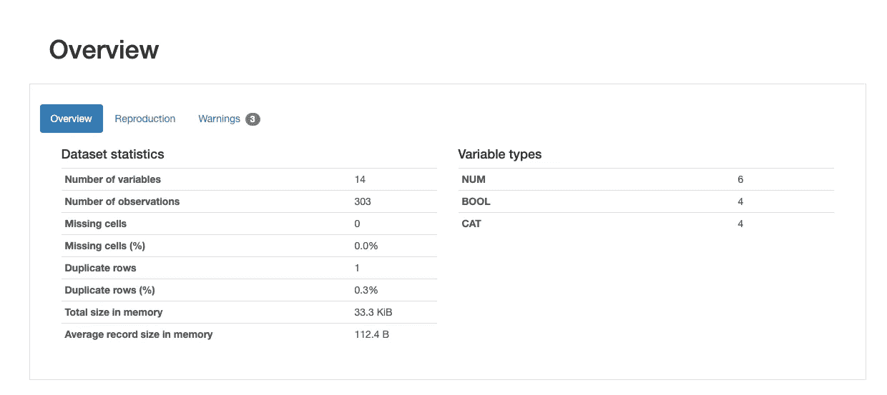
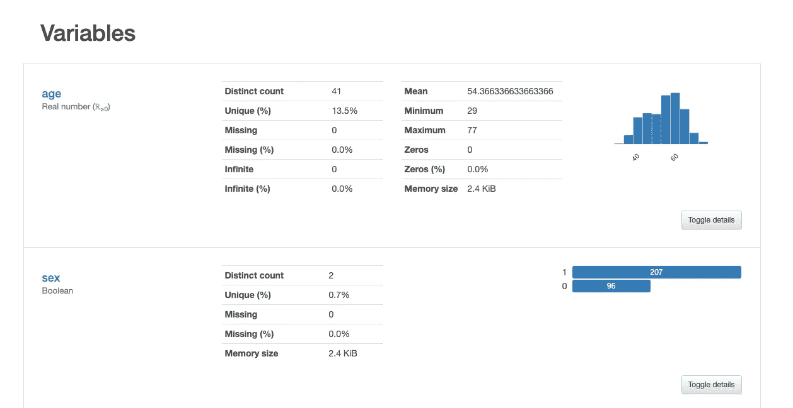
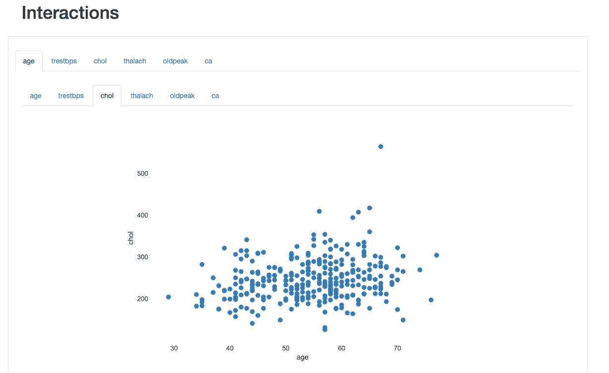
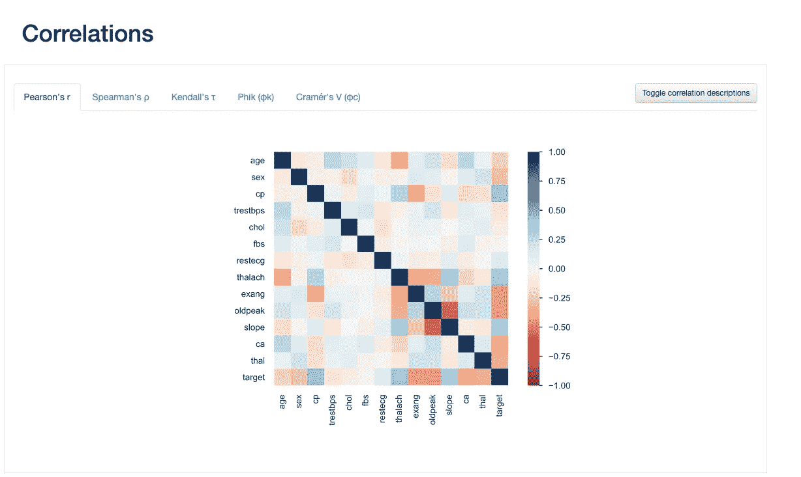
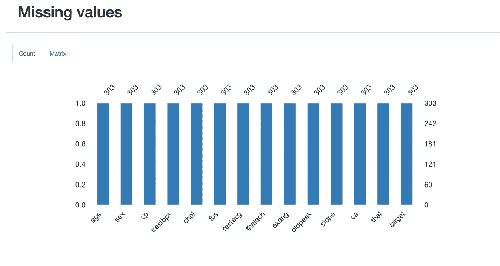
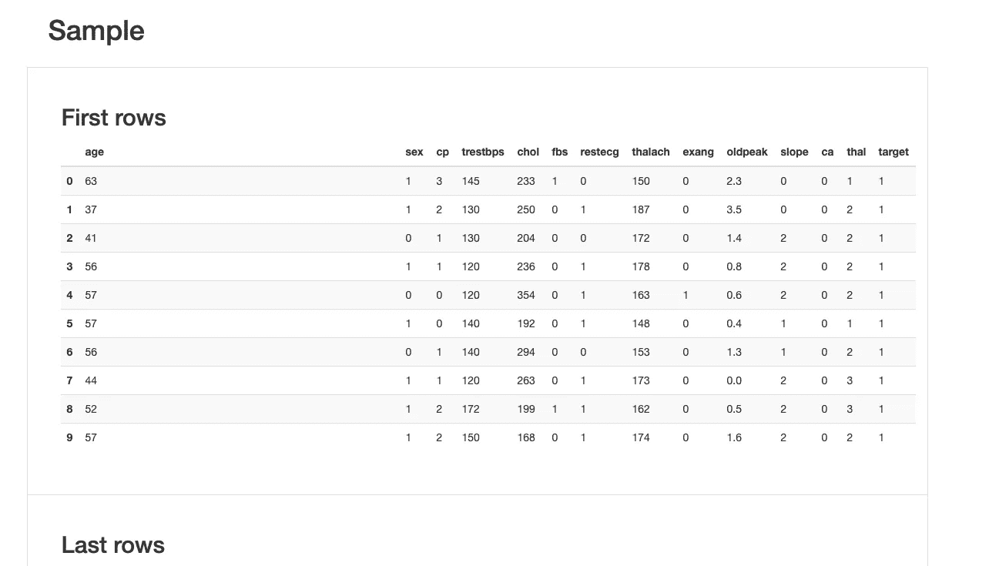
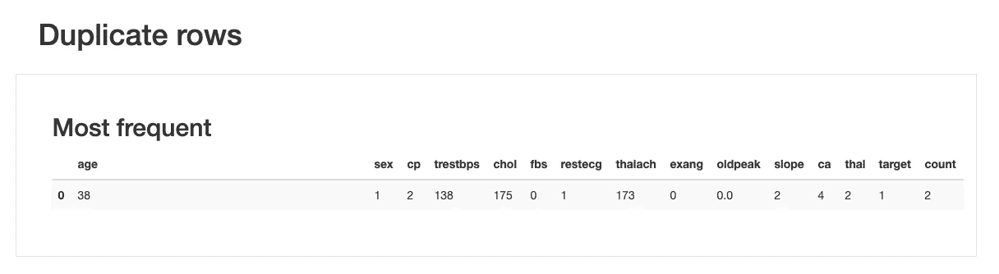

# 熊猫概况和探索性数据分析的第一行代码！

> 原文：<https://towardsdatascience.com/pandas-profiling-and-exploratory-data-analysis-with-line-one-of-code-423111991e58?source=collection_archive---------17----------------------->

## 了解如何为自动 EDA 安装和使用 pandas profiling


科林·伯伦斯来自[的图片](https://pixabay.com/?utm_source=link-attribution&utm_medium=referral&utm_campaign=image&utm_content=3068300)

**简介**

如果你已经熟悉熊猫概况包，你不会从这篇文章中学到任何新东西，所以你现在可以跳过它。

然而，如果你从未听说过它，这可能是迄今为止你得到的关于数据分析的最好的生产力提示之一，所以坚持住。

**熊猫简介**

Pandas profiling 是一个包，它允许您用最少的努力创建一个探索性的分析数据报告，一行代码。

因此，如果您是一名数据科学家或分析师，一直在手动进行探索性数据分析，那么使用 pandas profiling 将为您节省大量时间、精力和打字。你还记得做探索性数据分析时使用的所有重复代码吗，比如:

> info()，
> 
> 描述()，
> 
> isnull()，
> 
> corr()，
> 
> 等等。

你不用再做了。Pandas profiling package 将为您完成这项工作，并为您的数据创建一份完整的摘要报告。

> 所以让我们开始吧！

**如何安装熊猫评测包**

熊猫档案的安装非常容易。您可以使用标准的 pip 命令。

```
pip install pandas-profiling
```

安装这个包需要一两分钟的时间，你应该已经准备好在 python 中使用 pandas profiling 了。

**如何创建分析报告**

为了创建报告，您可以使用标准的 read_csv()函数加载数据集，该函数将数据存储在 pandas 数据框中。

然后使用 ProfileReport 初始化器，并向它传递一个刚刚创建的数据帧作为参数。

您可以使用 to_file()函数来导出报告，以便进行检查。

```
import pandas as pd
from pandas_profiling import ProfileReportdf = pd.read_csv(data_file_name)report = ProfileReport(df)report.to_file(output_file='output.html')
```

> 我们来看一个真实的例子。

我们将为真实数据集创建一个报告。我们选择了一个关于心脏病的数据集，可以从[这里](https://www.kaggle.com/ronitf/heart-disease-uci)下载。这个数据集大小为 33 KB，有 14 列，303 个观察值。

让我们使用 pandas profiling 为这个数据集创建一个报告。

```
from pandas_profiling import ProfileReportdf = pd.read_csv('heart.csv')report = ProfileReport(df)report.to_file(output_file='output.html')
```

运行这段代码后，您应该会看到报告生成的进度条，在几秒钟内，您应该能够通过在浏览器中打开*output.html*文件来查看完整的报告。

> 是的，就是这么简单！报告准备好了，你可以看了！

** * *报告应保存在读取原始数据的同一文件夹中。*

**报表结构**

让我们看看熊猫概况报告中包含了什么。

*   [概述](#overview)

在概述部分，我们应该看到三个选项卡:*概述*、*再现*和*警告*。

*概览*选项卡给出数据的基本信息，如列数和行数、数据大小、缺失值百分比、数据类型等。

*再现*包含关于报告创建的信息。

*警告*选项卡包括生成报告时触发的警告。



*   [变量](#variables)

本节重点对每个变量进行详细分析。

如果变量是连续的，它将显示一个直方图，如果是分类的，它将显示一个带有值分布的条形图。

您还可以看到每个变量缺失值的百分比。

下图显示了对心脏病数据集的*年龄*和*性别*变量的分析。



*   [互动](#interactions)

交互作用部分关注数值变量之间的二元关系。您可以使用选项卡来选择要检查的关系对。下图是*年龄*和*胆固醇*的关系。



*   [相关性](#correlations)

本节显示了不同类型的相关性。您可以查看数字变量的 Pearson、Spearman、Kendall 和 Phik 相关以及分类变量的 Cramer V 相关的报告。



*   [缺失值](#missing)

这一部分显示列分解后数据集中缺失的值。

我们可以看到我们的数据集在 my 的列中没有丢失值。



*   [样品](#sample)

这是一个取代手工数据分析的 head()和 tail()函数的部分。您可以看到数据集的第一行和最后 10 行。



*   [重复行](#duplicate)

此部分显示数据集中是否有重复的行。在心脏病数据集中实际上有一个重复的条目，其细节显示在下面的截图中。



**缺点**

在这篇文章中，我们已经谈了很多关于熊猫概况包的优点，但有任何缺点吗？是的，我们来提一些。

如果您的数据集非常大，创建一个报告需要很长时间(在极端情况下可能需要几个小时)。

我们有一些使用概要分析包的基本 EDA，这是数据分析的良好开端，但它肯定不是一个完整的探索。通常我们会看到更多的图形类型，如箱线图、更详细的条形图，以及一些其他类型的可视化和探索技术，它们将揭示特定数据集的古怪之处。

此外，如果您刚刚开始您的数据科学之旅，可能值得学习如何使用 pandas 本身收集报告中包含的信息。这是为了让你练习编码和操作数据！

> 否则，我认为它是一个伟大的和非常有用的包！

**总结**

在本文中，我们向您展示了如何安装和使用 pandas profiling。我们甚至向您展示了对结果的快速解释。

下载[心脏病数据集](https://www.kaggle.com/ronitf/heart-disease-uci)自己试试。

*最初发布于 aboutdatablog.com:* [熊猫剖析和探索性数据分析，代码第一行！](https://www.aboutdatablog.com/post/pandas-profiling-and-exploratory-data-analysis-with-line-one-of-code)，*2020 年 6 月 6 日。*

*PS:我正在 Medium 和*[***aboutdatablog.com***](https://www.aboutdatablog.com/)*上撰写深入浅出地解释基本数据科学概念的文章。你可以订阅我的* [***邮件列表***](https://medium.com/subscribe/@konkiewicz.m) *以便在我每次写新文章时得到通知。如果你还不是中等会员，你可以在这里加入*[](https://medium.com/@konkiewicz.m/membership)**。**

*下面还有一些你可能喜欢的帖子*

*[](/9-pandas-visualizations-techniques-for-effective-data-analysis-fc17feb651db) [## 9 熊猫有效数据分析的可视化技术

### 学习如何使用折线图、散点图、直方图、箱线图和其他一些可视化技术

towardsdatascience.com](/9-pandas-visualizations-techniques-for-effective-data-analysis-fc17feb651db) [](/what-are-lambda-functions-in-python-and-why-you-should-start-using-them-right-now-75ab85655dc6) [## python 中的 lambda 函数是什么，为什么你现在就应该开始使用它们

### 初学者在 python 和 pandas 中开始使用 lambda 函数的快速指南。

towardsdatascience.com](/what-are-lambda-functions-in-python-and-why-you-should-start-using-them-right-now-75ab85655dc6) [](/jupyter-notebook-autocompletion-f291008c66c) [## Jupyter 笔记本自动完成

### 数据科学家的最佳生产力工具，如果您还没有使用它，您应该使用它…

towardsdatascience.com](/jupyter-notebook-autocompletion-f291008c66c)*