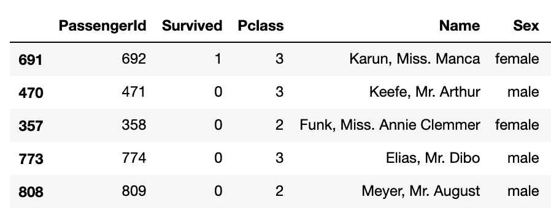
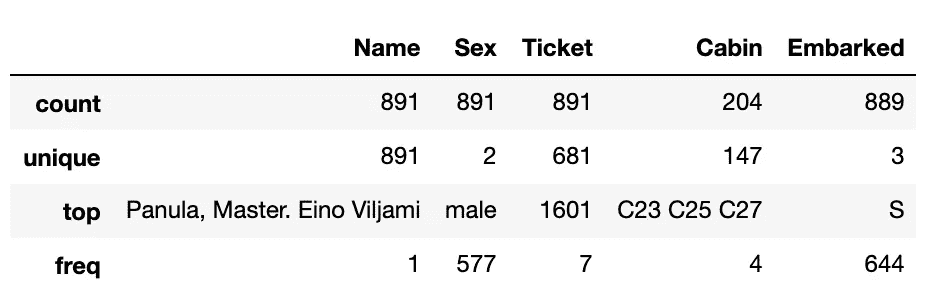

# 熊猫:收起新手数据分析师的身份(第 1 部分)

> 原文：<https://towardsdatascience.com/pandas-put-away-novice-data-analyst-status-part-1-7e1f0107dae0?source=collection_archive---------27----------------------->

## 熊猫如何让你成为更好的数据分析师？了解数据分析过程中不同步骤的一行程序。


[芝扬](https://unsplash.com/@qzyang?utm_source=medium&utm_medium=referral)在[上拍照](https://unsplash.com?utm_source=medium&utm_medium=referral)

我称之为熊猫**P**ut**A**way**N**ovice**D**ATA**A**analyst**S**tatus 是一个强大的开源数据分析和操作库。它可以帮助您对数据进行各种操作，并生成不同的报告。我要把它分成两篇文章-

1.  基础知识——我将在这个故事中讲述。我将介绍熊猫的基本功能，这些功能将向您概述如何开始使用熊猫，以及它如何帮助您节省大量时间。
2.  高级-引导您使用高级功能，轻松解决复杂的分析问题。它涵盖了样式、绘图、数据透视表等主题。务必检查[第二部分](https://medium.com/@ankit.goel.ankit/pandas-put-away-novice-data-analyst-status-part-2-8df616d5ac7c)。

[](/pandas-put-away-novice-data-analyst-status-part-2-8df616d5ac7c) [## 熊猫:收起新手数据分析师的身份(第 2 部分)

### 了解如何使用新冠肺炎数据绘制、设计、多索引或透视您的熊猫数据框架。

towardsdatascience.com](/pandas-put-away-novice-data-analyst-status-part-2-8df616d5ac7c) 

在文章结束时，你应该能够回答以下问题—

1.  如何读取不同格式的数据？
2.  使用不同 API 的数据探索。
3.  数据维度是什么。
4.  如何查找数据汇总？
5.  如何检查关于数据的不同统计？
6.  如何选择数据子集？
7.  一个线性来计算每个值的频率的唯一值。
8.  如何根据条件过滤数据？
9.  以不同格式保存数据。
10.  使用链接应用多个操作。

开始之前，请确保您已经安装了熊猫。如果没有，您可以使用下面的命令下载它。

```
# If you are using Anaconda Distribution (recommended)
conda install -c conda-forge pandas# install pandas using pip
pip install pandas# import pandas in notebook or python script
import pandas as pd
```

如果您还没有为您的数据分析或数据科学项目设置环境，您可以参考我的博客“[如何开始您的数据科学之旅](https://medium.com/swlh/start-your-data-science-journey-today-37366ee463f)”，它将带您了解您可以使用的不同库以及如何安装它们。

在这个练习中，我将使用著名的泰坦尼克号数据集。我**推荐**你从 Github 下载数据和笔记本。将其复制到您的环境中，并遵循它。

[](https://github.com/ankitgoel1602/data-science/tree/master/data-analysis/pandas) [## ankitgoel 1602/数据科学

### 熊猫:收起新手数据分析状态。这个库给出了你可以使用的不同熊猫 API 的概述…

github.com](https://github.com/ankitgoel1602/data-science/tree/master/data-analysis/pandas) 

关于数据的更多细节，可以参考 [Kaggle](https://www.kaggle.com/c/titanic/data?select=train.csv) 。

让我们开始，我试图保持数据分析的一般流程，就像从读取数据开始，然后经历数据分析过程中的不同步骤。

## 1.使用 read_csv 或 read_excel 或 read_json 读取数据

任何数据分析的起点都是获取数据集。Pandas 提供不同的功能来读取不同格式的数据。最常用的是—

## read_csv()

这允许您读取 CSV 文件。

```
pd.read_csv('path_to_your_csv_file.csv')
```

Pandas 提供了不同的选项来配置列名、数据类型或您想要读取的行数。查看熊猫 [read_csv](https://pandas.pydata.org/pandas-docs/stable/reference/api/pandas.read_csv.html) API 了解更多详情。


熊猫提供了不同的 read_csv 选项。来源- [熊猫文献](https://pandas.pydata.org/pandas-docs/stable/reference/api/pandas.read_csv.html)。

## read_excel()

这允许您读取 Excel 文件。

```
pd.read_excel('path_to_your_excel_file.xlsx')
```

像 CSV 一样，Pandas 为 read_excel 提供了一组丰富的选项，允许您读取 excel 中特定的工作表名称、数据类型或要读取的行数。查看 Pandas [read_excel](https://pandas.pydata.org/pandas-docs/stable/reference/api/pandas.read_excel.html) API 了解更多细节。

## read_json()

Pandas 的这个 API 有助于读取 JSON 数据，对于已经扁平化的数据非常有用。让我们以一个 JSON 为例，看看如何将它转换成平面表。

```
# Sample Record: Flattend JSON i.e. no nested array or dictionary
json_data = {
    "Scaler": "Standard",
    "family_min_samples_percentage": 5,
    "original_number_of_clusters": 4,
    "eps_value": 0.1,
    "min_samples": 5,
    "number_of_clusters": 9,
    "number_of_noise_samples": 72,
}# reading JSON data
pd.read_json(json_data)
```

只是看了 JSON 就把它转换成了下面的平面表。


当 JSON 数据是半结构化的，即包含嵌套的列表或字典时，它就不能很好地工作。Pandas 确实为此提供了一个 API json_normalize，如果你想了解更多，请查看

[](/how-to-parse-json-data-with-python-pandas-f84fbd0b1025) [## 如何用 Python 熊猫解析 JSON 数据？

### 使用 Pandas 读取 JSON 数据并将其规范化为平面表的一行程序。

towardsdatascience.com](/how-to-parse-json-data-with-python-pandas-f84fbd0b1025) 

不仅如此，Pandas 还支持许多其他数据类型。如果您使用其他数据类型，请务必查看 [Pandas 文档](https://pandas.pydata.org/pandas-docs/stable/reference/io.html)。

使用 read_csv 命令读取我们将在这里使用的 titanic 数据集-

```
# You can get it from the Github link provided.# Loading Titanic Dataset into titanic_data variable
titanic_data = pd.read_csv('titanic_train.csv')
```

这将创建一个 Pandas 数据帧(类似于表)并将其存储到 titanic_data 变量中。

接下来，我们将看到如何获得关于我们加载的数据的更多细节。

## 2.使用头部、尾部或样本浏览数据。

一旦我们加载了数据，我们想审查它。熊猫提供了不同的 API，我们可以用它们来探索数据。

## 头部( )

这就像 SQL 中的 TOP 命令，从数据帧的开始给我们“n”条记录。

```
# Selecting top 5 (n=5) records from the DataFrame
titanic_data.head(5)
```


泰坦尼克号数据集中的前 5 条记录。来源:作者。

## 尾部( )

这为我们提供了从数据帧末尾开始的“n”条记录。

```
# Selecting last 5 (n=5) records from the DataFrame
titanitc_data.tail(5)
```


泰坦尼克号数据集中的最后 5 条记录。来源:作者。

## 样本( )

这将从数据中随机选取“n”条记录。注意-在不同的运行中，该命令的输出可能会有所不同。

```
titanic_data.sample(5)
```



泰坦尼克号数据集中的 5 条随机记录。来源:作者。

## 3.使用形状的数据维度

一旦我们有了数据，我们需要知道我们正在处理多少行或列，而 **Pandas shape API** 正好给了我们这些。让我们看看—

```
# shape of the dataframe, note there is no parenthesis at the end as it is a property of dataframe
titanic_data.shape(891, 12)
```

(891，12)意味着我们的 Titanic 数据集中有 891 行和 12 列。

## 4.使用 info()的数据汇总

让我们先看看它的输出——

```
titanic_data.info()
```


泰坦尼克号数据集的信息。来源:作者。

正如你所看到的,“信息”提供了我们所拥有的数据的一个很好的总结，让我们一个一个地理解它。

1.  索引细节 Pandas 中的每个数据帧都有一个索引，如果你熟悉 SQL，它基本上就像是我们为访问数据而创建的索引。这意味着我们有一个从 0 到 890 的 RangeIndex，即总共 891 行。
2.  由“info”生成的表中的每一行都向我们提供了关于我们拥有的列的详细信息，列中有多少个值，以及 pandas 分配给它的数据类型。这有助于了解丢失的数据，比如我们可以说我们只有 714 行的“年龄”数据。
3.  内存使用——Pandas 将数据帧加载到内存中，这告诉我们数据集使用了多少内存。当我们有大型数据集时，这很方便，因此熊猫有一个特定的 API“memory _ usage”来提供更多选项。

## 5.使用 describe()的数据统计

这为我们提供了关于数据集的统计数据。如你所见，我们下面的数据显示—


在泰坦尼克号数据集上描述。来源:作者。

如您所见，它为我们提供了每列的大量信息，如记录数(不包括您在 Age 中看到的缺失记录)、平均值、标准差、最小值和不同的分位数百分比。默认情况下，该命令提供关于数字数据类型(如 int 或 float)的信息。要获得关于我们的“对象”列的统计信息，我们可以运行-

```
# show stats about object columns
titanic_data.describe(include=['O'])
```



有关 DataFrame 中对象类型列的详细信息。来源:作者。

如果你注意到了，我们在描述 API 中添加了“包含”参数，这是一个列表，我们可以传递多个值，比如-

*   include=['O '，' int64 ']-将给出有关数据帧中 Object 和 int 64 类型列的统计信息。
*   include=['O '，' float64 ']-将给出有关数据帧中 Object 和 float 64 类型列的统计信息。

与“include”类似，我们也可以使用“exclude ”,这将在计算统计数据时排除列类型。如果你对更多细节感兴趣，请参考[熊猫文档](https://pandas.pydata.org/pandas-docs/stable/reference/api/pandas.DataFrame.describe.html)。

## 6.使用 loc 和 iloc 进行数据选择

这些都是非常有用的功能，可以帮助我们进行数据选择。使用这些我们可以选择数据的任何部分。为了更好地理解它，让我们更改数据的索引(如果您不理解，请不要担心，我将在第 2 部分中讲述这一点)。

```
# Change index of our DataFrame from RangeIndex to 'Ticket' values
titanic_ticket_index = titanic_data.set_index('Ticket')
```


新索引为“票证”的数据帧。来源:作者。

## loc()

这将根据标签(即列和行的名称)选择数据。比如上面的数据，行标签像 A/5 21171，PC17599，113803，列标签像 PassengerId，Survived，Sex。loc 的一般语法是—

```
dataframe_name.loc[row_labels, column_labels(optional)]
```

Row_labels 和 columns_labels 可以采用不同的值。让我们看一些例子来更好地理解它。

***选择单个行。***

输入您想要的行的标签，即我们是否要选择“票证”，其中值为“A/5 21171”。

```
# notice we need to use [] brackets# This returns the data for the row which matches the name.
titanic_ticket_index.loc['A/5 21171']
```


***选择多行***

很多时候，我们需要选择多行来进一步分析。的。loc API 可以获取您想要选择的 row_labels 列表，即


或者像—

```
# we can supply start_label:end_label
# here we are selecting rows from label 'PC 17599' to '373450'
titanic_ticket_index.loc['PC 17599':'373450']
```


来源:作者。

注意-如果多行具有相同的标签，这将不起作用。

***选择单列***

这类似于我们选择行的方式，但是在选择列时，我们需要告诉 Pandas 我们想要选择的行。我们可以使用“:”来代替 row_label，这意味着我们希望选择所有行。

```
# selecting Embarked column for all rows.
titanic_ticket_index.loc[:,'Embarked']
```


***选择多列***

类似于我们对多行所做的，只需要告诉熊猫我们选择了哪些行。

```
# Selecting Sex, Age, Fare, Embarked column for all rows.
titanic_ticket_index.loc[:,['Sex','Age','Fare','Embarked']]
```


或者像—

```
# we can supply column start_label:end_label
# here we are selecting columns from label 'Sex' to 'Embarked'
titanic_ticket_index.loc[:, 'Sex':'Embarked']
```


***选择特定的行和列***

我们可以组合行和列上的选择来选择特定的行和列


## iloc()

这与 loc 类似，但是基于索引而不是标签来选择行和列。与标签不同，索引对于行总是从 0 到 number_of_rows-1 开始，对于列总是从 0 到 number_of_columns-1 开始。

让我们看一个例子-

```
# selecting specific rows and columns: example 2
# we can use start_index:end_index for both columns and rows.# selecting 3rd to 6th row and 1st to 4th column 
# end_index should be 1 greater the row or column number you want
titanic_ticket_index.iloc[3:7, 1:5]
```


在这里，我们没有像对“loc”那样浏览示例。如果你想了解我们如何使用通过 loc API 获得的 iloc 实现同样的结果，你可以参考 [Github](https://github.com/ankitgoel1602/data-science/blob/master/data-analysis/pandas/pandas_basic_functions_overview.ipynb) 。如果你在应用时遇到任何困难，请在评论中告诉我。

## 7.使用 value_counts()的列中的唯一值

Value_counts 给出了列中唯一值的计数，这对于了解以下信息非常有用

*   列中有不同的值。
*   最常见的值。
*   最频繁值的比例。

```
# value counts for the Sex column.
titanic_data['Sex'].value_counts()# output
male      577
female    314
Name: Sex, dtype: int64
```

如你所见，我们的数据集包含了更多的男性。我们甚至可以将其标准化，以查看值之间的分布。

```
# value counts normalized for Sex column
titanic_data['Sex'].value_counts(normalize=True)#output
male      0.647587
female    0.352413
Name: Sex, dtype: float64
```

这意味着，在我们的数据集中，男性和女性的比例大约是 65:35。

## 8.使用 query()过滤数据

通常，我们处理难以分析的大型数据集。在这种情况下，策略是过滤不同条件下的数据并进行分析。使用 Pandas Query API，我们只用一行代码就可以做到这一点。

让我们举几个例子来更好地理解它。

***选择年龄为> 15 的行。***

```
# first 5 records that has Age > 15
titanic_data.query('Age > 15').head(5)
```


***选择幸存的雄性。***

```
# first 5 males who survived
titanic_data.query('Sex=="male" and Survived==1').head(5)
```


我们可以定义变量并使用它们来编写过滤查询。当我们需要写脚本时，它会很方便。

```
# gender to select and min_fare, these can be passed as part of argument to the Script
gender_to_select = "female"
min_fare = 50# querying using attribute passed
titanic_data.query('(Sex==@gender_to_select) and (Fare > @min_fare)')
```


## 9.使用 to_csv 或 to_excel 保存数据

一旦我们在选择或过滤后得到了所需的数据，我们需要将它保存到

*   与他人分享。
*   在另一个笔记本中使用它。
*   使用一些工具将其可视化。

像读取数据一样，Pandas 提供了不同的选项来保存数据。我将介绍两个常用的主要 API。您可以参考 [Pandas 文档](https://pandas.pydata.org/pandas-docs/stable/reference/api/pandas.DataFrame.to_csv.html)以获得保存数据的其他格式。

## to_csv()

这允许您保存到 CSV 文件。

```
# Save data for males who survived into CSV file
males_survived = titanic_data.query('Sex=="male" and Survived==1')# Saving to CSV, index=False i.e. do not write Index.
males_survived.to_csv('males_survived.csv', index=False)
```

## 到 excel()

这允许您保存到 Excel 文件。熊猫需要安装 Openpyxl 包。如果你没有它，安装它使用—

```
# If you are using Anaconda Distribution (recommended)
conda install -c conda-forge openpyxl# install openpyxl using pip
pip install openpyxl
```

让我们保存到一个 Excel 文件—

```
# Save the data for passengers travelling with a Sibling or Parent
passengers_not_alone = titanic_data.query('SibSp==1 | Parch==1')# Saving to excel, index=False i.e. do not write Index.
passengers_not_alone.to_excel('travelling_with_parent_sibling.xlsx', index=False)
```

## 10.链接多个操作

在结束之前，让我们了解一下熊猫的强大功能之一，即链接。您可以在数据帧上应用各种操作，而无需将其保存到临时数据帧(#NamesAreHard)中，这使得您的代码清晰易读。你可能已经注意到了，我在博客的其他部分也使用了这个—

```
# Here we first queried the data and then selected top 5 rows.
titanic_data.query('Sex=="male" and Survived==1').head(5)
```

上述代码在您不确定输出的情况下非常有用。它帮助您应用操作并直接检查最上面的行。

在上一节中，我们必须首先创建一个临时数据帧(males_survived ),用于存储幸存雄性的数据，然后使用它保存到一个 CSV 文件。使用链接，我们只用一行就可以做到，甚至不需要复制

```
# we used chaining to first filter and then save the records
titanic_data.query('Sex=="male" and Survived==1').to_csv('males_survived.csv', index=False)
```

在 Pandas 中，只要最后一个操作的结果是一个系列或一个数据帧，你几乎可以链接任何操作。

# 结论

我希望这篇文章能帮助你开始使用 Pandas，并简化你的数据分析过程。如前所述，在本文中，我试图涵盖数据分析过程不同领域的基本功能。我将继续为此添加更多内容。

> Pandas 提供了许多不同的 API，可以帮助对数据执行高级操作，如绘图、样式化等。这些将在本系列的第 2 部分中讨论。做检查出"[收起新手数据分析师状态(Part-2)](https://medium.com/@ankit.goel.ankit/pandas-put-away-novice-data-analyst-status-part-2-8df616d5ac7c)

如果你在使用熊猫或数据分析时遇到任何问题，请在评论中告诉我，或在 LinkedIn 上 ping 我。我们可以试着一起解决。目前就这些了，下篇文章再见。

干杯！！！注意安全！！！继续学习！！！