# 熊猫:收起新手数据分析师的身份(第 2 部分)

> 原文：<https://towardsdatascience.com/pandas-put-away-novice-data-analyst-status-part-2-8df616d5ac7c?source=collection_archive---------22----------------------->

## 了解如何使用新冠肺炎数据绘制、设计、多索引或透视您的熊猫数据框架。

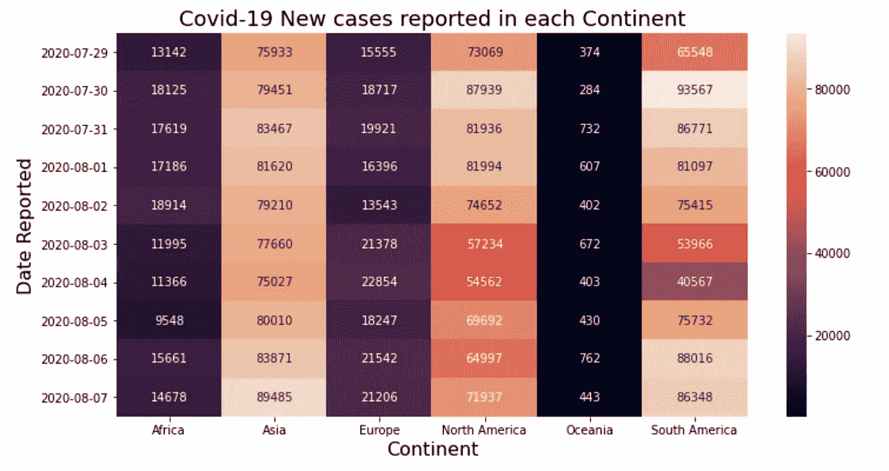

各大洲报告的新病例数:作者

这是我正在做的熊猫系列的第二篇文章。如果你是熊猫新手，一定要先看看第一部分。

[](/pandas-put-away-novice-data-analyst-status-part-1-7e1f0107dae0) [## 熊猫:收起新手数据分析师的身份

### 熊猫如何让你成为更好的数据分析师？了解数据分析过程中不同步骤的一行程序。

towardsdatascience.com](/pandas-put-away-novice-data-analyst-status-part-1-7e1f0107dae0) 

我称之为**P**ut**A**way**N**ovice**D**ATA**A**analyst**S**tatus，是一个强大的数据分析和操作库。在第 1 部分中，我们讨论了基本的 Pandas API 在数据分析过程中经历的不同步骤，比如读取数据、过滤、保存等等。在这里，我将重点介绍先进的熊猫 API，它们有助于轻松解决困难的分析问题。为了保持它的吸引力，我将把它作为一个问题解决练习，即首先我们将描述问题，然后我们将使用熊猫 API 用 1 或 2 行代码来解决它。

我将在 Data 中使用[我们的世界提供的开源新冠肺炎数据。请注意，我们仅将此数据用于知识共享，数据中可能存在差异。](https://ourworldindata.org/coronavirus-source-data)

> 📚资源: [Google Colab 实现](https://colab.research.google.com/drive/1LP6SdlTqVafaGAEhfhI5cwvd-gnhiyJk?usp=sharing) | [Github 仓库](https://github.com/ankitgoel1602/data-science/tree/master/data-analysis/pandas-advance) | [数据集](https://github.com/ankitgoel1602/data-science/blob/master/data-analysis/pandas-advance/owid-covid-data.csv)📚

在这篇文章中，我们将举例说明—

1.  使用 groupby()和 agg()进行数据聚合。
2.  使用 plot()绘制数据。
3.  熊猫数据帧样式使用。样式属性。
4.  旋转数据-将长格式数据转换为宽格式。
5.  使用 idxmin()和 idxmax()查找具有最小值或最大值的行和列。
6.  多索引-简化您的查询。
7.  将多个索引合并成一个索引。

在应用操作之前，让我们详细检查一下数据集。

## 数据集详细信息

> [我们的数据世界](https://ourworldindata.org/)维护着每天更新的新冠肺炎数据。它包括确诊病例、死亡人数以及与新冠肺炎相关的检测。我们将使用 2020 年 8 月 7 日的数据，它包含 35 列，包含各种信息，如国家 GDP、洗手设施等。

出于演示目的，我将选择包含以下内容的数据子集—

*   iso_code —国家的 alpha 3 代码。
*   大陆——世界各大洲。
*   位置—国家。
*   日期—报告案例的日期。
*   new _ cases 当天报告的新病例。
*   new _ deaths 当天报告的新死亡人数。
*   new_tests —在该日期进行的新电晕测试。

此外，我们将仅使用最近 10 天的数据，即从 2020 年 7 月 29 日到 8 月 7 日。如果你想知道如何过滤这些数据，请查看 [Github](https://github.com/ankitgoel1602/data-science/tree/master/data-analysis/pandas-advance) 。

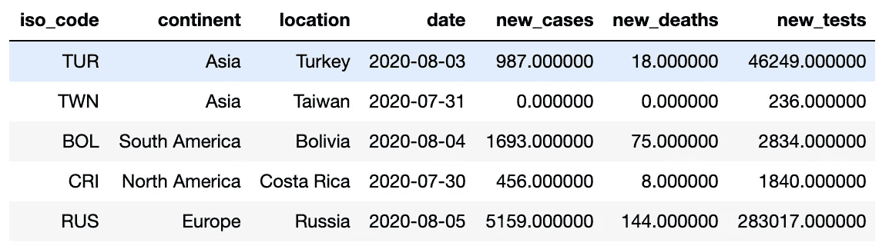

使用的新冠肺炎数据片段:作者

> 我相信你会看到许多与新冠肺炎有关的数据分析。让我们开始看看你如何自己做一个。

# 1.使用 groupby()和 agg()进行数据聚合

熊猫提供不同的 API 来聚合数据。让我们看看如何使用它们在一行中执行简单到复杂的聚合。

## 简单聚集

假设，我们需要找到每天报告的新病例总数。我们可以用——

```
# here we are chaining multiple operations together# Step 1: grouping data by date.
# Step 2: selecting new_cases from the group.
# Step 3: calculating the sum of the new_cases.
# Step 4: doing a groupby changes the index, so resetting it
# Step 5: selecting Last 5 records.data.groupby('date').new_cases.sum().reset_index().tail(5)
```

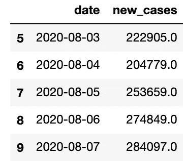

每天报告的新冠肺炎病例总数:作者

## 聚合多个字段

在上面的示例中，我们只聚合了一个字段，即“new_cases”。如果我们需要一个组有多个聚合怎么办？在这种情况下，我们可以将 groupby()和 agg()结合起来。比方说，我们需要找到—

*   每天报告的病例总数。
*   一个国家每天报告的最大病例数。
*   每天报告的死亡总数。
*   一个国家报告的最大死亡人数。
*   每天进行的测试总数
*   一天中报告数据的国家总数。

所有这些都可以用一行代码来完成—

```
# we are finding totals using sum and maximum using max
# Also, we used nunique to find unique number of countries reportingdata.groupby('date').agg({'new_cases':['sum','max'], 
                          'new_deaths':['sum','max'],
                          'new_tests':['sum'],
                          'location':'nunique',
                         }).reset_index().tail(5)
```

这给了我们一个很好的输出—

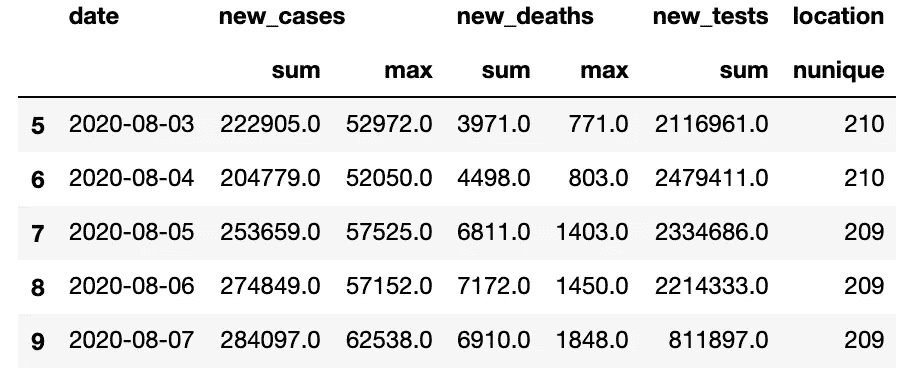

使用日期对新冠肺炎数据进行多重聚合:作者

使用这种聚合，我们得到了一个多列索引，在博客的后面，我们将看到如何将它组合成一个单一的索引。

## 命名聚合

如果您注意到上面的输出，它确实得到了结果，但是列的名称并不友好，因为它只是使用现有的列名。我们可以使用名为 aggregation 的熊猫来命名输出中的每个聚合。对于上面同样的问题，我们可以做—

```
# naming the aggregations, you can use any name for the aggregate
filtered_data.groupby('date').agg(
               total_new_cases = ('new_cases','sum'),
               max_new_cases_country = ('new_cases','max'),
               total_new_deaths = ('new_deaths','sum'),
               max_new_deaths_country = ('new_deaths','max'),
               total_new_tests = ('new_tests','sum'),
               total_countries_reported = ('location','nunique')
              ).reset_index().tail(5)
```

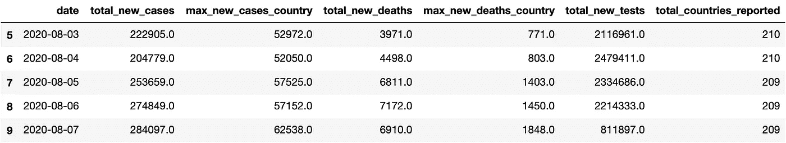

使用 agg()的命名聚合:作者

# 2.使用 Plot()绘制数据

数据分析师的主要工作是将数据可视化。Pandas 中的每个数据帧都有一个 plot() API 用于绘图。默认情况下，Pandas 使用 Matlplotlib 作为绘图的后端。您可以使用各种其他后端。在这里，我将使用 [Plotly](https://plotly.com/python/plotly-express/) 库，并将其配置为熊猫绘图后端。如果您没有安装 Plotly，那么您可以使用—

```
# if using anaconda distribution (recommended)
conda install -c conda-forge plotly# if using pip
pip install plotly
```

如果您已经安装了 Plotly，请确保您的版本≥ 4.8，因为它是运行以下代码部分所必需的。我们可以改变熊猫绘图后端使用—

```
# Set plotting backend as plotly
pd.options.plotting.backend = "plotly"
```

我们完成了配置。让我们通过几个例子来看看在熊猫中绘图是多么容易。

## 每个国家每天报告的新病例。

假设我们需要绘制每个国家每天报告的新病例。我们可以使用—

```
# generating a bar plot
data.plot.bar(x='date',y='new_cases', color='location')
```

上面的命令会生成一个漂亮的交互图(我确实改变了一些风格，请参考 Github) —

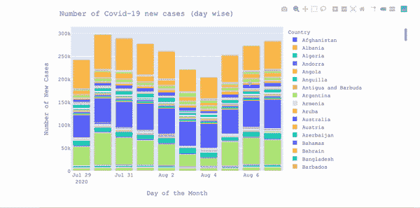

新冠肺炎每日按国家分类的新病例:作者

## 基于过去 10 天新增病例数的前 10 个国家

要获得排名靠前的国家，我们首先需要按“位置”对数据进行分组，然后用以下方式绘制

```
# Step 1: generating a new dataset based on each location i.e. country
# Step 2: doing the sum on new_cases followed by sorting
# Step 3: Selecting top 10 countries from the datasetdata.groupby(['location']).new_cases.sum().sort_values(ascending=False).head(10).plot.bar()
```

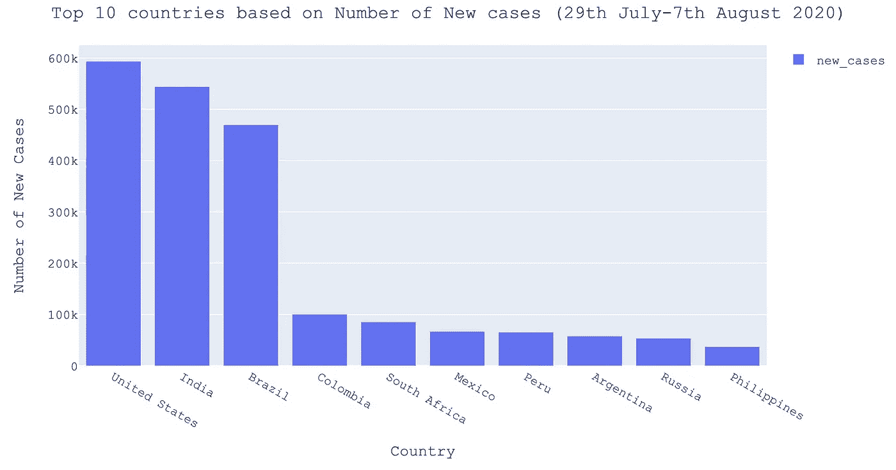

来源:作者图片

同样，您可以为不同的字段或数据的不同部分生成图。很简单，不是吗？

# 3.使用样式 API 的数据样式

很多时候我们需要在 Excel 和 Pandas 之间切换来做不同的事情，比如格式化数据或添加一些样式。Pandas 引入了样式 API，可以用来在 Pandas 中设置数据集的样式。我们可以使用样式进行各种操作。让我们看几个例子——

## 将数字转换为逗号分隔。

在我们的数据集中，new_cases、new_deaths 和 new_tests 存储为不适合表示的浮点值。使用样式，我们可以把它们改成逗号分隔的值，比如—

```
# formatting the data to show numbers as comma separateddata.style.format({'new_cases':'{0:,.0f}','new_deaths':'{0:,.0f}','new_tests':'{0:,.0f}',}).hide_index()
```

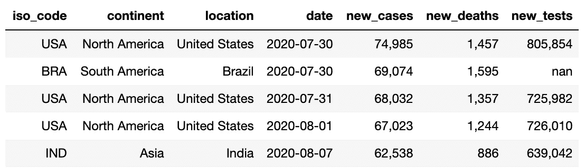

可展示格式的数字:作者

我们可以用它来做其他有趣的事情，比如为金额字段添加货币符号，改变小数点位数等。

## 突出显示最大值。

很多时候，我们需要突出显示列中的最大值。这可以通过使用—

```
# This will highlight the maximum for numeric column
data.style.highlight_max().hide_index()
```

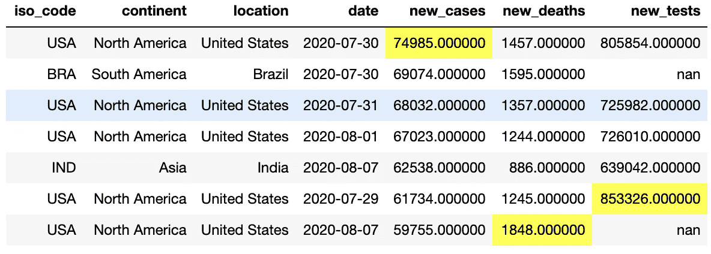

每列突出显示的最大值:作者

## 基于数值大小的颜色映射。

有时，查看基于数值大小的颜色图是很有用的，即大值用深色显示，小值用浅色显示。熊猫造型提供了一个很好的 API，它用一行代码无缝地做到了这一点

```
# Adding blue color map for each numeric field
data.style.hide_index().background_gradient(cmap='Blues')
```

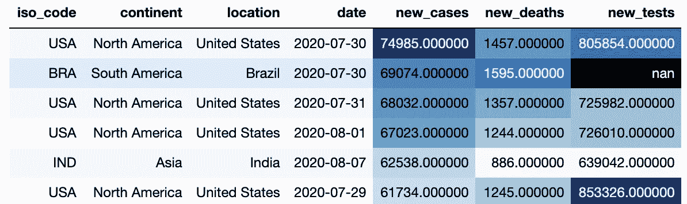

数值字段上的色彩映射表:作者

您可以使用样式 API 做各种其他事情。如果你想了解更多，请查阅[熊猫文献](https://pandas.pydata.org/pandas-docs/stable/user_guide/style.html)。

# 4.透视-将数据从长格式转换为宽格式

如果您熟悉 Excel，您应该听说过数据透视表。Pandas pivot 帮助我们将长数据(即以行存储的数据)转换为宽数据(即以列存储的数据)。熊猫为旋转提供了两种不同的 APIs

*   在枢轴上转动
*   数据透视表

我们将使用几个例子来检查每一个。

## 透视( )

考虑这样一个问题，我们需要为前 10 个国家查找新冠肺炎随时间变化的新案例。

首先，我们需要找到每天排名前 10 位的国家，我们可以使用下面的代码来完成—

```
# Step 1: create a group based on date and location
# Step 2: order it by number of new cases.grouped_data = data.groupby(['date','location']).new_cases.sum().sort_values(ascending=False)# we have data for each date grouped by location.
grouped_data.head(5)Output:
date        location     
2020-07-30  United States    74985.0
            Brazil           69074.0
2020-07-31  United States    68032.0
2020-08-01  United States    67023.0
2020-08-07  India            62538.0# Next we need to select top 10 countries for each date
# Step 3: create a new group based on date. 
# Step 4: select top 10 records from each group.top10_countries = grouped_data.groupby('date').head(10).reset_index()
```

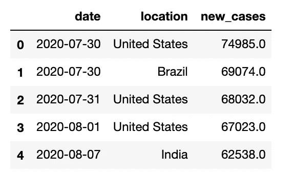

现在，我们有每天的前 10 个国家，但这是以长格式存储的，即每天我们有多行。我们可以使用 pivot 将这些数据转换成宽格式，使用—

```
# Step 5: pivoting data on date and location
top10_countries_pivot = top10_countries.pivot(index='date', columns='location', values='new_cases')
```

在上面的命令中，我们说对于每个日期，用 new_cases 的值为每个位置创建新列。这将导致—

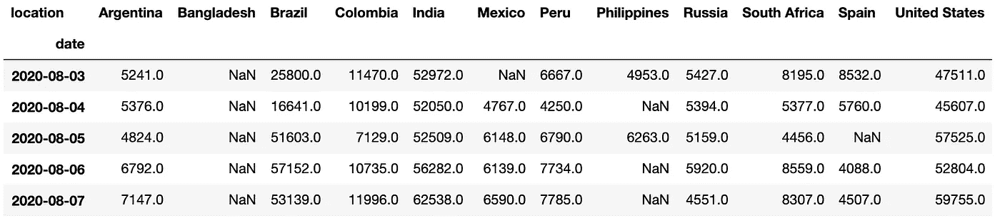

使用 Pivot 转换的新冠肺炎数据剪报:作者

接下来，我们可以直接使用 [Seaborn](https://seaborn.pydata.org/) 为透视数据生成一个漂亮的热图。

```
# Step 6: plotting heatmap using Seaborn
sns.heatmap(top10_countries_pivot, annot=True, fmt='.0f')
```

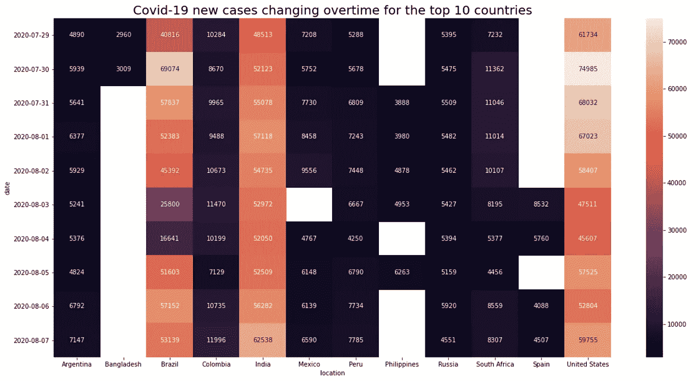

## 数据透视表( )

在上面的例子中，我们只有一行(日期，地点)的组合，即 2020-08-07，我们只有一行“印度”。如果我们需要找到每个洲的新病例数，该怎么办？在这种情况下，在给定的日期，每个洲有多个行，即行数等于该洲的国家数。为了解决这个问题，Pandas 提供了 pivot_table() API，它可以聚合记录，将其转换为一行。让我们看看它是如何实现的—

```
# Creating a pivot table for continent# We do not need to select top 10 records here as we have only 6 continents
# Notice the aggfunc below, it will actually sum the new_cases for each country in the continent.continent_pivot = filtered_data.pivot_table(index='date',columns='continent', values='new_cases', aggfunc='sum')
```

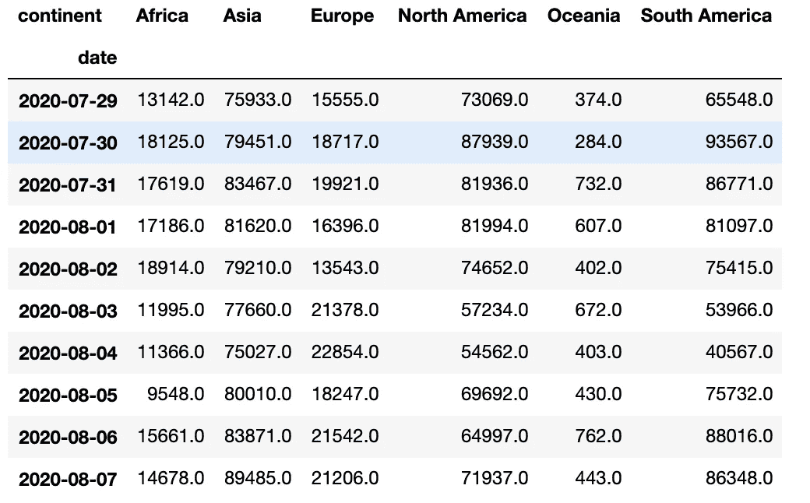

各大洲的新冠肺炎病例:作者


各大洲的新冠肺炎热图:作者

# 5.使用 idxmin()，idxmax()

您如何在数据透视表中找到具有最小或最大事例的国家/地区？我们可以使用 idxmin()或 idxmax()来实现。Idxmin()给出给定轴(即行或列)的最小值的索引，Idxmax()给出最大值的索引。

```
# find country with maximum cases 
# axis=1 to find max in the row, default is columntop10_countries_pivot.idxmax(axis=1)Output:
date
2020-07-29    United States
2020-07-30    United States
2020-07-31    United States
2020-08-01    United States
2020-08-02    United States
2020-08-03            India
2020-08-04            India
2020-08-05    United States
2020-08-06           Brazil
2020-08-07            India# find country with minimum cases
# axis=1 to find max in the row, default is columntop10_countries_pivot.idxmin(axis=1)# This is among the top 10 countries
Output:
date
2020-07-29      Bangladesh
2020-07-30      Bangladesh
2020-07-31     Philippines
2020-08-01     Philippines
2020-08-02     Philippines
2020-08-03     Philippines
2020-08-04            Peru
2020-08-05    South Africa
2020-08-06           Spain
2020-08-07           Spain
```

## 6.使用 set_index()的多索引

Pandas 支持行和列的多重索引。这对于回答简单的问题很方便。例如，如果我们需要找到数据

*   在一个特定的大陆的特定的一天。
*   在特定的日子特定的地点。
*   某些日子的一些地点。

有很多方法可以做到这一点，但是让我们看看使用多索引有多简单。首先，使用 set_index API 创建多索引。

```
# Creating Index on continent, location and date
# The index will be created in the order suppliedindexed_data = data.set_index(['continent','location','date']).sort_index()# values of the index
indexed_data.index.valuesOutput:
array([('Africa', 'Algeria', '2020-07-29'),
       ('Africa', 'Algeria', '2020-07-30'),
       ('Africa', 'Algeria', '2020-07-31'), ...,
       ('South America', 'Venezuela', '2020-08-05'),
       ('South America', 'Venezuela', '2020-08-06'),
       ('South America', 'Venezuela', '2020-08-07')], dtype=object)
```

现在，我们对每一行都有多索引，也就是说，要查询第一行，我们需要-

```
indexed_data.loc[(‘Africa’,’Algeria’,’2020–07–29')]
```


熊猫的多指标数据:作者

让我们看几个例子，看看创建多索引有什么帮助。

## 2020 年 8 月 7 日北美(大陆)美国(所在地)报告的新增病例数。

```
indexed_data.loc[('North America','United States','2020-08-07'),'new_cases']Output:
59755.0
```

## 2020 年 8 月 7 日亚洲报告的新病例

在这里，我们希望获得亚洲所有国家的数据。我们可以通过在 location 中传递 slice(None)来实现，这意味着获取所有位置。

```
indexed_data.loc[('Asia',slice(None),'2020-08-07'),'new_cases']Output(a snippet):
continent  location              date      
Asia       Afghanistan           2020-08-07       41.0
           Armenia               2020-08-07      233.0
           Azerbaijan            2020-08-07      144.0
           Bahrain               2020-08-07      375.0
           Bangladesh            2020-08-07     2977.0
           Bhutan                2020-08-07        3.0
           Brunei                2020-08-07        0.0
           Cambodia              2020-08-07        0.0
           China                 2020-08-07      132.0
           Georgia               2020-08-07        0.0
           India                 2020-08-07    62538.0
```

## 8 月 6 日和 7 日印度和美国报告了新病例

我们可以传递任何索引的值列表。在本例中，我们没有提供洲，也没有为位置和日期选择多个值。

```
indexed_data.loc[(slice(None),[‘India’,’United States’],[‘2020–08–06’,’2020–08–07']),’new_cases’]Output:
continent      location       date      
Asia           India          2020-08-06    56282.0
                              2020-08-07    62538.0
North America  United States  2020-08-06    52804.0
                              2020-08-07    59755.0
Name: new_cases, dtype: float64
```

> 你可以用多索引做很多事情。如果你想了解更多，请参考拜伦·多伦写的一篇好文章’[如何在熊猫中使用多指数来提升你的分析](/how-to-use-multiindex-in-pandas-to-level-up-your-analysis-aeac7f451fce)。

## 7.将多个索引合并成一个索引。

很多时候，当我们进行聚合时，我们会得到多列索引，比如—

```
# multiple aggregations on new_cases
grouped_data = data.groupby('date').agg({'new_cases':['sum','max','min']})
```

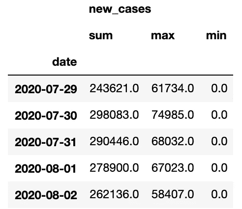

多列索引:作者

这使得得到实际结果有点困难。我们可以通过下面的方法将这些转换成一列—

```
# columns in grouped data
grouped_data.columnsOutput:
MultiIndex([('new_cases', 'sum'),
            ('new_cases', 'max'),
            ('new_cases', 'min')],
           )
```

使用简单的代码组合上面的列，如 new_cases_sum、new_cases_max、new_cases_min

```
# here are we just joining the tuple with '_'
# this works for level-2 column indexes onlynew_columns = ['%s%s' % (a, '_%s' % b if b else '') for a, b in grouped_data.columns]
new_columnsOutput:
['new_cases_sum', 'new_cases_max', 'new_cases_min']# change grouped_data columns.
grouped_data.columns = new_columns
```

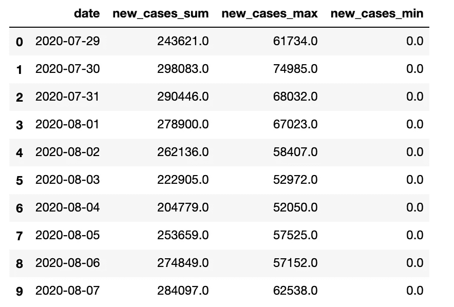

多列索引转换为单个索引:作者

# 结论

我希望这篇文章能帮助你提高数据分析技能，节省分析大型数据集的时间。我知道阅读时很少有事情看起来很复杂，所以我建议你下载这个笔记本来玩。如果你面临任何问题，请在评论中告诉我，并随时在 LinkedIn 上联系我。仍然有许多不错的熊猫 API 我不能浏览，也许我会写一个第 3 部分来涵盖这些。目前，这就是全部。

干杯！！！注意安全！！！继续学习！！！