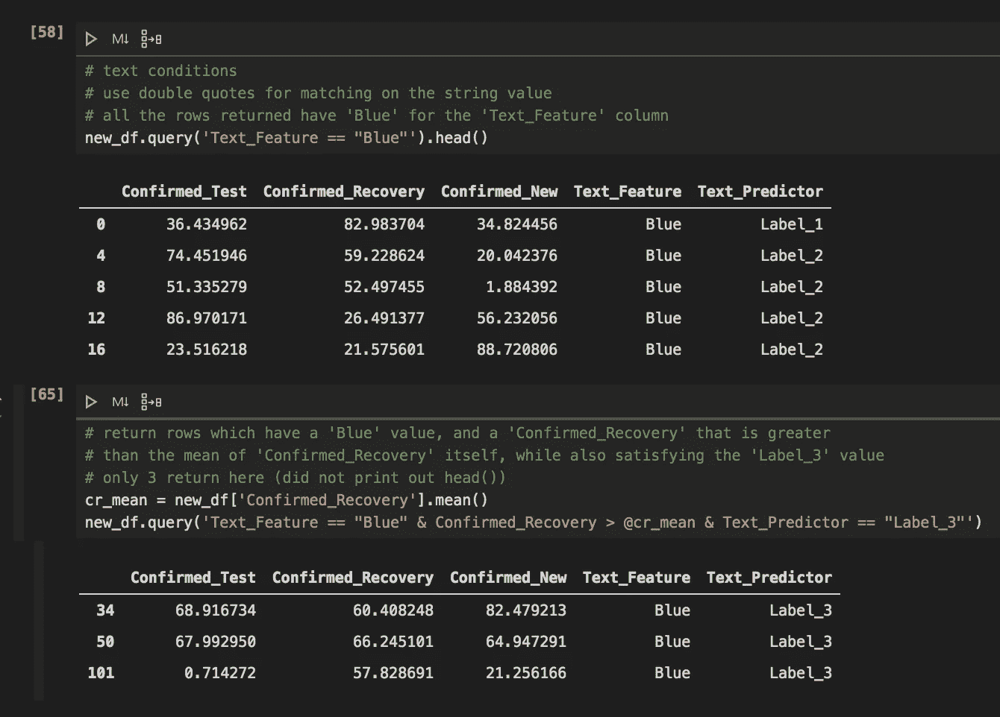

# 熊猫查询类似 SQL 的查询

> 原文：<https://towardsdatascience.com/pandas-query-for-sql-like-querying-279dc8cbfe3f?source=collection_archive---------18----------------------->

## 使用 pandas 查询函数查询数据帧的数据科学家 python 教程


由[un splash](https://unsplash.com/s/photos/panda?utm_source=unsplash&utm_medium=referral&utm_content=creditCopyText)【1】上的 [Mélody P](https://unsplash.com/@melodyp?utm_source=unsplash&utm_medium=referral&utm_content=creditCopyText) 拍摄

# 目录

1.  资料组
2.  熊猫
3.  询问
4.  教程代码
5.  摘要
6.  参考

# 资料组

本分析和 pandas 查询教程中使用的数据集是一个虚拟数据集，创建该数据集是为了模拟具有文本和数字特征的数据帧。请随意使用您自己的。csv 文件，包含文本和/或数字列，以遵循教程。

# 熊猫

[Pandas](https://pandas.pydata.org/)【2】是数据科学家和机器学习工程师最常用的库之一。它主要用于构建模型的探索性数据分析步骤，以及模型结果的即席分析。它还包含几个功能，包括查询功能。

# 询问

pandas 中的查询函数是一个有用的函数，它的作用类似于 SQL 中的*‘where’*子句。然而，它的好处是，你不需要不断地从 pandas、Jupyter Notebook 和你目前使用的 SQL 平台切换。下面列出了其他一些好处:

*   *编译几个条件*
*   *一个简单的函数，可以处理你的熊猫数据帧*
*   *引用描述性统计数据，而不是必须进行子查询*

# 教程代码

我已经编写了几个如何使用 pandas 查询功能的例子。下面的屏幕截图总结了一些有用的查询示例。下面，您可以看到如何同时满足文本和数字条件。查找特定列包含特定文本值的行，或者使用 *'@'* 符号创建描述性统计。例如， *'@mean_of_column'* 引用了您使用*建立的值。*函数均值()'。在第 65 行，返回的行具有一个*‘蓝色’*值和一个*‘已确认 _ 恢复’*值，该值大于*‘已确认 _ 恢复’*本身的平均值，同时还包括*‘标签 _ 3’*值。



返回相等的行以及其他几个条件的示例。作者截图[3]。

灰色框中引用的教程代码是用于演示查询函数的所有代码。首先，我进口了熊猫并读取了我的数据帧。然后，我添加新的行，我知道这些行将满足某些条件，以显示如何使用查询函数。*‘append’*函数在这里也很有用，因为它可以快速地向数据帧中添加新行，而不必显式地以序列格式调用每一列。我返回了 *'df.tail()'* ,以查看返回的行是否是我所期望的。

然后，我返回一列中的值等于另一列中的值的行。您也可以使用相同的逻辑，但是反过来看看您指定的列的哪些值不相等。接下来，您可以比较一列的值是否大于另一列的值，反之亦然。

我认为，query 最有用的特性是 *'@'* 方法。就像 SQL 中可以使用子查询来引用选择满足特定条件的行一样，这个方法也可以。 *'@'* 方法保存您想要比较的值。对于下面的例子，我查看了一列的平均值进行比较。

最后，通过输入类似于 SQL 中的*和*的 *' & '* ，可以使用查询函数在一行代码中执行多个条件。

```
# All the python code below for use:# import libraryimport pandas as pd # read in your dataframedf = pd.read_csv('/Users/example.csv')# write out new rowsrows = [pd.Series([100, 100, 20,'Blue','Label_1'], index=df.columns),pd.Series([100, 80, 60,'Blue','Label_1'], index=df.columns),pd.Series([80, 60, 100,'Blue','Label_1'], index=df.columns)]# append the multiple rowsnew_df = df.append(rows , ignore_index=True)# check the newest 3 rows you madenew_df.tail(3)# return rows where values from one column equal that of another# they do not for this comparisonnew_df.query('Confirmed_Test == Confirmed_New')# return rows where values from one column equal that of another# they do for this comparisonnew_df.query('Confirmed_Test == Confirmed_Recovery')# return rows where values from one column do not equal that of another# they do for this comparisonnew_df.query('Confirmed_New != Confirmed_Recovery').head()# return rows where values from one column are bigger than that of anothernew_df.query('Confirmed_New > Confirmed_Recovery').head()# see which rows where the 'Confirmed_New' values# are greater than the mean of the total column# use the '@' to reference 'cn_mean'cn_mean = new_df['Confirmed_New'].mean()new_df.query('Confirmed_New > @cn_mean').head()# multiple conditions examplecn_min = new_df['Confirmed_New'].min()cn_max = new_df['Confirmed_New'].max()new_df.query('Confirmed_New > @cn_min & Confirmed_New < @cn_max').head()# text conditions# use double quotes for matching on the string value# all the rows returned have 'Blue' for the 'Text_Feature' columnnew_df.query('Text_Feature == "Blue"').head()# return rows which have a 'Blue' value, and a 'Confirmed_Recovery' that is greater# than the mean of 'Confirmed_Recovery' itself, while also satisfying the 'Label_3' value# only 3 return here (did not print out head())cr_mean = new_df['Confirmed_Recovery'].mean()new_df.query('Text_Feature == "Blue" & Confirmed_Recovery > @cr_mean & Text_Predictor == "Label_3"')
```

要查看 python 格式的代码而不是写出的代码，下面是嵌入的[要点](https://gist.github.com/mprzybyla123/1e564183cb64ba29fa17b23e94459db2)【4】:

# 摘要

pandas 的查询功能是操作数据框架的一种简单快捷的方式。您可以使用类似 SQL 的子句返回满足您确定的条件的某些行。这是有益的，如果你已经在你的 Jupyter 笔记本。ipynb 文件或。py 文件，而不必在 SQL 平台上重新上传或执行 SQL 命令。熊猫查询也很直观，不需要很长时间就能学会。我希望本文中的例子对您有用。感谢您的阅读！

# 参考

[1] [梅洛迪 P](https://unsplash.com/@melodyp?utm_source=unsplash&utm_medium=referral&utm_content=creditCopyText) ， [Unsplash](https://unsplash.com/s/photos/panda?utm_source=unsplash&utm_medium=referral&utm_content=creditCopyText) (2017)

[2]熊猫，[熊猫](https://pandas.pydata.org/) (2020)

[3] M.Przybyla，截图(2020 年)

[4] M.Przybyla，[要点](https://gist.github.com/mprzybyla123/1e564183cb64ba29fa17b23e94459db2) (2020)