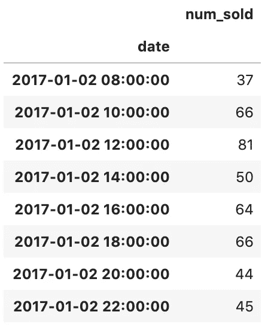
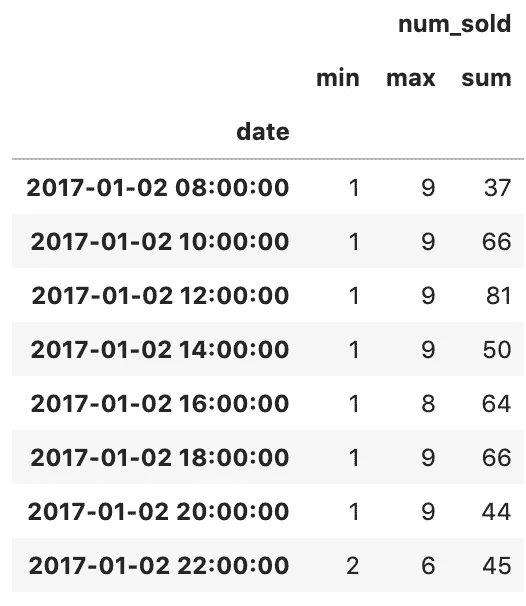
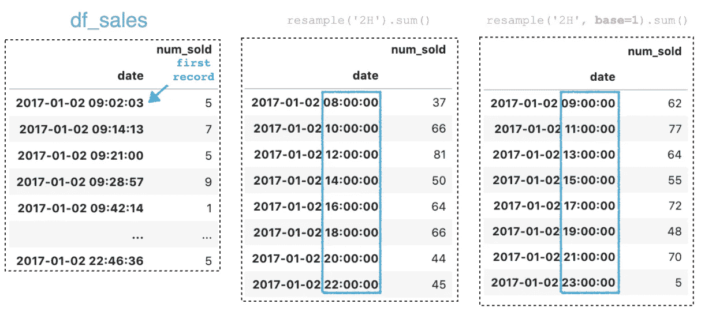
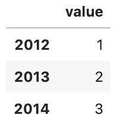
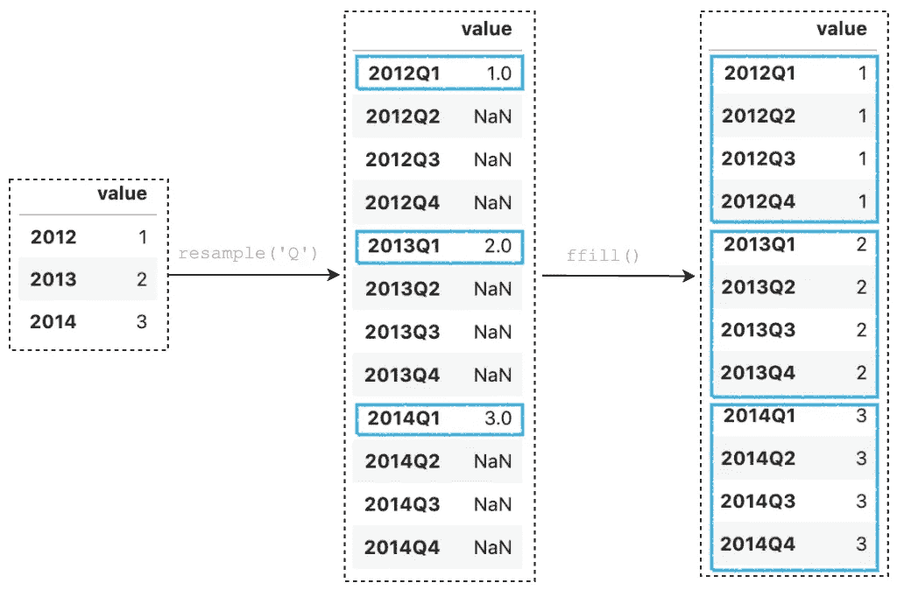
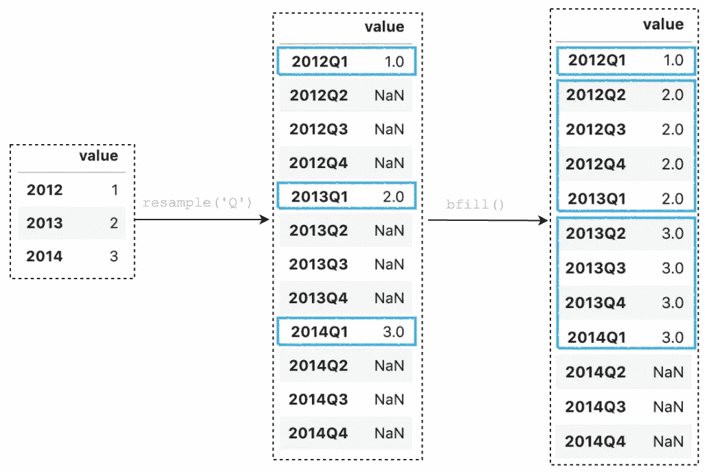
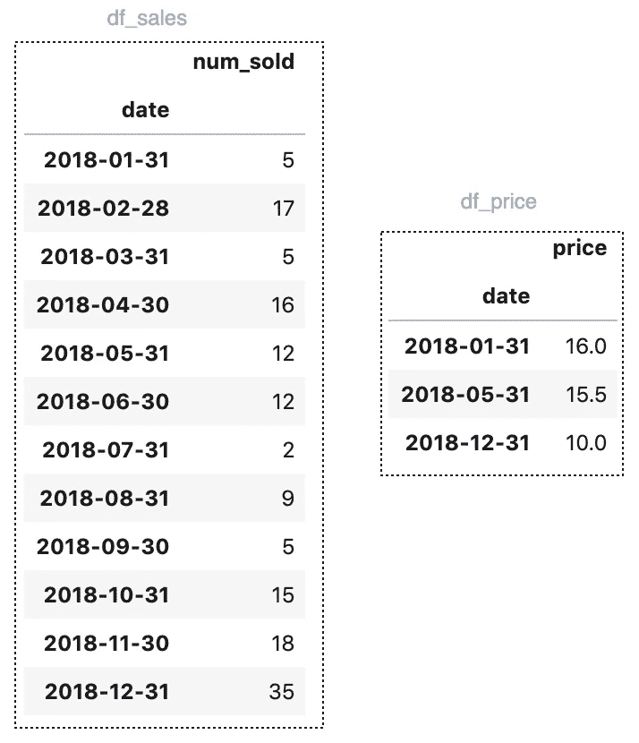
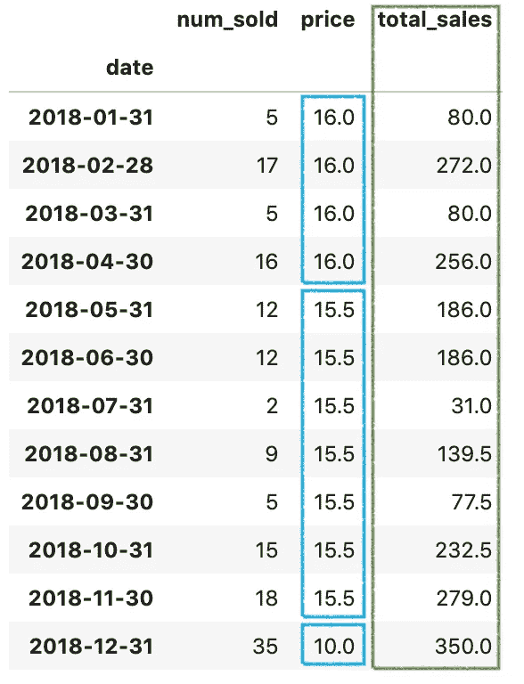
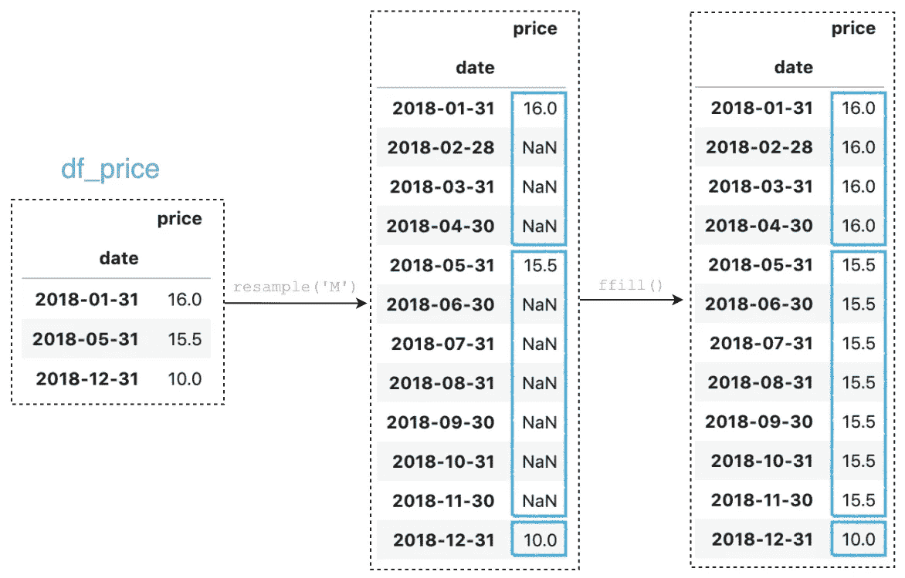
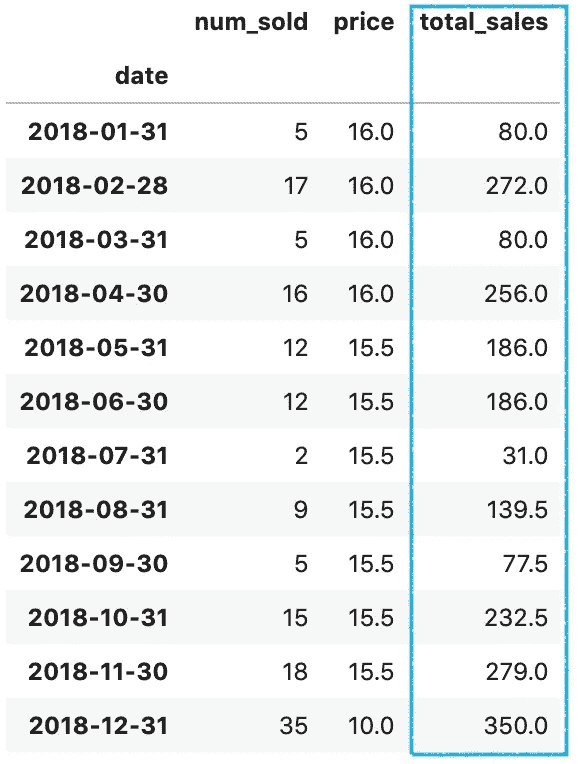

# 熊猫重采样()处理时间序列数据时你应该知道的技巧

> 原文：<https://towardsdatascience.com/pandas-resample-tricks-you-should-know-for-manipulating-time-series-data-7e9643a7e7f3?source=collection_archive---------0----------------------->

## 你应该知道的一些最有用的熊猫把戏


照片由[维里·伊万诺娃](https://unsplash.com/@veri_ivanova?utm_source=unsplash&utm_medium=referral&utm_content=creditCopyText)在 [Unsplash](https://unsplash.com/s/photos/time-series?utm_source=unsplash&utm_medium=referral&utm_content=creditCopyText) 上拍摄

时间序列数据在数据科学项目中很常见。通常，您可能有兴趣将时间序列数据重采样到您想要分析数据或从数据中获得更多见解的频率[1]。

在本文中，我们将介绍一些使用 Pandas `resample()`函数对时间序列数据进行重采样的例子。我们将讨论以下常见问题，并帮助您开始时间序列数据操作。

1.  下采样和执行聚合
2.  使用自定义基数缩减取样
3.  向上采样和填充值
4.  实际例子

源代码请查看[笔记本](https://github.com/BindiChen/machine-learning/blob/master/data-analysis/020-pandas-resample/pandas-resample.ipynb)。

# 1.下采样和执行聚合

下采样是将时间序列数据集重新采样到更宽的时间范围。比如从几分钟到几小时，从几天到几年。结果的行数将会减少，值可以用`mean()`、`min()`、`max()`、`sum()`等进行聚合。

让我们借助一个例子来看看它是如何工作的。

假设我们有一个关于销售的数据集。

```
df_sales = pd.read_csv(
    'sales_data.csv', 
    **parse_dates=['date'],** 
    **index_col=['date']**
)
```


`df_sales`的例子

要获得每 2 小时增加的销售总数，我们可以简单地使用`resample()`将数据帧下采样到 2 小时的区间中，并对落入区间中的时间戳值求和。

```
df_sales.**resample('2H')**.**sum()**
```



`resample('2H').sum()`的输出

为了执行多重聚合，我们可以将聚合函数列表传递给`agg()`方法。

```
df_sales.resample('2H').**agg(['min','max', 'sum'])**
```



多个聚合的输出

# 2.自定义缩减采样`base`

默认情况下，对于平均细分为 1 天/月/年的频率，聚合间隔的“原点”默认为`0`。因此，对于`2H`频率，结果范围将为`00:00:00`、`02:00:00`、`04:00:00`、…、`22:00:00`。

对于我们正在使用的销售数据，第一条记录有一个日期值`**2017–01–02 09:02:03**` ，因此让输出范围从`09:00:00`开始比从`08:00:00`开始更有意义。为此，我们可以使用参数`base`将聚合间隔的“原点”设置为不同的值，例如，设置`base=1`，这样结果范围就可以从`09:00:00`开始。

```
df_sales.resample('2H', **base=1**).sum()
```



带参数`base=1`

# 3.向上采样和填充值

上采样是与下采样相反的操作。它将时间序列数据集重新采样到一个更小的时间范围。比如从几小时到几分钟，从几年到几天。结果将增加行数，额外的行值默认为`NaN`。常用内置方法`ffill()`和`bfill()`进行正向填充或反向填充来代替`NaN`。

让我们做一个数据框架来演示。

```
df = pd.DataFrame(
    { 'value': [1, 2, 3] }, 
    **index=pd.period_range(
        '2012-01-01',
         freq='A',
         periods=3
    )**
)
```



按季度对一年进行重新采样并向前填充数值。正向填充方法`ffill()`将使用最后一个已知值替换`NaN`。

```
df.resample(**'Q'**).**ffill()**
```



`df.resample('Q').ffill()`

按季度对一年进行重新采样，并反向填充数值。反向填充方法`bfill()`将使用下一个已知值替换`NaN`。

```
df.resample(**'Q'**).**bfill()**
```



`df.resample('Q').bfill()`

# 4.实际例子

让我们来看看如何使用熊猫`resample()`来处理一个现实世界的问题。

假设我们有 2 个数据集，一个是月销售额`df_sales`，另一个是价格`df_price`。`df_price`只有价格变化的记录。



我们想计算每个月的 ***总销售额*** ，预期产量如下。



计算中的难点在于，我们需要检索每个月的价格，并将其组合回数据中，以便计算总价。

一个巧妙的解决方案是使用熊猫`resample()`功能。一行代码可以检索每个月的价格。

## 步骤 1:按月对价格数据集进行重新采样，并向前填充值

```
df_price = df_price.**resample('M')**.**ffill()**
```

通过调用`resample('M')`按月对给定的时间序列进行重新采样。之后，调用`ffill()`向前填充值。你是不是有点困惑？详情请看下图。



## 第二步:合并结果并计算总销售额

```
df = **pd.concat([df_sales, df_price], axis = 1)****df['total_sales'] = df['num_sold'] * df['price']**
```

带参数`axis=1`的熊猫`concat()`函数用于横向组合`df_sales`和`df_price`。之后，可以使用逐元素乘法`df['num_sold'] * df['price']`计算总销售额。

通过执行上面的语句，您应该得到如下所示的输出:



最终输出

# 结论

Pandas `resample()`函数是一个简单、强大且高效的功能，用于在频率转换期间执行重采样操作。

我希望这篇文章能帮助你节省分析时间序列数据的时间。我建议你查看一下关于`resample()` API 的[文档](https://pandas.pydata.org/pandas-docs/stable/reference/api/pandas.DataFrame.resample.html)，并了解你可以做的其他事情。

感谢阅读。请查看[笔记本](https://github.com/BindiChen/machine-learning/blob/master/data-analysis/020-pandas-resample/pandas-resample.ipynb)获取源代码，如果您对机器学习的实用方面感兴趣，请继续关注。

## 你可能会对我的其他一些熊猫文章感兴趣:

*   [如何对熊猫数据帧进行自定义排序](/how-to-do-a-custom-sort-on-pandas-dataframe-ac18e7ea5320)
*   [何时使用 Pandas transform()函数](/when-to-use-pandas-transform-function-df8861aa0dcf)
*   [你应该知道的熊猫串联()招数](/pandas-concat-tricks-you-should-know-to-speed-up-your-data-analysis-cd3d4fdfe6dd)
*   [Pandas 中 apply()和 transform()的区别](https://medium.com/@bindiatwork/difference-between-apply-and-transform-in-pandas-242e5cf32705)
*   [使用熊猫方法链接提高代码可读性](https://medium.com/@bindiatwork/using-pandas-method-chaining-to-improve-code-readability-d8517c5626ac)
*   [在 Pandas 数据帧中处理日期时间](/working-with-datetime-in-pandas-dataframe-663f7af6c587)
*   [熊猫阅读 _csv()你应该知道的招数](https://medium.com/@bindiatwork/all-the-pandas-read-csv-you-should-know-to-speed-up-your-data-analysis-1e16fe1039f3)
*   [你应该知道的用熊猫 read_csv()](/4-tricks-you-should-know-to-parse-date-columns-with-pandas-read-csv-27355bb2ad0e) 解析日期列的 4 个技巧

更多教程可以在我的 [Github](https://github.com/BindiChen/machine-learning) 上找到

# 参考

*   [1] [如何使用 Python 对时间序列数据进行重采样和插值](https://machinelearningmastery.com/resample-interpolate-time-series-data-python/)