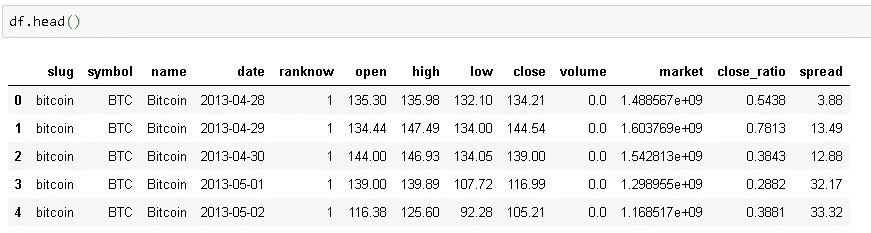
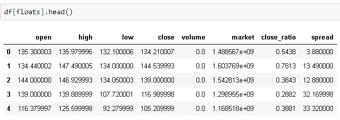
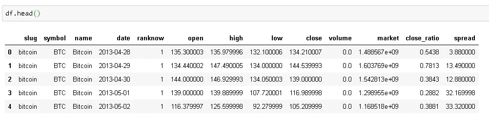

# 熊猫——用这些简单的技巧节省记忆

> 原文：<https://towardsdatascience.com/pandas-save-memory-with-these-simple-tricks-943841f8c32?source=collection_archive---------14----------------------->

## 如何在内存使用方面更高效地使用熊猫


[张家瑜](https://unsplash.com/@danielkcheung?utm_source=unsplash&utm_medium=referral&utm_content=creditCopyText)在 [Unsplash](https://unsplash.com/s/photos/small?utm_source=unsplash&utm_medium=referral&utm_content=creditCopyText) 上拍照

处理小型数据时，内存不是一个大问题。然而，当涉及到大型数据集时，有效地使用内存就变得势在必行。我将介绍一些非常简单的技巧来减小熊猫数据帧的大小。我将使用 Kaggle 上关于[加密货币市场](https://www.kaggle.com/jessevent/all-crypto-currencies)价格的相对较大的数据集。让我们从将数据读入熊猫数据帧开始。

```
import pandas as pd
import numpy as npdf = pd.read_csv("crypto-markets.csv")
df.shape
(942297, 13)
```

数据帧有将近一百万行和 13 列。它包括加密货币的历史价格。



让我们检查一下这个数据帧的大小:

```
df.memory_usage()
Index               80
slug           7538376
symbol         7538376
name           7538376
date           7538376
ranknow        7538376
open           7538376
high           7538376
low            7538376
close          7538376
volume         7538376
market         7538376
close_ratio    7538376
spread         7538376
dtype: int64
```

memory_usage()返回每行使用多少内存(以字节为单位)。我们可以通过几个数学运算来检查完整数据帧的内存使用情况，单位为兆字节:

```
df.memory_usage().sum() / (1024**2) #converting to megabytes
93.45909881591797
```

所以总大小是 93.46 MB。

让我们检查一下数据类型，因为在某些情况下，我们可以用更易于存储的数据类型来表示相同数量的信息。

```
df.dtypes
slug            object
symbol          object
name            object
date            object
ranknow          int64
open           float64
high           float64
low            float64
close          float64
volume         float64
market         float64
close_ratio    float64
spread         float64
dtype: object
```

首先想到的应该是“对象”数据类型。如果我们有分类数据，最好使用“类别”数据类型而不是“对象”,尤其是当类别的数量与行数相比非常低的时候。“slug”、“symbol”和“name”列就是这种情况:

```
df.slug.value_counts().size
2071
```

有 2072 个类别，相对于 100 万行是非常低的。让我们将这些列转换为“category”数据类型，并查看内存使用的减少情况:

```
df[['slug','symbol','name']] = df[['slug','symbol', 'name']].astype('category')df[['slug','symbol','name']].memory_usage()
Index          80
slug      1983082 #previous: 7538376
symbol    1982554
name      1983082
dtype: int64
```

因此每列的内存使用减少了%74。让我们看看我们总共存了多少钱:

```
df.memory_usage().sum() / (1024**2) #converting to megabytes
77.56477165222168
```

总大小从 93.46 MB 减少到 77.56 MB。

“ranknow”列显示不同货币类别之间的排名。既然有 2072 个类别，那么最大值应该是 2072。

```
df.ranknow.max()
2072
```

“ranknow”列的数据类型是 int64，但是我们也可以使用 int16 表示从 1 到 2072 的范围。int16 可以表示的范围是-32768 到+32767。

```
df["ranknow"] = df["ranknow"].astype("int16")df["ranknow"].memory_usage()
1884674 #previous: 7538376
```

因为我们从 int64 降低到 int16，所以内存使用如预期的那样减少了%75。

数据集中的浮点数用“float64”表示，但我可以用“float32”表示这些数字，这样我们就可以有 6 位数的精度。我认为 6 位数就足够了，除非你是在做高灵敏度的测量。

*   float32(等效 C 类型:float): 6 位精度
*   float64(等效 C 类型:double): 15 位精度

```
floats = df.select_dtypes(include=['float64']).columns.tolist()df[floats] = df[floats].astype('float32')df[floats].memory_usage()
Index               80
open           3769188 #previous: 7538376
high           3769188
low            3769188
close          3769188
volume         3769188
market         3769188
close_ratio    3769188
spread         3769188
dtype: int64
```

从“float64”到“float32”的转换如预期的那样将这些列的内存使用量减少了%50。



float32 有 6 位精度

在某些情况下，数据帧可能有冗余列。让我们看一下现有的数据框架:



“slug”、“symbol”、“name”等栏目以不同的格式表示同一事物。这三列中只有一列就足够了，所以我可以删除两列。您拥有的数据帧可能没有这样的列，但寻找冗余或不必要的列总是一个好的做法。例如，数据帧可能包括“计数”、“值”和“总和”列。我们可以很容易地获得总数乘以计数和值，所以总和列是不必要的。有些列可能与你想完成的任务完全无关，所以只需寻找这些列。在我的例子中，我将删除“符号”和“名称”列，并使用“slug”列:

```
df.drop(['symbol','name'], axis=1, inplace=True)
```

让我们检查最终数据帧的大小:

```
df.memory_usage().sum() / (1024*1024)
39.63435745239258
```

总大小从 93.46 MB 减少到 36.63 MB，我认为这是一个伟大的成就。我们能够节省 56，83 MB 的内存。

减小尺寸的另一个优点是简化计算。使用 float32 进行计算比使用 float64 花费的时间少。

我们应该尽可能地寻找减小尺寸的方法。

感谢您的阅读。如果您有任何反馈，请告诉我。