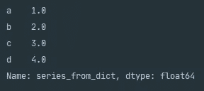
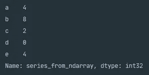
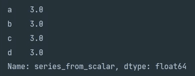
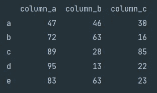
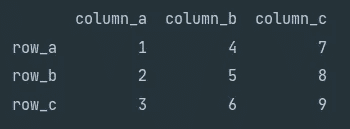

# 熊猫系列&数据框讲解

> 原文：<https://towardsdatascience.com/pandas-series-dataframe-explained-a178f9748d46?source=collection_archive---------19----------------------->

## 理解 Pandas 系列和 DataFrame 数据结构的综合指南

照片由[埃莉诺拉·阿尔巴希](https://unsplash.com/@eleonoralbasi?utm_source=medium&utm_medium=referral)在 [Unsplash](https://unsplash.com?utm_source=medium&utm_medium=referral) 上拍摄

# 介绍

作为一名成功的数据科学家，需要不断学习和提高我们使用各种工具的技能。如今，与数据科学同义的一个工具是[熊猫](https://pandas.pydata.org/pandas-docs/stable/index.html)。Pandas 是一个非常强大的开源库，用 Python 编写。它提供了一套多样化的工具，我们作为数据科学家可以用来清理、操作和分析数据。今天我们从基础开始，学习熊猫中最常见的两种数据结构系列和数据框架。

# 入门指南

## 安装熊猫& Numpy

Pandas 和 [Numpy](https://numpy.org/) 是用 Python 编写的开源库，你可以在你的 Python 脚本中使用它们。有几种方法可以安装这些软件包。默认情况下，如果您使用的是 [Anaconda](https://docs.anaconda.com/) ，这些包已经安装好了。如果您没有使用 Anaconda，那么最简单的安装选项是使用`pip`，这是 Python 推荐的安装包。您可以在 PyPA 的[文档](https://numpy.org/)中找到`pip`的详细安装说明。

一旦`pip`完成安装，您可以在终端上运行以下命令来安装 Pandas 和 Numpy `pip install pandas` `pip install numpy`。安装后，您可以使用下面的语法将 Pandas 和 Numpy 库导入到您的脚本中。

上面的 Python 片段显示了导入 Pandas 和 Numpy 包的语法。

# 熊猫系列

Pandas 系列数据结构是一个一维标签数组。它是数据帧的主要构造块，构成数据帧的行和列。您可以查看以下系列的构造函数。

上面的 Python 片段显示了熊猫系列的构造函数。

`data`参数可以接受几种不同的数据类型，如[n 数组](https://numpy.org/doc/stable/reference/generated/numpy.ndarray.html)、[字典](https://docs.python.org/3/tutorial/datastructures.html#dictionaries)和[标量](https://numpy.org/doc/stable/reference/arrays.scalars.html)值。`index`参数接受类似数组的对象，这将允许您标记索引轴。如果您没有向`index`参数传递一个条目，而向`data`参数传递一个字典，那么 Pandas 将使用字典键作为索引标签。您可以通过设置`dtype`参数来设置系列的数据类型。如果一个数据类型没有被指定，那么 Pandas 将会对数据类型进行推断。`name`参数如其所暗示的那样，允许您命名您已经创建的系列。

## 使用字典创建系列

下面我们提供了一个示例 Python 片段，您可以使用它来创建一个系列。

上面的 Python 片段演示了如何使用字典创建和命名一个系列。

上图显示了执行 Python 代码片段创建系列的结果。

从上面的控制台输出中，我们可以看到该系列使用了字典键作为索引，该系列被命名为`series_from_dict`，Pandas 推断出一个数据类型为`float64`。

## 从 ndarray 创建系列

生成测试序列的最快方法之一是使用 NumPy 的`random.randint()`,它产生一个填充了随机整数的 ndarray。

上面的 Python 片段演示了如何使用 ndarray 创建和命名一个系列。

上图显示了执行 Python 代码片段的结果。

## 从标量值创建序列

我们今天要看的最后一个方法是使用标量值创建一个序列。在这里，您可以为`data`分配一个值，并在索引长度内重复该值。

上面的 Python 片段展示了如何通过传递标量值来创建序列。

上图显示了执行 Python 代码片段的结果。

# 熊猫数据框

Pandas DataFrame 是由列和行组成的二维数据结构。您可以将 DataFrame 视为类似于 CSV 或关系数据库表。下面你可以看到创建数据帧的构造函数。

上面的 Python 片段显示了熊猫数据帧的构造函数。

与 Series 类似的`data`参数可以接受广泛的数据类型，例如 Series、Series 字典、结构化数组和 NumPy 数组。除了能够将索引标签传递给`index`，DataFrame 构造函数还可以通过`columns`接受列名。

## 为系列词典创建数据框架

生成数据帧最简单的方法之一是创建一个包含 Series 的字典。字典键将成为数据帧的列标签，而系列索引将成为数据帧的行标签。下面是一个 Python 片段，您可以用它来生成您的第一个数据帧。

上面的 Python 片段展示了如何使用系列字典创建 DataFrame。

上图显示了执行 Python 脚本的结果。

上面的控制台输出清楚地展示了 DataFrame 数据结构。字典关键字`column_a`、`column_b`和`column_c`现在形成了带标签的列，序列索引`a`、`b`、`c`、`d`和`e`是数据帧行标签。

## 为列表字典创建数据框架

Pandas DataFrame 构造函数也可以接收一个列表字典。下面我们为您提供了一个 Python 片段，您可以使用它来实现这一点。这里，我们通过 DataFrame 构造函数中的`index`参数分配了行标签。

上面的 Python 片段展示了如何从列表字典创建 DataFrame。

上图显示了从列表字典创建 DataFrame 的结果。

# 接下来去哪里？

既然您已经介绍了 Pandas 的基本构件，您的下一步应该是学习如何通过[迭代数据帧](/python-pandas-iterating-a-dataframe-eb7ce7db62f8)或使用 [Pandas Profiling](/learning-pandas-profiling-fc533336edc7) 进行分析来导航数据帧。

再次感谢您花时间阅读我们的故事，我们希望您发现它有价值！