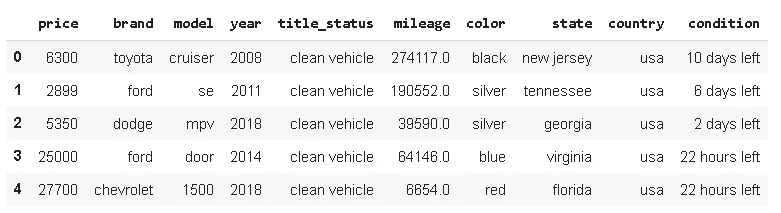
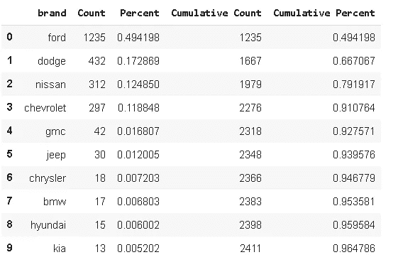
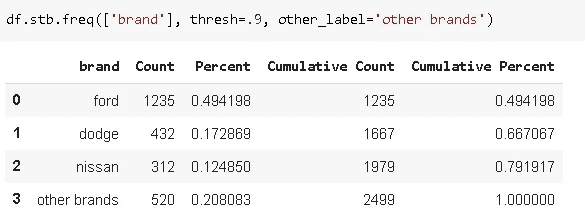
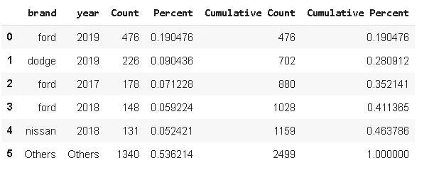
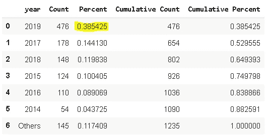
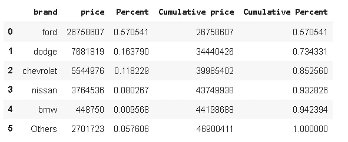
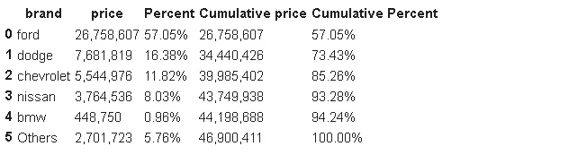

# 熊猫侧桌刚刚宣布

> 原文：<https://towardsdatascience.com/pandas-sidetable-just-announced-708e5f65938f?source=collection_archive---------14----------------------->

## 对数据框架的信息丰富、见解深刻的概述。


照片由[马库斯·斯皮斯克](https://unsplash.com/@markusspiske?utm_source=unsplash&utm_medium=referral&utm_content=creditCopyText)在 [Unsplash](https://unsplash.com/s/photos/different-colors?utm_source=unsplash&utm_medium=referral&utm_content=creditCopyText) 拍摄

Pandas 是一个非常强大和通用的 Python 数据分析库，它加速了数据科学项目的预处理步骤。它提供了许多在数据分析中非常有用的函数和方法。

虽然熊猫的内置功能能够执行有效的数据分析，但定制的功能或库为熊猫增加了价值。在本帖中，我们将探究其中一个附加组件。

昨天，克里斯·莫菲特宣布了一个新的名为 **sidetable** 的熊猫实用程序库。这里是 sidetable 的 [github repo](https://github.com/chris1610/sidetable) 。我发现它非常有用，并计划在我的日常分析中应用。这就是为什么我想通过一些例子来分享和传播这个词。

Sidetable 基于选定的列创建频率表。假设我们有一个数据集，其中包含某个分类变量的一些测量值(例如模型)。我们有许多不同的模型，每个模型都有许多观察值(行)。通过使用 sidetable，我们可以得到一个概览，显示每个模型在数据集中所占的份额。这也可以使用 pandas 的`**value_counts**`功能来实现，但是 sidetable 提供的信息更多，我们将在示例中看到。

如果你使用 jupyter 笔记本，我们首先需要用`pip`或`!pip`安装它:

```
!pip install sidetable
```

然后导入它:

```
import pandas as pd
import sidetable
```

我们现在可以使用 **stb** 作为数据帧的存取器。我将使用 kaggle 上可用的美国汽车数据集。它包含了拍卖的二手车的数据。

```
df = pd.read_csv("/content/USA_cars_datasets.csv")#drop redundant columns
df.drop(['Unnamed: 0','vin','lot'], axis=1, inplace=True)df.head()
```



我们可能想看看主导品牌是什么。一种方法是使用`value_counts`功能。数据集中出现次数最多的 10 个品牌:

```
df.brand.value_counts()[:10]ford         1235 
dodge         432 
nissan        312 
chevrolet     297 
gmc            42 
jeep           30 
chrysler       18 
bmw            17 
hyundai        15 
kia            13 Name: brand, dtype: int64
```

我们可以通过使用归一化参数来获得频率比:

```
df.brand.value_counts(normalize=True)[:10]ford         0.494198 
dodge        0.172869 
nissan       0.124850 
chevrolet    0.118848 
gmc          0.016807 
jeep         0.012005 
chrysler     0.007203 
bmw          0.006803 
hyundai      0.006002 
kia          0.005202 Name: brand, dtype: float64
```

数据集中几乎 50%的汽车都是福特的。这比只看到计数更能提供信息。Sidetable 更进了一步。

```
df.stb.freq(['brand'])[:10]
```



**Sidetable** 返回每个品牌的计数和百分比以及累计值。肯定比`**value_counts**`信息量大。我们对数据集中的分布有了更多的了解。累积值的一个额外特性是我们可以设置累积百分比的阈值。然后，达到阈值后的类别被标记为“其他”。我们也可以使用 **other_label** 参数为“其他”指定一个标签。例如，我们可能希望看到构成数据集 90%的品牌。

```
df.stb.freq(['brand'], thresh=.9, other_label='other brands')
```



我们也可以通过多列，看到更具体的分布。让我们看看数据集中排名靠前的品牌年份组合。

```
df.stb.freq(['brand','year'], thresh=.5)
```



福特以 50%的份额在数据集中占据主导地位。大多数福特汽车都是 2019 款，占整个数据集的 19%。请注意，19%表示整个数据集中的比率，而不仅仅是福特品牌中的比率。为了获得福特品牌的分布情况，我们可以对数据帧应用过滤器。

```
df[df.brand == 'ford'].stb.freq(['year'], thresh=.9)
```



我们可以看到，2019 款福特汽车占所有福特品牌汽车的 38%。回想一下前面的例子，2019 款福特汽车占据了整个数据集的 19%。

sidetable 的另一个有用特性是它提供了基于值的分布。例如，我们可以检查每个品牌汽车的总价。要聚合的列被传递给**值**参数。

```
df.stb.freq(['brand'], value='price', thresh=.95)
```



数据集中福特汽车的总价超过 2600 万，占所有汽车总价的 57%。回想一下前面的例子，数据集中 49%的汽车是福特品牌的。就总价而言，这一比例上升至 57%，表明福特汽车的平均价格高于其他品牌的平均价格。当然，还有其他因素会对价格产生影响，比如年份、里程、所有权状况等等。但是，它提供了一个一般的洞察力。

如果值的格式看起来不吸引人，可以使用**样式**参数进行更改。

```
df.stb.freq(['brand'], value='price', thresh=.95, style=True)
```



我认为熊猫的成功和流行来自于其多功能、强大且易于使用的操作和分析数据的功能。和熊猫一起完成一项任务几乎总是有多种方式。熊猫上添加的定制实用程序库优化了某些操作，并为熊猫带来了更多价值。再次感谢[克里斯·莫菲特](https://twitter.com/chris1610)提供的这个有价值的工具。

由于花在数据科学项目上的大部分时间都花在了数据清理和预处理步骤上，Pandas 是您武库中的宝贵资产。

感谢您的阅读。如果您有任何反馈，请告诉我。