# 熊猫串操作—解释

> 原文：<https://towardsdatascience.com/pandas-string-operations-explained-fdfab7602fb4?source=collection_archive---------19----------------------->

## 如何操作文本数据


Ashkan Forouzani 在 [Unsplash](https://unsplash.com/s/photos/letter?utm_source=unsplash&utm_medium=referral&utm_content=creditCopyText) 上的照片

我们必须用数值来表示每一位数据，以便由机器学习和深度学习模型进行处理和分析。然而，字符串通常不会有一个好的和干净的格式，需要大量的预处理。Pandas 提供了许多多功能函数来修改和处理字符串数据。在讨论字符串操作之前，最好提一下 pandas 是如何处理字符串数据类型的。

# **对象 vs 字符串**

在 pandas 1.0 之前，只有“object”数据类型用于存储字符串，这导致了一些缺点，因为非字符串数据也可以使用“object”数据类型存储。Pandas 1.0 引入了一个新的特定于字符串数据的数据类型**string type**。到目前为止，我们仍然可以使用 object 或 string type 来存储字符串，但是在将来，我们可能会被要求只使用 string type。

> 这里需要注意的一点是，对象数据类型仍然是字符串的默认数据类型。要使用 StringDtype，我们需要显式声明它。

我们可以通过“**字符串**或 **pd。用于选择字符串数据类型的 Dtype 参数的 string type()**参数。

```
import pandas as pd
import numpy as np
```

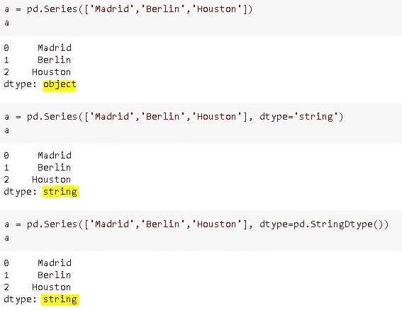

另一种方法是使用 **astype** 函数转换为“字符串”。

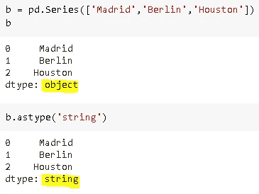

# **字符串操作**

*   **上下**

谈到字符串，首先想到的是小写和大写字母。对 as 来说可能没什么大不了的，但是“A”和“A”就像“A”和“k”或任何其他字符对计算机来说一样不同。

**上()**和**下()**的方法可以用来解决这个问题:

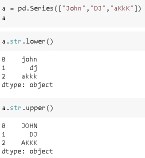

*   **剥离**

如果字符串的开头或结尾有空格，我们应该修剪字符串以消除空格。**剥离**的方法可以用来做这个任务:

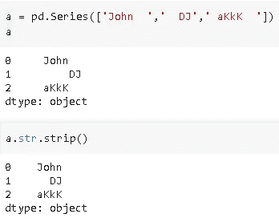

还有 **lstrip** 和 **rstrip** 方法分别删除前后空格。

*   **拆分**

有时字符串携带不止一条信息。为了利用不同种类的信息，我们需要拆分字符串。而这里用的方法是**分割**，令人惊讶。

我们只需要将字符传递给 split。默认字符是空格或空字符串(str= ' ')，所以如果我们要根据任何其他字符进行拆分，就需要指定它。

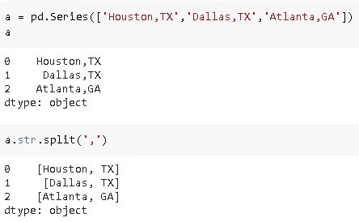

字符串被拆分，新元素被记录在一个列表中。通过传递索引，可以使用 **[]** 或 **get** 方法来访问列表中的元素。

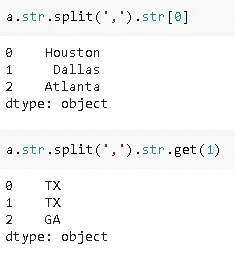

我们也可以在拆分后用新元素创建一个数据帧。**扩展**参数设置为真创建一个数据帧。

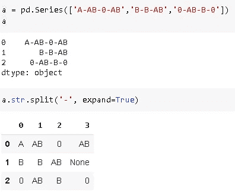

如果一行没有足够的元素来匹配其他行，则单元格中不填充任何元素。我们也可以限制分裂的次数。默认情况下，分割从左边开始，但是如果我们想从右边开始，应该使用 **rsplit** 。

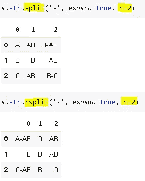

*   **卡特彼勒**

正如我们在某些情况下需要拆分字符串一样，我们可能需要组合或连接字符串。 **Cat** 方法用于连接字符串。

我们需要使用 **sep** 参数传递一个参数放在连接的字符串之间。默认情况下，cat 忽略缺失值，但是我们也可以使用 **na_rep** 参数指定如何处理它们。

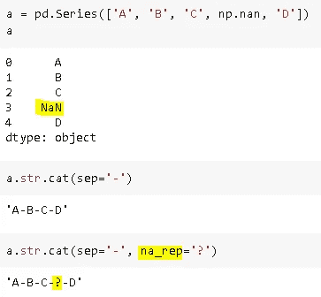

我们还可以进行元素级的连接(即向序列中的每个字符串添加一个字符串):

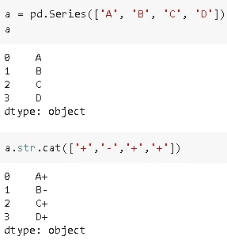

假设字符串是从左到右索引的，我们可以使用 **str[]** 访问每个索引。用例子来解释更好:

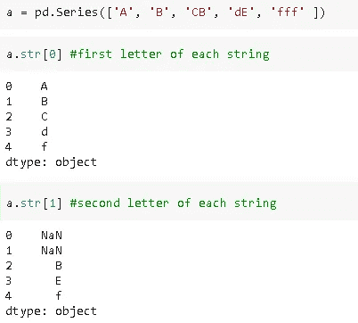

如果字符串没有指定的索引，则返回 NaN。

*   **开始和结束**

我们可以分别使用以开头的**和以**结尾的**来选择字符串。**

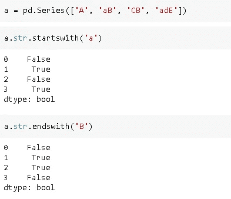

*   **得到假人**

我们可以从序列中提取虚拟变量。这在编码分类变量时特别有用。

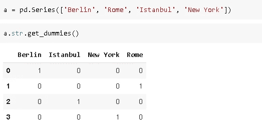

这种表示需要将分类变量输入到机器学习模型中。

如果一个字符串包含多个值，我们可以首先使用 **sep** 参数进行拆分和编码:

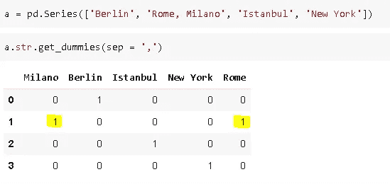

*   **镜头**

在某些情况下，我们需要数据帧的一系列或一列中字符串的长度。为了得到每个字符串的长度，我们可以应用 **len** 方法。请记住，len 也用于获取一个系列或数据帧的长度。让我们用例子来看看不同之处:

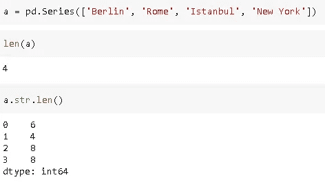

Pandas 字符串操作并不局限于我们在这里讨论的内容，但是我们讨论的函数和方法肯定会有助于处理字符串数据并加快数据清理和准备过程。

感谢阅读。如果您有任何反馈，请告诉我。