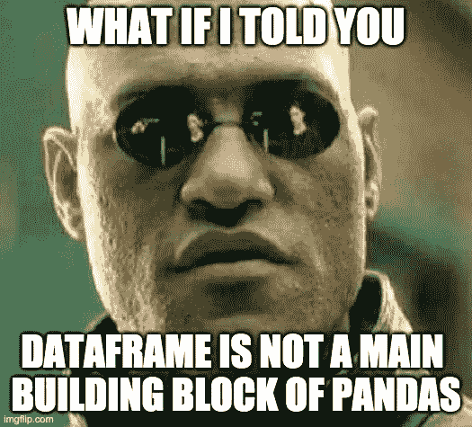
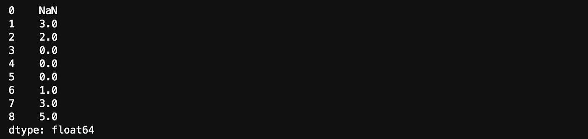
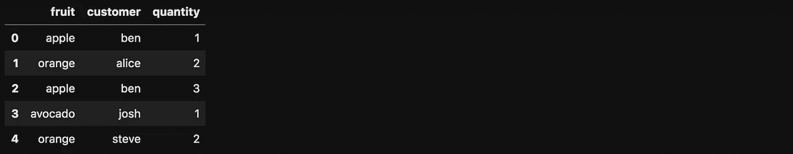
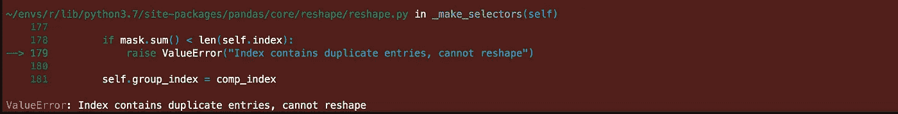
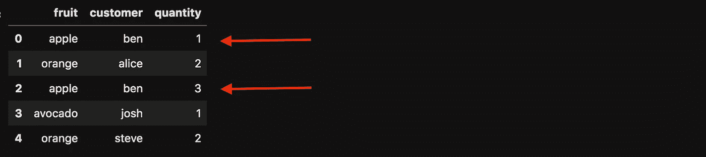
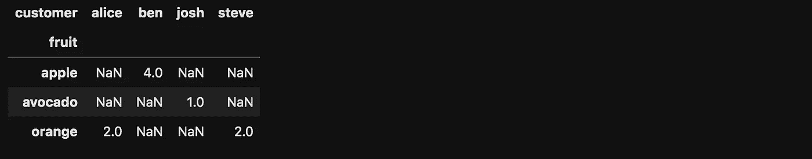
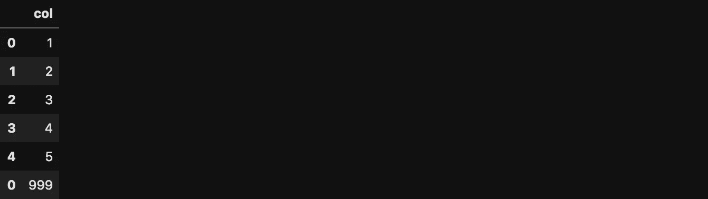
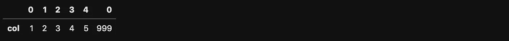

# 熊猫小贴士我希望我以前就知道

> 原文：<https://towardsdatascience.com/pandas-tips-i-wish-i-knew-before-ef4ea6a39e1a?source=collection_archive---------8----------------------->

## pivot 是如何工作的？熊猫的主要构件是什么？还有更多…


伊洛娜·弗罗利希在 [Unsplash](https://unsplash.com/s/photos/panda-talk?utm_source=unsplash&utm_medium=referral&utm_content=creditCopyText) 上的照片

我成为熊猫超级用户已经有几年了。有时候我认为我已经掌握了它，但是几个月后我发现我像个菜鸟一样编程。我们都经历过😊我在这里与你分享的技巧是我最近学到的。

要运行示例，请下载这个 [Jupyter 笔记本](https://romanorac.github.io/assets/notebooks/2020-04-01-pandas-tips-i-wish-i-knew.ipynb)。

**这里有几个你可能会感兴趣的链接:**

```
- [Complete your Python analyses 10x faster with Mito](https://trymito.io/) [Product]- [Free skill tests for Data Scientists & ML Engineers](https://aigents.co/skills) [Test]- [All New Self-Driving Car Engineer Nanodegree](https://imp.i115008.net/c/2402645/1116216/11298)[Course]
```

你愿意阅读更多这样的文章吗？如果是这样，你可以点击上面的任何链接来支持我。其中一些是附属链接，但你不需要购买任何东西。

# 让我们从一个爆炸性的提示开始💥


从 [giphy](https://giphy.com/gifs/reactionseditor-l0IxYWDltdHEqujnO) 下载的 Gif

熊猫有爆炸的功能。别担心，使用它是完全安全的😊当 DataFrame 列中存储有列表时，该函数非常有用。它解包列表中的值，并复制所有其他值，因此会爆炸💥

让我们创建一个 DataFrame，它的一列在列表中有随机数量的元素。

```
n = 10
df = pd.DataFrame(
    {
        "list_col": [[random.randint(0, 10) for _ in range(random.randint(3, 5))] for _ in range(10)],
    }
)
df.shape(10, 1) # output
```


现在，让我们执行 explode 函数。

```
df = df.explode("list_col")
df.shape(40, 1) #output
```

在下表中，我们可以观察到由于从列表中解包值，索引被重复。


# 数据帧不是熊猫的主要构件



迷因创造了[imgflip.com](https://imgflip.com/memegenerator)

Pandas 几乎是 DataFrames 的同义词，但如果我告诉你它不是它的主要构建块，你可能会感到惊讶。熊猫数据框架是建立在熊猫系列之上的。所以数据帧中的每一列都是一个系列。我们可以更深入，熊猫系列是基于什么？Numpy！但是我们不要走那么远。

当收益超过在项目中安装 pandas 的成本时，我甚至将 Python 的 list 包含在 pandas 系列中——我这里指的是后端，而不是分析项目。

让我们用窗口 2 计算一个列表中值的滚动和。

```
values = [1, 2, 0, 0, 0, 0, 1, 2, 3]
sr = pd.Series(values)
sr.rolling(2).sum()
```



这样代码就更简洁了。

# Pivot —数据科学家的必备工具


从 [giphy](https://giphy.com/gifs/Friends-season-5-episode-113-the-one-with-cop-UrbnbuU24p1zgyDMUH) 下载的 Gif

什么是支点？数据透视表是一个统计表，它汇总了一个更广泛的表中的数据。听起来很有用！让我们试一试。

假设我们有一家水果店和几个顾客。

```
df = pd.DataFrame(
    {
        "fruit": ["apple", "orange", "apple", "avocado", "orange"],
        "customer": ["ben", "alice", "ben", "josh", "steve"],
        "quantity": [1, 2, 3, 1, 2],
    }
)
```



现在，让我们用 fruit 和 customer 列以及聚合数量值来透视表。我们期待一张桌子，水果在一个轴上，顾客在另一个轴上。应合计数量值

```
df.pivot(index="fruit", columns="customer", values="quantity")
```



我们得到一个“值错误:索引包含重复条目，无法整形”。这是什么意思？

让我们用一个不同的命令(但是更容易解释)来尝试 pivot，它与 pivot 函数具有相同的效果。

```
df.set_index(["fruit", "customer"])["quantity"].unstack()
```

该命令返回与 pivot 函数相同的错误，但是更清楚幕后发生了什么。水果列和客户列组合在一起时似乎没有唯一的索引。



现在，让我们尝试使用 pivot_table 函数，这也是推荐的方法。注意，该函数还支持 aggfunc，默认情况下是 np.mean。我们在下面的例子中使用 np.sum。

```
df.pivot_table(index="fruit", columns="customer", values="quantity", aggfunc=np.sum)
```



# 很少值得一提


从 [giphy](https://giphy.com/gifs/waynes-world-wayne-campbell-MUeQeEQaDCjE4) 下载的 Gif

## 访问元素

访问数据帧中的第一个元素(和最后一个元素)非常简单:

```
df = pd.DataFrame({"col": [1, 2, 3, 4, 5]})df.iloc[0]df.iloc[-1] # the last element
```

你可能会问 loc 和 iloc 有什么区别？当通过索引访问行时，我们使用 loc，其中索引可以是字符串、整数或其他类型。

我们还使用 loc 在某个索引上设置一个新的列值(我们不能用 iloc 这样做—它会返回 ValueError):

```
df.loc[0, "col"] = 1
```

## 追加值

Pandas 有一个 append 函数，使您能够将值追加到数据帧中。但是技巧是附加的值也需要在数据帧中。

```
df = df.append(pd.DataFrame({'col': [999]}))
df
```



## 行到列

我最喜欢的将行变成列的方法是使用转置。它在 numpy 中也有效。

```
df.T
```



# 在你走之前

在[推特](https://twitter.com/romanorac)上关注我，在那里我定期[发关于数据科学和机器学习的推特](https://twitter.com/romanorac/status/1328952374447267843)。


照片由[Courtney hedge](https://unsplash.com/@cmhedger?utm_source=medium&utm_medium=referral)在 [Unsplash](https://unsplash.com/?utm_source=medium&utm_medium=referral) 上拍摄