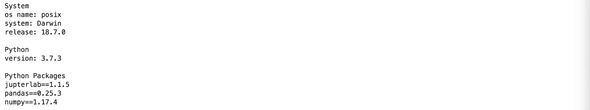
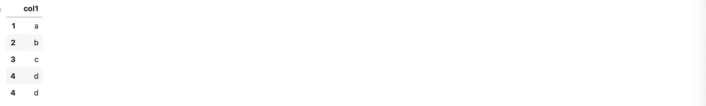
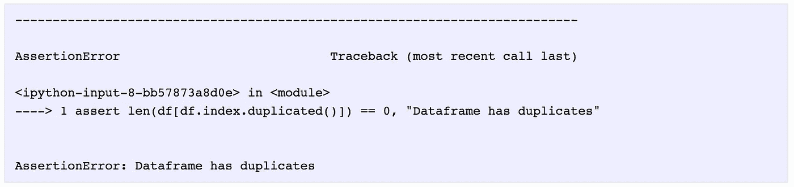
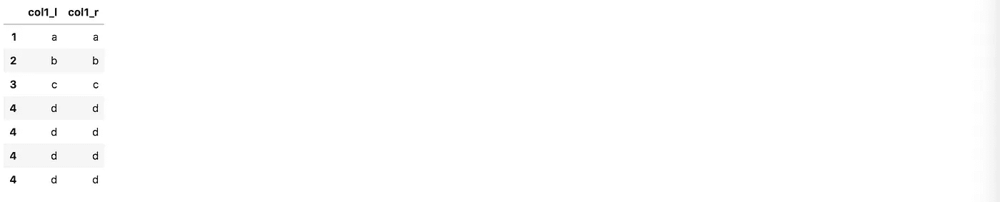
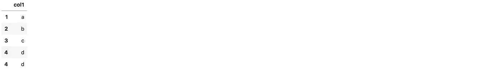

# 熊猫给你的建议会让你省去几个小时的挠头时间

> 原文：<https://towardsdatascience.com/pandas-tips-that-will-save-you-hours-of-head-scratching-31d8572218c9?source=collection_archive---------8----------------------->

## 从长远来看，使您的数据分析实验具有可重复性可以为您和他人节省时间


*当重新审视你过去处理过的问题时，发现代码不起作用是令人沮丧的。从长远来看，使您的数据分析实验具有可重复性可以为您和他人节省时间。这些提示将帮助您编写可重复的 pandas 代码，当您在团队中工作时，这对于您计划在未来重新访问或与其他人共享的个人项目非常重要。*

要运行示例，请下载这个 [Jupyter 笔记本](https://romanorac.github.io/assets/notebooks/2020-01-13-reproducibility-in-pandas.ipynb)。

**这里有几个你可能会感兴趣的链接:**

```
- [Labeling and Data Engineering for Conversational AI and Analytics](https://www.humanfirst.ai/)- [Data Science for Business Leaders](https://imp.i115008.net/c/2402645/880006/11298) [Course]- [Intro to Machine Learning with PyTorch](https://imp.i115008.net/c/2402645/788201/11298) [Course]- [Become a Growth Product Manager](https://imp.i115008.net/c/2402645/803127/11298) [Course]- [Deep Learning (Adaptive Computation and ML series)](https://amzn.to/3ncTG7D) [Ebook]- [Free skill tests for Data Scientists & Machine Learning Engineers](https://aigents.co/skills)
```

上面的一些链接是附属链接，如果你通过它们购买，我会赚取佣金。请记住，我链接课程是因为它们的质量，而不是因为我从你的购买中获得的佣金。

**要升级你的熊猫游戏，请阅读:**

[](/pandas-analytics-server-d9abceec888b) [## 熊猫分析服务器

### 一个开源项目，简化了熊猫与实时数据的连接，测试假设和可视化…

towardsdatascience.com](/pandas-analytics-server-d9abceec888b) 

# 输出版本

为了使您的 pandas 实验可重复，从输出系统信息和 python 包的版本开始。你(或你的同事)可以以后再感谢我。在某个包的旧版本中，某些功能可能被弃用、损坏或不可用。注意，Python 包是特意用==打印出来的，这样您就可以直接使用 pip 的输出来安装它们。

我使用下面的模板来输出系统信息和包的版本。

```
import os
import platform
from platform import python_versionimport jupyterlab
import numpy **as** np
import pandas **as** pd**print**("System")
**print**("os name: %s" **%** os**.**name)
**print**("system: %s" **%** platform**.**system())
**print**("release: %s" **%** platform**.**release())
**print**()
**print**("Python")
**print**("version: %s" **%** python_version())
**print**()
**print**("Python Packages")
**print**("jupterlab==%s" **%** jupyterlab**.**__version__)
**print**("pandas==%s" **%** pd**.**__version__)
**print**("numpy==%s" **%** np**.**__version__)
```



# 对自动导入说不

我曾经有过一个很棒的想法，不要每次都写。Jupyter 笔记本可以自动导入它们。

听起来很棒？嗯，结局不太好。过了一会儿，我忘记了我的定制配置，不久之后我就收到了类似这样的问题:“你运行代码了吗，因为它在第一行就失败了！”，“这段代码在你的机器上是如何工作的？”。

对自动进口说不。

# 播种

使用随机生成的数据时，必须设置种子。如果您正在使用机器学习模型，您还应该设置随机种子(如果可用)，以便模型返回确定性输出。

让我们看看例子。我们设置随机种子并输出一个包含 10 个伪随机数的随机样本。正如所料，第二次运行与第一次运行有不同的伪随机数。注意，熊猫在引擎盖下使用 numpy，所以我们需要用 numpy 设置种子。

```
np**.**random**.**seed(42)np**.**random**.**random_sample(10)# Outputarray([0.37454012, 0.95071431, 0.73199394, 0.59865848, 0.15601864,
       0.15599452, 0.05808361, 0.86617615, 0.60111501, 0.70807258]) np**.**random**.**random_sample(10)# Outputarray([0.02058449, 0.96990985, 0.83244264, 0.21233911, 0.18182497,
       0.18340451, 0.30424224, 0.52475643, 0.43194502, 0.29122914])
```

当我们再次设定相同的种子时会发生什么？我们重置种子，得到与上面相同的数字序列。这使得确定性伪随机数发生器。

```
np**.**random**.**seed(42)np**.**random**.**random_sample(10)# Outputarray([0.37454012, 0.95071431, 0.73199394, 0.59865848, 0.15601864,
       0.15599452, 0.05808361, 0.86617615, 0.60111501, 0.70807258])
```

# 评论

一个有 10 行 pandas 代码的代码块很可能被一个 pandas 专家重写为 5 行，但是代码的可理解性受到影响。随着工具越来越好，我们也倾向于做同样的事情。今天我们可能知道代码做了什么，但是一个月后我们会记得吗？初级分析师会知道这是什么吗？

大概不会！当代码变得复杂时，你应该写一两条注释。不只是在用熊猫做数据分析的时候，而是在一般编码的时候。

# 安全检查

写安全检查而不是注释，比如“这部分代码不支持空值或重复”。这将花费相同的时间，但是用户肯定会注意到安全检查，因为在出现问题的情况下，它们会中断执行。

让我们看看下面的例子。

```
df **=** pd**.**DataFrame(index**=**[1, 2, 3, 4, 4], data**=**{"col1": ["a", "b", "c", "d", "d"]})
```



数据帧具有重复的索引值 4。我们可以使用重复的函数来检测重复的索引，然后用 assert 语句中断执行。

```
**assert** len(df[df**.**index**.**duplicated()]) **==** 0, "Dataframe has duplicates" 
```



# 格式化代码

Jupyter 笔记本因无格式、丑陋的代码而臭名昭著。主要原因是早期版本没有代码格式化程序。在他们这样做之后，安装它们就不是一件小事了。但现在情况不同了。

我将 jupyterlab-code-formatter 与 jupyterlab 一起使用，效果很好。这里是[安装指南](https://jupyterlab-code-formatter.readthedocs.io/en/latest/installation.html#installation-step-1-installing-the-plugin-itself)。如果你需要任何安装帮助，请在评论中告诉我。

格式正确的代码会增加你不扔掉它重新开始的机会。

# 输出数据帧的形状

我发现在每次转换后输出数据帧的形状是一个很好的实践。这有助于在读取、合并等操作后发现错误的行数或列数。这样，我们只需检查 shape 函数的输出就可以发现错误，而无需重新运行笔记本。

让我们将示例数据帧与其自身进行内部连接。它只有 5 行，所以我们希望新的数据帧也有 5 行。

```
df**.**shape(5, 1)
```

新数据帧有 7 行，而不是 5 行。

```
df_new **=** df**.**join(df, lsuffix**=**'_l', rsuffix**=**'_r')
df_new**.**shape(7, 2)
```

我们看到问题的出现是因为一个重复的索引。通过使用 shape 函数，我们可以立即发现一个 bug。

```
df_new
```



# 提出可重复的问题

有些情况下，我们有输入数据，我们知道输出应该是什么样子，但我们不知道如何编写中间的步骤(我们都经历过)。下一步通常是询问关于堆栈溢出或 Reddit 的问题，或者向同事寻求帮助。

通过编写可重复的问题，我们可以使协作解决问题变得更加容易:

*   简明扼要地描述问题的核心，不要通过复制粘贴实验的一半而陷得太深，
*   使用可以在单行中初始化的小数据帧(不要引用本地数据集)，
*   使用 slack 时，用``将代码块中的代码换行。

一个好的做法是使 DataFrame 输出易于复制粘贴。没听说过？我举个例子解释一下。

```
df# Copy-paste output col1
1	a
2	b
3	c
4	d
4	d
```

Pandas 有一个 read_clipboard 方法，顾名思义就是这样做的。我们可以复制上面的输出并运行下面的命令，它将复制数据帧。你自己试试。如果需要，我们也可以将分隔符更改为制表符`\t`或任何其他分隔符。

```
df **=** pd**.**read_clipboard(sep**=**'\s\s+')
df
```



这个复制-粘贴过程不适用于 MultiIndex。所以提问的时候尽量避开他们。

# 结论

这些是让你的熊猫实验可重复的几个小技巧。你喜欢这个职位吗？请在下面的评论中告诉我。

# 在你走之前

在[推特](https://twitter.com/romanorac)上关注我，在那里我定期[发关于数据科学和机器学习的微博](https://twitter.com/romanorac/status/1328952374447267843)。


照片由[Courtney hedge](https://unsplash.com/@cmhedger?utm_source=medium&utm_medium=referral)在 [Unsplash](https://unsplash.com/?utm_source=medium&utm_medium=referral) 上拍摄