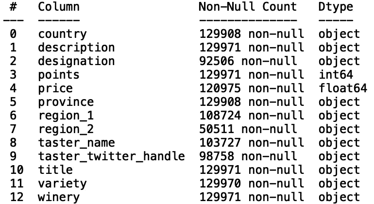

# 熊猫输入缺失数据的技巧

> 原文：<https://towardsdatascience.com/pandas-tricks-for-imputing-missing-data-63da3d14c0d6?source=collection_archive---------5----------------------->

## 用熊猫输入数据


[来源](https://www.pexels.com/photo/black-and-white-blank-challenge-connect-262488/)

数据科学家面临的最大挑战之一是处理缺失数据。在本帖中，我们将讨论如何使用熊猫来估算缺失的数值和分类值。

我们开始吧！

出于我们的目的，我们将使用*葡萄酒杂志数据集*，它可以在[这里](https://www.kaggle.com/pabloa/wine-magazine)找到。

首先，让我们将数据读入熊猫数据框:

```
import pandas as pd 
df = pd.read_csv("winemag-data-130k-v2.csv")
```

接下来，让我们使用。head()'方法:

```
print(df.head())
```


因为我们对输入缺失值感兴趣，所以查看缺失值在各列中的分布会很有用。

我们可以用'来显示丢失的值信息。“info()”方法。这将显示每列中非空值的数量:

```
print(df.info())
```



我们也可以使用。isnull()“和”。sum()'方法计算每列中缺失值的数量:

```
print(df.isnull().sum())
```


我们看到生成的 Pandas 系列显示了数据中每一列的缺失值。“价格”列包含 8996 个缺失值。我们可以使用'替换这些丢失的值。fillna()”方法。例如，让我们用平均价格填充缺失值:

```
df['price'].fillna(df['price'].mean(), inplace = True)
print(df.isnull().sum())
```


我们看到“价格”列不再有缺失值。现在，假设我们想做一个更精确的估算。一个好的猜测是用缺少的值所属国家的平均价格替换价格列中缺少的值。例如，如果我们考虑意大利葡萄酒缺失的葡萄酒价格，我们可以用意大利葡萄酒的平均价格替换这些缺失的值。接下来，让我们看看“国家”值的分布。我们可以使用集合模块中的“Counter”方法来实现:

```
from collections import Counter
print(Counter(df['country']))
```


让我们来看看美国制造的葡萄酒。我们可以定义一个只包含“美国”葡萄酒的数据框:

```
df_US = df[df['country']=='US']
```

现在，让我们打印缺失值的数量:

```
print(df_US.isnull().sum())
```


我们看到在“美国”葡萄酒数据中有 239 个缺失的“价格”值。为了用对应于美国价格的平均值填充缺失值，我们执行以下操作:

```
df_US['price'].fillna(df_US['price'].mean(), inplace = True)
```

现在，假设我们想对每个国家缺失的价格值进行这样的计算。首先，让我们估算缺失的国家值:

```
df['country'].fillna(df['country'].mode()[0], inplace = True)
```

接下来，在 for 循环中，我们可以定义特定于国家的数据帧:

```
for i in list(set(df['country'])):
    df_country = df[df['country']== country]
```

接下来，我们可以用相应的平均价格来填充这些国家特定数据框中缺失的值:

```
for i in list(set(df['country'])):
    df_country = df[df['country']== country]
    df_country['price'].fillna(df_country['price'].mean(),inplace = True)
```

然后，我们将结果附加到一个我们称之为“帧”的列表中

```
frames = []
for i in list(set(df['country'])):
    df_country = df[df['country']== country]
    df_country['price'].fillna(df_country['price'].mean(),inplace = True)
    frames.append(df_country)
```

最后，我们连接数据帧的结果列表:

```
frames = []
for i in list(set(df['country'])):
    df_country = df[df['country']== i]
    df_country['price'].fillna(df_country['price'].mean(),inplace = True)
    frames.append(df_country)
    final_df = pd.concat(frames)
```

现在，如果我们在估算前打印缺失价格值的数量，我们得到:

```
print(df.isnull().sum()) 
```


插补后:

```
print(final_df.isnull().sum())
```


我们看到除了一个缺失值之外，所有的值都被估算了。这对应于没有价格数据的埃及葡萄酒。我们可以通过检查 for 循环中数据帧的长度来解决这个问题，如果长度大于 1，则只使用特定于国家的平均值进行输入。如果长度等于 1，我们估算所有国家的平均值:

```
frames = []
for i in list(set(df['country'])):
    df_country = df[df['country']== i]
    if len(df_country) > 1:    
        df_country['price'].fillna(df_country['price'].mean(),inplace = True)        
    else:
        df_country['price'].fillna(df['price'].mean(),inplace = True)
    frames.append(df_country)    
    final_df = pd.concat(frames)
```

打印结果时，我们看到“价格”列的所有值都是估算的:

```
print(final_df.isnull().sum())
```


我们可以定义一个函数来概括这个逻辑。我们的函数将接受对应于数字列和分类列的变量:

```
def impute_numerical(categorical_column, numerical_column):
    frames = []
    for i in list(set(df[categorical_column])):
        df_category = df[df[categorical_column]== i]
        if len(df_category) > 1:    
            df_category[numerical_column].fillna(df_category[numerical_column].mean(),inplace = True)        
        else:
            df_category[numerical_column].fillna(df[numerical_column].mean(),inplace = True)
        frames.append(df_category)    
        final_df = pd.concat(frames)
    return final_df
```

我们通过执行以下操作，使用我们的函数进行插补:

```
impute_price  = impute_numerical('country', 'price')
print(impute_price.isnull().sum())
```


我们还要验证原始数据框和估算数据框的形状是否匹配

```
print("Original Shape: ", df.shape)
print("Imputed Shape: ", impute_price.shape)
```


类似地，我们可以定义一个估算分类值的函数。该函数将接受两个变量，这两个变量对应于具有分类值的列。

```
def impute_categorical(categorical_column1, categorical_column2):
    cat_frames = []
    for i in list(set(df[categorical_column1])):
        df_category = df[df[categorical_column1]== i]
        if len(df_category) > 1:    
            df_category[categorical_column2].fillna(df_category[categorical_column2].mode()[0],inplace = True)        
        else:
            df_category[categorical_column2].fillna(df[categorical_column2].mode()[0],inplace = True)
        cat_frames.append(df_category)    
        cat_df = pd.concat(cat_frames)
    return cat_df
```

我们可以用各个国家/地区的模式来估算缺失的“taster_name”值:

```
impute_taster = impute_categorical('country', 'taster_name')
print(impute_taster.isnull().sum())
```


我们看到“taster_name”列现在没有缺失值。同样，让我们验证形状是否与原始数据框匹配:

```
print("Original Shape: ", df.shape)
print("Imputed Shape: ", impute_taster.shape)
```


我就讲到这里，但是您可以随意使用数据并自己编码。

## 结论

总之，在这篇文章中，我们讨论了如何使用 Pandas 库处理缺失值。首先，我们讨论了如何用数据的平均值来估算缺失的数值。然后，我们研究了如何进行特定类别的数值插补。最后，我们展示了如何用对应于另一个分类列的模式来估算缺失的分类值。我希望你觉得这篇文章有用/有趣。这篇文章中的代码可以在 [GitHub](https://github.com/spierre91/medium_code/blob/master/pandas_tutorials/impute_data.py) 上找到。感谢您的阅读！