# 加快数据分析过程的熊猫技巧

> 原文：<https://towardsdatascience.com/pandas-tricks-that-expedite-data-analysis-process-e941dbfc3e75?source=collection_archive---------43----------------------->

## 用这些简单的技巧加速你的数据分析过程。

Pandas 是一个非常强大和通用的 Python 数据分析库，它加速了数据科学项目的预处理步骤。它提供了许多在数据分析中非常有用的函数和方法。


[张家瑜](https://unsplash.com/@danielkcheung?utm_source=unsplash&utm_medium=referral&utm_content=creditCopyText)在 [Unsplash](https://unsplash.com/s/photos/small?utm_source=unsplash&utm_medium=referral&utm_content=creditCopyText) 上拍照

一如既往，我们从进口熊猫开始。

```
import numpy as np
import pandas as pd
```

让我们创建一个样本数据帧来处理。Pandas 是一个多功能库，通常提供多种方式来完成一项任务。因此，有许多方法可以创建数据帧。一种常见的方法是传递包含列作为键值对的字典。

```
values = np.random.randint(10, size=10)years = np.arange(2010,2020)groups = ['A','A','B','A','B','B','C','A','C','C']df = pd.DataFrame({'group':groups, 'year':years, 'value':values})df
```

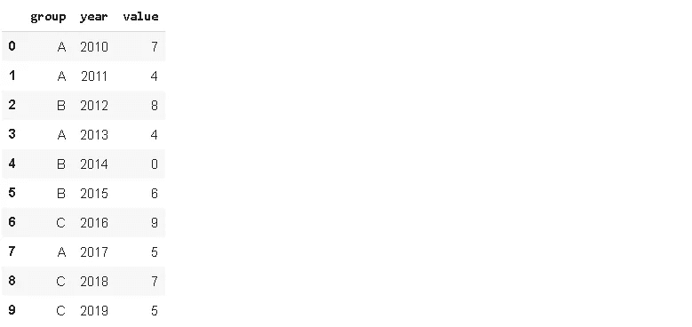

我们还使用 numpy 创建数组，用作列中的值。 **np.arange** 返回指定区间内的范围值。 **np.random.randint** 根据指定的范围和大小返回随机整数值。

数据框架包含 3 个不同组的一些年值。我们可能只对每年的值感兴趣，但在某些情况下，我们也需要一个累计和。Pandas 提供了一个简单易用的函数来计算累计和，即 **cumsum** 。

```
df['cumsum'] = df['value'].cumsum()df
```

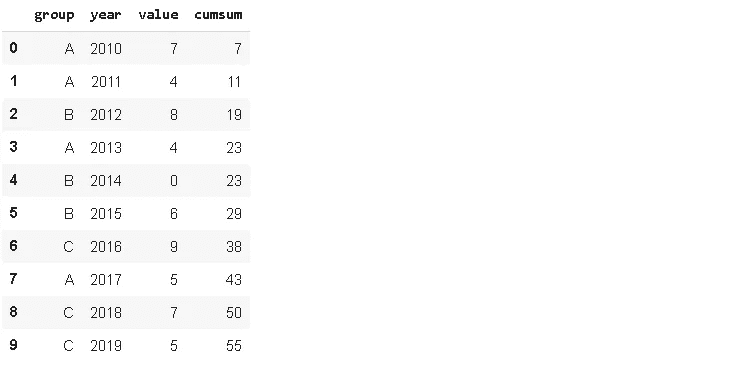

我们创建了一个名为“cumsum”的列，它包含值列中数字的累积和。但是，它不考虑群体。这种累积值在某些情况下可能没有用，因为我们无法区分不同的组。放心吧！这个问题有一个非常简单方便的解决方案。我们可以应用 **groupby** 函数。

```
df['cumsum'] = df[['value','group']].groupby('group').cumsum()df
```

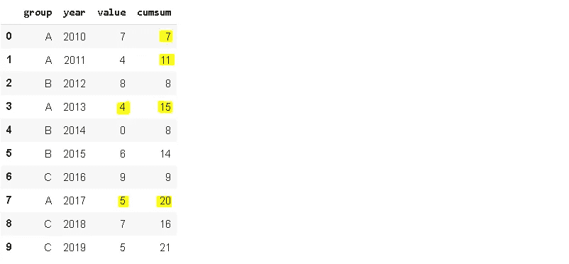

我们首先对“组”列应用 **groupby** ，然后应用 **cumsum** 函数。现在，每组内的值相加。为了使数据框看起来更好，我们可能希望根据组而不是年份对值进行排序，这样我们可以直观地将组分开。

```
df.sort_values(by='group').reset_index()
```

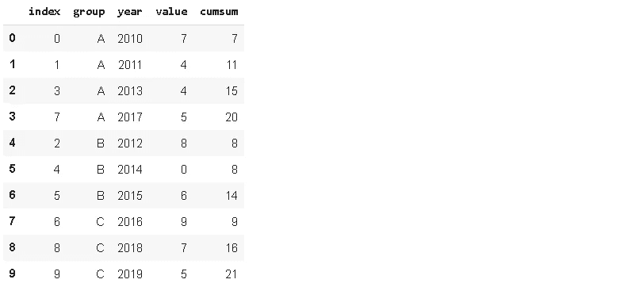

我们应用了 **sort_values** 函数，并用 **reset_index** 函数重置索引。正如我们在返回的数据帧中看到的，原始索引作为一列保存。我们可以通过将 reset_index 函数的 **drop** 参数设置为 True 来消除。

```
df = df.sort_values(by='group').reset_index(drop=True)df
```

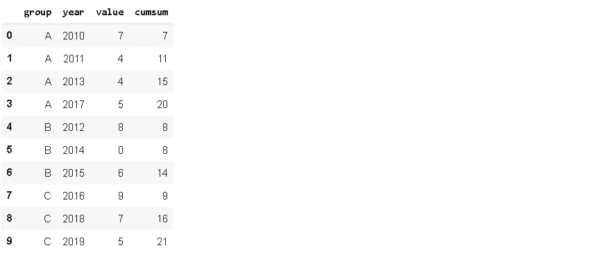

现在看起来好多了。当我们想在数据帧中添加一个新列时，默认情况下它会被添加到末尾。然而，pandas 提供了使用**插入**功能在任意位置添加新列的选项。

```
new = np.random.randint(5, size=10)df.insert(2, 'new_col', new)df
```

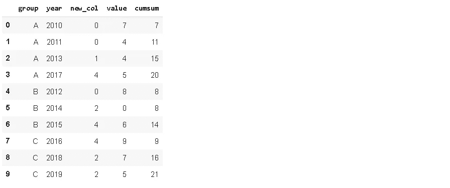

我们通过传递一个索引作为第一个参数来指定位置。该值必须是整数。列索引从零开始，就像行索引一样。第二个参数是列名，第三个参数是包含值的对象，这些值可以是**系列**或类似**数组的**对象。

假设我们想从数据帧中删除一列，但又想将该列保留为一个单独的序列。一种方法是将该列分配给一个系列，然后使用 **drop** 功能。更简单的方法是使用 **pop** 功能。

```
value = df.pop('value')df
```

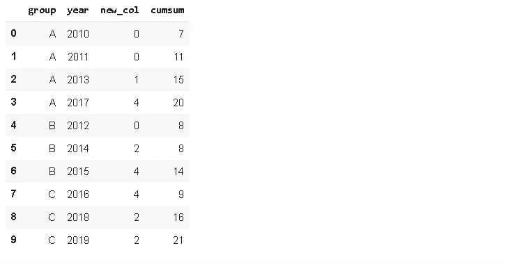

通过一行代码，我们从 dataframe 中删除了 value 列，并将其存储在 pandas 系列中。

我们有时需要根据条件过滤数据帧或应用掩码来获得某些值。过滤数据帧的一个简单方法是**查询**函数。我将使用我们一直使用的样本数据框架。让我们首先将“值”列插回:

```
df.insert(2, 'value', value)df
```

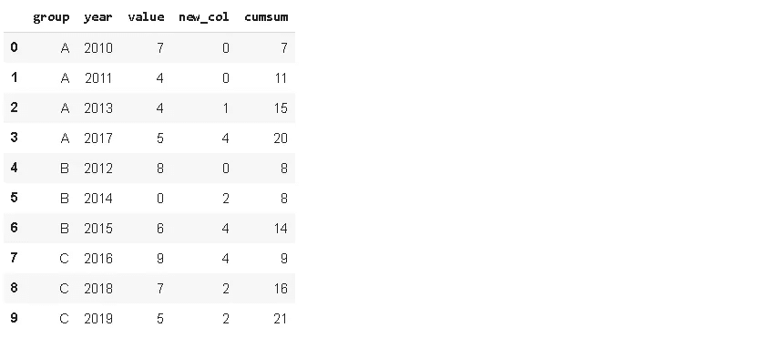

使用查询函数非常简单，只需要条件。

```
df.query('value < new_col')
```

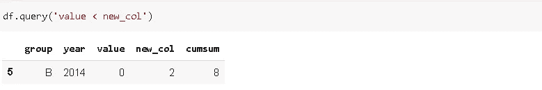

它返回“值”小于“新列”的行。我们可以设置更复杂的条件，也可以使用额外的操作符。

```
df.query('2*new_col > value')
```

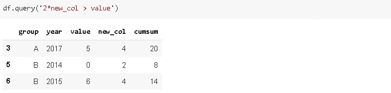

我们还可以将多个条件组合成一个查询。

```
df.query('2*new_col > value & cumsum < 15')
```

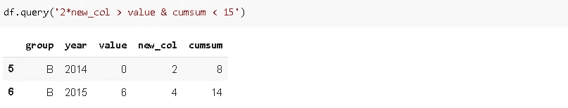

我们可以使用许多聚合函数来计算列的基本统计信息，如平均值、总和、计数等。我们可以将这些函数中每一个应用于一个列。然而，在某些情况下，我们可能需要检查不止一种类型的统计数据。例如，在某些情况下，计数和平均值可能都很重要。pandas 没有单独应用函数，而是提供了 agg 函数来应用多个聚合函数。

```
df[['group','value']].groupby('group').agg(['mean','count'])
```

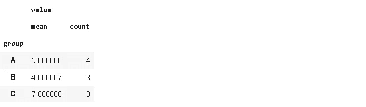

既看均值又看计数更有意义。我们可以很容易地检测出异常值，这些异常值具有极端的平均值，但观察次数非常少。

我认为熊猫的成功和流行来自于其多功能、强大且易于使用的操作和分析数据的功能。和熊猫一起完成一项任务几乎总是有多种方式。由于花在数据科学项目上的大部分时间都花在了数据清理和预处理步骤上，Pandas 是您武库中的宝贵资产。

感谢您的阅读。如果您有任何反馈，请告诉我。